# Tutorial: Azure Active Directory integration with Citrix Netscaler

In this tutorial, you learn how to integrate Citrix Netscaler with Azure Active Directory (Azure AD).
Integrating Citrix Netscaler with Azure AD provides you with the following benefits:

* You can control in Azure AD who has access to Citrix Netscaler.
* You can enable your users to be automatically signed-in to Citrix Netscaler (Single Sign-On) with their Azure AD accounts.
* You can manage your accounts in one central location - the Azure portal.

If you want to know more details about SaaS app integration with Azure AD, see [What is application access and single sign-on with Azure Active Directory](https://docs.microsoft.com/azure/active-directory/active-directory-appssoaccess-whatis).
If you don't have an Azure subscription, [create a free account](https://azure.microsoft.com/free/) before you begin.

## Prerequisites

To configure Azure AD integration with Citrix Netscaler, you need the following items:

* An Azure AD subscription. If you don't have an Azure AD environment, you can get one-month trial [here](https://azure.microsoft.com/pricing/free-trial/)
* Citrix Netscaler single sign-on enabled subscription

## Scenario description

In this tutorial, you configure and test Azure AD single sign-on in a test environment.

* Citrix Netscaler supports **SP** initiated SSO

* Citrix Netscaler supports **Just In Time** user provisioning

## Adding Citrix Netscaler from the gallery

To configure the integration of Citrix Netscaler into Azure AD, you need to add Citrix Netscaler from the gallery to your list of managed SaaS apps.

**To add Citrix Netscaler from the gallery, perform the following steps:**

1. In the **[Azure portal](https://portal.azure.com)**, on the left navigation panel, click **Azure Active Directory** icon.

	

2. Navigate to **Enterprise Applications** and then select the **All Applications** option.

	

3. To add new application, click **New application** button on the top of dialog.

	

4. In the search box, type **Citrix Netscaler**, select **Citrix Netscaler** from result panel then click **Add** button to add the application.

	 

## Configure and test Azure AD single sign-on

In this section, you configure and test Azure AD single sign-on with Citrix Netscaler based on a test user called **Britta Simon**.
For single sign-on to work, a link relationship between an Azure AD user and the related user in Citrix Netscaler needs to be established.

To configure and test Azure AD single sign-on with Citrix Netscaler, you need to complete the following building blocks:

1. **[Configure Azure AD Single Sign-On](#configure-azure-ad-single-sign-on)** - to enable your users to use this feature.
2. **[Configure Citrix Netscaler Single Sign-On](#configure-citrix-netscaler-single-sign-on)** - to configure the Single Sign-On settings on application side.
3. **[Create an Azure AD test user](#create-an-azure-ad-test-user)** - to test Azure AD single sign-on with Britta Simon.
4. **[Assign the Azure AD test user](#assign-the-azure-ad-test-user)** - to enable Britta Simon to use Azure AD single sign-on.
5. **[Create Citrix Netscaler test user](#create-citrix-netscaler-test-user)** - to have a counterpart of Britta Simon in Citrix Netscaler that is linked to the Azure AD representation of user.
6. **[Test single sign-on](#test-single-sign-on)** - to verify whether the configuration works.

### Configure Azure AD single sign-on

In this section, you enable Azure AD single sign-on in the Azure portal.

To configure Azure AD single sign-on with Citrix Netscaler, perform the following steps:

1. In the [Azure portal](https://portal.azure.com/), on the **Citrix Netscaler** application integration page, select **Single sign-on**.

    

2. On the **Select a Single sign-on method** dialog, select **SAML/WS-Fed** mode to enable single sign-on.

    

3. On the **Set up Single Sign-On with SAML** page, click **Edit** icon to open **Basic SAML Configuration** dialog.

	

4. On the **Basic SAML Configuration** section, perform the following steps:

    

	a. In the **Sign on URL** text box, type a URL using the following pattern:
    `https://<<Your FQDN>>/CitrixAuthService/AuthService.asmx`
    
    b. In the **Identifier (Entity ID)** text box, type a URL using the following pattern:
    `https://<<Your FQDN>>`

    c. In the **Reply URL (Assertion Consumer Service URL)** text box, type a URL using the following pattern:
    `https://<<Your FQDN>>/CitrixAuthService/AuthService.asmx`
    
    > [!NOTE]
	> These values are not real. Update these values with the actual Sign on URL and Identifier. Contact [Citrix Netscaler Client support team](https://www.citrix.com/contact/technical-support.html) to get these values. You can also refer to the patterns shown in the **Basic SAML Configuration** section in the Azure portal.

    > [!NOTE]
	> In order to get SSO working, these URLs should be accessible from public sites. You need to enable the firewall or other security settings on Netscaler side to enble Azure AD to post the token on the configured ACS URL.

5. On the **Set up Single Sign-On with SAML** page, in the **SAML Signing Certificate** section, click **Download** to download the **Federation Metadata XML** from the given options as per your requirement and save it on your computer.

	

6. On the **Set up Citrix Netscaler** section, copy the appropriate URL(s) as per your requirement.

	

	a. Login URL

	b. Azure AD Identifier

	c. Logout URL

### Configure Citrix Netscaler Single Sign-On

1. In a different web browser window, sign-on to your Citrix Netscaler tenant as an administrator.

2. Make sure that the **NetScaler Firmware Version = NS12.1: Build 48.13.nc**.

    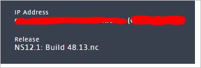

3. On the **VPN Virtual Server** page, perform the following steps:

     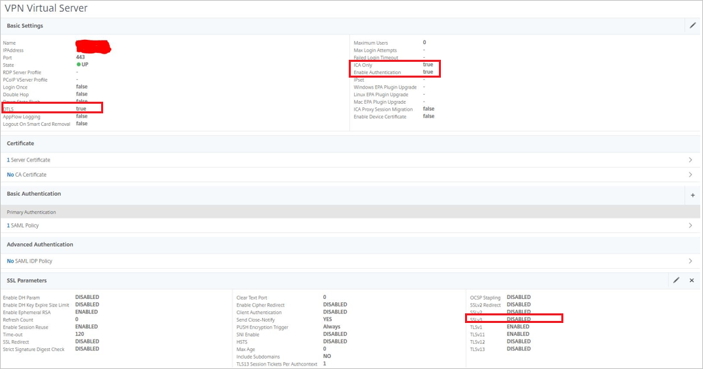

    a. Set Gateway Settings **ICA Only** as **true**.
    
    b. Set **Enable Authentication** as **true**.
    
    c. **DTLS** is optional.
    
    d. Make sure **SSLv3** as **Disabled**.

4. A customized **SSL Ciphers** Group is created to attain A+ on https://www.ssllabs.com as shown below:

    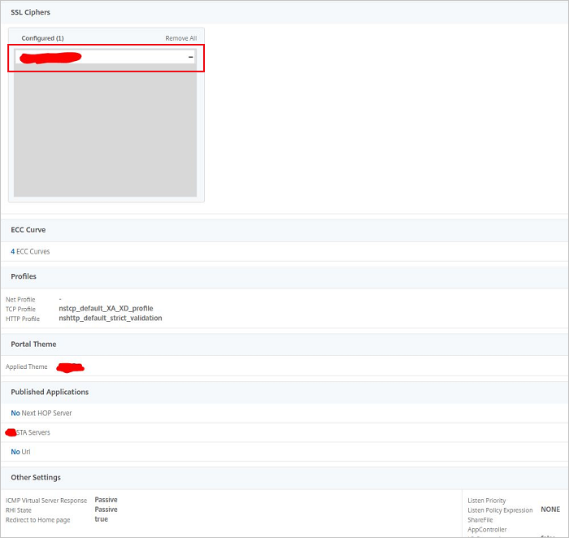

5. On the **Configure Authentication SAML Server** page, perform the following steps:

      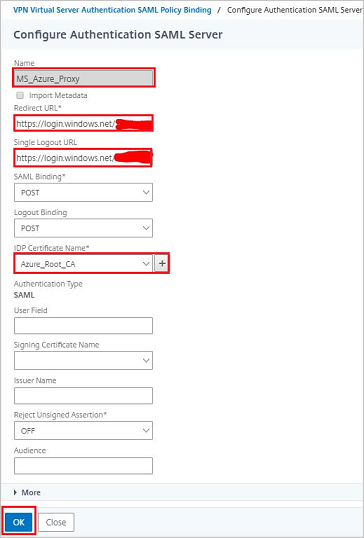

    a. In the **Name** textbox, type the name of your server.

    b. In the **Redirect URL** textbox, paste the value of **Login URL** which you have copied from the Azure portal.

    c. In the **Single Logout URL** textbox, paste the value of **Logout URL** which you have copied from the Azure portal.

    d. In **IDP Certificate Name**, click the **"+"** sign to add the certificate which you have downloaded from the Azure portal. After it is uploaded please select the certificate from the dropdown.

    e. Following more fields need to be set on this page

      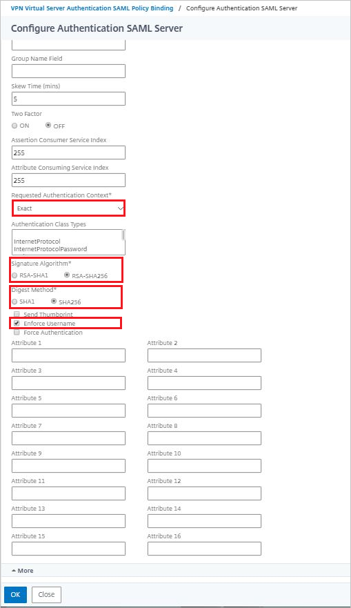

    f. Select **Requested Authentication Context** as **Exact**.

    g. Select **Signature Algorithm** as **RSA-SHA256**.

    h. Select **Digest Method** as **SHA256**.

    i. Check **Enforce Username**.

    j. Click **OK**

6. To configure the **Session Profile**, perform the following steps:

    

    a. In the **Name** textbox, type the name of your session profile.

    b. On the **Client Experience** tab, make the changes as shown in the screenshot below.

    c. Continue making the changes on the **General tab** as shown below and click **OK**

    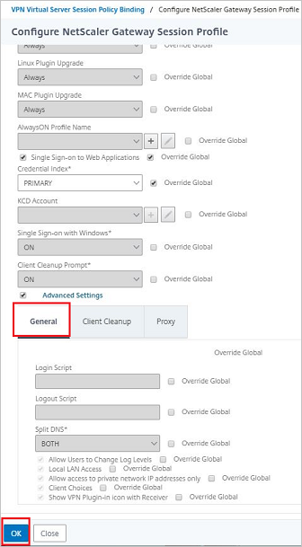

    d. On the **Published Applications** tab, make the changes as shown in the screenshot below and click **OK**.

    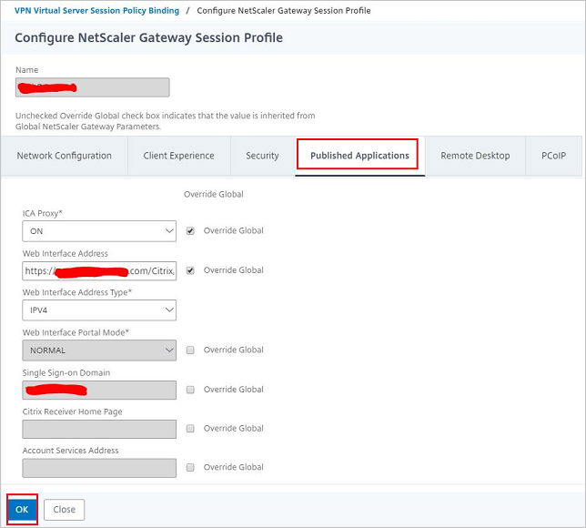

    e. On the **Security** tab, make the changes as shown in the screenshot below and click **OK**.

    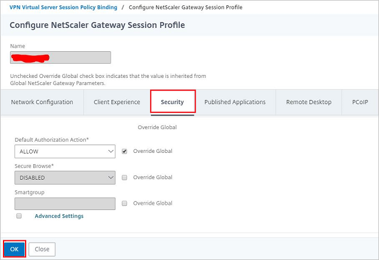

7. Make the ICA Connections connecting on Session Reliability Port **2598** as shown in the below screenshot.

    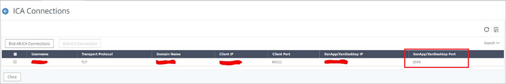

8. On the **SAML** section, add the **Servers** as shown in the screenshot below.

    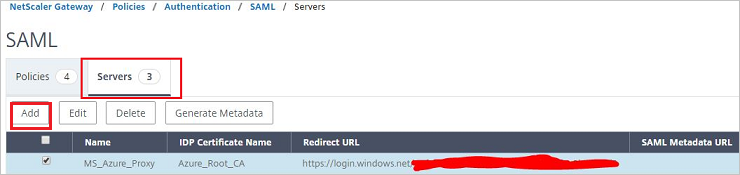

9. On the **SAML** section, add the **Policies** as shown in the screenshot below.

     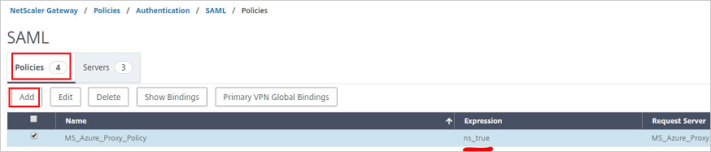

10. On the **Global Settings** page, go to the **Clientless Access** section.

    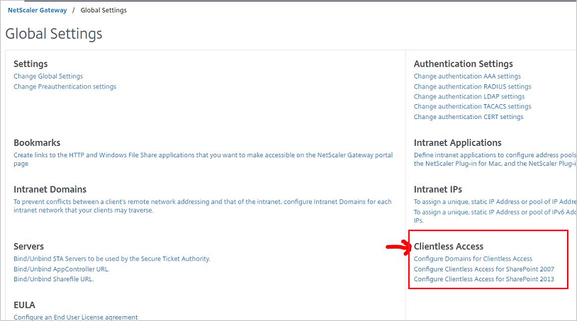

11. On the **Configuration** tab, perform the following steps:

    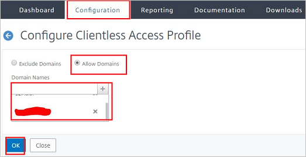

    a. Select **Allow Domains**.

    b. In the **Domain Name** textbox, select the domain.

    c. Click **OK**.

12. Make the **StoreFront** Settings on the **Receiver for Web Sites** as shown in the screenshot below:

    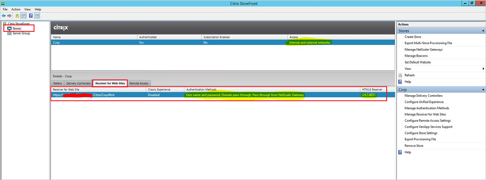

13. On the **Manage Authentication Methods - Corp** pop-up, perform the following steps:

    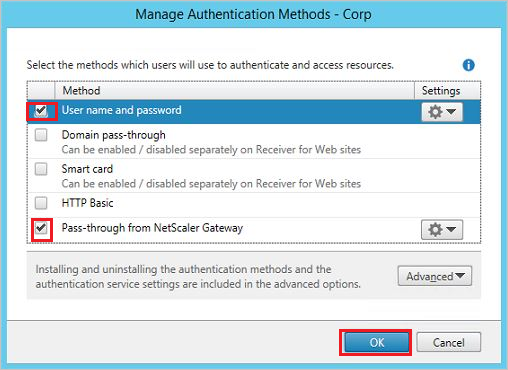

    a. Select **User name and password**.

    b. Select **Pass-through from NetScaler Gateway**.

    c. Click **OK**.

14. On the **Configure Trusted Domains** pop-up, perform the following steps:

    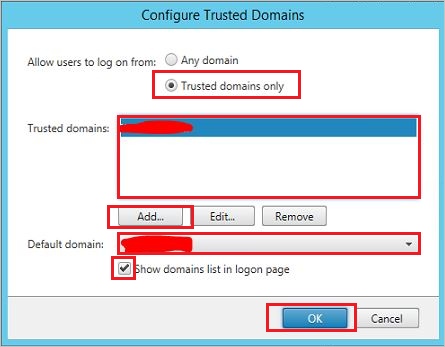

    a. Select **Trusted domains only**.

    b. Click on **Add** to add your domain in **Trusted domains** textbox.

    c. Select Default Domain from your **Default domain** list.

    d. Select **Show domains list in logon page**.

    e. Click **OK**.

15. On the **Manage NetScaler Gateways** pop-up, perform the following steps:

    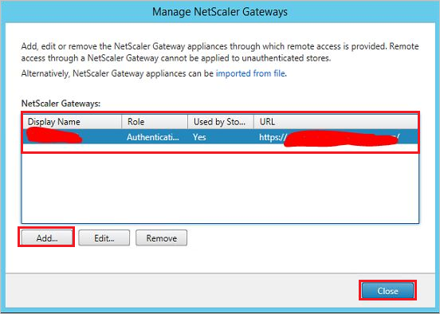

    a. Click on **Add** to add your NetScaler Gateways in **NetScaler Gateways** textbox.

    b. Click **Close**.

16. On the **StoreFront General Settings** tab, perform the following steps:

    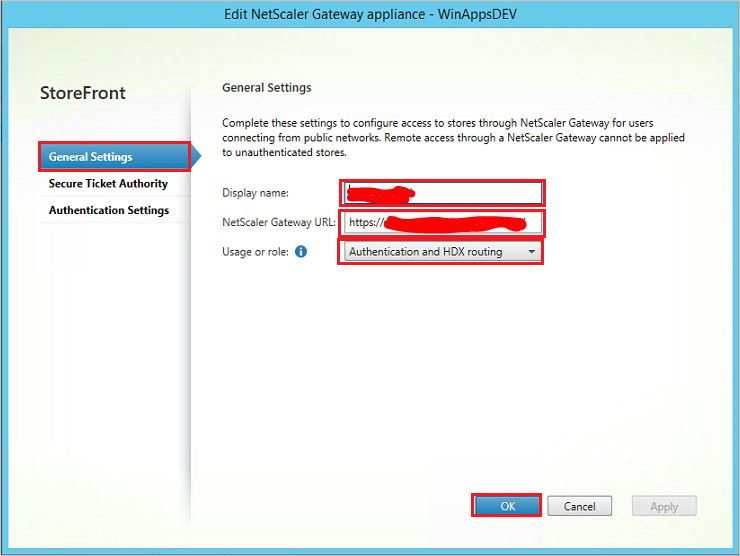

    a. In the **Display name** textbox type your NetScaler Gateway name.

    b. In the **NetScaler Gateway URL** textbox type your NetScaler Gateway URL.

    c. Select **Usage or role** as **Authentication and HDX routing**.

    d. Click **OK**.

17. On the **StoreFront Secure Ticket Authority** tab, perform the following steps:

    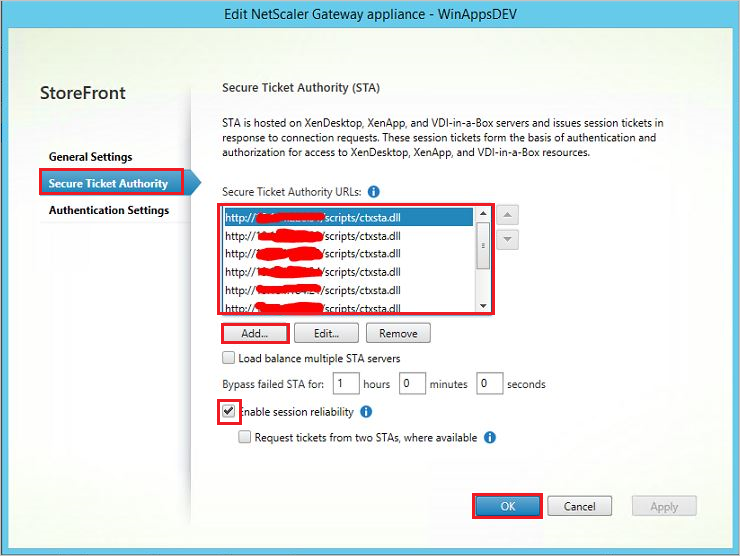

    a. Click on **Add** button to add your **Secure Ticket Authority URL's** in the textbox.

    b. Select **Enable session reliability**.

    c. Click **OK**.

18. On the **StoreFront Authentication Settings** tab, perform the following steps:

    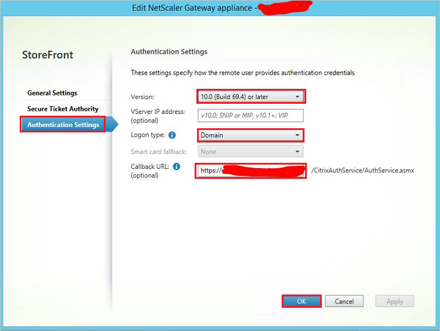

    a. Select your **Version**.

    b. Select **Logon type** as **Domain**.

    c. Enter your **Callback URL**.

    d. Click **OK**.

19. On the **StoreFront Deploy Citrix Receiver** tab, perform the following steps:

    

    a. Select **Deployment option** as **Use Receiver for HTML5 if local Receiver is unavailable**.

    b. Click **OK**.

20. On the **Manage Beacons** pop-up, perform the following steps:

    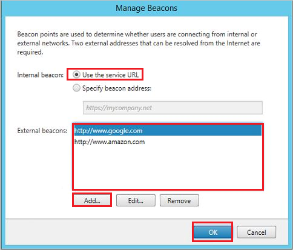

    a. Select the **Internal beacon** as **Use the service URL**.

    b. Click **Add** to add your URL's in the **External beacons** textbox.

    c. Click **OK**.

### Create an Azure AD test user 

The objective of this section is to create a test user in the Azure portal called Britta Simon.

1. In the Azure portal, in the left pane, select **Azure Active Directory**, select **Users**, and then select **All users**.

    

2. Select **New user** at the top of the screen.

    

3. In the User properties, perform the following steps.

    

    a. In the **Name** field enter **BrittaSimon**.
  
    b. In the **User name** field type **brittasimon@yourcompanydomain.extension**  
    For example, BrittaSimon@contoso.com

    c. Select **Show password** check box, and then write down the value that's displayed in the Password box.

    d. Click **Create**.

### Assign the Azure AD test user

In this section, you enable Britta Simon to use Azure single sign-on by granting access to Citrix Netscaler.

1. In the Azure portal, select **Enterprise Applications**, select **All applications**, then select **Citrix Netscaler**.

	

2. In the applications list, select **Citrix Netscaler**.

	

3. In the menu on the left, select **Users and groups**.

    

4. Click the **Add user** button, then select **Users and groups** in the **Add Assignment** dialog.

    

5. In the **Users and groups** dialog select **Britta Simon** in the Users list, then click the **Select** button at the bottom of the screen.

6. If you are expecting any role value in the SAML assertion then in the **Select Role** dialog select the appropriate role for the user from the list, then click the **Select** button at the bottom of the screen.

7. In the **Add Assignment** dialog click the **Assign** button.

### Create Citrix Netscaler test user

In this section, a user called Britta Simon is created in Citrix Netscaler. Citrix Netscaler supports just-in-time user provisioning, which is enabled by default. There is no action item for you in this section. If a user doesn't already exist in Citrix Netscaler, a new one is created after authentication.

>[!NOTE]
>If you need to create a user manually, you need to contact the [Citrix Netscaler Client support team](https://www.citrix.com/contact/technical-support.html).

### Test single sign-on 

In this section, you test your Azure AD single sign-on configuration using the Access Panel.

When you click the Citrix Netscaler tile in the Access Panel, you should be automatically signed in to the Citrix Netscaler for which you set up SSO. For more information about the Access Panel, see [Introduction to the Access Panel](https://docs.microsoft.com/azure/active-directory/active-directory-saas-access-panel-introduction).

## Additional Resources

- [List of Tutorials on How to Integrate SaaS Apps with Azure Active Directory](https://docs.microsoft.com/azure/active-directory/active-directory-saas-tutorial-list)

- [What is application access and single sign-on with Azure Active Directory?](https://docs.microsoft.com/azure/active-directory/active-directory-appssoaccess-whatis)

- [What is Conditional Access in Azure Active Directory?](https://docs.microsoft.com/azure/active-directory/conditional-access/overview)

