# Tutorial: Azure Active Directory single sign-on integration with Citrix NetScaler (Kerberos-based authentication)

In this tutorial, you'll learn how to integrate Citrix NetScaler with Azure Active Directory (Azure AD). When you integrate Citrix NetScaler with Azure AD, you can:

* Control in Azure AD who has access to Citrix NetScaler.
* Enable your users to be automatically signed in to Citrix NetScaler with their Azure AD accounts.
* Manage your accounts in one central location - the Azure portal.

To learn more about software as a service (SaaS) app integration with Azure AD, see [What is application access and single sign-on with Azure Active Directory](https://docs.microsoft.com/azure/active-directory/active-directory-appssoaccess-whatis).

## Prerequisites

To get started, you need the following items:

* An Azure AD subscription. If you don't have a subscription, you can get a [free account](https://azure.microsoft.com/free/).
* Citrix NetScaler single sign-on (SSO) enabled subscription.

## Scenario description

In this tutorial, you configure and test Azure AD SSO in a test environment. The tutorial includes these scenarios:

* **SP-initiated** SSO for Citrix NetScaler

* **Just in time** user provisioning for Citrix NetScaler

* [Kerberos-based authentication for Citrix NetScaler](#publish-the-web-server)

* [Header-based authentication for Citrix NetScaler](header-citrix-netscaler-tutorial.md#publish-the-web-server)

## Add Citrix NetScaler from the gallery

To integrate Citrix NetScaler with Azure AD, first add Citrix NetScaler to your list of managed SaaS apps from the gallery:

1. Sign in to the [Azure portal](https://portal.azure.com) using either a work or school account, or a personal Microsoft account.

1. In the left menu, select **Azure Active Directory**.

1. Go to **Enterprise Applications**, and then select **All Applications**.

1. To add a new application, select **New application**.

1. In the **Add from the gallery** section, enter **Citrix NetScaler** in the search box.

1. In the results, select **Citrix NetScaler**, and then add the app. Wait a few seconds while the app is added to your tenant.

## Configure and test Azure AD single sign-on for Citrix NetScaler

Configure and test Azure AD SSO with Citrix NetScaler by using a test user called **B.Simon**. For SSO to work, you need to establish a link relationship between an Azure AD user and the related user in Citrix NetScaler.

To configure and test Azure AD SSO with Citrix NetScaler, complete the following building blocks:

1. [Configure Azure AD SSO](#configure-azure-ad-sso) - to enable your users to use this feature.

    1. [Create an Azure AD test user](#create-an-azure-ad-test-user) - to test Azure AD SSO with B.Simon.

    1. [Assign the Azure AD test user](#assign-the-azure-ad-test-user) - to enable B.Simon to use Azure AD SSO.

1. [Configure Citrix NetScaler SSO](#configure-citrix-netscaler-sso) - to configure the SSO settings on the application side.

    * [Create a Citrix NetScaler test user](#create-a-citrix-netscaler-test-user) - to have a counterpart of B.Simon in Citrix NetScaler that is linked to the Azure AD representation of the user.

1. [Test SSO](#test-sso) - to verify whether the configuration works.

## Configure Azure AD SSO

To enable Azure AD SSO by using the Azure portal, complete these steps:

1. In the [Azure portal](https://portal.azure.com/), on the **Citrix NetScaler** application integration pane, under **Manage**, select **Single sign-on**.

1. On the **Select a single sign-on method** pane, select **SAML**.

1. On the **Set up Single Sign-On with SAML** pane, select the pen **Edit** icon for **Basic SAML Configuration** to edit the settings.

   

1. In the **Basic SAML Configuration** section, to configure the application in **IDP-initiated** mode:

    1. In the **Identifier** text box, enter a URL that has the following pattern:
    `https://<Your FQDN>`

    1. In the **Reply URL** text box, enter a URL that has the following pattern:
    `https://<Your FQDN>/CitrixAuthService/AuthService.asmx`

1. To configure the application in **SP-initiated** mode, select **Set additional URLs** and complete the following step:

    * In the **Sign-on URL** text box, enter a URL that has the following pattern:
    `https://<Your FQDN>/CitrixAuthService/AuthService.asmx`

	> [!NOTE]
	> * The URLs that are used in this section aren't real values. Update these values with the actual values for Identifier, Reply URL, and Sign-on URL. Contact the [Citrix NetScaler client support team](https://www.citrix.com/contact/technical-support.html) to get these values. You can also refer to the patterns shown in the **Basic SAML Configuration** section in the Azure portal.
    > * To set up SSO, the URLs must be accessible from public websites. You must enable the firewall or other security settings on the Citrix NetScaler side to enble Azure AD to post the token at the configured URL.

1. On the **Set up Single Sign-On with SAML** pane, in the **SAML Signing Certificate** section, for **App Federation Metadata Url**, copy the URL and save it in Notepad.

	

1. In the **Set up Citrix NetScaler** section, copy the relevant URLs based on your requirements.

	

### Create an Azure AD test user

In this section, you create a test user in the Azure portal called B.Simon.

1. On the left menu in the Azure portal, select **Azure Active Directory**, select **Users**, and then select **All users**.

1. Select **New user** at the top of the pane.

1. In **User** properties, complete these steps:

   1. For **Name**, enter `B.Simon`.  

   1. For **User name**, enter _username@companydomain.extension_. For example, `B.Simon@contoso.com`.

   1. Select the **Show password** check box, and then write down or copy the value that's displayed in **Password**.

   1. Select **Create**.

### Assign the Azure AD test user

In this section, you enable the user B.Simon to use Azure SSO by granting the user access to Citrix NetScaler.

1. In the Azure portal, select **Enterprise Applications**, and then select **All applications**.

1. In the applications list, select **Citrix NetScaler**.

1. On the app overview, under **Manage**, select **Users and groups**.

   

1. Select **Add user**. Then, in the **Add Assignment** dialog box, select **Users and groups**.

	

1. In the **Users and groups** dialog box, select **B.Simon** from the **Users** list. Choose **Select**.

1. If you're expecting any role value in the SAML assertion, in the **Select Role** dialog box, select the relevant role for the user from the list, and then choose **Select**.

1. In the **Add Assignment** dialog box, select **Assign**.

## Configure Citrix NetScaler SSO

Select a link for steps for the kind of authentication you want to configure:

- [Configure Citrix NetScaler SSO for Kerberos-based authentication](#publish-the-web-server)

- [Configure Citrix NetScaler SSO for header-based authentication](header-citrix-netscaler-tutorial.md#publish-the-web-server)

### Publish the web server 

To create a virtual server:

1. Select **Traffic Management** > **Load Balancing** > **Services**.
    
1. Select **Add**.

    

1. Set the following values for the web server that's running the applications:

   * **Service Name**
   * **Server IP/ Existing Server**
   * **Protocol**
   * **Port**

### Configure the load balancer

To configure the load balancer:

1. Go to **Traffic Management** > **Load Balancing** > **Virtual Servers**.

1. Select **Add**.

1. Set the following values as described in the following screenshot:

    * **Name**
    * **Protocol**
    * **IP Address**
    * **Port**

1. Select **OK**.

    

### Bind the virtual server

To bind the load balancer with the virtual server:

1. In the **Services and Service Groups** pane, select **No Load Balancing Virtual Server Service Binding**.

   

1. Verify the settings as shown in the following screenshot, and then select **Close**.

   

### Bind the certificate

To publish this service as SSL, bind the server certificate, and then test your application:

1. Under **Certificate**, select **No Server Certificate**.

   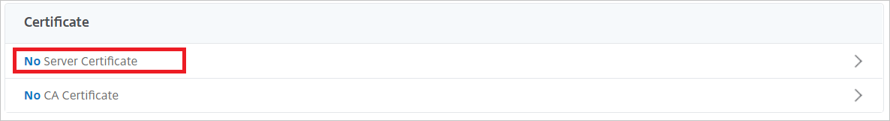

1. Verify the settings as shown in the following screenshot, and then select **Close**.

   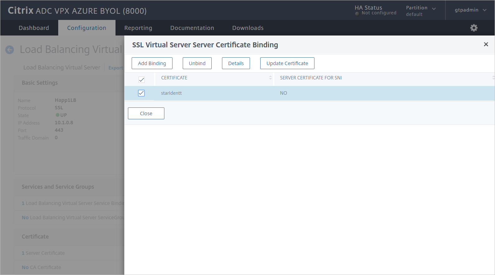

## Citrix ADC SAML profile

To configure the Citrix ADC SAML profile, complete the following sections.

### Create an authentication policy

To create an authentication policy:

1. Go to **Security** > **AAA – Application Traffic** > **Policies** > **Authentication** > **Authentication Policies**.

1. Select **Add**.

1. On the **Create Authentication Policy** pane, enter or select the following values:

    * **Name**: Enter a name for your authentication policy.
    * **Action**: Enter **SAML**, and then select **Add**.
    * **Expression**:  Enter **true**.     
    
    

1. Select **Create**.

### Create an authentication SAML server

To create an authentication SAML server, go to the **Create Authentication SAML Server** pane, and then complete the following steps:

1. For **Name**, enter a name for the authentication SAML server.

1. Under **Export SAML Metadata**:

   1. Select the **Import Metadata** check box.

   1. Enter the federation metadata URL from the Azure SAML UI that you copied earlier.
    
1. For **Issuer Name**, enter the relevant URL.

1. Select **Create**.

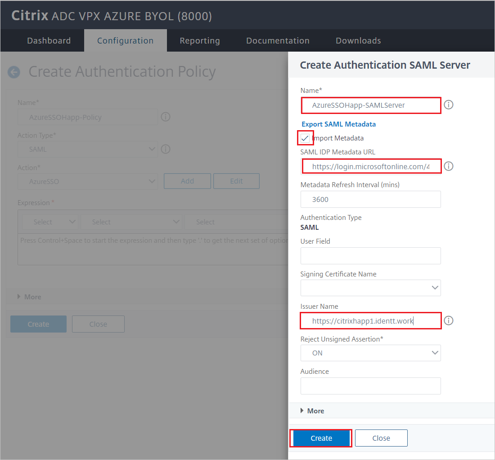

### Create an authentication virtual server

To create an authentication virtual server:

1.	Go to **Security** > **AAA - Application Traffic** > **Policies** > **Authentication** > **Authentication Virtual Servers**.

1.	Select **Add**, and then complete the following steps:

    1. For **Name**, enter a name for the authentication virtual server.

    1. Select the **Non-Addressable** check box.

    1. For **Protocol**, select **SSL**.

    1. Select **OK**.
    
1. Select **Continue**.

### Configure the authentication virtual server to use Azure AD

Modify two sections for the authentication virtual server:

1.	On the **Advanced Authentication Policies** pane, select **No Authentication Policy**.

    

1. On the **Policy Binding** pane, select the authentication policy, and then select **Bind**.

    

1. On the **Form Based Virtual Servers** pane, select **No Load Balancing Virtual Server**.

    

1. For **Authentication FQDN**, enter a fully qualified domain name (FQDN) (required).

1. Select the load balancing virtual server that you want to protect with Azure AD authentication.

1. Select **Bind**.

    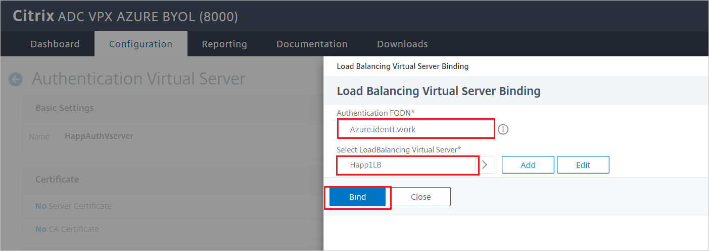

    > [!NOTE]
    > Be sure to select **Done** on the **Authentication Virtual Server Configuration** pane.

1. To verify your changes, in a browser, go to the application URL. You should see your tenant sign-in page instead of the unauthenticated access that you would have seen previously.

    

## Configure Citrix NetScaler SSO for Kerberos-based authentication

### Create a Kerberos delegation account for Citrix ADC

1. Create a user account (in this example, we use _AppDelegation_).

    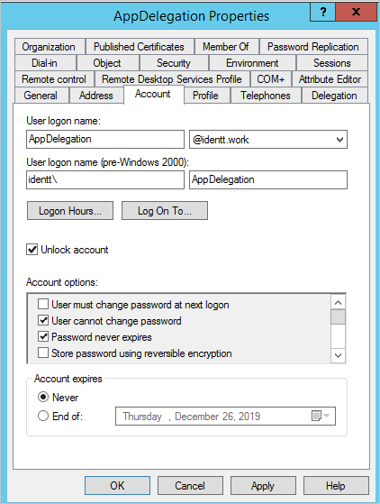

1. Set up a HOST SPN for this account. 

    Example: `setspn -S HOST/AppDelegation.IDENTT.WORK identt\appdelegation`
    
    In this example:

    * `IDENTT.WORK` is the domain FQDN.
    * `identt` is the domain NetBIOS name.
    * `appdelegation` is the delegation user account name.

1. Configure delegation for the web server as shown in the following screenshot:
 
    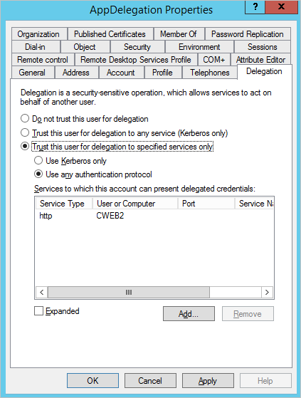

    > [!NOTE]
    > In the screenshot example, the internal web server name running the Windows Integrated Authentication (WIA) site is _CWEB2_.

### Citrix NetScaler AAA KCD (Kerberos delegation accounts)

To configure the Citrix NetScaler AAA KCD account:

1.	Go to  **Citrix Gateway** > **AAA KCD (Kerberos Constrained Delegation) Accounts**.

1.	Select **Add**, and then enter or select the following values:

    * **Name**: Enter a name for the KCD account.

    * **Realm**: Enter the domain and extension in uppercase.

    * **Service SPN**: `http/<host/fqdn>@<DOMAIN.COM>`.
    
        > [!NOTE]
        > `@DOMAIN.COM` is required and must be uppercase. Example: `http/cweb2@IDENTT.WORK`.

    * **Delegated User**: Enter the delegated user name.

    * Select the **Password for Delegated User** check box, and enter and confirm a password.

1. Select **OK**.
 
    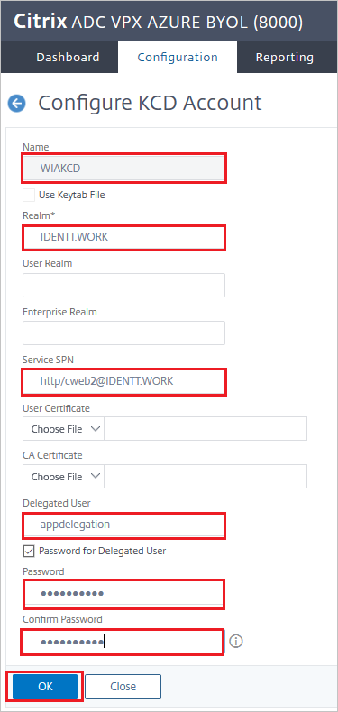

### Citrix traffic policy and traffic profile

To configure the Citrix traffic policy and traffic profile:

1.	Go to **Security** > **AAA - Application Traffic** > **Policies** > **Traffic Policies, Profiles and Form SSO ProfilesTraffic Policies**.

1.	Select **Traffic Profiles**.

1.	Select **Add**.

1.	To configure a traffic profile, enter or select the following values.

    * **Name**: Enter a name for the traffic profile.

    * **Single Sign-on**: Select **ON**.

    * **KCD Account**: Select the KCD account you created in the preceding section.

1. Select **OK**.

    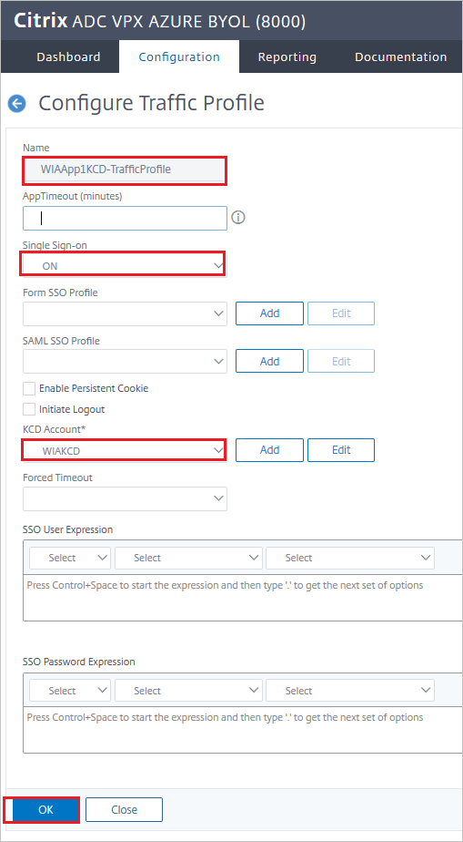
 
1.	Select **Traffic Policy**.

1.	Select **Add**.

1.	To configure a traffic policy, enter or select the following values:

    * **Name**: Enter a name for the traffic policy.

    * **Profile**: Select the traffic profile you created in the preceding section.

    * **Expression**: Enter **true**.

1. Select **OK**.

    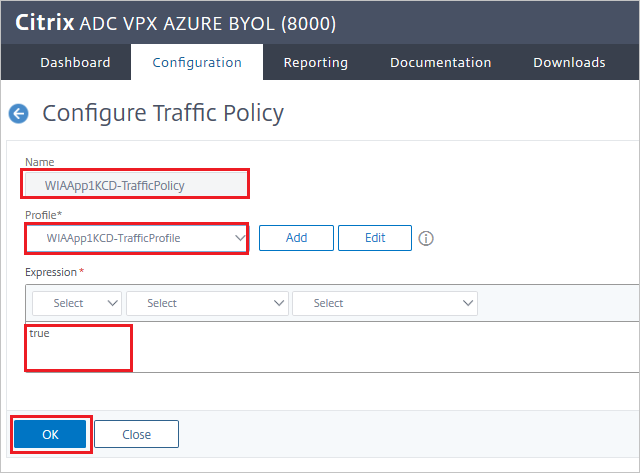

### Bind a traffic policy to a virtual server in Citrix

To bind a traffic policy to a virtual server by using the GUI:

1. Go to **Traffic Management** > **Load Balancing** > **Virtual Servers**.

1. In the list of virtual servers, select the virtual server to which you want to bind the rewrite policy, and then select **Open**.

1. On the **Load Balancing Virtual Server** pane, under **Advanced Settings**, select **Policies**. All policies that are configured for your NetScaler instance appear in the list.
 
    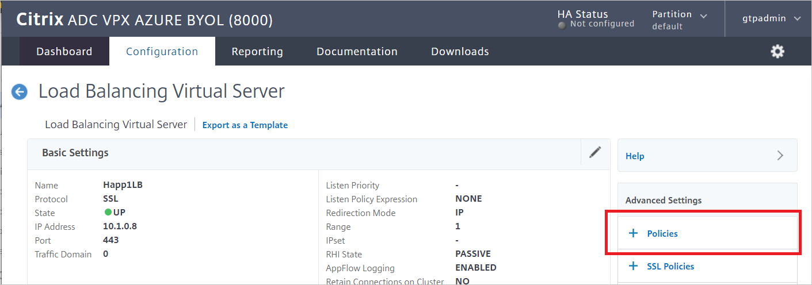

    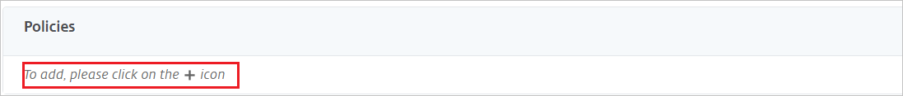

1.	Select the check box next to the name of the policy you want to bind to this virtual server.
 
    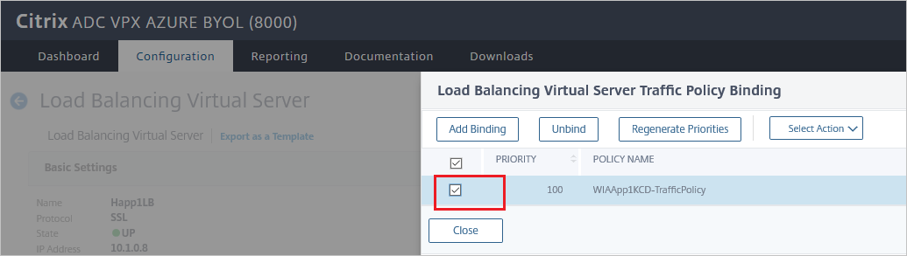

1. In the **Choose Type** dialog box:

    1. For **Choose Policy**, select **Traffic**.

    1. For **Choose Type**, select **Request**.

    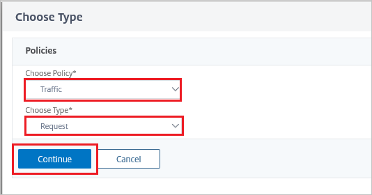

1. When the policy is bound, select **Done**.
 
    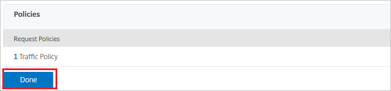

1. Test the binding by using the WIA website.

    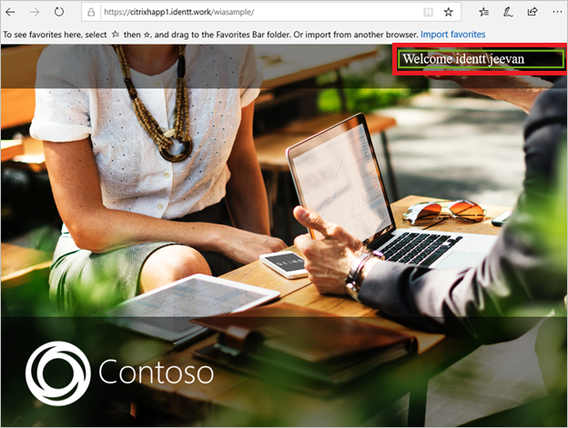    

### Create a Citrix NetScaler test user

In this section, a user called B.Simon is created in Citrix NetScaler. Citrix NetScaler supports just-in-time user provisioning, which is enabled by default. There is no action for you to take in this section. If a user doesn't already exist in Citrix NetScaler, a new one is created after authentication.

> [!NOTE]
> If you need to create a user manually, contact the [Citrix NetScaler client support team](https://www.citrix.com/contact/technical-support.html).

## Test SSO 

In this section, you test your Azure AD SSO configuration by using the Access Panel.

When you select the Citrix NetScaler tile in the Access Panel, you should be automatically signed in to the Citrix NetScaler for which you set up SSO. For more information about the Access Panel, see [Introduction to the Access Panel](https://docs.microsoft.com/azure/active-directory/active-directory-saas-access-panel-introduction).

## Additional resources

- [List of tutorials on how to integrate SaaS apps with Azure Active Directory](https://docs.microsoft.com/azure/active-directory/active-directory-saas-tutorial-list)

- [What is application access and single sign-on with Azure Active Directory?](https://docs.microsoft.com/azure/active-directory/active-directory-appssoaccess-whatis)

- [What is conditional access in Azure Active Directory?](https://docs.microsoft.com/azure/active-directory/conditional-access/overview)

- [Try Citrix NetScaler with Azure AD](https://aad.portal.azure.com/)

- [Configure Citrix NetScaler single sign-on for header-based authentication](header-citrix-netscaler-tutorial.md)
