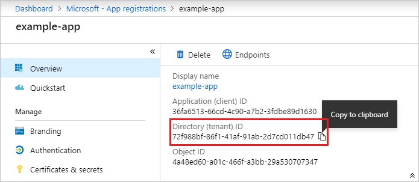
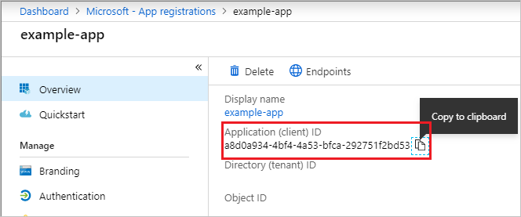
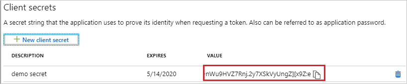
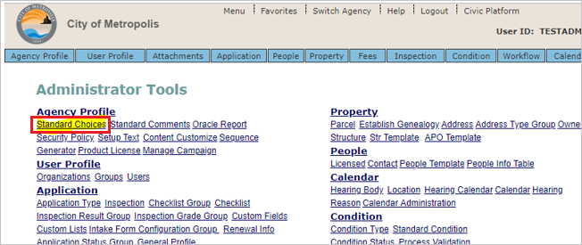
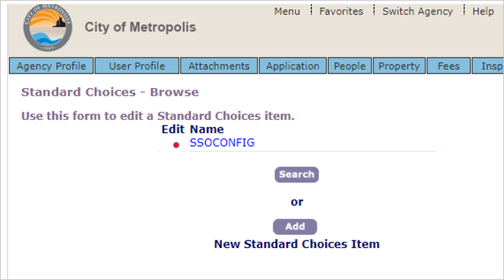

# Tutorial: Integrate Civic Platform with Azure Active Directory

In this tutorial, you'll learn how to integrate Civic Platform with Azure Active Directory (Azure AD). When you integrate Civic Platform with Azure AD, you can:

* Control in Azure AD who has access to Civic Platform.
* Enable your users to be automatically signed-in to Civic Platform with their Azure AD accounts.
* Manage your accounts in one central location - the Azure portal.

To learn more about SaaS app integration with Azure AD, see [What is application access and single sign-on with Azure Active Directory](https://docs.microsoft.com/azure/active-directory/active-directory-appssoaccess-whatis).

## Prerequisites

To get started, you need the following items:

* An Azure AD subscription. If you don't have a subscription, you can get one-month free trial [here](https://azure.microsoft.com/pricing/free-trial/).
* Civic Platform single sign-on (SSO) enabled subscription.

## Scenario description

In this tutorial, you configure and test Azure AD SSO in a test environment.

* Civic Platform supports **SP** initiated SSO

## Adding Civic Platform from the gallery

To configure the integration of Civic Platform into Azure AD, you need to add Civic Platform from the gallery to your list of managed SaaS apps.

1. Sign in to the [Azure portal](https://portal.azure.com) using either a work or school account, or a personal Microsoft account.
1. On the left navigation pane, select the **Azure Active Directory** service.
1. Navigate to **Enterprise Applications** and then select **All Applications**.
1. To add new application, select **New application**.
1. In the **Add from the gallery** section, type **Civic Platform** in the search box.
1. Select **Civic Platform** from results panel and then add the app. Wait a few seconds while the app is added to your tenant.

## Configure and test Azure AD single sign-on

Configure and test Azure AD SSO with Civic Platform using a test user called **B.Simon**. For SSO to work, you need to establish a link relationship between an Azure AD user and the related user in Civic Platform.

To configure and test Azure AD SSO with Civic Platform, complete the following building blocks:

1. **[Configure Azure AD SSO](#configure-azure-ad-sso)** - to enable your users to use this feature.
2. **[Configure Civic Platform SSO](#configure-civic-platform-sso)** - to configure the Single Sign-On settings on application side.
3. **[Create an Azure AD test user](#create-an-azure-ad-test-user)** - to test Azure AD single sign-on with B.Simon.
4. **[Assign the Azure AD test user](#assign-the-azure-ad-test-user)** - to enable B.Simon to use Azure AD single sign-on.
5. **[Create Civic Platform test user](#create-civic-platform-test-user)** - to have a counterpart of B.Simon in Civic Platform that is linked to the Azure AD representation of user.
6. **[Test SSO](#test-sso)** - to verify whether the configuration works.

### Configure Azure AD SSO

Follow these steps to enable Azure AD SSO in the Azure portal.

1. In the [Azure portal](https://portal.azure.com/), on the **Civic Platform** application integration page, find the **Manage** section and select **Single sign-on**.
1. On the **Select a Single sign-on method** page, select **SAML**.
1. On the **Set up Single Sign-On with SAML** page, click the edit/pen icon for **Basic SAML Configuration** to edit the settings.

   

1. On the **Basic SAML Configuration** section, enter the values for the following fields:

	a. In the **Sign on URL** text box, type a URL using the following pattern:
    `https://<SUBDOMAIN>.accela.com`

    b. In the **Identifier (Entity ID)** text box, type a URL: `civicplatform.accela.com`

	> [!NOTE]
	> The Sign on URL value is not real. Update this value with the actual Sign on URL. Contact [Civic Platform Client support team](mailto:skale@accela.com) to get this value. You can also refer to the patterns shown in the **Basic SAML Configuration** section in the Azure portal.

1. On the **Set up Single Sign-On with SAML** page, In the **SAML Signing Certificate** section, click copy button to copy **App Federation Metadata Url** and save it on your computer.

	

1. Navigate to **Azure Active Directory** > **App registrations** in Azure AD, select your application.

1. Copy the **Directory (tenant) ID** and store it into Notepad.

    

1. Copy the **Application ID** and store it into Notepad.

   

1. Navigate to **Azure Active Directory** > **App registrations** in Azure AD, select your application. Select **Certificates & secrets**.

1. Select **Client secrets -> New client secret**.

1. Provide a description of the secret, and a duration. When done, select **Add**.

   > [!NOTE]
   > After saving the client secret, the value of the client secret is displayed. Copy this value because you aren't able to retrieve the key later.

   

### Configure Civic Platform SSO

1. Open a new web browser window and sign into your Atlassian Cloud company site as an administrator.

1. Click on **Standard Choices**.

    

1. Create a standard choice **ssoconfig**.

1. Search for **ssoconfig**  and submit.

    

1. Expand SSOCONFIG by clicking on red dot.

    

1. Provide SSO related configuration information in the following step:

    

    1. In the **applicationid** field, enter the **Application ID** value, which you have copied from the Azure portal.

    1. In the **clientSecret** field, enter the **Secret** value, which you have copied from the Azure portal.

    1. In the **directoryId** field, enter the **Directory (tenant) ID** value, which you have copied from the Azure portal.

    1. Enter the idpName. Ex:- `Azure`.

### Create an Azure AD test user

In this section, you'll create a test user in the Azure portal called B.Simon.

1. From the left pane in the Azure portal, select **Azure Active Directory**, select **Users**, and then select **All users**.
1. Select **New user** at the top of the screen.
1. In the **User** properties, follow these steps:
   1. In the **Name** field, enter `B.Simon`.  
   1. In the **User name** field, enter the username@companydomain.extension. For example, `B.Simon@contoso.com`.
   1. Select the **Show password** check box, and then write down the value that's displayed in the **Password** box.
   1. Click **Create**.

### Assign the Azure AD test user

In this section, you'll enable B.Simon to use Azure single sign-on by granting access to Civic Platform.

1. In the Azure portal, select **Enterprise Applications**, and then select **All applications**.
1. In the applications list, select **Civic Platform**.
1. In the app's overview page, find the **Manage** section and select **Users and groups**.

   

1. Select **Add user**, then select **Users and groups** in the **Add Assignment** dialog.

	

1. In the **Users and groups** dialog, select **B.Simon** from the Users list, then click the **Select** button at the bottom of the screen.
1. If you're expecting any role value in the SAML assertion, in the **Select Role** dialog, select the appropriate role for the user from the list and then click the **Select** button at the bottom of the screen.
1. In the **Add Assignment** dialog, click the **Assign** button.

### Create Civic Platform test user

In this section, you create a user called B.Simon in Civic Platform. Work with Civic Platform support team to add the users in the [Civic Platform Client support team](mailto:skale@accela.com). Users must be created and activated before you use single sign-on.

### Test SSO 

In this section, you test your Azure AD single sign-on configuration using the Access Panel.

When you click the Civic Platform tile in the Access Panel, you should be automatically signed in to the Civic Platform for which you set up SSO. For more information about the Access Panel, see [Introduction to the Access Panel](https://docs.microsoft.com/azure/active-directory/active-directory-saas-access-panel-introduction).

## Additional Resources

- [ List of Tutorials on How to Integrate SaaS Apps with Azure Active Directory ](https://docs.microsoft.com/azure/active-directory/active-directory-saas-tutorial-list)

- [What is application access and single sign-on with Azure Active Directory? ](https://docs.microsoft.com/azure/active-directory/active-directory-appssoaccess-whatis)

- [What is conditional access in Azure Active Directory?](https://docs.microsoft.com/azure/active-directory/conditional-access/overview)

