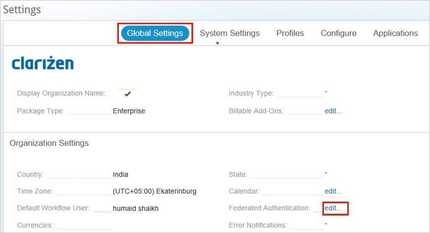
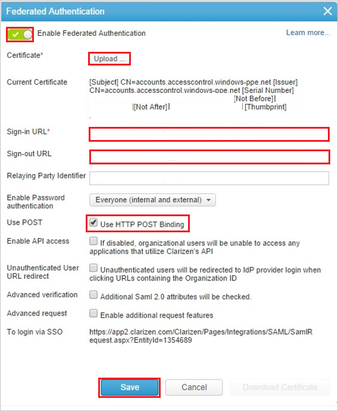

# Tutorial: Azure Active Directory integration with Clarizen One

In this tutorial, you'll learn how to integrate Clarizen One with Azure Active Directory (Azure AD). When you integrate Clarizen One with Azure AD, you can:

* Control in Azure AD who has access to Clarizen One.
* Enable your users to be automatically signed-in to Clarizen One with their Azure AD accounts.
* Manage your accounts in one central location - the Azure portal.

## Prerequisites

To get started, you need the following items:

* An Azure AD subscription. If you don't have a subscription, you can get a [free account](https://azure.microsoft.com/free/).
* Clarizen One single sign-on (SSO) enabled subscription.

## Scenario description

In this tutorial, you configure and test Azure AD single sign-on in a test environment.

* Clarizen One supports **IDP** initiated SSO.

> [!NOTE]
> Identifier of this application is a fixed string value so only one instance can be configured in one tenant.

## Add Clarizen One from the gallery

To configure the integration of Clarizen One into Azure AD, you need to add Clarizen One from the gallery to your list of managed SaaS apps.

1. Sign in to the Azure portal using either a work or school account, or a personal Microsoft account.
1. On the left navigation pane, select the **Azure Active Directory** service.
1. Navigate to **Enterprise Applications** and then select **All Applications**.
1. To add new application, select **New application**.
1. In the **Add from the gallery** section, type **Clarizen One** in the search box.
1. Select **Clarizen One** from results panel and then add the app. Wait a few seconds while the app is added to your tenant.

## Configure and test Azure AD SSO for Clarizen One

Configure and test Azure AD SSO with Clarizen One using a test user called **B.Simon**. For SSO to work, you need to establish a link relationship between an Azure AD user and the related user in Clarizen One.

To configure and test Azure AD SSO with Clarizen One, perform the following steps:

1. **[Configure Azure AD SSO](#configure-azure-ad-sso)** - to enable your users to use this feature.
    1. **[Create an Azure AD test user](#create-an-azure-ad-test-user)** - to test Azure AD single sign-on with B.Simon.
    1. **[Assign the Azure AD test user](#assign-the-azure-ad-test-user)** - to enable B.Simon to use Azure AD single sign-on.
1. **[Configure Clarizen One SSO](#configure-clarizen-one-sso)** - to configure the single sign-on settings on application side.
    1. **[Create Clarizen test user](#create-clarizen-one-test-user)** - to have a counterpart of B.Simon in Clarizen One that is linked to the Azure AD representation of user.
1. **[Test SSO](#test-sso)** - to verify whether the configuration works.

## Configure Azure AD SSO

Follow these steps to enable Azure AD SSO in the Azure portal.

1. In the Azure portal, on the **Clarizen One** application integration page, find the **Manage** section and select **single sign-on**.
1. On the **Select a single sign-on method** page, select **SAML**.
1. On the **Set up single sign-on with SAML** page, click the pencil icon for **Basic SAML Configuration** to edit the settings.

   

4. On the **Set up Single Sign-On with SAML** page, perform the following steps:

    a. In the **Identifier** text box, type the value:
    `Clarizen`

    b. In the **Reply URL** text box, type the URL:
    `https://.clarizen.com/Clarizen/Pages/Integrations/SAML/SamlResponse.aspx`

4. On the **Set up Single Sign-On with SAML** page, in the **SAML Signing Certificate** section, click **Download** to download the **Certificate (Base64)** from the given options as per your requirement and save it on your computer.

    

6. On the **Set up Clarizen One** section, copy the appropriate URL(s) as per your requirement.

    

### Create an Azure AD test user 

In this section, you'll create a test user in the Azure portal called B.Simon.

1. From the left pane in the Azure portal, select **Azure Active Directory**, select **Users**, and then select **All users**.
1. Select **New user** at the top of the screen.
1. In the **User** properties, follow these steps:
   1. In the **Name** field, enter `B.Simon`.  
   1. In the **User name** field, enter the username@companydomain.extension. For example, `B.Simon@contoso.com`.
   1. Select the **Show password** check box, and then write down the value that's displayed in the **Password** box.
   1. Click **Create**.

### Assign the Azure AD test user

In this section, you'll enable B.Simon to use Azure single sign-on by granting access to Clarizen One.

1. In the Azure portal, select **Enterprise Applications**, and then select **All applications**.
1. In the applications list, select **Clarizen One**.
1. In the app's overview page, find the **Manage** section and select **Users and groups**.
1. Select **Add user**, then select **Users and groups** in the **Add Assignment** dialog.
1. In the **Users and groups** dialog, select **B.Simon** from the Users list, then click the **Select** button at the bottom of the screen.
1. If you are expecting a role to be assigned to the users, you can select it from the **Select a role** dropdown. If no role has been set up for this app, you see "Default Access" role selected.
1. In the **Add Assignment** dialog, click the **Assign** button.

## Configure Clarizen One SSO

1. In a different web browser window, sign in to your Clarizen One company site as an administrator.

1. Click your username, and then click **Settings**.

    

1. Click the **Global Settings** tab. Then, next to **Federated Authentication**, click **edit**.

    

1. In the **Federated Authentication** dialog box, perform the following steps:

    

    a. Select **Enable Federated Authentication**.

    b. Click **Upload** to upload your downloaded certificate.

    c. In the **Sign-in URL** box, enter the value of **Login URL** from the Azure AD application configuration window.

    d. In the **Sign-out URL** box, enter the value of **Logout URL** from the Azure AD application configuration window.

    e. Select **Use POST**.

    f. Click **Save**.

### Create Clarizen One test user

The objective of this section is to create a user called Britta Simon in Clarizen One.

**If you need to create user manually, please perform following steps:**

To enable Azure AD users to sign in to Clarizen One, you must provision user accounts. In the case of Clarizen One, provisioning is a manual task.

1. Sign in to your Clarizen One company site as an administrator.

2. Click **People**.

    

3. Click **Invite User**.

    

1. In the **Invite People** dialog box, perform the following steps:

    

    a. In the **Email** box, type the email address of the Britta Simon account.

    b. Click **Invite**.

    > [!NOTE]
    > The Azure Active Directory account holder will receive an email and follow a link to confirm their account before it becomes active.

## Test SSO 

In this section, you test your Azure AD single sign-on configuration with following options.

* Click on Test this application in Azure portal and you should be automatically signed in to the Clarizen One for which you set up the SSO.

* You can use Microsoft My Apps. When you click the Clarizen One tile in the My Apps, you should be automatically signed in to the Clarizen One for which you set up the SSO. For more information about the My Apps, see [Introduction to the My Apps](https://docs.microsoft.com/azure/active-directory/active-directory-saas-access-panel-introduction).

## Next steps

Once you configure Clarizen One you can enforce session control, which protects exfiltration and infiltration of your organization’s sensitive data in real time. Session control extends from Conditional Access. [Learn how to enforce session control with Microsoft Cloud App Security](https://docs.microsoft.com/cloud-app-security/proxy-deployment-any-app).