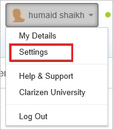
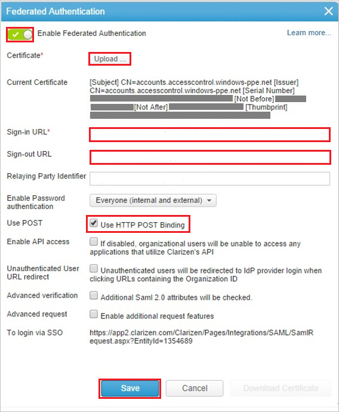
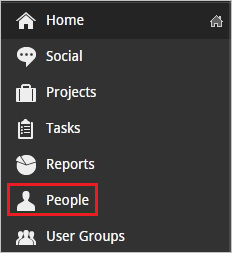
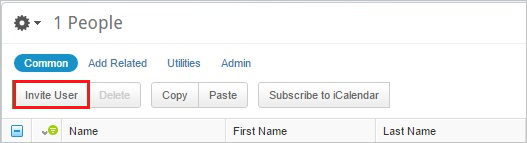

# Tutorial: Azure Active Directory integration with Clarizen

In this tutorial, you learn how to integrate Clarizen with Azure Active Directory (Azure AD).
Integrating Clarizen with Azure AD provides you with the following benefits:

* You can control in Azure AD who has access to Clarizen.
* You can enable your users to be automatically signed-in to Clarizen (Single Sign-On) with their Azure AD accounts.
* You can manage your accounts in one central location - the Azure portal.

If you want to know more details about SaaS app integration with Azure AD, see [What is application access and single sign-on with Azure Active Directory](https://docs.microsoft.com/azure/active-directory/active-directory-appssoaccess-whatis).
If you don't have an Azure subscription, [create a free account](https://azure.microsoft.com/free/) before you begin.

## Prerequisites

To configure Azure AD integration with Clarizen, you need the following items:

* An Azure AD subscription. If you don't have an Azure AD environment, you can get one-month trial [here](https://azure.microsoft.com/pricing/free-trial/)
* Clarizen single sign-on enabled subscription

## Scenario description

In this tutorial, you configure and test Azure AD single sign-on in a test environment.

* Clarizen supports **IDP** initiated SSO

## Adding Clarizen from the gallery

To configure the integration of Clarizen into Azure AD, you need to add Clarizen from the gallery to your list of managed SaaS apps.

**To add Clarizen from the gallery, perform the following steps:**

1. In the **[Azure portal](https://portal.azure.com)**, on the left navigation panel, click **Azure Active Directory** icon.

	

2. Navigate to **Enterprise Applications** and then select the **All Applications** option.

	

3. To add new application, click **New application** button on the top of dialog.

	

4. In the search box, type **Clarizen**, select **Clarizen** from result panel then click **Add** button to add the application.

	 

## Configure and test Azure AD single sign-on

In this section, you configure and test Azure AD single sign-on with Clarizen based on a test user called **Britta Simon**.
For single sign-on to work, a link relationship between an Azure AD user and the related user in Clarizen needs to be established.

To configure and test Azure AD single sign-on with Clarizen, you need to complete the following building blocks:

1. **[Configure Azure AD Single Sign-On](#configure-azure-ad-single-sign-on)** - to enable your users to use this feature.
2. **[Configure Clarizen Single Sign-On](#configure-clarizen-single-sign-on)** - to configure the Single Sign-On settings on application side.
3. **[Create an Azure AD test user](#create-an-azure-ad-test-user)** - to test Azure AD single sign-on with Britta Simon.
4. **[Assign the Azure AD test user](#assign-the-azure-ad-test-user)** - to enable Britta Simon to use Azure AD single sign-on.
5. **[Create Clarizen test user](#create-clarizen-test-user)** - to have a counterpart of Britta Simon in Clarizen that is linked to the Azure AD representation of user.
6. **[Test single sign-on](#test-single-sign-on)** - to verify whether the configuration works.

### Configure Azure AD single sign-on

In this section, you enable Azure AD single sign-on in the Azure portal.

To configure Azure AD single sign-on with Clarizen, perform the following steps:

1. In the [Azure portal](https://portal.azure.com/), on the **Clarizen** application integration page, select **Single sign-on**.

    

2. On the **Select a Single sign-on method** dialog, select **SAML/WS-Fed** mode to enable single sign-on.

    

3. On the **Set up Single Sign-On with SAML** page, click **Edit** icon to open **Basic SAML Configuration** dialog.

	

4. On the **Set up Single Sign-On with SAML** page, perform the following steps:

    

    a. In the **Identifier** text box, type a value:
    `Clarizen`

    b. In the **Reply URL** text box, type a URL using the following pattern:
    `https://.clarizen.com/Clarizen/Pages/Integrations/SAML/SamlResponse.aspx`

	> [!NOTE]
	> These are not the real values. You have to use the actual identifier and reply URL. Here we suggest that you use the unique value of a string as the identifier. To get the actual values, contact the [Clarizen support team](https://success.clarizen.com/hc/en-us/requests/new).

4. On the **Set up Single Sign-On with SAML** page, in the **SAML Signing Certificate** section, click **Download** to download the **Certificate (Base64)** from the given options as per your requirement and save it on your computer.

	

6. On the **Set up Clarizen** section, copy the appropriate URL(s) as per your requirement.

	

	a. Login URL

	b. Azure Ad Identifier

	c. Logout URL

### Configure Clarizen Single Sign-On

1. In a different web browser window, sign in to your Clarizen company site as an administrator.

1. Click your username, and then click **Settings**.

	

1. Click the **Global Settings** tab. Then, next to **Federated Authentication**, click **edit**.

	

1. In the **Federated Authentication** dialog box, perform the following steps:

	

	a. Select **Enable Federated Authentication**.

	b. Click **Upload** to upload your downloaded certificate.

	c. In the **Sign-in URL** box, enter the value of **Login URL** from the Azure AD application configuration window.

	d. In the **Sign-out URL** box, enter the value of **Logout URL** from the Azure AD application configuration window.

	e. Select **Use POST**.

	f. Click **Save**.

### Create an Azure AD test user 

The objective of this section is to create a test user in the Azure portal called Britta Simon.

1. In the Azure portal, in the left pane, select **Azure Active Directory**, select **Users**, and then select **All users**.

    

2. Select **New user** at the top of the screen.

    

3. In the User properties, perform the following steps.

    

    a. In the **Name** field enter **BrittaSimon**.
  
    b. In the **User name** field type **brittasimon\@yourcompanydomain.extension**  
    For example, BrittaSimon@contoso.com

    c. Select **Show password** check box, and then write down the value that's displayed in the Password box.

    d. Click **Create**.

### Assign the Azure AD test user

In this section, you enable Britta Simon to use Azure single sign-on by granting access to Clarizen.

1. In the Azure portal, select **Enterprise Applications**, select **All applications**, then select **Clarizen**.

	

2. In the applications list, select **Clarizen**.

	

3. In the menu on the left, select **Users and groups**.

    

4. Click the **Add user** button, then select **Users and groups** in the **Add Assignment** dialog.

    

5. In the **Users and groups** dialog select **Britta Simon** in the Users list, then click the **Select** button at the bottom of the screen.

6. If you are expecting any role value in the SAML assertion then in the **Select Role** dialog select the appropriate role for the user from the list, then click the **Select** button at the bottom of the screen.

7. In the **Add Assignment** dialog click the **Assign** button.

### Create Clarizen test user

The objective of this section is to create a user called Britta Simon in Clarizen.

**If you need to create user manually, please perform following steps:**

To enable Azure AD users to sign in to Clarizen, you must provision user accounts. In the case of Clarizen, provisioning is a manual task.

1. Sign in to your Clarizen company site as an administrator.

2. Click **People**.

    

3. Click **Invite User**.

	

1. In the **Invite People** dialog box, perform the following steps:

	

	a. In the **Email** box, type the email address of the Britta Simon account.

    b. Click **Invite**.

	> [!NOTE]
    > The Azure Active Directory account holder will receive an email and follow a link to confirm their account before it becomes active.

### Test single sign-on 

In this section, you test your Azure AD single sign-on configuration using the Access Panel.

When you click the Clarizen tile in the Access Panel, you should be automatically signed in to the Clarizen for which you set up SSO. For more information about the Access Panel, see [Introduction to the Access Panel](https://docs.microsoft.com/azure/active-directory/active-directory-saas-access-panel-introduction).

## Additional Resources

- [List of Tutorials on How to Integrate SaaS Apps with Azure Active Directory](https://docs.microsoft.com/azure/active-directory/active-directory-saas-tutorial-list)

- [What is application access and single sign-on with Azure Active Directory?](https://docs.microsoft.com/azure/active-directory/active-directory-appssoaccess-whatis)

- [What is Conditional Access in Azure Active Directory?](https://docs.microsoft.com/azure/active-directory/conditional-access/overview)
