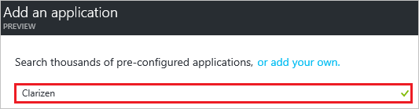
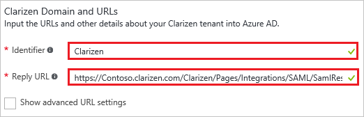
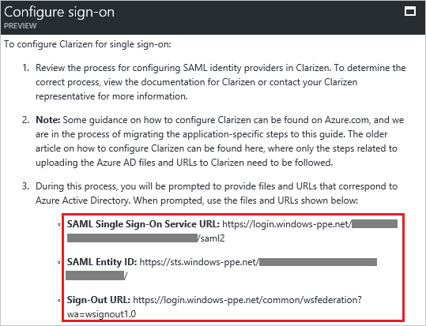

# Tutorial: Azure Active Directory integration with Clarizen

In this tutorial, you learn how to integrate Azure Active Directory (Azure AD) with Clarizen. This integration gives you the following benefits:

- You can control, in Azure AD, who has access to Clarizen.
- You can enable your users to be automatically signed in to Clarizen (single sign-on) with their Azure AD accounts.
- You can manage your accounts in one central location, the Azure portal.

The scenario in this tutorial consists of two main tasks:

1. Add Clarizen from the gallery.
1. Configure and test Azure AD single sign-on.

If you want more details about software as a service (SaaS) app integration with Azure AD, see [What is application access and single sign-on with Azure Active Directory?](../manage-apps/what-is-single-sign-on.md).

## Prerequisites
To configure Azure AD integration with Clarizen, you need the following items:

- An Azure AD subscription
- A Clarizen subscription that's enabled for single sign-on

To test the steps in this tutorial, follow these recommendations:

- Test Azure AD single sign-on in a test environment. Don't use your production environment, unless this is necessary.
- If you don't have an Azure AD test environment, you can [get a one-month trial](https://azure.microsoft.com/pricing/free-trial/).

## Add Clarizen from the gallery
To configure the integration of Clarizen into Azure AD, add Clarizen from the gallery to your list of managed SaaS apps.

1. In the [Azure portal](https://portal.azure.com), in the left pane, click the **Azure Active Directory** icon.

	![Azure Active Directory icon][1]

1. Click **Enterprise applications**. Then click **All applications**.

	![Clicking "Enterprise applications" and "All applications"][2]

1. Click the **Add** button at the top of the dialog box.

	![The "Add" button][3]

1. In the search box, type **Clarizen**.

	

1. In the results pane, select **Clarizen**, and then click **Add** to add the application.

	

## Configure and test Azure AD single sign-on
In the following sections, you configure and test Azure AD single sign-on with Clarizen based on the test user Britta Simon.

For single sign-on to work, Azure AD needs to know what the counterpart user in Clarizen is to a user in Azure AD. In other words, a link relationship between an Azure AD user and the related user in Clarizen needs to be established. You establish this link relationship by assigning the value of **user name** in Azure AD as the value of **Username** in Clarizen.

To configure and test Azure AD single sign-on with Clarizen, complete the following building blocks:

1. **[Configure Azure AD single sign-on](#configure-azure-ad-single-sign-on)** to enable your users to use this feature.
1. **[Create an Azure AD test user](#create-an-azure-ad-test-user)** to test Azure AD single sign-on with Britta Simon.
1. **[Create a Clarizen test user](#create-a-clarizen-test-user)** to have a counterpart of Britta Simon in Clarizen that is linked to the Azure AD representation of her.
1. **[Assign the Azure AD test user](#assign-the-azure-ad-test-user)** to enable Britta Simon to use Azure AD single sign-on.
1. **[Test single sign-on](#test-single-sign-on)** to verify whether the configuration works.

### Configure Azure AD single sign-on
Enable Azure AD single sign-on in the Azure portal and configure single sign-on in your Clarizen application.

1. In the Azure portal, on the **Clarizen** application integration page, click **Single sign-on**.

	![Clicking "Single sign-on"][4]

1. In the **Single sign-on** dialog box, for **Mode**, select **SAML-based Sign-on** to enable single sign-on.

	

1. In the **Clarizen Domain and URLs** section, perform the following steps:

	

    a. In the **Identifier** box, type the value as: **Clarizen**

	b. In the **Reply URL** box, type a URL by using the following pattern: **https://<company name>.clarizen.com/Clarizen/Pages/Integrations/SAML/SamlResponse.aspx**

	> [!NOTE]
	> These are not the real values. You have to use the actual identifier and reply URL. Here we suggest that you use the unique value of a string as the identifier. To get the actual values, contact the [Clarizen support team](https://success.clarizen.com/hc/en-us/requests/new).

1. On the **SAML Signing Certificate** section, click **Create new certificate**.

	 	

1. In the **Create New Certificate** dialog box, click the calendar icon and select an expiry date. Then click **Save**.

	

1. In the **SAML Signing Certificate** section, select **Make new certificate active**, and then click **Save**.

	

1. In the **Rollover certificate** dialog box, click **OK**.

	

1. In the **SAML Signing Certificate** section, click **Certificate (Base64)** and then save the certificate file on your computer.

	

1. In the **Clarizen Configuration** section, click **Configure Clarizen** to open the **Configure sign-on** window.

	

	

1. In a different web browser window, sign in to your Clarizen company site as an administrator.

1. Click your username, and then click **Settings**.

	

1. Click the **Global Settings** tab. Then, next to **Federated Authentication**, click **edit**.

	

1. In the **Federated Authentication** dialog box, perform the following steps:

	

	a. Select **Enable Federated Authentication**.

	b. Click **Upload** to upload your downloaded certificate.

	c. In the **Sign-in URL** box, enter the value of **SAML Single Sign-On Service URL** from the Azure AD application configuration window.

	d. In the **Sign-out URL** box, enter the value of **Sign-Out URL** from the Azure AD application configuration window.

	e. Select **Use POST**.

	f. Click **Save**.

### Create an Azure AD test user
In the Azure portal, create a test user called Britta Simon.

![Name and email address of the Azure AD test user][100]

1. In the Azure portal, in the left pane, click the **Azure Active Directory** icon.

	

1. Click **Users and groups**, and then click **All users** to display the list of users.

	

1. At the top of the dialog box, click **Add** to open the **User** dialog box.

	

1. In the **User** dialog box, perform the following steps:

	

    a. In the **Name** box, type **BrittaSimon**.

    b. In the **User name** box, type the email address of the Britta Simon account.

	c. Select **Show Password** and write down the value of **Password**.

    d. Click **Create**.

### Create a Clarizen test user

The objective of this section is to create a user called Britta Simon in Clarizen.

**If you need to create user manually, please perform following steps:**

To enable Azure AD users to sign in to Clarizen, you must provision user accounts. In the case of Clarizen, provisioning is a manual task.

1. Sign in to your Clarizen company site as an administrator.

2. Click **People**.

    

3. Click **Invite User**.

	

1. In the **Invite People** dialog box, perform the following steps:

	

	a. In the **Email** box, type the email address of the Britta Simon account.

    b. Click **Invite**.

	> [!NOTE]
    > The Azure Active Directory account holder will receive an email and follow a link to confirm their account before it becomes active.

### Assign the Azure AD test user
Enable Britta Simon to use Azure single sign-on by granting her access to Clarizen.

![Assigned test user][200]

1. In the Azure portal, open the applications view, browse to the directory view, click **Enterprise applications**, and then click **All applications**.

	![Clicking "Enterprise applications" and "All applications"][201]

1. In the applications list, select **Clarizen**.

	

1. In the left pane, click **Users and groups**.

	![Clicking "Users and groups"][202]

1. Click the **Add** button. Then, in the **Add Assignment** dialog box, select **Users and groups**.

	![The "Add" button and the "Add Assignment" dialog box][203]

1. In the **Users and groups** dialog box, select **Britta Simon** in the list of users.

1. In the **Users and groups** dialog box, click the **Select** button.

1. In the **Add Assignment** dialog box, click the **Assign** button.

### Test single sign-on
Test your Azure AD single sign-on configuration by using the Access Panel.

When you click the Clarizen tile in the Access Panel, you should be automatically signed in to your Clarizen application.

## Additional resources

* [List of tutorials on how to integrate SaaS apps with Azure Active Directory](tutorial-list.md)
* [What is application access and single sign-on with Azure Active Directory?](../manage-apps/what-is-single-sign-on.md)

<!--Image references-->

[1]: ./media/clarizen-tutorial/tutorial_general_01.png
[2]: ./media/clarizen-tutorial/tutorial_general_02.png
[3]: ./media/clarizen-tutorial/tutorial_general_03.png
[4]: ./media/clarizen-tutorial/tutorial_general_04.png

[100]: ./media/clarizen-tutorial/tutorial_general_100.png

[200]: ./media/clarizen-tutorial/tutorial_general_200.png
[201]: ./media/clarizen-tutorial/tutorial_general_201.png
[202]: ./media/clarizen-tutorial/tutorial_general_202.png
[203]: ./media/clarizen-tutorial/tutorial_general_203.png