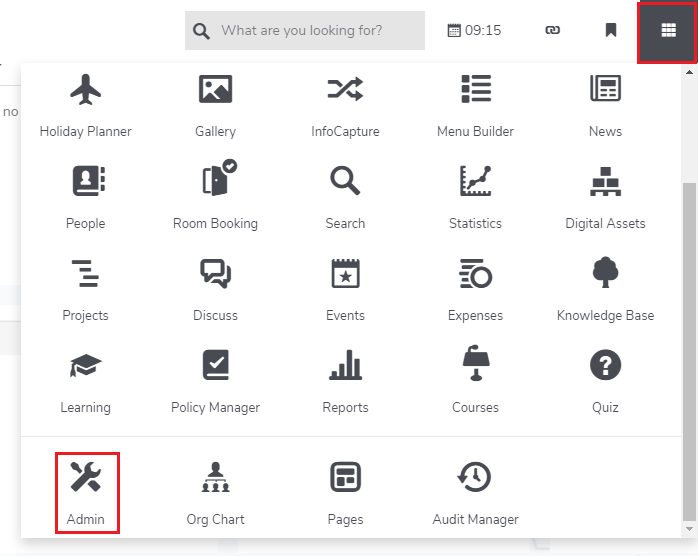
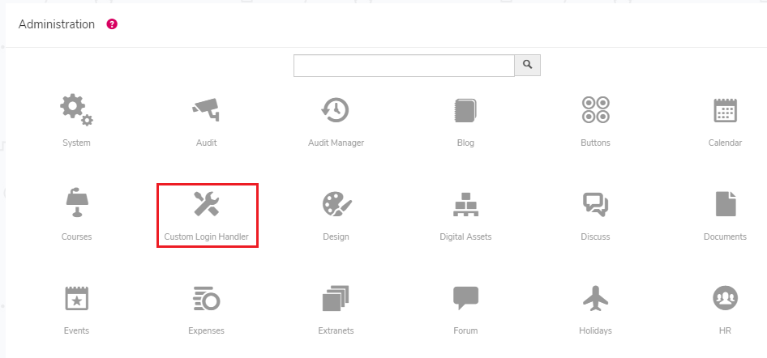
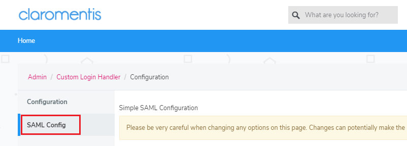
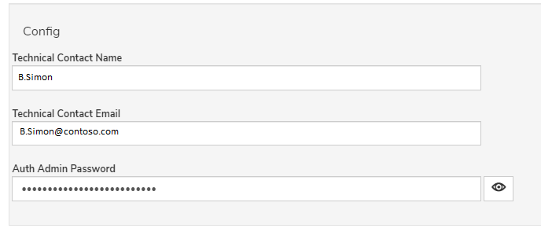
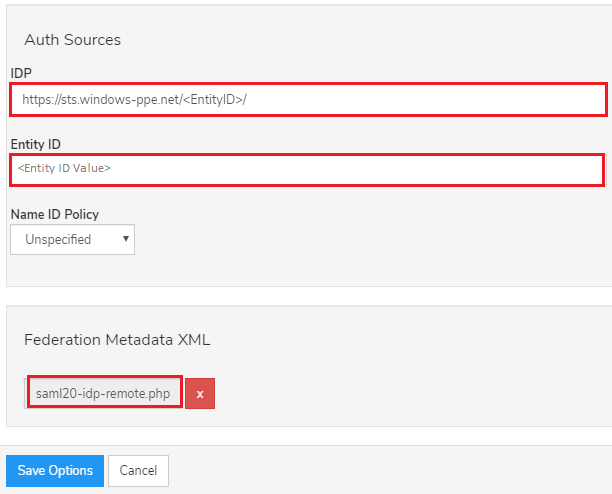
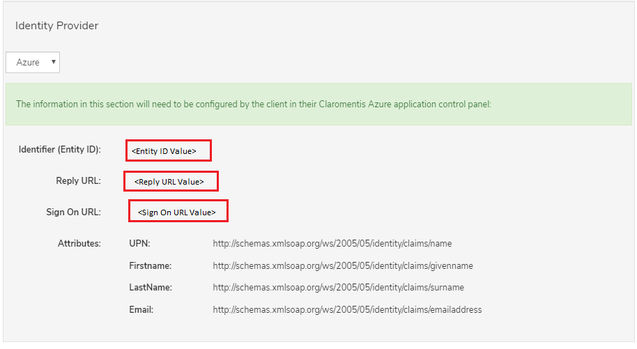

# Tutorial: Azure Active Directory single sign-on (SSO) integration with Claromentis

In this tutorial, you'll learn how to integrate Claromentis with Azure Active Directory (Azure AD). When you integrate Claromentis with Azure AD, you can:

* Control in Azure AD who has access to Claromentis.
* Enable your users to be automatically signed-in to Claromentis with their Azure AD accounts.
* Manage your accounts in one central location - the Azure portal.

To learn more about SaaS app integration with Azure AD, see [What is application access and single sign-on with Azure Active Directory](https://docs.microsoft.com/azure/active-directory/active-directory-appssoaccess-whatis).

## Prerequisites

To get started, you need the following items:

* An Azure AD subscription. If you don't have a subscription, you can get a [free account](https://azure.microsoft.com/free/).
* Claromentis single sign-on (SSO) enabled subscription.

## Scenario description

In this tutorial, you configure and test Azure AD SSO in a test environment.

* Claromentis supports **SP and IDP** initiated SSO
* Claromentis supports **Just In Time** user provisioning

## Adding Claromentis from the gallery

To configure the integration of Claromentis into Azure AD, you need to add Claromentis from the gallery to your list of managed SaaS apps.

1. Sign in to the [Azure portal](https://portal.azure.com) using either a work or school account, or a personal Microsoft account.
1. On the left navigation pane, select the **Azure Active Directory** service.
1. Navigate to **Enterprise Applications** and then select **All Applications**.
1. To add new application, select **New application**.
1. In the **Add from the gallery** section, type **Claromentis** in the search box.
1. Select **Claromentis** from results panel and then add the app. Wait a few seconds while the app is added to your tenant.

## Configure and test Azure AD single sign-on for Claromentis

Configure and test Azure AD SSO with Claromentis using a test user called **B.Simon**. For SSO to work, you need to establish a link relationship between an Azure AD user and the related user in Claromentis.

To configure and test Azure AD SSO with Claromentis, complete the following building blocks:

1. **[Configure Azure AD SSO](#configure-azure-ad-sso)** - to enable your users to use this feature.
    * **[Create an Azure AD test user](#create-an-azure-ad-test-user)** - to test Azure AD single sign-on with B.Simon.
    * **[Assign the Azure AD test user](#assign-the-azure-ad-test-user)** - to enable B.Simon to use Azure AD single sign-on.
1. **[Configure Claromentis SSO](#configure-claromentis-sso)** - to configure the single sign-on settings on application side.
    * **[Create Claromentis test user](#create-claromentis-test-user)** - to have a counterpart of B.Simon in Claromentis that is linked to the Azure AD representation of user.
1. **[Test SSO](#test-sso)** - to verify whether the configuration works.

## Configure Azure AD SSO

Follow these steps to enable Azure AD SSO in the Azure portal.

1. In the [Azure portal](https://portal.azure.com/), on the **Claromentis** application integration page, find the **Manage** section and select **single sign-on**.
1. On the **Select a single sign-on method** page, select **SAML**.
1. On the **Set up single sign-on with SAML** page, click the edit/pen icon for **Basic SAML Configuration** to edit the settings.

   

1. On the **Basic SAML Configuration** section, if you wish to configure the application in **IDP** initiated mode, enter the values for the following fields:

    a. In the **Identifier** text box, enter the identifier value as per your organization requirement.

    b. In the **Reply URL** text box, type a URL using the following pattern:
    `https://<customer_site_url>/custom/loginhandler/simplesaml/www/module.php/saml/sp/saml2-acs.php/claromentis`

1. Click **Set additional URLs** and perform the following step if you wish to configure the application in **SP** initiated mode:

    In the **Sign-on URL** text box, type a URL using the following pattern:

    ```https
    https://<customer_site_url>/login
    https://<customer_site_url>/login?no_auto=0
    ```

	> [!NOTE]
	> These values are not real. Update these values with the actual Identifier, Reply URL and Sign-on URL which is explained later in the turorial.

1. On the **Set up single sign-on with SAML** page, in the **SAML Signing Certificate** section,  find **Federation Metadata XML** and select **Download** to download the certificate and save it on your computer.

	

1. On the **Set up Claromentis** section, copy the appropriate URL(s) based on your requirement.

	

### Create an Azure AD test user

In this section, you'll create a test user in the Azure portal called B.Simon.

1. From the left pane in the Azure portal, select **Azure Active Directory**, select **Users**, and then select **All users**.
1. Select **New user** at the top of the screen.
1. In the **User** properties, follow these steps:
   1. In the **Name** field, enter `B.Simon`.  
   1. In the **User name** field, enter the username@companydomain.extension. For example, `B.Simon@contoso.com`.
   1. Select the **Show password** check box, and then write down the value that's displayed in the **Password** box.
   1. Click **Create**.

### Assign the Azure AD test user

In this section, you'll enable B.Simon to use Azure single sign-on by granting access to Claromentis.

1. In the Azure portal, select **Enterprise Applications**, and then select **All applications**.
1. In the applications list, select **Claromentis**.
1. In the app's overview page, find the **Manage** section and select **Users and groups**.

   

1. Select **Add user**, then select **Users and groups** in the **Add Assignment** dialog.

	

1. In the **Users and groups** dialog, select **B.Simon** from the Users list, then click the **Select** button at the bottom of the screen.
1. If you're expecting any role value in the SAML assertion, in the **Select Role** dialog, select the appropriate role for the user from the list and then click the **Select** button at the bottom of the screen.
1. In the **Add Assignment** dialog, click the **Assign** button.

## Configure Claromentis SSO

1. In a different browser window, sign into the Claromentis website as an administrator.

1. Click on the **applications icon** and select **Admin**.

    

1. Select **Custom Login Handler** tab.

    

1. Select **SAML Config**.

    

1. On the **SAML Config** tab, scroll down to the **Config** section and perform the following steps:

    

    a. In the **Technical Contact Name** textbox, enter the name of technical contact person.

    b. In the **Technical Contact Email** textbox, enter the Email address of technical contact person.

    c. Provide the password in the **Auth Admin Password** textbox.

1. Scroll down to **Auth Sources** and perform the following steps:

    

    a. In the **IDP** textbox, enter the **Azure AD Identifier** value, which you have copied from the Azure portal.

    b. In the **Entity ID** textbox, enter the Entity ID value.

    c. Upload the **Federation Metadata XML** file, which you have downloaded from the Azure portal.

    d. Click **Save**.

1. You will now notice all URLs have been populated within the **Identity Provider** section in the **SAML Config** section.

    

    a. Copy **Identifier (Entity ID)** value, paste this value in the **Identifier** textbox on the **Basic SAML Configuration** section in Azure portal.

    b. Copy **Reply URL** value, paste this value in the **Reply URL** textbox on the **Basic SAML Configuration** section in Azure portal.

    c. Copy **Sign On URL** value, paste this value in the **Sign-on URL** textbox on the **Basic SAML Configuration** section in Azure portal.

### Create Claromentis test user

In this section, a user called B.Simon is created in Claromentis. Claromentis supports just-in-time user provisioning, which is enabled by default. There is no action item for you in this section. If a user doesn't already exist in Claromentis, a new one is created after authentication.

## Test SSO

In this section, you test your Azure AD single sign-on configuration using the Access Panel.

When you click the Claromentis tile in the Access Panel, you should be automatically signed in to the Claromentis for which you set up SSO. For more information about the Access Panel, see [Introduction to the Access Panel](https://docs.microsoft.com/azure/active-directory/active-directory-saas-access-panel-introduction).

## Additional resources

- [ List of Tutorials on How to Integrate SaaS Apps with Azure Active Directory ](https://docs.microsoft.com/azure/active-directory/active-directory-saas-tutorial-list)

- [What is application access and single sign-on with Azure Active Directory? ](https://docs.microsoft.com/azure/active-directory/active-directory-appssoaccess-whatis)

- [What is conditional access in Azure Active Directory?](https://docs.microsoft.com/azure/active-directory/conditional-access/overview)

- [Try Claromentis with Azure AD](https://aad.portal.azure.com/)