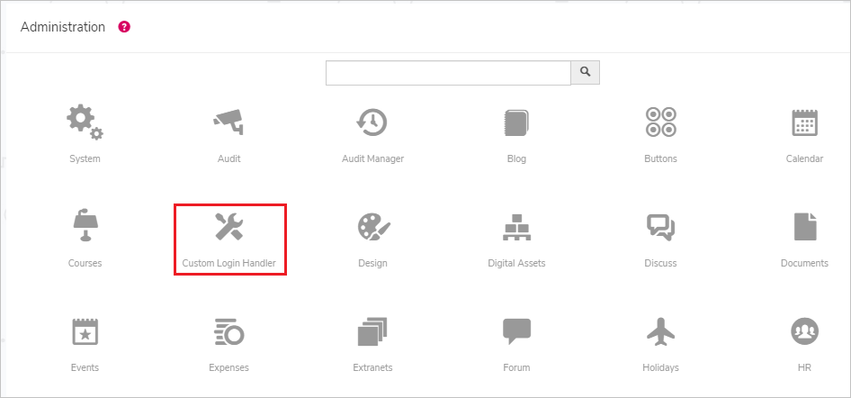
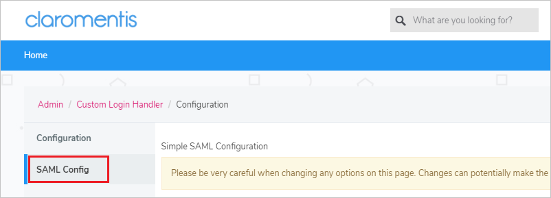
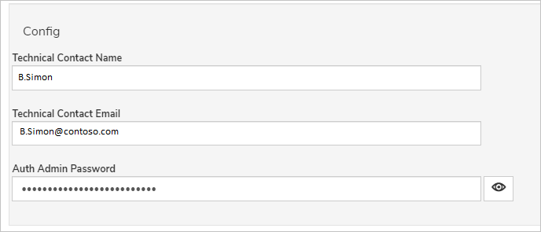
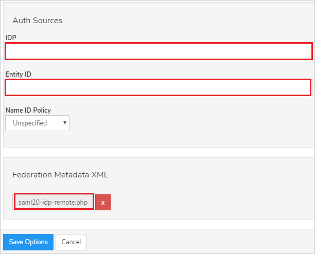

# Tutorial: Microsoft Entra single sign-on (SSO) integration with Claromentis

In this tutorial, you'll learn how to integrate Claromentis with Microsoft Entra ID. When you integrate Claromentis with Microsoft Entra ID, you can:

* Control in Microsoft Entra ID who has access to Claromentis.
* Enable your users to be automatically signed-in to Claromentis with their Microsoft Entra accounts.
* Manage your accounts in one central location.

## Prerequisites

To get started, you need the following items:

* A Microsoft Entra subscription. If you don't have a subscription, you can get a [free account](https://azure.microsoft.com/free/).
* Claromentis single sign-on (SSO) enabled subscription.

## Scenario description

In this tutorial, you configure and test Microsoft Entra SSO in a test environment.

* Claromentis supports **SP and IDP** initiated SSO.
* Claromentis supports **Just In Time** user provisioning.

> [!NOTE]
> Identifier of this application is a fixed string value so only one instance can be configured in one tenant.

## Add Claromentis from the gallery

To configure the integration of Claromentis into Microsoft Entra ID, you need to add Claromentis from the gallery to your list of managed SaaS apps.

1. Sign in to the [Microsoft Entra admin center](https://entra.microsoft.com) as at least a [Cloud Application Administrator](../roles/permissions-reference.md#cloud-application-administrator).
1. Browse to **Identity** > **Applications** > **Enterprise applications** > **New application**.
1. In the **Add from the gallery** section, type **Claromentis** in the search box.
1. Select **Claromentis** from results panel and then add the app. Wait a few seconds while the app is added to your tenant.

 Alternatively, you can also use the [Enterprise App Configuration Wizard](https://portal.office.com/AdminPortal/home?Q=Docs#/azureadappintegration). In this wizard, you can add an application to your tenant, add users/groups to the app, assign roles, as well as walk through the SSO configuration as well. [Learn more about Microsoft 365 wizards.](/microsoft-365/admin/misc/azure-ad-setup-guides)

## Configure and test Microsoft Entra SSO for Claromentis

Configure and test Microsoft Entra SSO with Claromentis using a test user called **B.Simon**. For SSO to work, you need to establish a link relationship between a Microsoft Entra user and the related user in Claromentis.

To configure and test Microsoft Entra SSO with Claromentis, perform the following steps:

1. **[Configure Microsoft Entra SSO](#configure-azure-ad-sso)** - to enable your users to use this feature.
    1. **[Create a Microsoft Entra test user](#create-an-azure-ad-test-user)** - to test Microsoft Entra single sign-on with B.Simon.
    1. **[Assign the Microsoft Entra test user](#assign-the-azure-ad-test-user)** - to enable B.Simon to use Microsoft Entra single sign-on.
1. **[Configure Claromentis SSO](#configure-claromentis-sso)** - to configure the single sign-on settings on application side.
    1. **[Create Claromentis test user](#create-claromentis-test-user)** - to have a counterpart of B.Simon in Claromentis that is linked to the Microsoft Entra representation of user.
1. **[Test SSO](#test-sso)** - to verify whether the configuration works.

## Configure Microsoft Entra SSO

Follow these steps to enable Microsoft Entra SSO.

1. Sign in to the [Microsoft Entra admin center](https://entra.microsoft.com) as at least a [Cloud Application Administrator](../roles/permissions-reference.md#cloud-application-administrator).
1. Browse to **Identity** > **Applications** > **Enterprise applications** > **Claromentis** > **Single sign-on**.
1. On the **Select a single sign-on method** page, select **SAML**.
1. On the **Set up single sign-on with SAML** page, click the pencil icon for **Basic SAML Configuration** to edit the settings.

   

1. On the **Basic SAML Configuration** section, if you wish to configure the application in **IDP** initiated mode, perform the following steps:

    a. In the **Identifier** text box, enter the identifier value as per your organization requirement.

    b. In the **Reply URL** text box, type a URL using the following pattern:
    `https://<CUSTOMER_SITE_URL>/custom/loginhandler/simplesaml/www/module.php/saml/sp/saml2-acs.php/claromentis`

1. Click **Set additional URLs** and perform the following step if you wish to configure the application in **SP** initiated mode:

    In the **Sign-on URL** text box, type a URL using one of the following patterns:

    | Sign-on URL |
    | ---- |
    | `https://<CUSTOMER_SITE_URL>/login` |
    | `https://<CUSTOMER_SITE_URL>/login?no_auto=0` |
    |
	> [!NOTE]
	> These values are not real. Update these values with the actual Reply URL and Sign-on URL which is explained later in the tutorial.

1. On the **Set up single sign-on with SAML** page, in the **SAML Signing Certificate** section,  find **Federation Metadata XML** and select **Download** to download the certificate and save it on your computer.

	

1. On the **Set up Claromentis** section, copy the appropriate URL(s) based on your requirement.

	

### Create a Microsoft Entra test user

In this section, you'll create a test user called B.Simon.

1. Sign in to the [Microsoft Entra admin center](https://entra.microsoft.com) as at least a [User Administrator](../roles/permissions-reference.md#user-administrator).
1. Browse to **Identity** > **Users** > **All users**.
1. Select **New user** > **Create new user**, at the top of the screen.
1. In the **User** properties, follow these steps:
   1. In the **Display name** field, enter `B.Simon`.  
   1. In the **User principal name** field, enter the username@companydomain.extension. For example, `B.Simon@contoso.com`.
   1. Select the **Show password** check box, and then write down the value that's displayed in the **Password** box.
   1. Select **Review + create**.
1. Select **Create**.

### Assign the Microsoft Entra test user

In this section, you'll enable B.Simon to use single sign-on by granting access to Claromentis.

1. Sign in to the [Microsoft Entra admin center](https://entra.microsoft.com) as at least a [Cloud Application Administrator](../roles/permissions-reference.md#cloud-application-administrator).
1. Browse to **Identity** > **Applications** > **Enterprise applications** > **Claromentis**.
1. In the app's overview page, select **Users and groups**.
1. Select **Add user/group**, then select **Users and groups** in the **Add Assignment** dialog.
   1. In the **Users and groups** dialog, select **B.Simon** from the Users list, then click the **Select** button at the bottom of the screen.
   1. If you are expecting a role to be assigned to the users, you can select it from the **Select a role** dropdown. If no role has been set up for this app, you see "Default Access" role selected.
   1. In the **Add Assignment** dialog, click the **Assign** button.

## Configure Claromentis SSO

1. In a different browser window, sign into the Claromentis website as an administrator.

1. Click on the **applications icon** and select **Admin**.

    

1. Select **Custom Login Handler** tab.

    

1. Select **SAML Config**.

    

1. On the **SAML Config** tab, scroll down to the **Config** section and perform the following steps:

    

    a. In the **Technical Contact Name** textbox, enter the name of technical contact person.

    b. In the **Technical Contact Email** textbox, enter the Email address of technical contact person.

    c. Provide the password in the **Auth Admin Password** textbox.

1. Scroll down to **Auth Sources** and perform the following steps:

    

    a. In the **IDP** textbox, enter the **Microsoft Entra Identifier** value, which you copied previously.

    b. In the **Entity ID** textbox, enter the Entity ID value.

    c. Upload the **Federation Metadata XML** file, which you have downloaded.

    d. Click **Save**.

1. You will now notice all URLs have been populated within the **Identity Provider** section in the **SAML Config** section.

    

    a. Copy **Identifier (Entity ID)** value, paste this value in the **Identifier** textbox on the **Basic SAML Configuration** section in Azure portal.

    b. Copy **Reply URL** value, paste this value in the **Reply URL** textbox on the **Basic SAML Configuration** section in Azure portal.

    c. Copy **Sign On URL** value, paste this value in the **Sign-on URL** textbox on the **Basic SAML Configuration** section in Azure portal.

### Create Claromentis test user

In this section, a user called B.Simon is created in Claromentis. Claromentis supports just-in-time user provisioning, which is enabled by default. There is no action item for you in this section. If a user doesn't already exist in Claromentis, a new one is created after authentication.

## Test SSO

In this section, you test your Microsoft Entra single sign-on configuration with following options. 

#### SP initiated:

* Click on **Test this application**, this will redirect to Claromentis Sign on URL where you can initiate the login flow.  

* Go to Claromentis Sign-on URL directly and initiate the login flow from there.

#### IDP initiated:

* Click on **Test this application**, and you should be automatically signed in to the Claromentis for which you set up the SSO. 

You can also use Microsoft My Apps to test the application in any mode. When you click the Claromentis tile in the My Apps, if configured in SP mode you would be redirected to the application sign on page for initiating the login flow and if configured in IDP mode, you should be automatically signed in to the Claromentis for which you set up the SSO. For more information about the My Apps, see [Introduction to the My Apps](https://support.microsoft.com/account-billing/sign-in-and-start-apps-from-the-my-apps-portal-2f3b1bae-0e5a-4a86-a33e-876fbd2a4510).

## Next steps

Once you configure Claromentis you can enforce session control, which protects exfiltration and infiltration of your organization’s sensitive data in real time. Session control extends from Conditional Access. [Learn how to enforce session control with Microsoft Defender for Cloud Apps](/cloud-app-security/proxy-deployment-aad).
