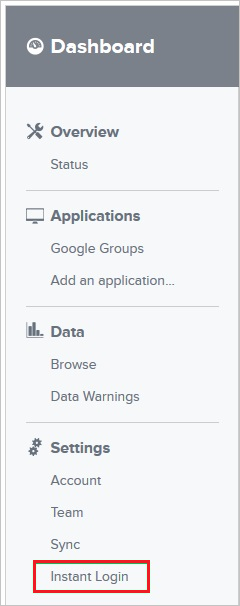
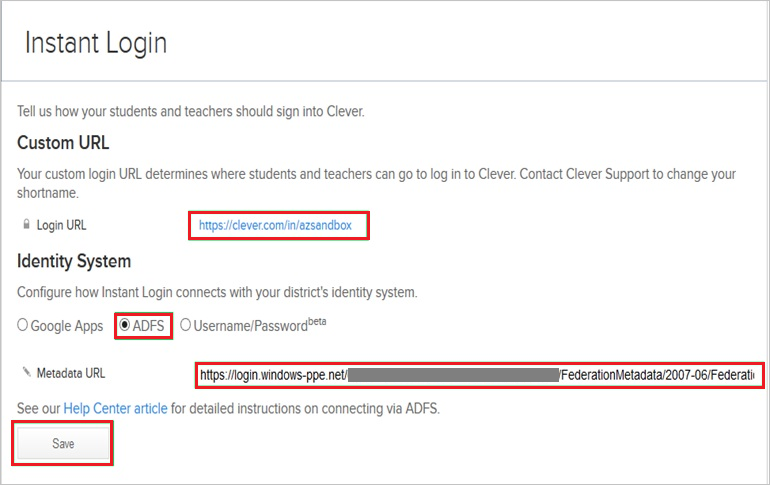

# Tutorial: Azure Active Directory single sign-on (SSO) integration with Clever

In this tutorial, you'll learn how to integrate Clever with Azure Active Directory (Azure AD). When you integrate Clever with Azure AD, you can:

* Control in Azure AD who has access to Clever.
* Enable your users to be automatically signed-in to Clever with their Azure AD accounts.
* Manage your accounts in one central location - the Azure portal.

To learn more about SaaS app integration with Azure AD, see [What is application access and single sign-on with Azure Active Directory](https://docs.microsoft.com/azure/active-directory/active-directory-appssoaccess-whatis).

## Prerequisites

To get started, you need the following items:

* An Azure AD subscription. If you don't have a subscription, you can get a [free account](https://azure.microsoft.com/free/).
* Clever single sign-on (SSO) enabled subscription.

## Scenario description

In this tutorial, you configure and test Azure AD SSO in a test environment.

* Clever supports **SP** initiated SSO

> [!NOTE]
> Identifier of this application is a fixed string value so only one instance can be configured in one tenant.

## Adding Clever from the gallery

To configure the integration of Clever into Azure AD, you need to add Clever from the gallery to your list of managed SaaS apps.

1. Sign in to the [Azure portal](https://portal.azure.com) using either a work or school account, or a personal Microsoft account.
1. On the left navigation pane, select the **Azure Active Directory** service.
1. Navigate to **Enterprise Applications** and then select **All Applications**.
1. To add new application, select **New application**.
1. In the **Add from the gallery** section, type **Clever** in the search box.
1. Select **Clever** from results panel and then add the app. Wait a few seconds while the app is added to your tenant.

## Configure and test Azure AD single sign-on for Clever

Configure and test Azure AD SSO with Clever using a test user called **B.Simon**. For SSO to work, you need to establish a link relationship between an Azure AD user and the related user in Clever.

To configure and test Azure AD SSO with Clever, complete the following building blocks:

1. **[Configure Azure AD SSO](#configure-azure-ad-sso)** - to enable your users to use this feature.
    1. **[Create an Azure AD test user](#create-an-azure-ad-test-user)** - to test Azure AD single sign-on with B.Simon.
    1. **[Assign the Azure AD test user](#assign-the-azure-ad-test-user)** - to enable B.Simon to use Azure AD single sign-on.
1. **[Configure Clever SSO](#configure-clever-sso)** - to configure the single sign-on settings on application side.
    1. **[Create Clever test user](#create-clever-test-user)** - to have a counterpart of B.Simon in Clever that is linked to the Azure AD representation of user.
1. **[Test SSO](#test-sso)** - to verify whether the configuration works.

## Configure Azure AD SSO

Follow these steps to enable Azure AD SSO in the Azure portal.

1. In the [Azure portal](https://portal.azure.com/), on the **Clever** application integration page, find the **Manage** section and select **single sign-on**.
1. On the **Select a single sign-on method** page, select **SAML**.
1. On the **Set up single sign-on with SAML** page, click the edit/pen icon for **Basic SAML Configuration** to edit the settings.

   

1. On the **Basic SAML Configuration** section, enter the values for the following fields:

	a. In the **Sign on URL** text box, type a URL using the following pattern:
    `https://clever.com/in/<companyname>`

    b. In the **Identifier (Entity ID)** text box, type a URL using the following pattern:
    `https://clever.com/oauth/saml/metadata.xml`

	> [!NOTE]
	> The Sign on URL value is not real. Update the value with the actual Sign on URL. Contact [Clever Client support team](https://clever.com/about/contact/) to get the value. You can also refer to the patterns shown in the **Basic SAML Configuration** section in the Azure portal.

1. On the **Set up single sign-on with SAML** page, In the **SAML Signing Certificate** section, click copy button to copy **App Federation Metadata Url** and save it on your computer.

	

### Create an Azure AD test user

In this section, you'll create a test user in the Azure portal called B.Simon.

1. From the left pane in the Azure portal, select **Azure Active Directory**, select **Users**, and then select **All users**.
1. Select **New user** at the top of the screen.
1. In the **User** properties, follow these steps:
   1. In the **Name** field, enter `B.Simon`.  
   1. In the **User name** field, enter the username@companydomain.extension. For example, `B.Simon@contoso.com`.
   1. Select the **Show password** check box, and then write down the value that's displayed in the **Password** box.
   1. Click **Create**.

### Assign the Azure AD test user

In this section, you'll enable B.Simon to use Azure single sign-on by granting access to Clever.

1. In the Azure portal, select **Enterprise Applications**, and then select **All applications**.
1. In the applications list, select **Clever**.
1. In the app's overview page, find the **Manage** section and select **Users and groups**.

   

1. Select **Add user**, then select **Users and groups** in the **Add Assignment** dialog.

	

1. In the **Users and groups** dialog, select **B.Simon** from the Users list, then click the **Select** button at the bottom of the screen.
1. If you're expecting any role value in the SAML assertion, in the **Select Role** dialog, select the appropriate role for the user from the list and then click the **Select** button at the bottom of the screen.
1. In the **Add Assignment** dialog, click the **Assign** button.

## Configure Clever SSO

1. In a different web browser window, sign to your Clever company site as an administrator.

1. In the toolbar, click **Instant Login**.

	

	> [!NOTE]
	> Before you can Test single sign-on, You have to contact [Clever Client support team](https://clever.com/about/contact/) to enable Office 365 SSO in the back end.

1. On the **Instant Login** page, perform the following steps:
 
	

	a. Type the **Login URL**.

	>[!NOTE]
	>The **Login URL** is a custom value. Contact [Clever Client support team](https://clever.com/about/contact/) to get this value.

	b. As **Identity System**, select **ADFS**.

	c. In the **Metadata URL** textbox, paste **App Federation Metadata Url** value which you have copied from the Azure portal.

	d. Click **Save**.

### Create Clever test user

To enable Azure AD users to sign to Clever, they must be provisioned into Clever.

In case of Clever, Work with [Clever Client support team](https://clever.com/about/contact/) to add the users in the Clever platform. Users must be created and activated before you use single sign-on.

> [!NOTE]
> You can use any other Clever user account creation tools or APIs provided by Clever to provision Azure AD user accounts.

## Test SSO 

In this section, you test your Azure AD single sign-on configuration using the Access Panel.

When you click the Clever tile in the Access Panel, you should be automatically signed in to the Clever for which you set up SSO. For more information about the Access Panel, see [Introduction to the Access Panel](https://docs.microsoft.com/azure/active-directory/active-directory-saas-access-panel-introduction).

## Additional resources

- [ List of Tutorials on How to Integrate SaaS Apps with Azure Active Directory ](https://docs.microsoft.com/azure/active-directory/active-directory-saas-tutorial-list)

- [What is application access and single sign-on with Azure Active Directory? ](https://docs.microsoft.com/azure/active-directory/active-directory-appssoaccess-whatis)

- [What is conditional access in Azure Active Directory?](https://docs.microsoft.com/azure/active-directory/conditional-access/overview)

- [Try Clever with Azure AD](https://aad.portal.azure.com/)