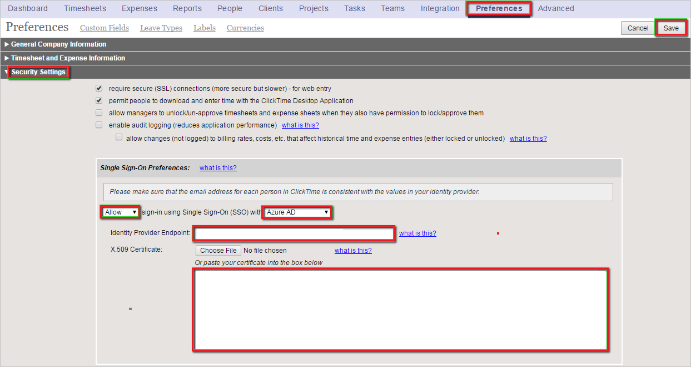

# Tutorial: Azure AD SSO integration with ClickTime

In this tutorial, you'll learn how to integrate ClickTime with Azure Active Directory (Azure AD). When you integrate ClickTime with Azure AD, you can:

* Control in Azure AD who has access to ClickTime.
* Enable your users to be automatically signed-in to ClickTime with their Azure AD accounts.
* Manage your accounts in one central location - the Azure portal.

## Prerequisites

To get started, you need the following items:

* An Azure AD subscription. If you don't have a subscription, you can get a [free account](https://azure.microsoft.com/free/).
* ClickTime single sign-on (SSO) enabled subscription.

## Scenario description

In this tutorial, you configure and test Azure AD single sign-on in a test environment.

* ClickTime supports **IDP** initiated SSO.

> [!NOTE]
> Identifier of this application is a fixed string value so only one instance can be configured in one tenant.

## Add ClickTime from the gallery

To configure the integration of ClickTime into Azure AD, you need to add ClickTime from the gallery to your list of managed SaaS apps.

1. Sign in to the Azure portal using either a work or school account, or a personal Microsoft account.
1. On the left navigation pane, select the **Azure Active Directory** service.
1. Navigate to **Enterprise Applications** and then select **All Applications**.
1. To add new application, select **New application**.
1. In the **Add from the gallery** section, type **ClickTime** in the search box.
1. Select **ClickTime** from results panel and then add the app. Wait a few seconds while the app is added to your tenant.

 Alternatively, you can also use the [Enterprise App Configuration Wizard](https://portal.office.com/AdminPortal/home?Q=Docs#/azureadappintegration). In this wizard, you can add an application to your tenant, add users/groups to the app, assign roles, as well as walk through the SSO configuration as well. [Learn more about Microsoft 365 wizards.](/microsoft-365/admin/misc/azure-ad-setup-guides)

## Configure and test Azure AD SSO for ClickTime

Configure and test Azure AD SSO with ClickTime using a test user called **B.Simon**. For SSO to work, you need to establish a link relationship between an Azure AD user and the related user in ClickTime.

To configure and test Azure AD SSO with ClickTime, perform the following steps:

1. **[Configure Azure AD SSO](#configure-azure-ad-sso)** - to enable your users to use this feature.
    1. **[Create an Azure AD test user](#create-an-azure-ad-test-user)** - to test Azure AD single sign-on with B.Simon.
    1. **[Assign the Azure AD test user](#assign-the-azure-ad-test-user)** - to enable B.Simon to use Azure AD single sign-on.
1. **[Configure ClickTime SSO](#configure-clicktime-sso)** - to configure the single sign-on settings on application side.
    1. **[Create ClickTime test user](#create-clicktime-test-user)** - to have a counterpart of B.Simon in ClickTime that is linked to the Azure AD representation of user.
1. **[Test SSO](#test-sso)** - to verify whether the configuration works.

## Configure Azure AD SSO

Follow these steps to enable Azure AD SSO in the Azure portal.

1. In the Azure portal, on the **ClickTime** application integration page, find the **Manage** section and select **single sign-on**.
1. On the **Select a single sign-on method** page, select **SAML**.
1. On the **Set up single sign-on with SAML** page, click the pencil icon for **Basic SAML Configuration** to edit the settings.

   

4. On the **Set up Single Sign-On with SAML** page, perform the following steps:

    a. In the **Identifier** text box, type the URL:
    `https://app.clicktime.com/sp/`

    b. In the **Reply URL** text box, type one of the following URLs:

    | **Reply URL** |
    |----|
    | `https://app.clicktime.com/Login/` |
    | `https://app.clicktime.com/App/Login/Consume.aspx` |

4. On the **Set up Single Sign-On with SAML** page, in the **SAML Signing Certificate** section, click **Download** to download the **Certificate (Base64)** from the given options as per your requirement and save it on your computer.

    

6. On the **Set up ClickTime** section, copy the appropriate URL(s) as per your requirement.

    

### Create an Azure AD test user 

In this section, you'll create a test user in the Azure portal called B.Simon.

1. From the left pane in the Azure portal, select **Azure Active Directory**, select **Users**, and then select **All users**.
1. Select **New user** at the top of the screen.
1. In the **User** properties, follow these steps:
   1. In the **Name** field, enter `B.Simon`.  
   1. In the **User name** field, enter the username@companydomain.extension. For example, `B.Simon@contoso.com`.
   1. Select the **Show password** check box, and then write down the value that's displayed in the **Password** box.
   1. Click **Create**.

### Assign the Azure AD test user

In this section, you'll enable B.Simon to use Azure single sign-on by granting access to ClickTime.

1. In the Azure portal, select **Enterprise Applications**, and then select **All applications**.
1. In the applications list, select **ClickTime**.
1. In the app's overview page, find the **Manage** section and select **Users and groups**.
1. Select **Add user**, then select **Users and groups** in the **Add Assignment** dialog.
1. In the **Users and groups** dialog, select **B.Simon** from the Users list, then click the **Select** button at the bottom of the screen.
1. If you are expecting a role to be assigned to the users, you can select it from the **Select a role** dropdown. If no role has been set up for this app, you see "Default Access" role selected.
1. In the **Add Assignment** dialog, click the **Assign** button.

## Configure ClickTime SSO

1. In a different web browser window, log into your ClickTime company site as an administrator.

1. In the toolbar on the top, click **Preferences**, and then click **Security Settings**.

1. In the **Single Sign-On Preferences** configuration section, perform the following steps:

    

    a.  Select **Allow** sign-in using Single Sign-On (SSO) with **Azure AD**.

    b. In the **Identity Provider Endpoint** textbox, paste **Login URL** which you have copied from Azure portal.

    c.  Open the **base-64 encoded certificate** downloaded from Azure portal in **Notepad**, copy the content, and then paste it into the **X.509 Certificate** textbox.

    d.  Click **Save**.

### Create ClickTime test user

In order to enable Azure AD users to log into ClickTime, they must be provisioned into ClickTime.  
In the case of ClickTime, provisioning is a manual task.

> [!NOTE]
> You can use any other ClickTime user account creation tools or APIs provided by ClickTime to provision Azure AD user accounts.

**To provision a user account, perform the following steps:**

1. Log in to your **ClickTime** tenant.

1. In the toolbar on the top, click **Company**, and then click **People**.

    

1. Click **Add Person**.

    

1. In the New Person section, perform the following steps:

    

    a.  In the **full name** textbox, type full name of user like **Britta Simon**. 

    b.  In the **email address** textbox, type the email of user like **brittasimon\@contoso.com**.

    > [!NOTE]
    > If you want to, you can set additional properties of the new person object.

    c.  Click **Save**.

## Test SSO

In this section, you test your Azure AD single sign-on configuration with following options.

* Click on Test this application in Azure portal and you should be automatically signed in to the ClickTime for which you set up the SSO.

* You can use Microsoft My Apps. When you click the ClickTime tile in the My Apps, you should be automatically signed in to the ClickTime for which you set up the SSO. For more information about the My Apps, see [Introduction to the My Apps](../user-help/my-apps-portal-end-user-access.md).

## Next steps

Once you configure ClickTime you can enforce session control, which protects exfiltration and infiltration of your organization’s sensitive data in real time. Session control extends from Conditional Access. [Learn how to enforce session control with Microsoft Defender for Cloud Apps](/cloud-app-security/proxy-deployment-aad).
