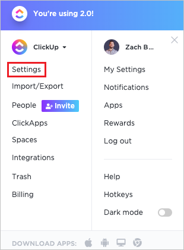
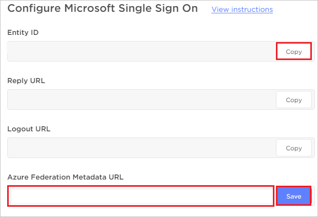

# Tutorial: Azure Active Directory integration with ClickUp Productivity Platform

In this tutorial, you'll learn how to integrate ClickUp Productivity Platform with Azure Active Directory (Azure AD). When you integrate ClickUp Productivity Platform with Azure AD, you can:

* Control in Azure AD who has access to ClickUp Productivity Platform.
* Enable your users to be automatically signed-in to ClickUp Productivity Platform with their Azure AD accounts.
* Manage your accounts in one central location - the Azure portal.

## Prerequisites

To get started, you need the following items:

* An Azure AD subscription. If you don't have a subscription, you can get a [free account](https://azure.microsoft.com/free/).
* ClickUp Productivity Platform single sign-on (SSO) enabled subscription.

## Scenario description

In this tutorial, you configure and test Azure AD single sign-on in a test environment.

* ClickUp Productivity Platform supports **SP** initiated SSO.

## Add ClickUp Productivity Platform from the gallery

To configure the integration of ClickUp Productivity Platform into Azure AD, you need to add ClickUp Productivity Platform from the gallery to your list of managed SaaS apps.

1. Sign in to the Azure portal using either a work or school account, or a personal Microsoft account.
1. On the left navigation pane, select the **Azure Active Directory** service.
1. Navigate to **Enterprise Applications** and then select **All Applications**.
1. To add new application, select **New application**.
1. In the **Add from the gallery** section, type **ClickUp Productivity Platform** in the search box.
1. Select **ClickUp Productivity Platform** from results panel and then add the app. Wait a few seconds while the app is added to your tenant.

## Configure and test Azure AD SSO for ClickUp Productivity Platform

Configure and test Azure AD SSO with ClickUp Productivity Platform using a test user called **B.Simon**. For SSO to work, you need to establish a link relationship between an Azure AD user and the related user in ClickUp Productivity Platform.

To configure and test Azure AD SSO with ClickUp Productivity Platform, perform the following steps:

1. **[Configure Azure AD SSO](#configure-azure-ad-sso)** - to enable your users to use this feature.
    1. **[Create an Azure AD test user](#create-an-azure-ad-test-user)** - to test Azure AD single sign-on with B.Simon.
    1. **[Assign the Azure AD test user](#assign-the-azure-ad-test-user)** - to enable B.Simon to use Azure AD single sign-on.
1. **[Configure ClickUp Productivity Platform SSO](#configure-clickup-productivity-platform-sso)** - to configure the single sign-on settings on application side.
    1. **[Create ClickUp Productivity Platform test user](#create-clickup-productivity-platform-test-user)** - to have a counterpart of B.Simon in ClickUp Productivity Platform that is linked to the Azure AD representation of user.
1. **[Test SSO](#test-sso)** - to verify whether the configuration works.

## Configure Azure AD SSO

Follow these steps to enable Azure AD SSO in the Azure portal.

1. In the Azure portal, on the **ClickUp Productivity Platform** application integration page, find the **Manage** section and select **single sign-on**.
1. On the **Select a single sign-on method** page, select **SAML**.
1. On the **Set up single sign-on with SAML** page, click the pencil icon for **Basic SAML Configuration** to edit the settings.

   

4. On the **Basic SAML Configuration** section, perform the following steps:

    a. In the **Sign on URL** text box, type the URL:
    `https://app.clickup.com/login/sso`

    b. In the **Identifier (Entity ID)** text box, type a URL using the following pattern:
    `https://api.clickup.com/v1/team/<team_id>/microsoft`

    > [!NOTE]
    > The Identifier value is not real. Update this value with the actual Identifier, which is explained later in this tutorial.

5. On the **Set up Single Sign-On with SAML** page, In the **SAML Signing Certificate** section, click copy button to copy **App Federation Metadata Url** and save it on your computer.

    

### Create an Azure AD test user

In this section, you'll create a test user in the Azure portal called B.Simon.

1. From the left pane in the Azure portal, select **Azure Active Directory**, select **Users**, and then select **All users**.
1. Select **New user** at the top of the screen.
1. In the **User** properties, follow these steps:
   1. In the **Name** field, enter `B.Simon`.  
   1. In the **User name** field, enter the username@companydomain.extension. For example, `B.Simon@contoso.com`.
   1. Select the **Show password** check box, and then write down the value that's displayed in the **Password** box.
   1. Click **Create**.

### Assign the Azure AD test user

In this section, you'll enable B.Simon to use Azure single sign-on by granting access to ClickUp Productivity Platform.

1. In the Azure portal, select **Enterprise Applications**, and then select **All applications**.
1. In the applications list, select **ClickUp Productivity Platform**.
1. In the app's overview page, find the **Manage** section and select **Users and groups**.
1. Select **Add user**, then select **Users and groups** in the **Add Assignment** dialog.
1. In the **Users and groups** dialog, select **B.Simon** from the Users list, then click the **Select** button at the bottom of the screen.
1. If you are expecting a role to be assigned to the users, you can select it from the **Select a role** dropdown. If no role has been set up for this app, you see "Default Access" role selected.
1. In the **Add Assignment** dialog, click the **Assign** button.

## Configure ClickUp Productivity Platform SSO

1. In a different web browser window, sign-on to your ClickUp Productivity Platform tenant as an administrator.

2. Click on the **User profile**, and then select **Settings**.

    

    

3. Select **Microsoft**, under Single Sign-On (SSO) Provider.

    

4. On the **Configure Microsoft Single Sign On** page, perform the following steps:

    

    a. Click **Copy** to copy the Entity ID value and paste it into the **Identifier (Entity ID)** textbox in the **Basic SAML Configuration** section in the Azure portal.

    b. In the **Azure Federation Metadata URL** textbox, paste the App Federation Metadata Url value, which you have copied from the Azure portal and then click **Save**.

5. To complete the setup, click **Authenticate With Microsoft to complete setup** and authenticate with microsoft account.

    

### Create ClickUp Productivity Platform test user

1. In a different web browser window, sign-on to your ClickUp Productivity Platform tenant as an administrator.

2. Click on the **User profile**, and then select **People**.

    

    

3. Enter the email address of the user in the textbox and click **Invite**.

    

    > [!NOTE]
    > The user will receive the notification and must accept the invitation to activate the account.

## Test SSO

In this section, you test your Azure AD single sign-on configuration with following options. 

* Click on **Test this application** in Azure portal. This will redirect to ClickUp Productivity Platform Sign-on URL where you can initiate the login flow. 

* Go to ClickUp Productivity Platform Sign-on URL directly and initiate the login flow from there.

* You can use Microsoft My Apps. When you click the ClickUp Productivity Platform tile in the My Apps, this will redirect to ClickUp Productivity Platform Sign-on URL. For more information about the My Apps, see [Introduction to the My Apps](../user-help/my-apps-portal-end-user-access.md).

## Next steps

Once you configure ClickUp Productivity Platform you can enforce session control, which protects exfiltration and infiltration of your organization’s sensitive data in real time. Session control extends from Conditional Access. [Learn how to enforce session control with Microsoft Cloud App Security](/cloud-app-security/proxy-deployment-any-app).