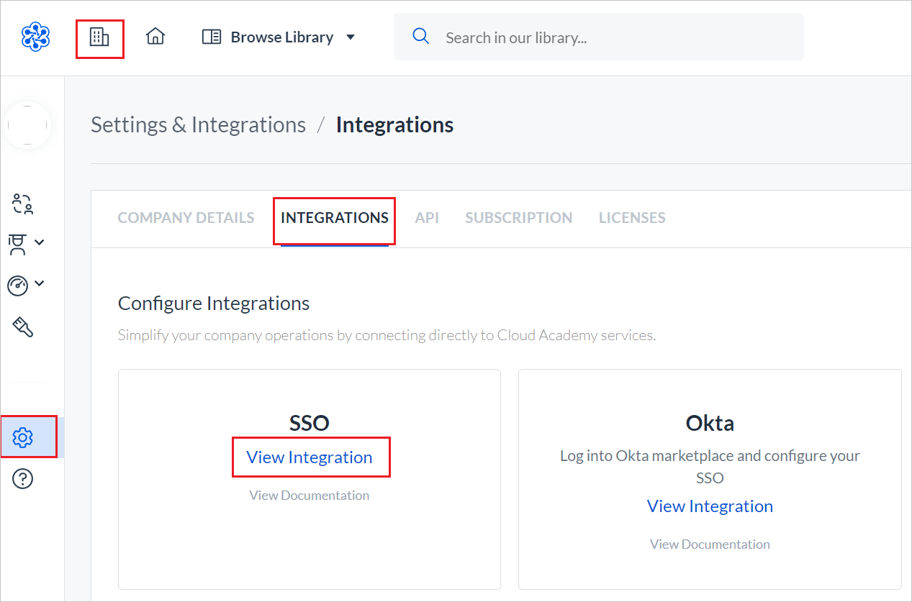
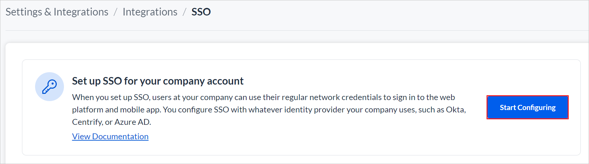
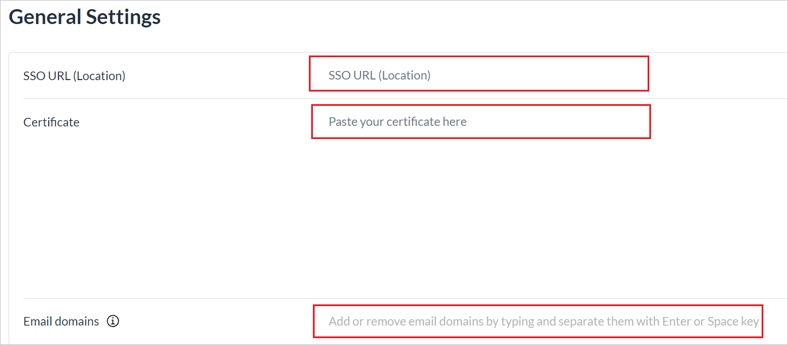
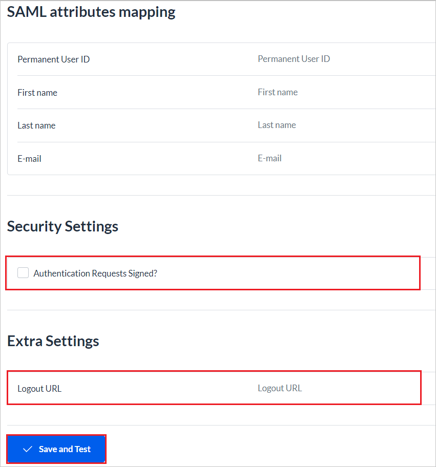

# Tutorial: Microsoft Entra SSO integration with Cloud Academy

In this tutorial, you learn how to integrate Cloud Academy with Microsoft Entra ID. When you integrate Cloud Academy with Microsoft Entra ID, you can:

* Use Microsoft Entra ID to control who can access Cloud Academy.
* Enable your users to be automatically signed in to Cloud Academy with their Microsoft Entra accounts.
* Manage your accounts in one central location: the Azure portal.

## Prerequisites

To get started, you need the following items:

* A Microsoft Entra subscription. If you don't have a subscription, you can get a [free account](https://azure.microsoft.com/free/).
* A Cloud Academy subscription with single sign-on (SSO) enabled.

## Tutorial description

In this tutorial, you configure and test Microsoft Entra SSO in a test environment.

* Cloud Academy supports **SP** initiated SSO.
* Cloud Academy supports **Just In Time** user provisioning.
* Cloud Academy supports [Automated user provisioning](cloud-academy-sso-provisioning-tutorial.md).

## Add Cloud Academy from the gallery

To configure the integration of Cloud Academy into Microsoft Entra ID, you need to add Cloud Academy from the gallery to your list of managed SaaS apps:

1. Sign in to the [Microsoft Entra admin center](https://entra.microsoft.com) as at least a [Cloud Application Administrator](../roles/permissions-reference.md#cloud-application-administrator).
1. Browse to **Identity** > **Applications** > **Enterprise applications** > **New application**.
1. In the **Add from the gallery** section, enter **Cloud Academy** in the search box.
1. Select **Cloud Academy** in the results panel and then add the app. Wait a few seconds while the app is added to your tenant.

 Alternatively, you can also use the [Enterprise App Configuration Wizard](https://portal.office.com/AdminPortal/home?Q=Docs#/azureadappintegration). In this wizard, you can add an application to your tenant, add users/groups to the app, assign roles, and walk through the SSO configuration as well. [Learn more about Microsoft 365 wizards.](/microsoft-365/admin/misc/azure-ad-setup-guides)

## Configure and test Microsoft Entra SSO for Cloud Academy

You'll configure and test Microsoft Entra SSO with Cloud Academy by using a test user named **B.Simon**. For SSO to work, you need to establish a link relationship between a Microsoft Entra user and the corresponding user in Cloud Academy.

To configure and test Microsoft Entra SSO with Cloud Academy, you'll complete these high-level steps:

1. **[Configure Microsoft Entra SSO](#configure-azure-ad-sso)** to enable your users to use the feature.
    1. **[Create a Microsoft Entra test user](#create-an-azure-ad-test-user)** to test Microsoft Entra single sign-on.
    1. **[Grant access to the test user](#grant-access-to-the-test-user)** to enable the user to use Microsoft Entra single sign-on.
1. **[Configure single sign-on for Cloud Academy](#configure-single-sign-on-for-cloud-academy)** on the application side.
    1. **[Create a Cloud Academy test user](#create-a-cloud-academy-test-user)** as a counterpart to the Microsoft Entra representation of the user.
1. **[Test SSO](#test-sso)** to verify that the configuration works.

## Configure Microsoft Entra SSO

Follow these steps to enable Microsoft Entra SSO in the Azure portal:

1. Sign in to the [Microsoft Entra admin center](https://entra.microsoft.com) as at least a [Cloud Application Administrator](../roles/permissions-reference.md#cloud-application-administrator).
1. Browse to **Identity** > **Applications** > **Enterprise applications** > **Cloud Academy** application integration page, in the **Manage** section, select **single sign-on**.
1. On the **Select a single sign-on method** page, select **SAML**.
1. On the **Set up Single Sign-On with SAML** page, select the pencil button for **Basic SAML Configuration** to edit the settings:

   

1. In the **Basic SAML Configuration** section, update the **Identifier** text box, type the following URLs and proceed:
  
    | Identifier |
    |--------------|
    | `urn:federation:cloudacademy` |
  
1. In the **Basic SAML Configuration** section, update the **Reply URL** text box, type one of the following URLs and proceed:
  
    | Reply URL |
    |--------------|
    | `https://cloudacademy.com/labs/social/complete/saml/` |
    | `https://app.qa.com/labs/social/complete/saml/` |
  
1. In the **Basic SAML Configuration** section, update the **Sign-on URL** text box, type one of the following URLs and save it:
  
    | Sign-on URL |
    |--------------|
    | `https://cloudacademy.com/login/enterprise/` |
    | `https://app.qa.com/login/enterprise/` |
  
1. Select the pencil button for **SAML Signing Certificate** to edit the settings:

   

1. Download the **PEM certificate**:

   
  
1. On the **Set up Cloud Academy** section, copy the **Login URL**:

   

### Create a Microsoft Entra test user

In this section, you create a test user called B.Simon.

1. Sign in to the [Microsoft Entra admin center](https://entra.microsoft.com) as at least a [User Administrator](../roles/permissions-reference.md#user-administrator).
1. Browse to **Identity** > **Users** > **All users**.
1. Select **New user** > **Create new user**, at the top of the screen.
1. In the **User** properties, follow these steps:
   1. In the **Display name** field, enter `B.Simon`.  
   1. In the **User principal name** field, enter the username@companydomain.extension. For example, `B.Simon@contoso.com`.
   1. Select the **Show password** check box, and then write down the value that's displayed in the **Password** box.
   1. Select **Review + create**.
1. Select **Create**.

### Grant access to the test user

In this section, you enable B.Simon to use Azure single sign-on by granting that user access to Cloud Academy.

1. Browse to **Identity** > **Applications** > **Enterprise applications**.
1. In the applications list, select **Cloud Academy**.
1. On the app's overview page, in the **Manage** section, select **Users and groups**:
1. Select **Add user**, and then select **Users and groups** in the **Add Assignment** dialog box:
1. In the **Users and groups** dialog box, select **B.Simon** in the **Users** list, and then click the **Select** button at the bottom of the screen.
1. If you're expecting a role to be assigned to the users, you can select it from the **Select a role** dropdown. If no role has been set up for this app, you see "Default Access" role selected.
1. In the **Add Assignment** dialog box, select **Assign**.

## Configure single sign-on for Cloud Academy

1. In a different browser window, sign in to your Cloud Academy company site as administrator.

1. On the home page, click the **Azure Integration Team** icon, and then select **Settings** in the left menu.

1. On the **INTEGRATIONS** tab, select the **SSO** card.

    

1. Select **Start Configuring** to set up SSO.

    

1. On the **General Settings** page, complete the following steps:

    

    1. In the **SSO URL (Location)** box, paste the login URL value that you copied, in step 9 of [Configure Microsoft Entra SSO](#configure-azure-ad-sso).

    1. Open the downloaded Base64 certificate in Notepad. Paste its contents into the **Certificate** box.

1. Perform the following steps in the below page:

    

    1. In the **SAML Attributes Mapping** section, fill in the required fields with the source attribute values:
  
       `http://schemas.microsoft.com/identity/claims/objectidentifier`
       `http://schemas.xmlsoap.org/ws/2005/05/identity/claims/givenname`
       `http://schemas.xmlsoap.org/ws/2005/05/identity/claims/surname`
       `http://schemas.xmlsoap.org/ws/2005/05/identity/claims/emailaddress`

    1. In the **Security Settings** section, select the **Authentication Requests Signed?** check box to set this value to **True**.

    1. In the **Extra Settings(Optional)** section, fill the **Logout URL** box with the logout URL value that you copied, in step 9 of [Configure Microsoft Entra SSO](#configure-azure-ad-sso).

1. Select **Save and Test**.

1. Next, a dialog shows the service provider information. Download the XML file:

    :::image type="content" source="./media/cloud-academy-sso-tutorial/set-up-provider-information.png" alt-text="Screenshot that shows downloading the metadata configuration file.":::

1. Now that you have the XML file of the service provider, go back to the application you created. In the **Single sign-on** section, upload the metadata file:

    :::image type="content" source="./media/cloud-academy-sso-tutorial/upload-metadata.png" alt-text="Screenshot that shows uploading the metadata in the Azure application.":::

1. Now that you've updated the service provider metadata, you can go back to the SSO panel of your Cloud Academy company site and proceed with the test and activation. In the service provider dialog, select **Continue**:

   :::image type="content" source="./media/cloud-academy-sso-tutorial/continue-sso-activation.png" alt-text="Screenshot that shows the service provider dialog.":::

1. Select **Test SSO connection** to start the test flow:

    :::image type="content" source="./media/cloud-academy-sso-tutorial/test-sso-connection.png" alt-text="Screenshot that shows the Test S S O connection button.":::

    > [!NOTE]
    > If you're signed in to Cloud Academy by using the test user account you created, proceed with the test flow. Otherwise, close the dialog, scroll up to **General Settings**, copy and paste the subdomain URL in a private or incognito browser tab, and then sign in as the test user. If sign-in is successful, you can close the browser tab and select **Save and Test**. A browser tab will reopen the service provider dialog. Select **continue**, and then select **Test SSO connection** again. Finally, select **Test was successful** because you've already tested sign-in by using a private or incognito tab.
    >
    > Continue to the next step.

1. If sign-in is successful, you can activate SSO integration for the entire organization:

    :::image type="content" source="./media/cloud-academy-sso-tutorial/test-successful.png" alt-text="Screenshot that shows S S O activation is successful.":::

> [!NOTE]
> For more information about how to configure Cloud Academy, see [Setting Up Single Sign-On](https://support.cloudacademy.com/hc/articles/360043908452-Setting-Up-Single-Sign-On).

### Create a Cloud Academy test user

In this section, a user called B.Simon is created in Cloud Academy. Cloud Academy supports just-in-time user provisioning, which is enabled by default. There's no action item for you in this section. If a user doesn't already exist in Cloud Academy, a new one is created after authentication.

Cloud Academy also supports automatic user provisioning. For more information, see the [Cloud Academy SSO provisioning tutorial](./cloud-academy-sso-provisioning-tutorial.md).

## Test SSO

In this section, you test your Microsoft Entra SSO configuration by using one of the following options:

* In the Azure portal, select **Test this application**. You're redirected to the Cloud Academy sign-on URL and you can initiate the sign-in flow.

* Go to Cloud Academy sign-on URL directly and initiate the sign-in flow from there.

* You can use Microsoft My Apps. When you click the Cloud Academy tile in the My Apps portal, this will redirect to Cloud Academy sign-on URL. For more information about the My Apps portal, see [Introduction to My Apps](https://support.microsoft.com/account-billing/sign-in-and-start-apps-from-the-my-apps-portal-2f3b1bae-0e5a-4a86-a33e-876fbd2a4510).

## Next steps

After you configure Cloud Academy, you can enforce session control, which protects exfiltration and infiltration of your organization’s sensitive data in real time. Session control extends from Conditional Access. [Learn how to enforce session control with Microsoft Cloud App Security](/cloud-app-security/proxy-deployment-any-app).
