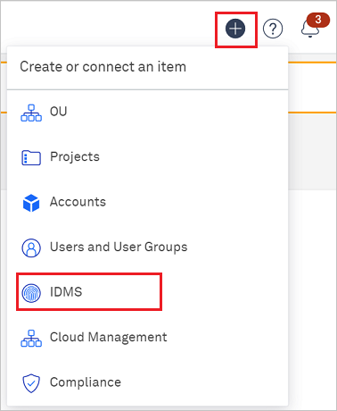
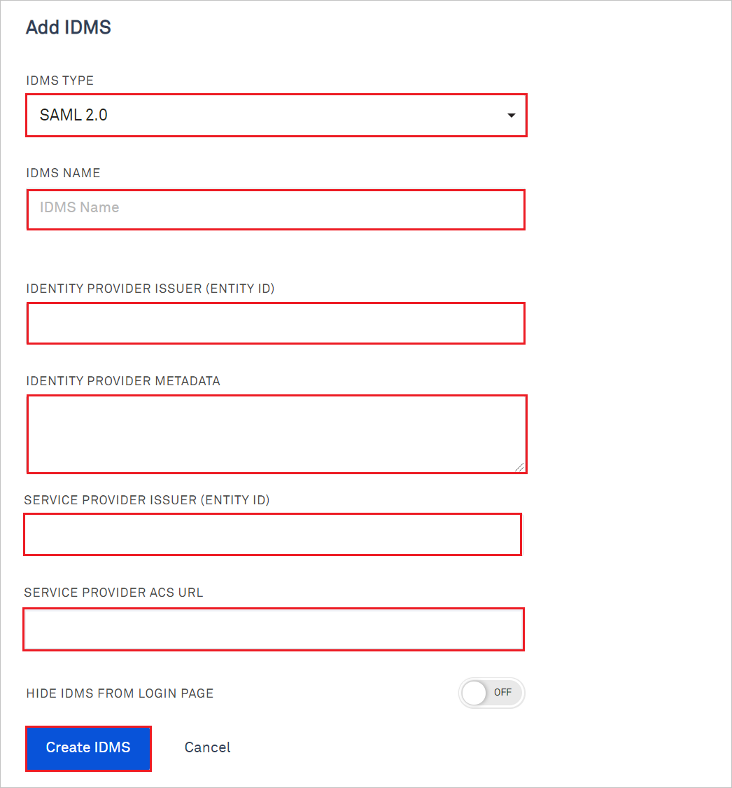

# Tutorial: Azure AD SSO integration with Kion (formerly cloudtamer.io)

In this tutorial, you'll learn how to integrate Kion with Azure Active Directory (Azure AD). When you integrate Kion with Azure AD, you can:

* Control in Azure AD who has access to Kion.
* Enable your users to be automatically signed-in to Kion with their Azure AD accounts.
* Manage your accounts in one central location - the Azure portal.

## Prerequisites

To get started, you need the following items:

* An Azure AD subscription. If you don't have a subscription, you can get a [free account](https://azure.microsoft.com/free/).
* Kion single sign-on (SSO) enabled subscription.

## Scenario description

In this tutorial, you configure and test Azure AD SSO in a test environment.

* Kion supports **IDP** initiated SSO.
* Kion supports **Just In Time** user provisioning.

## Add Kion (formerly cloudtamer.io) from the gallery

To configure the integration of Kion into Azure AD, you need to add Kion from the gallery to your list of managed SaaS apps.

1. Sign in to the Azure portal using either a work or school account, or a personal Microsoft account.
1. On the left navigation pane, select the **Azure Active Directory** service.
1. Navigate to **Enterprise Applications** and then select **All Applications**.
1. To add new application, select **New application**.
1. In the **Add from the gallery** section, type **Kion** in the search box.
1. Select **Kion** from results panel and then add the app. Wait a few seconds while the app is added to your tenant.

 Alternatively, you can also use the [Enterprise App Configuration Wizard](https://portal.office.com/AdminPortal/home?Q=Docs#/azureadappintegration). In this wizard, you can add an application to your tenant, add users/groups to the app, assign roles, as well as walk through the SSO configuration as well. [Learn more about Microsoft 365 wizards.](/microsoft-365/admin/misc/azure-ad-setup-guides)

## Configure and test Azure AD SSO for Kion (formerly cloudtamer.io)

Configure and test Azure AD SSO with Kion using a test user called **B.Simon**. For SSO to work, you need to establish a link relationship between an Azure AD user and the related user in Kion.

To configure and test Azure AD SSO with Kion, perform the following steps:

1. **[Configure Azure AD SSO](#configure-azure-ad-sso)** - to enable your users to use this feature.
    1. **[Create an Azure AD test user](#create-an-azure-ad-test-user)** - to test Azure AD single sign-on with B.Simon.
    1. **[Assign the Azure AD test user](#assign-the-azure-ad-test-user)** - to enable B.Simon to use Azure AD single sign-on.
1. **[Configure Kion SSO](#configure-kion-sso)** - to configure the single sign-on settings on application side.
    1. **[Create Kion test user](#create-kion-test-user)** - to have a counterpart of B.Simon in Kion that is linked to the Azure AD representation of user.
1. **[Test SSO](#test-sso)** - to verify whether the configuration works.
1. **[Group assertions](#group-assertions)** - to set group assertions for Azure AD and Kion.

### Begin Kion SSO Configuration

1. Log in to Kion website as an administrator.

1. Click on **+** plus icon at the top right corner and select **IDMS**.

    

1. Select **SAML 2.0** as the IDMS Type.

1. Leave this screen open and copy values from this screen into the Azure AD configuration.

## Configure Azure AD SSO

Follow these steps to enable Azure AD SSO in the Azure portal.

1. In the Azure portal, on the **Kion** application integration page, find the **Manage** section and select **single sign-on**.
1. On the **Select a single sign-on method** page, select **SAML**.
1. On the **Set up single sign-on with SAML** page, click the pencil icon for **Basic SAML Configuration** to edit the settings.

   

1. On the **Basic SAML Configuration** section, perform the following steps:

    a. In the **Identifier** text box, paste the **SERVICE PROVIDER ISSUER (ENTITY ID)** from Kion into this box.

    b. In the **Reply URL** text box, paste the **SERVICE PROVIDER ACS URL** from Kion into this box.

1. On the **Set up single sign-on with SAML** page, in the **SAML Signing Certificate** section,  find **Federation Metadata XML** and select **Download** to download the certificate and save it on your computer.

	

1. On the **Set up Kion** section, copy the appropriate URL(s) based on your requirement.

	

### Create an Azure AD test user

In this section, you'll create a test user in the Azure portal called B.Simon.

1. From the left pane in the Azure portal, select **Azure Active Directory**, select **Users**, and then select **All users**.
1. Select **New user** at the top of the screen.
1. In the **User** properties, follow these steps:
   1. In the **Name** field, enter `B.Simon`.  
   1. In the **User name** field, enter the username@companydomain.extension. For example, `B.Simon@contoso.com`.
   1. Select the **Show password** check box, and then write down the value that's displayed in the **Password** box.
   1. Click **Create**.

### Assign the Azure AD test user

In this section, you'll enable B.Simon to use Azure single sign-on by granting access to Kion.

1. In the Azure portal, select **Enterprise Applications**, and then select **All applications**.
1. In the applications list, select **Kion**.
1. In the app's overview page, find the **Manage** section and select **Users and groups**.
1. Select **Add user**, then select **Users and groups** in the **Add Assignment** dialog.
1. In the **Users and groups** dialog, select **B.Simon** from the Users list, then click the **Select** button at the bottom of the screen.
1. If you are expecting a role to be assigned to the users, you can select it from the **Select a role** dropdown. If no role has been set up for this app, you see "Default Access" role selected.
1. In the **Add Assignment** dialog, click the **Assign** button.

## Configure Kion SSO

1. Perform the following steps in the **Add IDMS** page:

    

    a. In the **IDMS Name** give a name that the users will recognize from the Login screen.

    b. In the **IDENTITY PROVIDER ISSUER (ENTITY ID)** textbox, paste the **Identifier** value which you have copied from the Azure portal.

    c. Open the downloaded **Federation Metadata XML** from the Azure portal into Notepad and paste the content into the **IDENTITY PROVIDER METADATA** textbox.

    d. Copy **SERVICE PROVIDER ISSUER (ENTITY ID)** value, paste this value into the **Identifier** text box in the Basic SAML Configuration section in the Azure portal.

    e. Copy **SERVICE PROVIDER ACS URL** value, paste this value into the **Reply URL** text box in the Basic SAML Configuration section in the Azure portal.

    f. Under Assertion Mapping, enter the following values:

    | Field | Value |
    |-----------|-------|
    | First Name | `http://schemas.xmlsoap.org/ws/2005/05/identity/claims/givenname` |
    | Last Name | `http://schemas.xmlsoap.org/ws/2005/05/identity/claims/surname` |
    | Email | `http://schemas.xmlsoap.org/ws/2005/05/identity/claims/name` |
    |  Username | `http://schemas.xmlsoap.org/ws/2005/05/identity/claims/name` |
    |

1. Click **Create IDMS**.

### Create Kion test user

In this section, a user called Britta Simon is created in Kion. Kion supports just-in-time user provisioning, which is enabled by default. There is no action item for you in this section. If a user doesn't already exist in Kion, a new one is created after authentication.

## Test SSO 

In this section, you test your Azure AD single sign-on configuration with following options.

* Click on Test this application in Azure portal and you should be automatically signed in to the Kion for which you set up the SSO.

* You can use Microsoft My Apps. When you click the Kion tile in the My Apps, you should be automatically signed in to the Kion for which you set up the SSO. For more information about the My Apps, see [Introduction to the My Apps](../user-help/my-apps-portal-end-user-access.md).

## Group assertions

To easily manage Kion user permissions by using existing Azure Active Directory groups, complete these steps:

### Azure AD configuration

1. In the Azure portal, go to **Azure Active Directory** > **Enterprise Applications**.
1. In the list, select the enterprise application for Kion.
1. On **Overview**, in the left menu, select **Single sign-on**.
1. On **Single Sign-On**, under **User Attributes & Claims**, select **Edit**.
1. Select **Add a group claim**. 
   > [!NOTE]
   > You can have only one group claim. If this option is disabled, you might already have a group claim defined.
1. On **Group Claims**, select the groups that should be returned in the claim:
   - If you will always have every group you intend to use in Kion assigned to this enterprise application, select **Groups assigned to the application**.
   - If you want all groups to appear (this selection can cause a large number of group assertions and might be subject to limits), select **Groups assigned to the application**.
1. For **Source attribute**, leave the default **Group ID**.
1. Select the **Customize the name of the group claim** checkbox.
1. For **Name**, enter **memberOf**.
1. Select **Save** to complete the configuration with Azure AD.

### Kion configuration

1. In Kion, go to **Users** > **Identity Management Systems**.
1. Select the IDMS that you've created for Azure AD.
1. On the overview page, select the **User Group Associations** tab.
1. For each user group mapping that you want, complete these steps:
   1. Select **Add** > **Add New**.
   1. In the dialog that appears:
      1. For **Name**, enter **memberOf**.
      1. For **Regex**, enter the object ID (from Azure AD) of the group you want to match.
      1. For **User Group**, select the Kion internal group you want to map to the group in **Regex**.
      1. Select the **Update on Login** checkbox.
   1. Select **Add** to add the group association.

## Next steps

Once you configure Kion you can enforce session control, which protects exfiltration and infiltration of your organization’s sensitive data in real time. Session control extends from Conditional Access. [Learn how to enforce session control with Microsoft Cloud App Security](/cloud-app-security/proxy-deployment-any-app).