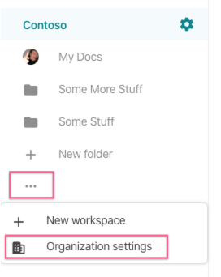
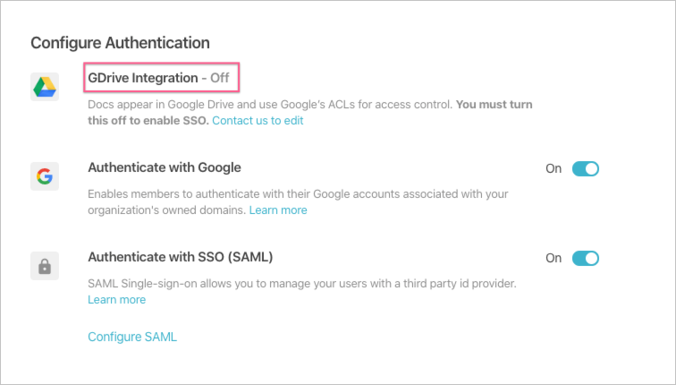
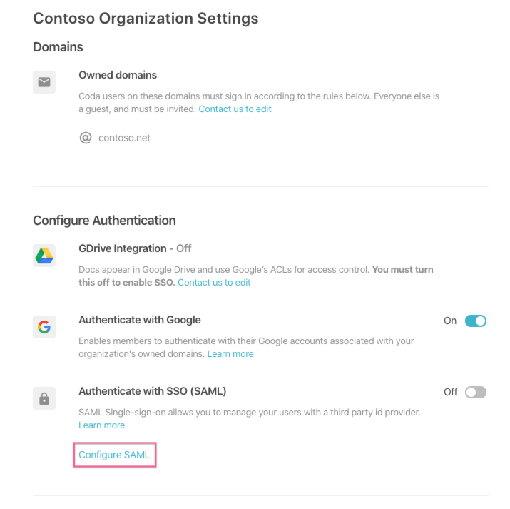
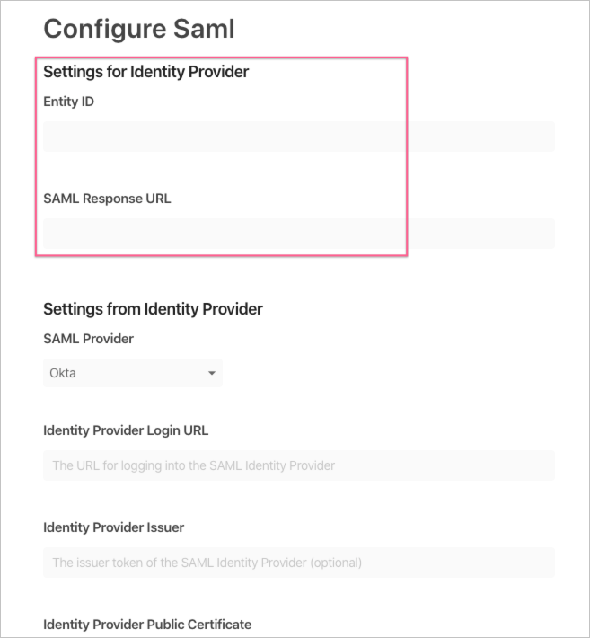

# Tutorial: Azure Active Directory single sign-on (SSO) integration with Coda

In this tutorial, you'll learn how to integrate Coda with Azure Active Directory (Azure AD). When you integrate Coda with Azure AD, you can:

* Control in Azure AD who has access to Coda.
* Enable your users to be automatically signed-in to Coda with their Azure AD accounts.
* Manage your accounts in one central location - the Azure portal.

To learn more about SaaS app integration with Azure AD, see [What is application access and single sign-on with Azure Active Directory](https://docs.microsoft.com/azure/active-directory/active-directory-appssoaccess-whatis).

## Prerequisites

To get started, you need the following items:

* An Azure AD subscription. If you don't have a subscription, you can get a [free account](https://azure.microsoft.com/free/).
* Coda single sign-on (SSO) enabled subscription (Enterprise) with GDrive integration disabled. Contact [Coda support team](mailto:support@coda.io) to disable GDrive integration for your Organization if it is currently enabled.

## Scenario description

In this tutorial, you configure and test Azure AD SSO in a test environment.

* Coda supports **IDP** initiated SSO

* Coda supports **Just In Time** user provisioning

* Once you configure Coda, you can enforce session controls which protect exfiltration and infiltration of your organization’s sensitive data in real-time. Session controls extend from Conditional Access. [Learn how to enforce session control with Microsoft Cloud App Security](https://docs.microsoft.com/cloud-app-security/proxy-deployment-any-app).

## Adding Coda from the gallery

To configure the integration of Coda into Azure AD, you need to add Coda from the gallery to your list of managed SaaS apps.

1. Sign in to the [Azure portal](https://portal.azure.com) using either a work or school account, or a personal Microsoft account.
1. On the left navigation pane, select the **Azure Active Directory** service.
1. Navigate to **Enterprise Applications** and then select **All Applications**.
1. To add new application, select **New application**.
1. In the **Add from the gallery** section, type **Coda** in the search box.
1. Select **Coda** from results panel and then add the app. Wait a few seconds while the app is added to your tenant.

## Configure and test Azure AD single sign-on for Coda

Configure and test Azure AD SSO with Coda using a test user called **B.Simon**. For SSO to work, you need to establish a link relationship between an Azure AD user and the related user in Coda.

To configure and test Azure AD SSO with Coda, complete the following building blocks:

1. **[Begin configuration of Coda SSO](#begin-configuration-of-coda-sso)** - to begin configuration of SSO in Coda.
1. **[Configure Azure AD SSO](#configure-azure-ad-sso)** - to enable your users to use this feature.
   * **[Create an Azure AD test user](#create-an-azure-ad-test-user)** - to test Azure AD single sign-on with B.Simon.
   * **[Assign the Azure AD test user](#assign-the-azure-ad-test-user)** - to enable B.Simon to use Azure AD single sign-on.
1. **[Configure Coda SSO](#configure-coda-sso)** - to complete configuration of single sign-on settings in Coda.
   * **[Create Coda test user](#create-coda-test-user)** - to have a counterpart of B.Simon in Coda that is linked to the Azure AD representation of user.
1. **[Test SSO](#test-sso)** - to verify whether the configuration works.

## Begin configuration of Coda SSO

Follow these steps in Coda to begin.

1. In Coda, open your **Organization settings** panel.

   

1. Ensure that your organization has GDrive Integration turned off. If it is currently enabled, contact the [Coda support team](mailto:support@coda.io) to help you migrate off GDrive.

   

1. Under **Authenticate with SSO (SAML)**, select the **Configure SAML** option.

   

1. Note the values for **Entity ID** and **SAML Response URL**, which you'll need in subsequent steps.

   

## Configure Azure AD SSO

Follow these steps to enable Azure AD SSO in the Azure portal.

1. In the [Azure portal](https://portal.azure.com/), on the **Coda** application integration page, find the **Manage** section and select **single sign-on**.
1. On the **Select a single sign-on method** page, select **SAML**.
1. On the **Set up single sign-on with SAML** page, click the edit/pen icon for **Basic SAML Configuration** to edit the settings.

   

1. On the **Set up single sign-on with SAML** page, enter the values for the following fields:

   a. In the **Identifier** text box, enter the "Entity ID" from above. It should follow the pattern:
   `https://coda.io/samlId/<CUSTOMID>`

   b. In the **Reply URL** text box, enter the "SAML Response URL" from above. It should follow the pattern:
   `https://coda.io/login/sso/saml/<CUSTOMID>/consume`

   > [!NOTE]
   > Your values will differ from the above; you can find your values in Coda's "Configure SAML" console. Update these values with the actual Identifier and Reply URL.

1. On the **Set up single sign-on with SAML** page, in the **SAML Signing Certificate** section, find **Certificate (Base64)** and select **Download** to download the certificate and save it on your computer.

   

1. On the **Set up Coda** section, copy the appropriate URL(s) based on your requirement.

   

### Create an Azure AD test user

In this section, you'll create a test user in the Azure portal called B.Simon.

1. From the left pane in the Azure portal, select **Azure Active Directory**, select **Users**, and then select **All users**.
1. Select **New user** at the top of the screen.
1. In the **User** properties, follow these steps:
   1. In the **Name** field, enter `B.Simon`.
   1. In the **User name** field, enter the username@companydomain.extension. For example, `B.Simon@contoso.com`.
   1. Select the **Show password** check box, and then write down the value that's displayed in the **Password** box.
   1. Click **Create**.

### Assign the Azure AD test user

In this section, you'll enable B.Simon to use Azure single sign-on by granting access to Coda.

1. In the Azure portal, select **Enterprise Applications**, and then select **All applications**.
1. In the applications list, select **Coda**.
1. In the app's overview page, find the **Manage** section and select **Users and groups**.

   

1. Select **Add user**, then select **Users and groups** in the **Add Assignment** dialog.

   

1. In the **Users and groups** dialog, select **B.Simon** from the Users list, then click the **Select** button at the bottom of the screen.
1. If you're expecting any role value in the SAML assertion, in the **Select Role** dialog, select the appropriate role for the user from the list and then click the **Select** button at the bottom of the screen.
1. In the **Add Assignment** dialog, click the **Assign** button.

## Configure Coda SSO

To complete the setup, you'll enter values from Azure Active Directory in the Coda **Configure Saml** panel.

1. In Coda, open your **Organization settings** panel.
1. Under **Authenticate with SSO (SAML)**, select the **Configure SAML** option.
1. Set **SAML Provider** to **Azure Active Directory**.
1. In **Identity Provider Login URL**, paste the **Login URL** from the Azure console.
1. In **Identity Provider Issuer**, paste the **Azure AD Identifier** from the Azure console.
1. In **Identity Provider Public Certificate**, select the **Upload Certificate** option and select the certificate file you downloaded earlier.
1. Select **Save**.

This completes the work necessary for the SAML SSO connection setup.

### Create Coda test user

In this section, a user called Britta Simon is created in Coda. Coda supports just-in-time user provisioning, which is enabled by default. There is no action item for you in this section. If a user doesn't already exist in Coda, a new one is created after authentication.

## Test SSO

In this section, you test your Azure AD single sign-on configuration using the Access Panel.

When you click the Coda tile in the Access Panel, you should be automatically signed in to the Coda for which you set up SSO. For more information about the Access Panel, see [Introduction to the Access Panel](https://docs.microsoft.com/azure/active-directory/active-directory-saas-access-panel-introduction).

## Additional resources

- [ List of Tutorials on How to Integrate SaaS Apps with Azure Active Directory ](https://docs.microsoft.com/azure/active-directory/active-directory-saas-tutorial-list)

- [What is application access and single sign-on with Azure Active Directory? ](https://docs.microsoft.com/azure/active-directory/active-directory-appssoaccess-whatis)

- [What is conditional access in Azure Active Directory?](https://docs.microsoft.com/azure/active-directory/conditional-access/overview)

- [Try Coda with Azure AD](https://aad.portal.azure.com/)

- [What is session control in Microsoft Cloud App Security?](https://docs.microsoft.com/cloud-app-security/proxy-intro-aad)

- [How to protect Coda with advanced visibility and controls](https://docs.microsoft.com/cloud-app-security/proxy-intro-aad)
