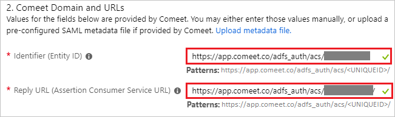
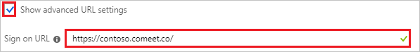
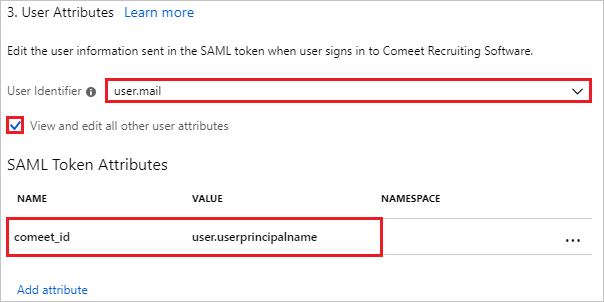
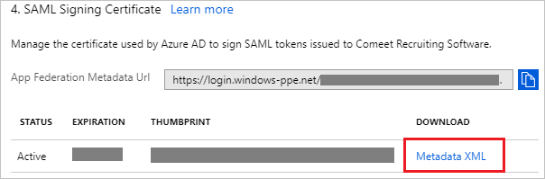
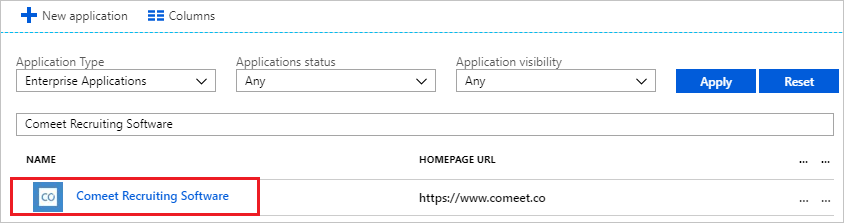

# Tutorial: Azure Active Directory integration with Comeet Recruiting Software

In this tutorial, you learn how to integrate Comeet Recruiting Software with Azure Active Directory (Azure AD).

Integrating Comeet Recruiting Software with Azure AD provides you with the following benefits:

- You can control in Azure AD who has access to Comeet Recruiting Software.
- You can enable your users to automatically get signed-on to Comeet Recruiting Software (Single Sign-On) with their Azure AD accounts.
- You can manage your accounts in one central location - the Azure portal.

If you want to know more details about SaaS app integration with Azure AD, see [what is application access and single sign-on with Azure Active Directory](../manage-apps/what-is-single-sign-on.md)

## Prerequisites

To configure Azure AD integration with Comeet Recruiting Software, you need the following items:

- An Azure AD subscription
- A Comeet Recruiting Software single sign-on enabled subscription

To test the steps in this tutorial, you should follow these recommendations:

- If you don't have an Azure AD trial environment, you can [get a one-month trial](https://azure.microsoft.com/pricing/free-trial/).

## Scenario description

In this tutorial, you test Azure AD single sign-on in a test environment. 
The scenario outlined in this tutorial consists of two main building blocks:

1. Adding Comeet Recruiting Software from the gallery
2. Configuring and testing Azure AD single sign-on

## Adding Comeet Recruiting Software from the gallery

To configure the integration of Comeet Recruiting Software into Azure AD, you need to add Comeet Recruiting Software from the gallery to your list of managed SaaS apps.

**To add Comeet Recruiting Software from the gallery, perform the following steps:**

1. In the **[Azure portal](https://portal.azure.com)**, on the left navigation panel, click **Azure Active Directory** icon. 

	![The Azure Active Directory button][1]

2. Navigate to **Enterprise applications**. Then go to **All applications**.

	![The Enterprise applications blade][2]

3. To add new application, click **New application** button on the top of dialog.

	![The New application button][3]

4. In the search box, type **Comeet Recruiting Software**, select **Comeet Recruiting Software** from result panel then click **Add** button to add the application.

	

## Configure and test Azure AD single sign-on

In this section, you configure and test Azure AD single sign-on with Comeet Recruiting Software based on a test user called "Britta Simon".

For single sign-on to work, Azure AD needs to know what the counterpart user in Comeet Recruiting Software is to a user in Azure AD. In other words, a link relationship between an Azure AD user and the related user in Comeet Recruiting Software needs to be established.

To configure and test Azure AD single sign-on with Comeet Recruiting Software, you need to complete the following building blocks:

1. **[Configure Azure AD Single Sign-On](#configure-azure-ad-single-sign-on)** - to enable your users to use this feature.
2. **[Create an Azure AD test user](#create-an-azure-ad-test-user)** - to test Azure AD single sign-on with Britta Simon.
3. **[Create a Comeet Recruiting Software test user](#create-a-comeet-recruiting-software-test-user)** - to have a counterpart of Britta Simon in Comeet Recruiting Software that is linked to the Azure AD representation of user.
4. **[Assign the Azure AD test user](#assign-the-azure-ad-test-user)** - to enable Britta Simon to use Azure AD single sign-on.
5. **[Test single sign-on](#test-single-sign-on)** - to verify whether the configuration works.

### Configure Azure AD single sign-on

In this section, you enable Azure AD single sign-on in the Azure portal and configure single sign-on in your Comeet Recruiting Software application.

**To configure Azure AD single sign-on with Comeet Recruiting Software, perform the following steps:**

1. In the Azure portal, on the **Comeet Recruiting Software** application integration page, click **Single sign-on**.

	![Configure single sign-on link][4]

2. On the **Single sign-on** dialog, select **Mode** as	**SAML-based Sign-on** to enable single sign-on.

	

3. On the **Comeet Recruiting Software Domain and URLs** section, perform the following steps if you wish to configure the application in **IDP** initiated mode:

	

    a. In the **Identifier** textbox, type a URL using the following pattern: `https://app.comeet.co/adfs_auth/acs/<UNIQUEID>/`

	b. In the **Reply URL** textbox, type a URL using the following pattern: `https://app.comeet.co/adfs_auth/acs/<UNIQUEID>/`

	> [!NOTE]
	> These values are not real. Update these values with the actual Identifier, Reply URL. You will get these values from the Comeet Recruiting Software portal as shown in the [support page](https://support.comeet.co/knowledgebase/adfs-single-sign-on/).

4. Check **Show advanced URL settings** and perform the following step if you wish to configure the application in **SP** initiated mode:

	

    In the **Sign-on URL** textbox, type the URL: `https://app.comeet.co`

5. Comeet Recruiting Software application expects the SAML assertions in a specific format, which requires you to add custom attribute mappings to your SAML token attributes configuration. The following screenshot shows an example for this. The default value of **User Identifier** is **user.userprincipalname** but **Comeet Recruiting Software** expects this to be mapped with the user's email address. For that you can use **user.mail** attribute from the list or use the appropriate attribute value based on your organization configuration.

	

6. Click **View and edit all other user attributes** checkbox in the **User Attributes** section to expand the attributes. Perform the following steps on each of the displayed attributes-

	| Attribute Name | Attribute Value |
	| ---------------| --------------- |
	| comeet_id | user.userprincipalname |

	a. Click **Add attribute** to open the **Add Attribute** dialog.

	

	

	b. In the **Name** textbox, type the **attribute name** shown for that row.

	c. From the **Value** list, type the attribute value shown for that row.

	d. Click **Ok**.

7. On the **SAML Signing Certificate** section, click **Metadata XML** and then save the metadata file on your computer.

	

8. Click **Save** button.

	

9. To configure single sign-on on **Comeet Recruiting Software** side, paste the content of the downloaded Metadata XML into Comeet Recruiting Software, as shown in the [Support Page](https://support.comeet.co/knowledgebase/adfs-single-sign-on/).

### Create an Azure AD test user

The objective of this section is to create a test user in the Azure portal called Britta Simon.

   ![Create an Azure AD test user][100]

**To create a test user in Azure AD, perform the following steps:**

1. In the Azure portal, in the left pane, click the **Azure Active Directory** button.

    

2. To display the list of users, go to **Users and groups**, and then click **All users**.

    

3. To open the **User** dialog box, click **Add** at the top of the **All Users** dialog box.

    

4. In the **User** dialog box, perform the following steps:

    

    a. In the **Name** box, type **BrittaSimon**.

    b. In the **User name** box, type the email address of user Britta Simon.

    c. Select the **Show Password** check box, and then write down the value that's displayed in the **Password** box.

    d. Click **Create**.

### Create a Comeet Recruiting Software test user

In this section, you create a user called Britta Simon in Comeet Recruiting Software. Work with [Comeet Recruiting Software support team](mailto:support@comeet.co) to add the users in the Comeet Recruiting Software platform. Users must be created and activated before you use single sign-on.

### Assign the Azure AD test user

In this section, you enable Britta Simon to use Azure single sign-on by granting access to Comeet Recruiting Software.

![Assign the user role][200]

**To assign Britta Simon to Comeet Recruiting Software, perform the following steps:**

1. In the Azure portal, open the applications view, and then navigate to the directory view and go to **Enterprise applications** then click **All applications**.

	![Assign User][201]

2. In the applications list, select **Comeet Recruiting Software**.

	  

3. In the menu on the left, click **Users and groups**.

	![The "Users and groups" link][202]

4. Click **Add** button. Then select **Users and groups** on **Add Assignment** dialog.

	![The Add Assignment pane][203]

5. On **Users and groups** dialog, select **Britta Simon** in the Users list.

6. Click **Select** button on **Users and groups** dialog.

7. Click **Assign** button on **Add Assignment** dialog.

### Test single sign-on

In this section, you test your Azure AD single sign-on configuration using the Access Panel.

When you click the Comeet Recruiting Software tile in the Access Panel, you should get automatically signed-on to your Comeet Recruiting Software application.
For more information about the Access Panel, see [Introduction to the Access Panel](../user-help/active-directory-saas-access-panel-introduction.md).

## Additional resources

* [List of Tutorials on How to Integrate SaaS Apps with Azure Active Directory](tutorial-list.md)
* [What is application access and single sign-on with Azure Active Directory?](../manage-apps/what-is-single-sign-on.md)

<!--Image references-->

[1]: ./media/comeetrecruitingsoftware-tutorial/tutorial_general_01.png
[2]: ./media/comeetrecruitingsoftware-tutorial/tutorial_general_02.png
[3]: ./media/comeetrecruitingsoftware-tutorial/tutorial_general_03.png
[4]: ./media/comeetrecruitingsoftware-tutorial/tutorial_general_04.png

[100]: ./media/comeetrecruitingsoftware-tutorial/tutorial_general_100.png

[200]: ./media/comeetrecruitingsoftware-tutorial/tutorial_general_200.png
[201]: ./media/comeetrecruitingsoftware-tutorial/tutorial_general_201.png
[202]: ./media/comeetrecruitingsoftware-tutorial/tutorial_general_202.png
[203]: ./media/comeetrecruitingsoftware-tutorial/tutorial_general_203.png