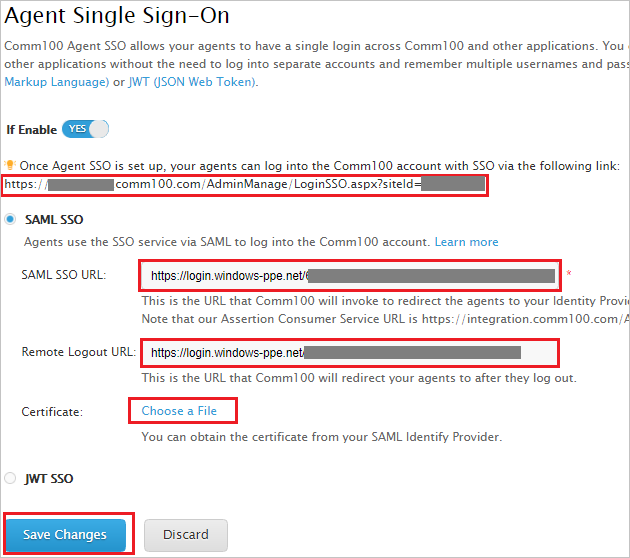
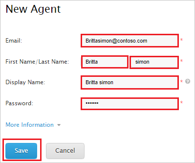

# Tutorial: Azure Active Directory single sign-on (SSO) integration with Comm100 Live Chat

In this tutorial, you'll learn how to integrate Comm100 Live Chat with Azure Active Directory (Azure AD). When you integrate Comm100 Live Chat with Azure AD, you can:

* Control in Azure AD who has access to Comm100 Live Chat.
* Enable your users to be automatically signed-in to Comm100 Live Chat with their Azure AD accounts.
* Manage your accounts in one central location - the Azure portal.

To learn more about SaaS app integration with Azure AD, see [What is application access and single sign-on with Azure Active Directory](https://docs.microsoft.com/azure/active-directory/active-directory-appssoaccess-whatis).

## Prerequisites

To get started, you need the following items:

* An Azure AD subscription. If you don't have a subscription, you can get a [free account](https://azure.microsoft.com/free/).
* Comm100 Live Chat single sign-on (SSO) enabled subscription.

## Scenario description

In this tutorial, you configure and test Azure AD SSO in a test environment.

* Comm100 Live Chat supports **SP** initiated SSO

> [!NOTE]
> Identifier of this application is a fixed string value so only one instance can be configured in one tenant.

## Adding Comm100 Live Chat from the gallery

To configure the integration of Comm100 Live Chat into Azure AD, you need to add Comm100 Live Chat from the gallery to your list of managed SaaS apps.

1. Sign in to the [Azure portal](https://portal.azure.com) using either a work or school account, or a personal Microsoft account.
1. On the left navigation pane, select the **Azure Active Directory** service.
1. Navigate to **Enterprise Applications** and then select **All Applications**.
1. To add new application, select **New application**.
1. In the **Add from the gallery** section, type **Comm100 Live Chat** in the search box.
1. Select **Comm100 Live Chat** from results panel and then add the app. Wait a few seconds while the app is added to your tenant.

## Configure and test Azure AD single sign-on for Comm100 Live Chat

Configure and test Azure AD SSO with Comm100 Live Chat using a test user called **B.Simon**. For SSO to work, you need to establish a link relationship between an Azure AD user and the related user in Comm100 Live Chat.

To configure and test Azure AD SSO with Comm100 Live Chat, complete the following building blocks:

1. **[Configure Azure AD SSO](#configure-azure-ad-sso)** - to enable your users to use this feature.
    1. **[Create an Azure AD test user](#create-an-azure-ad-test-user)** - to test Azure AD single sign-on with B.Simon.
    1. **[Assign the Azure AD test user](#assign-the-azure-ad-test-user)** - to enable B.Simon to use Azure AD single sign-on.
1. **[Configure Comm100 Live Chat SSO](#configure-comm100-live-chat-sso)** - to configure the single sign-on settings on application side.
    1. **[Create Comm100 Live Chat test user](#create-comm100-live-chat-test-user)** - to have a counterpart of B.Simon in Comm100 Live Chat that is linked to the Azure AD representation of user.
1. **[Test SSO](#test-sso)** - to verify whether the configuration works.

## Configure Azure AD SSO

Follow these steps to enable Azure AD SSO in the Azure portal.

1. In the [Azure portal](https://portal.azure.com/), on the **Comm100 Live Chat** application integration page, find the **Manage** section and select **single sign-on**.
1. On the **Select a single sign-on method** page, select **SAML**.
1. On the **Set up single sign-on with SAML** page, click the edit/pen icon for **Basic SAML Configuration** to edit the settings.

   

1. On the **Basic SAML Configuration** section, enter the values for the following fields:

    In the **Sign-on URL** text box, type a URL using the following pattern:
    `https://<SUBDOMAIN>.comm100.com/AdminManage/LoginSSO.aspx?siteId=<SITEID>`

	> [!NOTE] 
	> The Sign-on URL value is not real. You will update the Sign-on URL value with the actual Sign-on URL, which is explained later in the tutorial.

1. Comm100 Live Chat application expects the SAML assertions in a specific format, which requires you to add custom attribute mappings to your SAML token attributes configuration. The following screenshot shows the list of default attributes.

	

1. In addition to above, Comm100 Live Chat application expects few more attributes to be passed back in SAML response which are shown below. These attributes are also pre populated but you can review them as per your requirement.

	| Name |  Source Attribute|
	| ---------------| --------------- |
	|   email    | user.mail |

1. On the **Set up single sign-on with SAML** page, in the **SAML Signing Certificate** section,  find **Certificate (Base64)** and select **Download** to download the certificate and save it on your computer.

	

1. On the **Set up Comm100 Live Chat** section, copy the appropriate URL(s) based on your requirement.

	

### Create an Azure AD test user

In this section, you'll create a test user in the Azure portal called B.Simon.

1. From the left pane in the Azure portal, select **Azure Active Directory**, select **Users**, and then select **All users**.
1. Select **New user** at the top of the screen.
1. In the **User** properties, follow these steps:
   1. In the **Name** field, enter `B.Simon`.  
   1. In the **User name** field, enter the username@companydomain.extension. For example, `B.Simon@contoso.com`.
   1. Select the **Show password** check box, and then write down the value that's displayed in the **Password** box.
   1. Click **Create**.

### Assign the Azure AD test user

In this section, you'll enable B.Simon to use Azure single sign-on by granting access to Comm100 Live Chat.

1. In the Azure portal, select **Enterprise Applications**, and then select **All applications**.
1. In the applications list, select **Comm100 Live Chat**.
1. In the app's overview page, find the **Manage** section and select **Users and groups**.

   

1. Select **Add user**, then select **Users and groups** in the **Add Assignment** dialog.

	

1. In the **Users and groups** dialog, select **B.Simon** from the Users list, then click the **Select** button at the bottom of the screen.
1. If you're expecting any role value in the SAML assertion, in the **Select Role** dialog, select the appropriate role for the user from the list and then click the **Select** button at the bottom of the screen.
1. In the **Add Assignment** dialog, click the **Assign** button.

## Configure Comm100 Live Chat SSO

1. In a different web browser window, sign in to Comm100 Live Chat as a Security Administrator.

1. On the top right side of the page, click **My Account**.

   

1. From the left side of menu, click **Security** and then click **Agent Single Sign-On**.

   

1. On the **Agent Single Sign-On** page, perform the following steps:

   

   a. Copy the first highlighted link and paste it in **Sign-on URL** textbox in **Basic SAML Configuration** section on Azure portal.

   b. In the **SAML SSO URL** textbox, paste the value of **Login URL**, which you have copied from the Azure portal.

   c. In the **Remote Logout URL** textbox, paste the value of **Logout URL**, which you have copied from the Azure portal.

   d. Click **Choose a File** to upload the base-64 encoded certificate that you have downloaded from the Azure portal, into the **Certificate**.

   e. Click **Save Changes**.

### Create Comm100 Live Chat test user

To enable Azure AD users to sign in to Comm100 Live Chat, they must be provisioned into Comm100 Live Chat. In Comm100 Live Chat, provisioning is a manual task.

**To provision a user account, perform the following steps:**

1. Sign in to Comm100 Live Chat as a Security Administrator.

2. On the top right side of the page, click **My Account**.

	

3. From the left side of menu, click **Agents** and then click **New Agent**.

	

4. On the **New Agent** page, perform the following steps:

	

	a. a. In **Email** text box, enter the email of user like **B.simon\@contoso.com**.

	b. In **First Name** text box, enter the first name of user like **B**.

	c. In **Last Name** text box, enter the last name of user like **simon**.

	d. In the **Display Name** textbox, enter the display name of user like **B.simon**

	e. In the **Password** textbox, type your password.

	f. Click **Save**.

## Test SSO 

In this section, you test your Azure AD single sign-on configuration using the Access Panel.

When you click the Comm100 Live Chat tile in the Access Panel, you should be automatically signed in to the Comm100 Live Chat for which you set up SSO. For more information about the Access Panel, see [Introduction to the Access Panel](https://docs.microsoft.com/azure/active-directory/active-directory-saas-access-panel-introduction).

## Additional resources

- [ List of Tutorials on How to Integrate SaaS Apps with Azure Active Directory ](https://docs.microsoft.com/azure/active-directory/active-directory-saas-tutorial-list)

- [What is application access and single sign-on with Azure Active Directory? ](https://docs.microsoft.com/azure/active-directory/active-directory-appssoaccess-whatis)

- [What is conditional access in Azure Active Directory?](https://docs.microsoft.com/azure/active-directory/conditional-access/overview)

- [Try Comm100 Live Chat with Azure AD](https://aad.portal.azure.com/)

