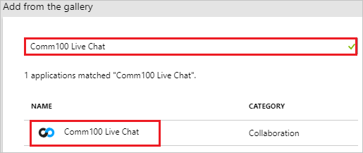
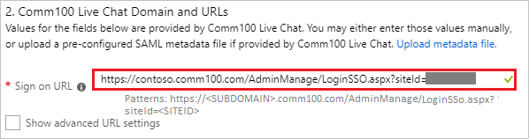
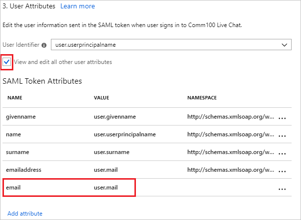
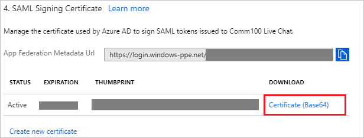
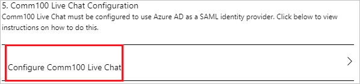
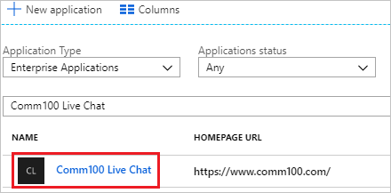

# Tutorial: Azure Active Directory integration with Comm100 Live Chat

In this tutorial, you learn how to integrate Comm100 Live Chat with Azure Active Directory (Azure AD).

Integrating Comm100 Live Chat with Azure AD provides you with the following benefits:

- You can control in Azure AD who has access to Comm100 Live Chat.
- You can enable your users to automatically get signed-on to Comm100 Live Chat (Single Sign-On) with their Azure AD accounts.
- You can manage your accounts in one central location - the Azure portal.

If you want to know more details about SaaS app integration with Azure AD, see [what is application access and single sign-on with Azure Active Directory](../manage-apps/what-is-single-sign-on.md).

## Prerequisites

To configure Azure AD integration with Comm100 Live Chat, you need the following items:

- An Azure AD subscription
- A Comm100 Live Chat single sign-on enabled subscription

> [!NOTE]
> To test the steps in this tutorial, we do not recommend using a production environment.

To test the steps in this tutorial, you should follow these recommendations:

- Do not use your production environment, unless it is necessary.
- If you don't have an Azure AD trial environment, you can [get a one-month trial](https://azure.microsoft.com/pricing/free-trial/).

## Scenario description
In this tutorial, you test Azure AD single sign-on in a test environment. 
The scenario outlined in this tutorial consists of two main building blocks:

1. Adding Comm100 Live Chat from the gallery
2. Configuring and testing Azure AD single sign-on

## Adding Comm100 Live Chat from the gallery
To configure the integration of Comm100 Live Chat into Azure AD, you need to add Comm100 Live Chat from the gallery to your list of managed SaaS apps.

**To add Comm100 Live Chat from the gallery, perform the following steps:**

1. In the **[Azure portal](https://portal.azure.com)**, on the left navigation panel, click **Azure Active Directory** icon. 

	![The Azure Active Directory button][1]

2. Navigate to **Enterprise applications**. Then go to **All applications**.

	![The Enterprise applications blade][2]
	
3. To add new application, click **New application** button on the top of dialog.

	![The New application button][3]

4. In the search box, type **Comm100 Live Chat**, select **Comm100 Live Chat** from result panel then click **Add** button to add the application.

	

## Configure and test Azure AD single sign-on

In this section, you configure and test Azure AD single sign-on with Comm100 Live Chat based on a test user called "Britta Simon".

For single sign-on to work, Azure AD needs to know what the counterpart user in Comm100 Live Chat is to a user in Azure AD. In other words, a link relationship between an Azure AD user and the related user in Comm100 Live Chat needs to be established.

To configure and test Azure AD single sign-on with Comm100 Live Chat, you need to complete the following building blocks:

1. **[Configure Azure AD Single Sign-On](#configure-azure-ad-single-sign-on)** - to enable your users to use this feature.
2. **[Create an Azure AD test user](#create-an-azure-ad-test-user)** - to test Azure AD single sign-on with Britta Simon.
3. **[Create a Comm100 Live Chat test user](#create-a-comm100-live-chat-test-user)** - to have a counterpart of Britta Simon in Comm100 Live Chat that is linked to the Azure AD representation of user.
4. **[Assign the Azure AD test user](#assign-the-azure-ad-test-user)** - to enable Britta Simon to use Azure AD single sign-on.
5. **[Test single sign-on](#test-single-sign-on)** - to verify whether the configuration works.

### Configure Azure AD single sign-on

In this section, you enable Azure AD single sign-on in the Azure portal and configure single sign-on in your Comm100 Live Chat application.

**To configure Azure AD single sign-on with Comm100 Live Chat, perform the following steps:**

1. In the Azure portal, on the **Comm100 Live Chat** application integration page, click **Single sign-on**.

	![Configure single sign-on link][4]

2. On the **Single sign-on** dialog, select **Mode** as	**SAML-based Sign-on** to enable single sign-on.
 
	

3. On the **Comm100 Live Chat Domain and URLs** section, perform the following steps:

	

    In the **Sign-on URL** textbox, type a URL using the following pattern: `https://<SUBDOMAIN>.comm100.com/AdminManage/LoginSSO.aspx?siteId=<SITEID>`
	
	> [!NOTE] 
	> The Sign-on URL value is not real. You will update the Sign-on URL value with the actual Sign-on URL, which is explained later in the tutorial.

4. Comm100 Live Chat application expects the SAML assertions to contain specific attributes. Configure the following attributes  for this application. You can manage the values of these attributes from the **User Attributes** section on application integration page. The following screenshot shows an example for this.

	
	
5. In the **User Attributes** section on the **Single sign-on** dialog, configure SAML token attribute as shown in the image above and perform the following steps:
	
	|  Attribute Name  | Attribute Value |
	| --------------- | -------------------- |    
	|   email    | user.mail |

	a. Click **Add attribute** to open the **Add Attribute** dialog.

	

	
	
	b. In the **Name** textbox, type the attribute name shown for that row.
	
	c. From the **Value** list, type the attribute value shown for that row.

	d. Leave the **Namespace** blank.
	
	e. Click **Ok**.

6. On the **SAML Signing Certificate** section, click **Certificate (Base64)** and then save the certificate file on your computer.

	 

7. Click **Save** button.

	

8. On the **Comm100 Live Chat Configuration** section, click **Configure Comm100 Live Chat** to open **Configure sign-on** window. Copy the **Sign-Out URL and SAML Single Sign-On Service URL** from the **Quick Reference section.**

	

9. In a different web browser window, login to Comm100 Live Chat as a Security Administrator.

10. On the top right side of the page, click **My Account**.

	

11. From the left side of menu, click **Security** and then click **Agent Single Sign-On**.

	

12. On the **Agent Single Sign-On** page, perform the following steps:

	

	a. Copy the first highlighted link and paste it in **Sign-on URL** textbox in **Comm100 Live Chat Domain and URLs** section on Azure portal.

	b. In the **SAML SSO URL** textbox, paste the value of **SAML Single Sign-On Service URL**, which you have copied from the Azure portal.

	c. In the **Remote Logout URL** textbox, paste the value of **Sign-Out URL**, which you have copied from the Azure portal.

	d. Click **Choose a File** to upload the base-64 encoded certificate that you have downloaded from the Azure portal, into the **Certificate**.

	e. Click **Save Changes**

### Create an Azure AD test user

The objective of this section is to create a test user in the Azure portal called Britta Simon.

   ![Create an Azure AD test user][100]

**To create a test user in Azure AD, perform the following steps:**

1. In the Azure portal, in the left pane, click the **Azure Active Directory** button.

    

2. To display the list of users, go to **Users and groups**, and then click **All users**.

    

3. To open the **User** dialog box, click **Add** at the top of the **All Users** dialog box.

    

4. In the **User** dialog box, perform the following steps:

    

    a. In the **Name** box, type **BrittaSimon**.

    b. In the **User name** box, type the email address of user Britta Simon.

    c. Select the **Show Password** check box, and then write down the value that's displayed in the **Password** box.

    d. Click **Create**.
 
### Create a Comm100 Live Chat test user

To enable Azure AD users to log in to Comm100 Live Chat, they must be provisioned into Comm100 Live Chat. In Comm100 Live Chat, provisioning is a manual task.

**To provision a user account, perform the following steps:**

1. Log in to Comm100 Live Chat as a Security Administrator.

2. On the top right side of the page, click **My Account**.

	

3. From the left side of menu, click **Agents** and then click **New Agent**.

	

4. On the **New Agent** page, perform the following steps:

	

	a. a. In **Email** text box, enter the email of user like **Brittasimon@contoso.com**.

	b. In **First Name** text box, enter the first name of user like **Britta**.

	c. In **Last Name** text box, enter the last name of user like **simon**.

	d. In the **Display Name** textbox, enter the display name of user like **Britta simon**

	e. In the **Password** textbox, type your password.

	f. Click **Save**.

### Assign the Azure AD test user

In this section, you enable Britta Simon to use Azure single sign-on by granting access to Comm100 Live Chat.

![Assign the user role][200] 

**To assign Britta Simon to Comm100 Live Chat, perform the following steps:**

1. In the Azure portal, open the applications view, and then navigate to the directory view and go to **Enterprise applications** then click **All applications**.

	![Assign User][201] 

2. In the applications list, select **Comm100 Live Chat**.

	  

3. In the menu on the left, click **Users and groups**.

	![The "Users and groups" link][202]

4. Click **Add** button. Then select **Users and groups** on **Add Assignment** dialog.

	![The Add Assignment pane][203]

5. On **Users and groups** dialog, select **Britta Simon** in the Users list.

6. Click **Select** button on **Users and groups** dialog.

7. Click **Assign** button on **Add Assignment** dialog.
	
### Test single sign-on

In this section, you test your Azure AD single sign-on configuration using the Access Panel.

When you click the Comm100 Live Chat tile in the Access Panel, you should get automatically signed-on to your Comm100 Live Chat application.
For more information about the Access Panel, see [Introduction to the Access Panel](../active-directory-saas-access-panel-introduction.md). 

## Additional resources

* [List of Tutorials on How to Integrate SaaS Apps with Azure Active Directory](tutorial-list.md)
* [What is application access and single sign-on with Azure Active Directory?](../manage-apps/what-is-single-sign-on.md)

<!--Image references-->

[1]: ./media/comm100livechat-tutorial/tutorial_general_01.png
[2]: ./media/comm100livechat-tutorial/tutorial_general_02.png
[3]: ./media/comm100livechat-tutorial/tutorial_general_03.png
[4]: ./media/comm100livechat-tutorial/tutorial_general_04.png

[100]: ./media/comm100livechat-tutorial/tutorial_general_100.png

[200]: ./media/comm100livechat-tutorial/tutorial_general_200.png
[201]: ./media/comm100livechat-tutorial/tutorial_general_201.png
[202]: ./media/comm100livechat-tutorial/tutorial_general_202.png
[203]: ./media/comm100livechat-tutorial/tutorial_general_203.png

