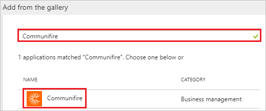
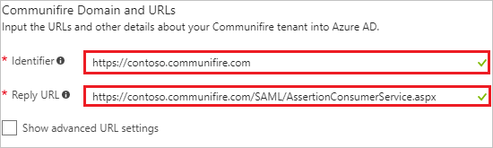
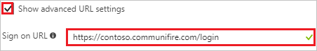
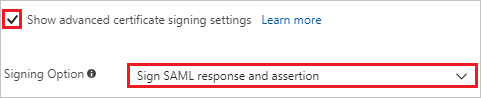
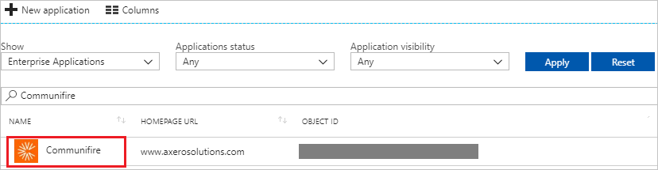

---
title: 'Tutorial: Azure Active Directory integration with Communifire | Microsoft Docs'
description: Learn how to configure single sign-on between Azure Active Directory and Communifire.
services: active-directory
documentationCenter: na
author: jeevansd
manager: mtillman
ms.reviewer: joflore

ms.assetid: de2a164d-2115-43e7-a9ed-e54f483f4aeb
ms.service: active-directory
ms.component: saas-app-tutorial
ms.workload: identity
ms.tgt_pltfrm: na
ms.devlang: na
ms.topic: article
ms.date: 11/29/2017
ms.author: jeedes

---
# Tutorial: Azure Active Directory integration with Communifire

In this tutorial, you learn how to integrate Communifire with Azure Active Directory (Azure AD).

Integrating Communifire with Azure AD provides you with the following benefits:

- You can control in Azure AD who has access to Communifire.
- You can enable your users to automatically get signed-on to Communifire (Single Sign-On) with their Azure AD accounts.
- You can manage your accounts in one central location - the Azure portal.

If you want to know more details about SaaS app integration with Azure AD, see [what is application access and single sign-on with Azure Active Directory](../manage-apps/what-is-single-sign-on.md).

## Prerequisites

To configure Azure AD integration with Communifire, you need the following items:

- An Azure AD subscription
- A Communifire single-sign on enabled subscription

> [!NOTE]
> To test the steps in this tutorial, we do not recommend using a production environment.

To test the steps in this tutorial, you should follow these recommendations:

- Do not use your production environment, unless it is necessary.
- If you don't have an Azure AD trial environment, you can [get a one-month trial](https://azure.microsoft.com/pricing/free-trial/).

## Scenario description
In this tutorial, you test Azure AD single sign-on in a test environment. 
The scenario outlined in this tutorial consists of two main building blocks:

1. Adding Communifire from the gallery
1. Configuring and testing Azure AD single sign-on

## Adding Communifire from the gallery
To configure the integration of Communifire into Azure AD, you need to add Communifire from the gallery to your list of managed SaaS apps.

**To add Communifire from the gallery, perform the following steps:**

1. In the **[Azure portal](https://portal.azure.com)**, on the left navigation panel, click **Azure Active Directory** icon. 

	![The Azure Active Directory button][1]

1. Navigate to **Enterprise applications**. Then go to **All applications**.

	![The Enterprise applications blade][2]
	
1. To add new application, click **New application** button on the top of dialog.

	![The New application button][3]

1. In the search box, type **Communifire**, select **Communifire** from result panel then click **Add** button to add the application.

	

## Configure and test Azure AD single sign-on

In this section, you configure and test Azure AD single sign-on with Communifire based on a test user called "Britta Simon".

For single sign-on to work, Azure AD needs to know what the counterpart user in Communifire is to a user in Azure AD. In other words, a link relationship between an Azure AD user and the related user in Communifire needs to be established.

In Communifire, assign the value of the **user name** in Azure AD as the value of the **Username** to establish the link relationship.

To configure and test Azure AD single sign-on with Communifire, you need to complete the following building blocks:

1. **[Configure Azure AD Single Sign-On](#configure-azure-ad-single-sign-on)** - to enable your users to use this feature.
1. **[Create an Azure AD test user](#create-an-azure-ad-test-user)** - to test Azure AD single sign-on with Britta Simon.
1. **[Create a Communifire test user](#create-a-communifire-test-user)** - to have a counterpart of Britta Simon in Communifire that is linked to the Azure AD representation of user.
1. **[Assign the Azure AD test user](#assign-the-azure-ad-test-user)** - to enable Britta Simon to use Azure AD single sign-on.
1. **[Test single sign-on](#test-single-sign-on)** - to verify whether the configuration works.

### Configure Azure AD single sign-on

In this section, you enable Azure AD single sign-on in the Azure portal and configure single sign-on in your Communifire application.

**To configure Azure AD single sign-on with Communifire, perform the following steps:**

1. In the Azure portal, on the **Communifire** application integration page, click **Single sign-on**.

	![Configure single sign-on link][4]

1. On the **Single sign-on** dialog, select **Mode** as	**SAML-based Sign-on** to enable single sign-on.
 
	

1. On the **Communifire Domain and URLs** section, perform the following steps if you wish to configure the application in IDP initiated mode:

	

    a. In the **Identifier** textbox, type a URL using the following pattern: `https://<subdomain>.communifire.com`

	b. In the **Reply URL** textbox, type a URL using the following pattern: `https://<subdomain>.communifire.com/SAML/AssertionConsumerService.aspx`

1. Check **Show advanced URL settings** and perform the following step if you wish to configure the application in **SP** initiated mode:

	

    In the **Sign-on URL** textbox, type a URL using the following pattern: `https://<subdomain>.communifire.com/login`
	 
	> [!NOTE] 
	> These values are not real. Update these values with the actual Identifier, Reply URL, and Sign-On URL. Contact [Communifire Client support team](https://my.axerosolutions.com/spaces/77/communifire-support/help/welcome) to get these values. 

1. On the **SAML Signing Certificate** section, click **Metadata XML** and then save the metadata file on your computer.

	 

1.  Check **Show advanced certificate Signing settings** and select **Signing Option** as **Sign SAML response and assertion**.

	 

1. Click **Save** button.

	
	
1. To configure single sign-on on **Communifire** side, you need to send the downloaded **Metadata XML** to [Communifire support team](https://my.axerosolutions.com/spaces/77/communifire-support/help/welcome). They set this setting to have the SAML SSO connection set properly on both sides.

> [!TIP]
> You can now read a concise version of these instructions inside the [Azure portal](https://portal.azure.com), while you are setting up the app!  After adding this app from the **Active Directory > Enterprise Applications** section, simply click the **Single Sign-On** tab and access the embedded documentation through the **Configuration** section at the bottom. You can read more about the embedded documentation feature here: [Azure AD embedded documentation]( https://go.microsoft.com/fwlink/?linkid=845985)

### Create an Azure AD test user

The objective of this section is to create a test user in the Azure portal called Britta Simon.

   ![Create an Azure AD test user][100]

**To create a test user in Azure AD, perform the following steps:**

1. In the Azure portal, in the left pane, click the **Azure Active Directory** button.

    

1. To display the list of users, go to **Users and groups**, and then click **All users**.

    

1. To open the **User** dialog box, click **Add** at the top of the **All Users** dialog box.

    

1. In the **User** dialog box, perform the following steps:

    

    a. In the **Name** box, type **BrittaSimon**.

    b. In the **User name** box, type the email address of user Britta Simon.

    c. Select the **Show Password** check box, and then write down the value that's displayed in the **Password** box.

    d. Click **Create**.
 
### Create a Communifire test user

The objective of this section is to create a user called Britta Simon in Communifire. Communifire supports just-in-time provisioning, which is by default enabled. A new user is created after saving the profile details during an attempt to access Communifire if it doesn't exist yet.

>[!Note]
>If you need to create a user manually, Contact [Communifire support team](https://my.axerosolutions.com/spaces/77/communifire-support/help/welcome).

### Assign the Azure AD test user

In this section, you enable Britta Simon to use Azure single sign-on by granting access to Communifire.

![Assign the user role][200] 

**To assign Britta Simon to Communifire, perform the following steps:**

1. In the Azure portal, open the applications view, and then navigate to the directory view and go to **Enterprise applications** then click **All applications**.

	![Assign User][201] 

1. In the applications list, select **Communifire**.

	  

1. In the menu on the left, click **Users and groups**.

	![The "Users and groups" link][202]

1. Click **Add** button. Then select **Users and groups** on **Add Assignment** dialog.

	![The Add Assignment pane][203]

1. On **Users and groups** dialog, select **Britta Simon** in the Users list.

1. Click **Select** button on **Users and groups** dialog.

1. Click **Assign** button on **Add Assignment** dialog.
	
### Test single sign-on

In this section, you test your Azure AD single sign-on configuration using the Access Panel.

When you click the Communifire tile in the Access Panel, you should get automatically signed-on to your Communifire application.
For more information about the Access Panel, see [Introduction to the Access Panel](../user-help/active-directory-saas-access-panel-introduction.md). 

## Additional resources

* [List of Tutorials on How to Integrate SaaS Apps with Azure Active Directory](tutorial-list.md)
* [What is application access and single sign-on with Azure Active Directory?](../manage-apps/what-is-single-sign-on.md)

<!--Image references-->

[1]: ./media/communifire-tutorial/tutorial_general_01.png
[2]: ./media/communifire-tutorial/tutorial_general_02.png
[3]: ./media/communifire-tutorial/tutorial_general_03.png
[4]: ./media/communifire-tutorial/tutorial_general_04.png

[100]: ./media/communifire-tutorial/tutorial_general_100.png

[200]: ./media/communifire-tutorial/tutorial_general_200.png
[201]: ./media/communifire-tutorial/tutorial_general_201.png
[202]: ./media/communifire-tutorial/tutorial_general_202.png
[203]: ./media/communifire-tutorial/tutorial_general_203.png

