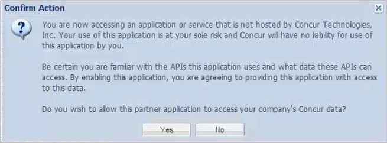

# Tutorial: Configure Concur for automatic user provisioning

The objective of this tutorial is to show you the steps you need to perform in Concur and Azure AD to automatically provision and de-provision user accounts from Azure AD to Concur.

## Prerequisites

The scenario outlined in this tutorial assumes that you already have the following items:

*   An Azure Active directory tenant.
*   A Concur single sign-on enabled subscription.
*   A user account in Concur with Team Admin permissions.

## Assigning users to Concur

Azure Active Directory uses a concept called "assignments" to determine which users should receive access to selected apps. In the context of automatic user account provisioning, only the users and groups that have been "assigned" to an application in Azure AD is synchronized.

Before configuring and enabling the provisioning service, you need to decide what users and/or groups in Azure AD represent the users who need access to your Concur app. Once decided, you can assign these users to your Concur app by following the instructions here:

[Assign a user or group to an enterprise app](https://docs.microsoft.com/azure/active-directory/active-directory-coreapps-assign-user-azure-portal)

### Important tips for assigning users to Concur

*   It is recommended that a single Azure AD user be assigned to Concur to test the provisioning configuration. Additional users and/or groups may be assigned later.

*   When assigning a user to Concur, you must select a valid user role. The "Default Access" role does not work for provisioning.

## Enable user provisioning

This section guides you through connecting your Azure AD to Concur's user account provisioning API, and configuring the provisioning service to create, update, and disable assigned user accounts in Concur based on user and group assignment in Azure AD.

> [!Tip] 
> You may also choose to enabled SAML-based Single Sign-On for Concur, following the instructions provided in [Azure portal](https://portal.azure.com). Single sign-on can be configured independently of automatic provisioning, though these two features compliment each other.

### To configure user account provisioning:

The objective of this section is to outline how to enable provisioning of Active Directory user accounts to Concur.

To enable apps in the Expense Service, there has to be proper setup and use of a Web Service Admin profile. Don't add the WS Admin role to your existing administrator profile that you use for T&E administrative functions.

Concur Consultants or the client administrator must create a distinct Web Service Administrator profile and the Client administrator must use this profile for the Web Services Administrator functions (for example, enabling apps). These profiles must be kept separate from the client administrator's daily T&E admin profile (the T&E admin profile should not have the WSAdmin role assigned).

When you create the profile to be used for enabling the app, enter the client administrator's name into the user profile fields. This assigns ownership to the profile. Once one or more profiles is created, the client must log in with this profile to click the "*Enable*" button for a Partner App within the Web Services menu.

For the following reasons, this action should not be done with the profile they use for normal T&E administration.

* The client has to be the one that clicks "*Yes*" on the dialogue window that is displayed after an app is enabled. This click acknowledges the client is willing for the Partner application to access their data, so you or the Partner cannot click that Yes button.

* If a client administrator that has enabled an app using the T&E admin profile leaves the company (resulting in the profile being inactivated), any apps enabled using that profile does not function until the app is enabled with another active WS Admin profile. This is why you are supposed to create distinct WS Admin profiles.

* If an administrator leaves the company, the name associated to the WS Admin profile can be changed to the replacement administrator if desired without impacting the enabled app because that profile does not need inactivated.

**To configure user provisioning, perform the following steps:**

1. Log on to your **Concur** tenant.

2. From the **Administration** menu, select **Web Services**.
   
    

3. On the left side, from the **Web Services** pane, select **Enable Partner Application**.
   
    

4. From the **Enable Application** list, select **Azure Active Directory**, and then click **Enable**.
   
    

5. Click **Yes** to close the **Confirm Action** dialog.
   
    

6. In the [Azure portal](https://portal.azure.com), browse to the **Azure Active Directory > Enterprise Apps > All applications** section.

7. If you have already configured Concur for single sign-on, search for your instance of Concur using the search field. Otherwise, select **Add** and search for **Concur** in the application gallery. Select Concur from the search results, and add it to your list of applications.

8. Select your instance of Concur, then select the **Provisioning** tab.

9. Set the **Provisioning Mode** to **Automatic**. 
 
    

10. Under the **Admin Credentials** section, enter the **user name** and the **password** of your Concur administrator.

11. In the Azure portal, click **Test Connection** to ensure Azure AD can connect to your Concur app. If the connection fails, ensure your Concur account has Team Admin permissions.

12. Enter the email address of a person or group who should receive provisioning error notifications in the **Notification Email** field, and check the checkbox.

13. Click **Save.**

14. Under the Mappings section, select **Synchronize Azure Active Directory Users to Concur.**

15. In the **Attribute Mappings** section, review the user attributes that are synchronized from Azure AD to Concur. The attributes selected as **Matching** properties are used to match the user accounts in Concur for update operations. Select the Save button to commit any changes.

16. To enable the Azure AD provisioning service for Concur, change the **Provisioning Status** to **On** in the **Settings** section

17. Click **Save.**

You can now create a test account. Wait for up to 20 minutes to verify that the account has been synchronized to Concur.

## Additional resources

* [Managing user account provisioning for Enterprise Apps](tutorial-list.md)
* [What is application access and single sign-on with Azure Active Directory?](../manage-apps/what-is-single-sign-on.md)
* [Configure Single Sign-on](concur-tutorial.md)

