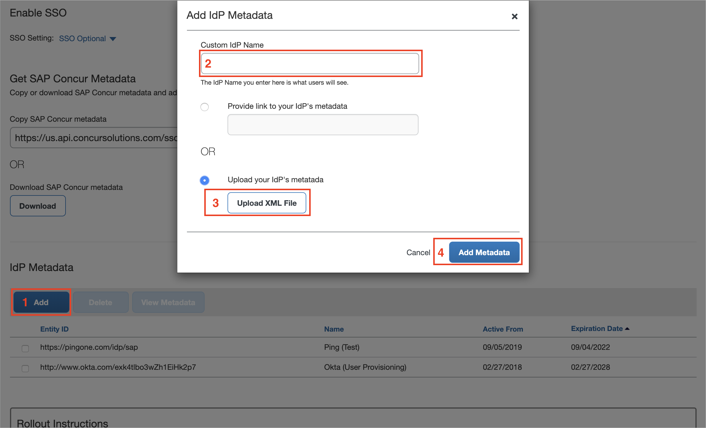

# Tutorial: Microsoft Entra single sign-on (SSO) integration with SAP Concur Travel and Expense

In this tutorial, you'll learn how to integrate SAP Concur Travel and Expense with Microsoft Entra ID. When you integrate SAP Concur Travel and Expense with Microsoft Entra ID, you can:

* Control in Microsoft Entra ID who has access to SAP Concur Travel and Expense.
* Enable your users to be automatically signed-in to SAP Concur Travel and Expense with their Microsoft Entra accounts.
* Manage your accounts in one central location.

## Prerequisites

To get started, you need the following items:

* A Microsoft Entra subscription. If you don't have a subscription, you can get a [free account](https://azure.microsoft.com/free/).
* SAP Concur Travel and Expense subscription.
* A "Company Administrator" role under your Concur user account. You can test if you have the right access by going to [Concur SSO Self-Service Tool](https://www.concursolutions.com/nui/authadmin/ssoadmin). If you do not have the access, please contact Concur support or implementation project manager. 

## Scenario description

In this tutorial, you configure and test Microsoft Entra SSO.

* SAP Concur Travel and Expense supports **IDP** and **SP** initiated SSO
* SAP Concur Travel and Expense supports testing SSO in both production and implementation environment 

> [!NOTE]
> Identifier of this application is a fixed string value for each of the three regions: US, EMEA, and China. So only one instance can be configured for each region in one tenant. 

## Adding SAP Concur Travel and Expense from the gallery

To configure the integration of SAP Concur Travel and Expense into Microsoft Entra ID, you need to add SAP Concur Travel and Expense from the gallery to your list of managed SaaS apps.

1. Sign in to the [Microsoft Entra admin center](https://entra.microsoft.com) as at least a [Cloud Application Administrator](../roles/permissions-reference.md#cloud-application-administrator).
1. Browse to **Identity** > **Applications** > **Enterprise applications** > **New application**.
1. In the **Add from the gallery** section, type **SAP Concur Travel and Expense** in the search box.
1. Select **SAP Concur Travel and Expense** from results panel and then add the app. Wait a few seconds while the app is added to your tenant.

 Alternatively, you can also use the [Enterprise App Configuration Wizard](https://portal.office.com/AdminPortal/home?Q=Docs#/azureadappintegration). In this wizard, you can add an application to your tenant, add users/groups to the app, assign roles, as well as walk through the SSO configuration as well. [Learn more about Microsoft 365 wizards.](/microsoft-365/admin/misc/azure-ad-setup-guides)

## Configure and test Microsoft Entra SSO for SAP Concur Travel and Expense

Configure and test Microsoft Entra SSO with SAP Concur Travel and Expense using a test user called **B.Simon**. For SSO to work, you need to establish a link relationship between a Microsoft Entra user and the related user in SAP Concur Travel and Expense.

To configure and test Microsoft Entra SSO with SAP Concur Travel and Expense, perform the following steps:

1. **[Configure Microsoft Entra SSO](#configure-azure-ad-sso)** - to enable your users to use this feature.
    1. **[Create a Microsoft Entra test user](#create-an-azure-ad-test-user)** - to test Microsoft Entra single sign-on with B.Simon.
    1. **[Assign the Microsoft Entra test user](#assign-the-azure-ad-test-user)** - to enable B.Simon to use Microsoft Entra single sign-on.
1. **[Configure SAP Concur Travel and Expense SSO](#configure-sap-concur-travel-and-expense-sso)** - to configure the single sign-on settings on application side.
    1. **[Create SAP Concur Travel and Expense test user](#create-sap-concur-travel-and-expense-test-user)** - to have a counterpart of B.Simon in SAP Concur Travel and Expense that is linked to the Microsoft Entra representation of user.
1. **[Test SSO](#test-sso)** - to verify whether the configuration works.

## Configure Microsoft Entra SSO

Follow these steps to enable Microsoft Entra SSO.

1. Sign in to the [Microsoft Entra admin center](https://entra.microsoft.com) as at least a [Cloud Application Administrator](../roles/permissions-reference.md#cloud-application-administrator).
1. Browse to **Identity** > **Applications** > **Enterprise applications** > **SAP Concur Travel and Expense** > **Single sign-on**.
1. On the **Select a single sign-on method** page, select **SAML**.
1. On the **Set up single sign-on with SAML** page, click the edit/pen icon for **Basic SAML Configuration** to edit the settings.

   

1. On the **Basic SAML Configuration** section the application is pre-configured in **IDP** initiated mode and the necessary URLs are already pre-populated with Azure. The user needs to save the configuration by clicking the **Save** button.

    > [!NOTE]
    > Identifier (Entity ID) and Reply URL (Assertion Consumer Service URL) are region specific. Please select based on the datacenter of your Concur entity. If you do not know the datacenter of your Concur entity, please contact Concur support. 

1. On the **Set up Single Sign-On with SAML** page, click the edit/pen icon for **User Attribute** to edit the settings. The Unique User Identifier needs to match Concur user login_id. Usually, you should change **user.userprincipalname** to **user.mail**.

    

6. On the **Set up single sign-on with SAML** page, in the **SAML Signing Certificate** section,  find **Federation Metadata XML** and select **Download** to download the metadata and save it on your computer.

	

### Create a Microsoft Entra test user

In this section, you'll create a test user called B.Simon.

1. Sign in to the [Microsoft Entra admin center](https://entra.microsoft.com) as at least a [User Administrator](../roles/permissions-reference.md#user-administrator).
1. Browse to **Identity** > **Users** > **All users**.
1. Select **New user** > **Create new user**, at the top of the screen.
1. In the **User** properties, follow these steps:
   1. In the **Display name** field, enter `B.Simon`.  
   1. In the **User principal name** field, enter the username@companydomain.extension. For example, `B.Simon@contoso.com`.
   1. Select the **Show password** check box, and then write down the value that's displayed in the **Password** box.
   1. Select **Review + create**.
1. Select **Create**.

### Assign the Microsoft Entra test user

In this section, you'll enable B.Simon to use single sign-on by granting access to SAP Concur Travel and Expense.

1. Sign in to the [Microsoft Entra admin center](https://entra.microsoft.com) as at least a [Cloud Application Administrator](../roles/permissions-reference.md#cloud-application-administrator).
1. Browse to **Identity** > **Applications** > **Enterprise applications** > **SAP Concur Travel and Expense**.
1. In the app's overview page, find the **Manage** section and select **Users and groups**.

1. Select **Add user**, then select **Users and groups** in the **Add Assignment** dialog.

1. In the **Users and groups** dialog, select **B.Simon** from the Users list, then click the **Select** button at the bottom of the screen.
1. If you are expecting a role to be assigned to the users, you can select it from the **Select a role** dropdown. If no role has been set up for this app, you see "Default Access" role selected.
1. In the **Add Assignment** dialog, click the **Assign** button.

## Configure SAP Concur Travel and Expense SSO
1. In a different web browser window, you need to upload the downloaded **Federation Metadata XML** to [Concur SSO Self-Service Tool](https://www.concursolutions.com/nui/authadmin/ssoadmin) and sign in to your SAP Concur Travel and Expense company site as an administrator.

1. Click **Add**.
1. Enter a custom name for your IdP, for example "Microsoft Entra ID (US)". 
1. Click **Upload XML File** and attach **Federation Metadata XML** you downloaded previously.
1. Click **Add Metadata** to save the change.

    

### Create SAP Concur Travel and Expense test user

In this section, you create a user called B.Simon in SAP Concur Travel and Expense. Work with Concur support team to add the users in the SAP Concur Travel and Expense platform. Users must be created and activated before you use single sign-on. 

> [!NOTE]
> B.Simon's Concur login id needs to match B.Simon's unique identifier at Microsoft Entra ID. For example, if B.Simon's Microsoft Entra unique identifier is `B.Simon@contoso.com`. B.Simon's Concur login id needs to be `B.Simon@contoso.com` as well. 

## Configure Concur Mobile SSO
To enable Concur mobile SSO, you need to give Concur support team **User access URL**. Follow steps below to get **User access URL** from Microsoft Entra ID:
1. Go to **Enterprise applications**
1. Click **SAP Concur Travel and Expense**
1. Click **Properties**
1. Copy **User access URL** and give this URL to Concur support

> [!NOTE]
> Self-Service option to configure SSO is not available so work with Concur support team to enable mobile SSO. 

## Test SSO 

In this section, you test your Microsoft Entra single sign-on configuration with following options.

#### SP initiated:

* Click on **Test this application**, this will redirect to SAP Concur Travel and Expense Sign on URL where you can initiate the login flow.

* Go to SAP Concur Travel and Expense Sign-on URL directly and initiate the login flow from there.

#### IDP initiated:

* Click on **Test this application**, and you should be automatically signed in to the SAP Concur Travel and Expense for which you set up the SSO

You can also use Microsoft My Apps to test the application in any mode. When you click the SAP Concur Travel and Expense tile in the My Apps, if configured in SP mode you would be redirected to the application sign on page for initiating the login flow and if configured in IDP mode, you should be automatically signed in to the SAP Concur Travel and Expense for which you set up the SSO. For more information about the My Apps, see [Introduction to the My Apps](https://support.microsoft.com/account-billing/sign-in-and-start-apps-from-the-my-apps-portal-2f3b1bae-0e5a-4a86-a33e-876fbd2a4510).

## Next steps

Once you configure SAP Concur Travel and Expense you can enforce session control, which protects exfiltration and infiltration of your organization’s sensitive data in real time. Session control extends from Conditional Access. [Learn how to enforce session control with Microsoft Defender for Cloud Apps](/cloud-app-security/proxy-deployment-any-app).
