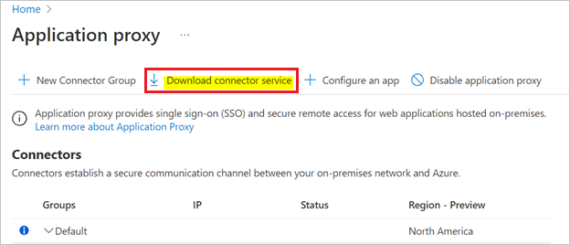
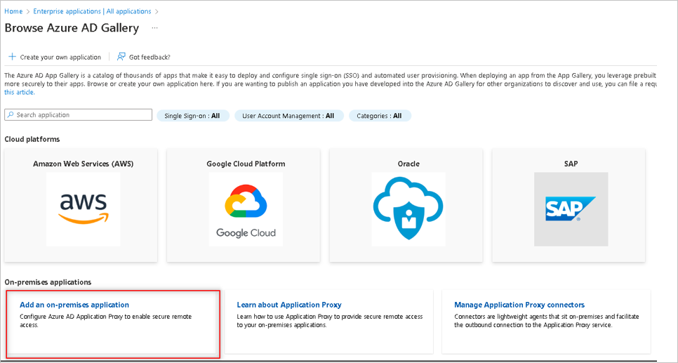
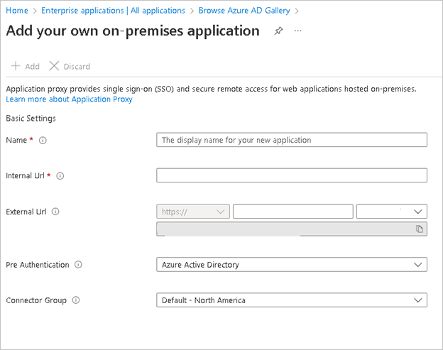

# Tutorial: App Proxy configuration for Microsoft Entra SAML SSO for Confluence

This article helps to configure Microsoft Entra SAML SSO for your on-premises Confluence application using Application Proxy.

## Prerequisites

To configure Microsoft Entra integration with Confluence SAML SSO by Microsoft, you need the following items:

- A Microsoft Entra subscription.
- Confluence server application installed on a Windows 64-bit server (on-premises or on the cloud IaaS infrastructure).
- Confluence server is HTTPS enabled.
- Note the supported versions for Confluence Plugin are mentioned in below section.
- Confluence server is reachable on internet particularly to Microsoft Entra Login page for authentication and should able to receive the token from Microsoft Entra ID.
- Admin credentials are set up in Confluence.
- WebSudo is disabled in Confluence.
- Test user created in the Confluence server application.

To get started, you need the following items:

* Do not use your production environment, unless it is necessary.
* A Microsoft Entra subscription. If you don't have a subscription, you can get a [free account](https://azure.microsoft.com/free/).
* Confluence SAML SSO by Microsoft single sign-on (SSO) enabled subscription.

## Supported versions of Confluence

As of now, following versions of Confluence are supported:

- Confluence: 5.0 to 5.10
- Confluence: 6.0.1 to 6.15.9
- Confluence: 7.0.1 to 7.17.0

> [!NOTE]
> Please note that our Confluence Plugin also works on Ubuntu Version 16.04

## Scenario description

In this tutorial, you configure and test Microsoft Entra SSO for on-premises confluence setup using application proxy mode.
1. Download and Install Microsoft Entra application proxy connector.
1. Add Application Proxy in Microsoft Entra ID.
1. Add a Confluence SAML SSO app in Microsoft Entra ID.
1. Configure SSO for SAML SSO Confluence Application in Microsoft Entra ID.
1. Create a Microsoft Entra test user.
1. Assigning the test user for the Confluence Microsoft Entra App.
1. Configure SSO for Confluence SAML SSO by Microsoft Confluence plugin in your Confluence Server.
1. Assigning the test user for the Microsoft Confluence plugin in your Confluence Server.
1. Test the SSO.

## Download and Install the App Proxy Connector Service

1. Sign in to the [Microsoft Entra admin center](https://entra.microsoft.com) as at least a [Application Administrator](../roles/permissions-reference.md#application-administrator).
1. Browse to **Identity** > **Applications** > **Enterprise applications** > **Application proxy**.
1. Select **Download connector service**.

    

1. Accept terms & conditions to download connector. Once downloaded, install it to the system, which hosts the confluence application.

## Add an On-premises Application in Microsoft Entra ID

To add an Application proxy, we need to create an enterprise application.

1. Sign in to the [Microsoft Entra admin center](https://entra.microsoft.com) as at least a [Application Administrator](../roles/permissions-reference.md#application-administrator).
1. Browse to **Identity** > **Applications** > **Enterprise applications** > **New application**.
1. Choose **Add an on-premises application**.

    

1. Type the name of the application and click the create button at the bottom left column.

    

    1.	**Internal URL** will be your Confluence application URL.
    2.	**External URL** will be auto-generated based on the Name you choose.
    3.	**Pre Authentication** can be left to Microsoft Entra ID as default.
    4.	Choose **Connector Group** which lists your connector agent under it as active.
    5.	Leave the **Additional Settings** as default.

1. Click on the **Save** from the top options to configure an application proxy.

## Add a Confluence SAML SSO app in Microsoft Entra ID

Now that you've prepared your environment and installed a connector, you're ready to add confluence applications to Microsoft Entra ID.

1. Sign in to the [Microsoft Entra admin center](https://entra.microsoft.com) as at least a [Application Administrator](../roles/permissions-reference.md#application-administrator).
1. Browse to **Identity** > **Applications** > **Enterprise applications** > **New application**.
1.	Select **Confluence SAML SSO by Microsoft** widget from the Microsoft Entra Gallery.

## Configure SSO for Confluence SAML SSO Application in Microsoft Entra ID

1. Sign in to the [Microsoft Entra admin center](https://entra.microsoft.com) as at least a [Application Administrator](../roles/permissions-reference.md#application-administrator).
1. Browse to **Identity** > **Applications** > **Enterprise applications**.
1. Open the **Confluence SAML SSO by Microsoft** > **Single sign-on**.
1. On the **Select a single sign-on method** page, select **SAML**.
1. On the **Set up single sign-on with SAML** page, click the pencil icon for **Basic SAML Configuration** to edit the settings.

    

1. On the Basic SAML Configuration section, enter the **External Url** value for the following fields: identifier, Reply URL, SignOn URL.

### Create a Microsoft Entra test user

In this section, you'll create a test user called B.Simon.

1. Sign in to the [Microsoft Entra admin center](https://entra.microsoft.com) as at least a [User Administrator](../roles/permissions-reference.md#user-administrator).
1. Browse to **Identity** > **Users** > **All users**.
1. Select **New user** > **Create new user**, at the top of the screen.
1. In the **User** properties, follow these steps:
   1. In the **Display name** field, enter `B.Simon`.  
   1. In the **User principal name** field, enter the username@companydomain.extension. For example, `B.Simon@contoso.com`.
   1. Select the **Show password** check box, and then write down the value that's displayed in the **Password** box.
   1. Select **Review + create**.
1. Select **Create**.

### Assigning the test user for the Confluence Microsoft Entra App

In this section, you'll enable B.Simon to use single sign-on by granting access to Confluence Microsoft Entra App.

1. Sign in to the [Microsoft Entra admin center](https://entra.microsoft.com) as at least a [Cloud Application Administrator](../roles/permissions-reference.md#cloud-application-administrator).
1. Browse to **Identity** > **Applications** > **Enterprise applications** > **Confluence SAML SSO by Microsoft**.
1. In the app's overview page, find the **Manage** section and select **Users and groups**.
1. Select **Add user/group**, then select **Users and groups** in the **Add Assignment** dialog.
1. In the **Users and groups** dialog, select **B.Simon** from the Users list, then click the **Select** button at the bottom of the screen.
1. In the **Add Assignment** dialog, click the **Assign** button. 

1. Verify the App Proxy setup by checking if the configured test user is able to SSO using the external URL mentioned in the on-premises application.

> [!NOTE]
> Complete the setup of the JIRA SAML SSO by Microsoft application by following [this](./jiramicrosoft-tutorial.md) tutorial.
