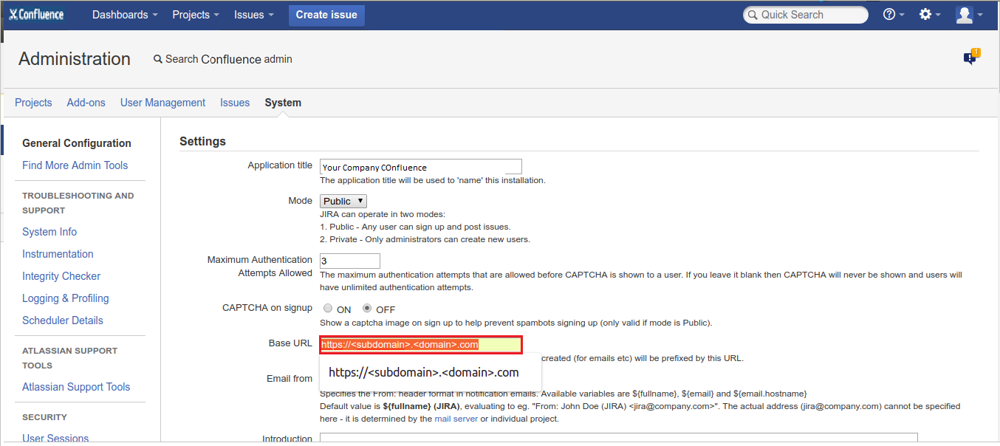
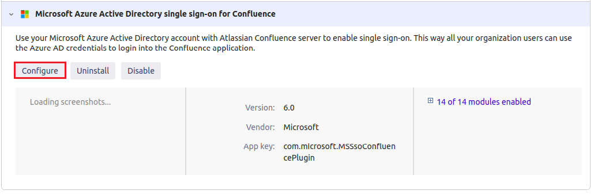
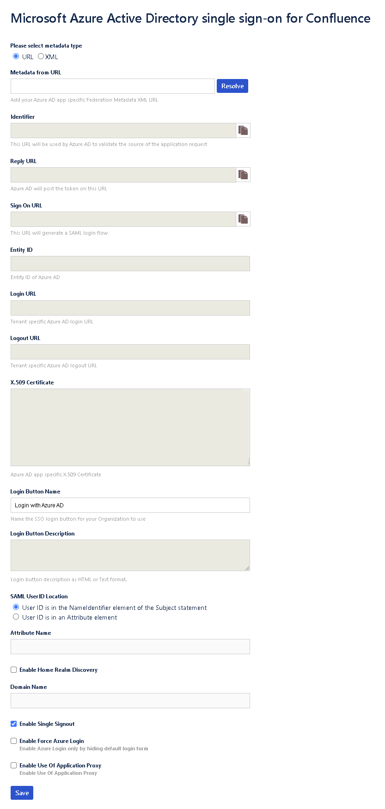
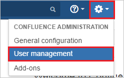

# Tutorial: Azure AD SSO integration with Confluence SAML SSO by Microsoft

In this tutorial, you'll learn how to integrate Confluence SAML SSO by Microsoft with Azure Active Directory (Azure AD). When you integrate Confluence SAML SSO by Microsoft with Azure AD, you can:

* Control in Azure AD who has access to Confluence SAML SSO by Microsoft.
* Enable your users to be automatically signed-in to Confluence SAML SSO by Microsoft with their Azure AD accounts.
* Manage your accounts in one central location - the Azure portal.

## Description:

Use your Microsoft Azure Active Directory account with Atlassian Confluence server to enable single sign-on. This way all your organization users can use the Azure AD credentials to sign in into the Confluence application. This plugin uses SAML 2.0 for federation.

## Prerequisites

To configure Azure AD integration with Confluence SAML SSO by Microsoft, you need the following items:

- An Azure AD subscription.
- Confluence server application installed on a Windows 64-bit server (on-premises or on the cloud IaaS infrastructure).
- Confluence server is HTTPS enabled.
- Note the supported versions for Confluence Plugin are mentioned in below section.
- Confluence server is reachable on internet particularly to Azure AD Login page for authentication and should able to receive the token from Azure AD.
- Admin credentials are set up in Confluence.
- WebSudo is disabled in Confluence.
- Test user created in the Confluence server application.

> [!NOTE]
> To test the steps in this tutorial, we do not recommend using a production environment of Confluence. Test the integration first in development or staging environment of the application and then use the production environment.

> [!NOTE]
> This integration is also available to use from Azure AD US Government Cloud environment. You can find this application in the Azure AD US Government Cloud Application Gallery and configure it in the same way as you do from public cloud.

To get started, you need the following items:

* Do not use your production environment, unless it is necessary.
* An Azure AD subscription. If you don't have a subscription, you can get a [free account](https://azure.microsoft.com/free/).
* Confluence SAML SSO by Microsoft single sign-on (SSO) enabled subscription.

> [!NOTE]
> For the information on application proxy configuration for Confluence, please refer [this](confluence-app-proxy-tutorial.md) tutorial.

## Supported versions of Confluence

As of now, following versions of Confluence are supported:

- Confluence: 5.0 to 5.10
- Confluence: 6.0.1 to 6.15.9
- Confluence: 7.0.1 to 8.0.4

> [!NOTE]
> Please note that our Confluence Plugin also works on Ubuntu Version 16.04

## Scenario description

In this tutorial, you configure and test Azure AD SSO in a test environment.

* Confluence SAML SSO by Microsoft supports **SP** initiated SSO.

## Adding Confluence SAML SSO by Microsoft from the gallery

To configure the integration of Confluence SAML SSO by Microsoft into Azure AD, you need to add Confluence SAML SSO by Microsoft from the gallery to your list of managed SaaS apps.

1. Sign in to the Azure portal using either a work or school account, or a personal Microsoft account.
1. On the left navigation pane, select the **Azure Active Directory** service.
1. Navigate to **Enterprise Applications** and then select **All Applications**.
1. To add new application, select **New application**.
1. In the **Add from the gallery** section, type **Confluence SAML SSO by Microsoft** in the search box.
1. Select **Confluence SAML SSO by Microsoft** from results panel and then add the app. Wait a few seconds while the app is added to your tenant.

 Alternatively, you can also use the [Enterprise App Configuration Wizard](https://portal.office.com/AdminPortal/home?Q=Docs#/azureadappintegration). In this wizard, you can add an application to your tenant, add users/groups to the app, assign roles, as well as walk through the SSO configuration as well. [Learn more about Microsoft 365 wizards.](/microsoft-365/admin/misc/azure-ad-setup-guides)

## Configure and test Azure AD SSO for Confluence SAML SSO by Microsoft

Configure and test Azure AD SSO with Confluence SAML SSO by Microsoft using a test user called **B.Simon**. For SSO to work, you need to establish a link relationship between an Azure AD user and the related user in Confluence SAML SSO by Microsoft.

To configure and test Azure AD SSO with Confluence SAML SSO by Microsoft, perform the following steps:

1. **[Configure Azure AD SSO](#configure-azure-ad-sso)** - to enable your users to use this feature.
    1. **[Create an Azure AD test user](#create-an-azure-ad-test-user)** - to test Azure AD single sign-on with B.Simon.
    1. **[Assign the Azure AD test user](#assign-the-azure-ad-test-user)** - to enable B.Simon to use Azure AD single sign-on.
1. **[Configure Confluence SAML SSO by Microsoft SSO](#configure-confluence-saml-sso-by-microsoft-sso)** - to configure the single sign-on settings on application side.
    1. **[Create Confluence SAML SSO by Microsoft test user](#create-confluence-saml-sso-by-microsoft-test-user)** - to have a counterpart of B.Simon in Confluence SAML SSO by Microsoft that is linked to the Azure AD representation of user.
1. **[Test SSO](#test-sso)** - to verify whether the configuration works.

## Configure Azure AD SSO

Follow these steps to enable Azure AD SSO in the Azure portal.

1. In the Azure portal, on the **Confluence SAML SSO by Microsoft** application integration page, find the **Manage** section and select **single sign-on**.
1. On the **Select a single sign-on method** page, select **SAML**.
1. On the **Set up single sign-on with SAML** page, click the pencil icon for **Basic SAML Configuration** to edit the settings.

   

1. On the **Basic SAML Configuration** section, perform the following steps:

    a. In the **Identifier** box, type a URL using the following pattern:
    `https://<DOMAIN:PORT>/`

    b. In the **Reply URL** text box, type a URL using the following pattern:
    `https://<DOMAIN:PORT>/plugins/servlet/saml/auth`
    
    c. In the **Sign-on URL** text box, type a URL using the following pattern:
    `https://<DOMAIN:PORT>/plugins/servlet/saml/auth`

    > [!NOTE]
    > These values are not real. Update these values with the actual Identifier, Reply URL, and Sign-on URL. Port is optional in case it’s a named URL. These values are received during the configuration of Confluence plugin, which is explained later in the tutorial.

1. On the **Set up single sign-on with SAML** page, In the **SAML Signing Certificate** section, click copy button to copy **App Federation Metadata Url** and save it on your computer.

    

### Create an Azure AD test user

In this section, you'll create a test user in the Azure portal called B.Simon.

1. From the left pane in the Azure portal, select **Azure Active Directory**, select **Users**, and then select **All users**.
1. Select **New user** at the top of the screen.
1. In the **User** properties, follow these steps:
   1. In the **Name** field, enter `B.Simon`.  
   1. In the **User name** field, enter the username@companydomain.extension. For example, `B.Simon@contoso.com`.
   1. Select the **Show password** check box, and then write down the value that's displayed in the **Password** box.
   1. Click **Create**.

### Assign the Azure AD test user

In this section, you'll enable B.Simon to use Azure single sign-on by granting access to Confluence SAML SSO by Microsoft.

1. In the Azure portal, select **Enterprise Applications**, and then select **All applications**.
1. In the applications list, select **Confluence SAML SSO by Microsoft**.
1. In the app's overview page, find the **Manage** section and select **Users and groups**.
1. Select **Add user**, then select **Users and groups** in the **Add Assignment** dialog.
1. In the **Users and groups** dialog, select **B.Simon** from the Users list, then click the **Select** button at the bottom of the screen.
1. If you are expecting a role to be assigned to the users, you can select it from the **Select a role** dropdown. If no role has been set up for this app, you see "Default Access" role selected.
1. In the **Add Assignment** dialog, click the **Assign** button.

## Configure Confluence SAML SSO by Microsoft SSO

1. In a different web browser window, sign in to your Confluence instance as an administrator.

1. Hover on cog and click the **Add-ons**.

    

1. Download the plugin from [Microsoft Download Center](https://www.microsoft.com/download/details.aspx?id=56503). Manually upload the plugin provided by Microsoft using **Upload add-on** menu. The download of plugin is covered under [Microsoft Service Agreement](https://www.microsoft.com/servicesagreement/).

    

1. For running the Confluence reverse proxy scenario or load balancer scenario perform the following steps:

    > [!NOTE]
    > You should be configuring the server first with the below instructions and then install the plugin.

    a. Add below attribute in **connector** port in **server.xml** file of JIRA server application.

    `scheme="https" proxyName="<subdomain.domain.com>" proxyPort="<proxy_port>" secure="true"`

    

    b. Change **Base URL** in **System Settings** according to proxy/load balancer.

    

1. Once the plugin is installed, it appears in **User Installed** add-ons section of **Manage Add-on** section. Click **Configure** to configure the new plugin.

    

1. Perform following steps on configuration page:

    

    > [!TIP]
    > Ensure that there is only one certificate mapped against the app so that there is no error in resolving the metadata. If there are multiple certificates, admin gets an error upon resolving the metadata.

    1. In the **Metadata URL** textbox, paste **App Federation Metadata Url** value which you have copied from the Azure portal and click the **Resolve** button. It reads the IdP metadata URL and populates all the fields information.

    1. Copy the **Identifier, Reply URL and Sign on URL** values and paste them in **Identifier, Reply URL and Sign on URL** textboxes respectively in **Basic SAML Configuration** section on Azure portal.

    1. In **Login Button Name** type the name of button your organization wants the users to see on login screen.

    1. In **Login Button Description** type the description of button your organization wants the users to see on login screen.

    1. In **SAML User ID Locations**, select either **User ID is in the NameIdentifier element of the Subject statement** or **User ID is in an Attribute element**.  This ID has to be the Confluence user ID. If the user ID is not matched, then system will not allow users to sign in. 

       > [!Note]
       > Default SAML User ID location is Name Identifier. You can change this to an attribute option and enter the appropriate attribute name.

    1. If you select **User ID is in an Attribute element** option, then in **Attribute name** textbox type the name of the attribute where User ID is expected. 

    1. If you are using the federated domain (like ADFS etc.) with Azure AD, then click on the **Enable Home Realm Discovery** option and configure the **Domain Name**.

    1. In **Domain Name** type the domain name here in case of the ADFS-based login.

    1. Check **Enable Single Sign out** if you wish to sign out from Azure AD when a user signs out from Confluence. 

    1. Enable **Force Azure Login** checkbox, if you wish to sign in through Azure AD credentials only.

       > [!Note]
       > To enable the default login form for admin login on the login page when the force azure login is enabled, add the query parameter in the browser URL.
       > `https://<DOMAIN:PORT>/login.action?force_azure_login=false`

    1. **Enable Use of Application Proxy** checkbox, if you have configured your on-premise atlassian application in an App Proxy setup. For App proxy setup , follow the steps on the [Azure AD App Proxy Documentation](../app-proxy/what-is-application-proxy.md).

    1. Click **Save** button to save the settings.

       > [!NOTE]
       > For more information about installation and troubleshooting, visit [MS Confluence SSO Connector Admin Guide](./ms-confluence-jira-plugin-adminguide.md). There is also an [FAQ](./ms-confluence-jira-plugin-adminguide.md) for your assistance.

### Create Confluence SAML SSO by Microsoft test user

To enable Azure AD users to sign in to Confluence on-premises server, they must be provisioned into Confluence SAML SSO by Microsoft. For Confluence SAML SSO by Microsoft, provisioning is a manual task.

**To provision a user account, perform the following steps:**

1. Sign in to your Confluence on-premises server as an administrator.

1. Hover on cog and click the **User management**.

    

1. Under Users section, click **Add users** tab. On the **Add a User** dialog page, perform the following steps:

    

    a. In the **Username** textbox, type the email of user like B.Simon.

    b. In the **Full Name** textbox, type the full name of user like B.Simon.

    c. In the **Email** textbox, type the email address of user like B.Simon@contoso.com.

    d. In the **Password** textbox, type the password for B.Simon.

    e. Click **Confirm Password** reenter the password.

    f. Click **Add** button.

## Test SSO 

In this section, you test your Azure AD single sign-on configuration with following options. 

* Click on **Test this application** in Azure portal. This will redirect to Confluence SAML SSO by Microsoft Sign-on URL where you can initiate the login flow. 

* Go to Confluence SAML SSO by Microsoft Sign-on URL directly and initiate the login flow from there.

* You can use Microsoft My Apps. When you click the Confluence SAML SSO by Microsoft tile in the My Apps, this will redirect to Confluence SAML SSO by Microsoft Sign-on URL. For more information about the My Apps, see [Introduction to the My Apps](https://support.microsoft.com/account-billing/sign-in-and-start-apps-from-the-my-apps-portal-2f3b1bae-0e5a-4a86-a33e-876fbd2a4510).

## Next steps

Once you configure Confluence SAML SSO by Microsoft you can enforce Session control, which protects exfiltration and infiltration of your organization’s sensitive data in real time. Session control extends from Conditional Access. [Learn how to enforce session control with Microsoft Defender for Cloud Apps](/cloud-app-security/proxy-deployment-aad).
