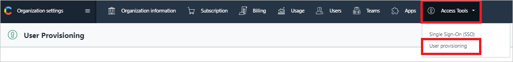
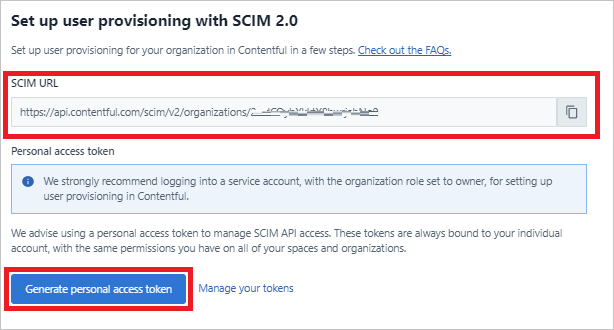
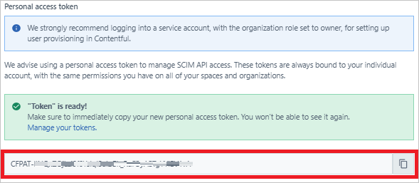

# Tutorial: Configure Contentful for automatic user provisioning

This tutorial describes the steps you need to perform in both Contentful and Azure Active Directory (Azure AD) to configure automatic user provisioning. When configured, Azure AD automatically provisions and deprovisions users and groups to [Contentful](https://www.contentful.com/) using the Azure AD Provisioning service. For important details on what this service does, how it works, and frequently asked questions, see [Automate user provisioning and deprovisioning to SaaS applications with Azure Active Directory](../app-provisioning/user-provisioning.md). 

## Capabilities supported

> [!div class="checklist"]
> * Create users in Contentful
> * Remove users in Contentful when they don't require access anymore
> * Keep user attributes synchronized between Azure AD and Contentful
> * Provision groups and group memberships in Contentful
> * [Single sign-on](contentful-tutorial.md) to Contentful (recommended)

## Prerequisites

The scenario outlined in this tutorial assumes that you already have the following prerequisites:

* [An Azure AD tenant](../develop/quickstart-create-new-tenant.md). 
* A user account in Azure AD with [permission](../roles/permissions-reference.md) to configure provisioning (for example, Application Administrator, Cloud Application administrator, Application Owner, or Global Administrator). 
* A Contentful organization account with a subscription that supports System for Cross-domain Identity Management (SCIM) provisioning. If you have questions about your organization's subscription, contact [Contentful support](mailto:support@contentful.com).
 
## Plan your provisioning deployment

1. Learn about [how the provisioning service works](../app-provisioning/user-provisioning.md).
2. Determine who will be in [scope for provisioning](../app-provisioning/define-conditional-rules-for-provisioning-user-accounts.md).
3. Determine what data to [map between Azure AD and Contentful](../app-provisioning/customize-application-attributes.md). 

## Configure Contentful to support provisioning with Azure AD

1. In Contentful, create a **Service User** account. All provisioning permissions for Azure will be provided through this account. We recommend that you choose **Owner** as the organization role for this account.

2. Log in to Contentful as the **Service User**.

3. Go to **Left Slider** > **Organization settings** > **Access Tools** > **User provisioning**.

   

4. Copy and save the **SCIM URL**. You'll enter this value on the **Provisioning** tab of your Contentful application in the Azure portal.

5. Select **Generate personal access token**.

    

6. In the modal window, enter a name for your Personal Access Token, and then select **Generate**.

7. The **SCIM URL** and the **Secret Token** are generated. Copy and save these values. You'll enter these values on the **Provisioning** tab of your Contentful application in the Azure portal.

    

If you have questions when you configure provisioning in the Contentful admin console, contact [Contentful Support](mailto:support@contentful.com).

## Add Contentful from the Azure AD application gallery

To manage provisioning to Contentful, add Contentful from the Azure AD application gallery. If you have previously set up Contentful for single sign-on, you can use the same application. However, we recommend that you create a separate app to initially test the integration. Learn how to [add an application in the gallery](../app-provisioning/add-gallery-app.md). 

## Define who will be in scope for provisioning 

You can use the Azure AD provisioning service to scope who will be provisioned based on assignment to the application and or based on attributes of the user or group. 

If you choose to scope who will be provisioned to your app based on assignment, complete the steps to [assign users and groups to the application](../app-provisioning/assign-user-or-group-access-portal.md).

If you choose to scope who will be provisioned based solely on attributes of the user or group, use a scoping filter to [define conditional rules for provisioning user accounts](../app-provisioning/define-conditional-rules-for-provisioning-user-accounts.md). 

* When you assign users and groups to Contentful, you must select a role other than **Default Access**. Users who have the Default Access role are excluded from provisioning and are indicated in the provisioning logs as not effectively entitled. If the only role available on the application is the Default Access role, you can [update the application manifest](../develop/howto-add-app-roles-in-azure-ad-apps.md) to add more roles. 

* Start small. Test with a small set of users and groups before you roll out to everyone. When provisioning scope is set to assigned users and groups, you can control the scope by assigning one or two users or groups to the app. When the scope is set to all users and groups, you can specify an [attribute-based scoping filter](../app-provisioning/define-conditional-rules-for-provisioning-user-accounts.md). 

## Configure automatic user provisioning to Contentful 

This section guides you through the steps to set up the Azure AD provisioning service to create, update, and disable users and groups in TestApp based on user or group assignments in Azure AD.

### Configure automatic user provisioning for Contentful in Azure AD

1. Sign in to the [Azure portal](https://portal.azure.com). Select **Enterprise Applications**, and then select **All applications**.

   [Enterprise applications blade](common/enterprise-applications.png)

2. In the applications list, select **Contentful**.

   

3. Select the **Provisioning** tab.

   

4. Set **Provisioning Mode** to **Automatic**.

   

5. In the **Admin Credentials** section, enter your Contentful tenant URL and secret token. To ensure that Azure AD can connect to Contentful, select **Test Connection**. If the connection fails, be sure that your Contentful account has Admin permissions, and then try again.

   

6. In **Notification Email**, enter the email address of a person or group who should receive the provisioning error notifications, and then select the **Send an email notification when a failure occurs** check box.

   

7. Select **Save**.

8. In the **Mappings** section, select **Synchronize Azure Active Directory Users to Contentful**.

9. In the **Attribute-Mapping** section, review the *user* attributes that are synchronized from Azure AD to Contentful. The attributes selected as **Matching** properties are used to match the user accounts in Contentful for update operations. If you choose to change the [matching target attribute](../app-provisioning/customize-application-attributes.md), you must ensure that the Contentful API supports filtering users based on that attribute. Select the **Save** button to commit any changes.

   |Attribute|Type|Supported for filtering|
   |---|---|---|
   |userName|String|&check;|
   |name.givenName|String|
   |name.familyName|String|

10. In the **Mappings** section, select **Synchronize Azure Active Directory Groups to Contentful**.

11. In the **Attribute-Mapping** section, review the *group* attributes that are synchronized from Azure AD to Contentful. The attributes selected as **Matching** properties are used to match the groups in Contentful for update operations. Select the **Save** button to commit any changes.

      |Attribute|Type|Supported for filtering|
      |---|---|---|
      |displayName|String|&check;|
      |members|Reference|

12. To set up scoping filters, complete the steps that are described in the [Scoping filter tutorial](../app-provisioning/define-conditional-rules-for-provisioning-user-accounts.md).

13. To enable the Azure AD provisioning service for Contentful, in the **Settings** section, change **Provisioning Status** to **On**.

    

14. To define the users or groups that you want to provision to Contentful, in the **Settings** section, select the relevant values in **Scope**.

    

15. When you're ready to provision, select **Save**.

    

This operation starts the initial synchronization cycle of all users and groups defined in **Scope** under **Settings**. The initial cycle takes longer to perform than subsequent cycles, which occur approximately every 40 minutes, as long as the Azure AD provisioning service is running. 

## Monitor your deployment

After you've configured provisioning, use the following resources to monitor your deployment:

* To determine which users have been provisioned successfully or unsuccessfully, view the [provisioning logs](../reports-monitoring/concept-provisioning-logs.md).
* To see the status of the provisioning cycle and how close it is to finishing, check the [progress bar](../app-provisioning/application-provisioning-when-will-provisioning-finish-specific-user.md).
* If the provisioning configuration seems to be in an unhealthy state, the application goes into quarantine. Learn more about [quarantine states](../app-provisioningapplication-provisioning-quarantine-status.md).  

## Next steps

* [Learn how to review logs and get reports on provisioning activity](../app-provisioning/check-status-user-account-provisioning.md)
* [Manage user account provisioning for Enterprise Apps](../app-provisioning/configure-automatic-user-provisioning-portal.md)
* [What is application access and single sign-on with Azure Active Directory?](../app-provisioning/what-is-single-sign-on.md)
