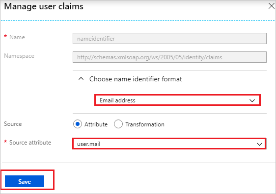

# Tutorial: Azure Active Directory single sign-on (SSO) integration with Coralogix

In this tutorial, you'll learn how to integrate Coralogix with Azure Active Directory (Azure AD). When you integrate Coralogix with Azure AD, you can:

* Control in Azure AD who has access to Coralogix.
* Enable your users to be automatically signed-in to Coralogix with their Azure AD accounts.
* Manage your accounts in one central location - the Azure portal.

To learn more about SaaS app integration with Azure AD, see [What is application access and single sign-on with Azure Active Directory](../manage-apps/what-is-single-sign-on.md).

## Prerequisites

To get started, you need the following items:

* An Azure AD subscription. If you don't have a subscription, you can get a [free account](https://azure.microsoft.com/free/).
* Coralogix single sign-on (SSO) enabled subscription.

## Scenario description

In this tutorial, you configure and test Azure AD SSO in a test environment.

* Coralogix supports **SP** initiated SSO

> [!NOTE]
> Identifier of this application is a fixed string value so only one instance can be configured in one tenant.

## Adding Coralogix from the gallery

To configure the integration of Coralogix into Azure AD, you need to add Coralogix from the gallery to your list of managed SaaS apps.

1. Sign in to the [Azure portal](https://portal.azure.com) using either a work or school account, or a personal Microsoft account.
1. On the left navigation pane, select the **Azure Active Directory** service.
1. Navigate to **Enterprise Applications** and then select **All Applications**.
1. To add new application, select **New application**.
1. In the **Add from the gallery** section, type **Coralogix** in the search box.
1. Select **Coralogix** from results panel and then add the app. Wait a few seconds while the app is added to your tenant.

 Alternatively, you can also use the [Enterprise App Configuration Wizard](https://portal.office.com/AdminPortal/home?Q=Docs#/azureadappintegration). In this wizard, you can add an application to your tenant, add users/groups to the app, assign roles, as well as walk through the SSO configuration as well. [Learn more about Microsoft 365 wizards.](/microsoft-365/admin/misc/azure-ad-setup-guides)

## Configure and test Azure AD single sign-on for Coralogix

Configure and test Azure AD SSO with Coralogix using a test user called **B.Simon**. For SSO to work, you need to establish a link relationship between an Azure AD user and the related user in Coralogix.

To configure and test Azure AD SSO with Coralogix, complete the following building blocks:

1. **[Configure Azure AD SSO](#configure-azure-ad-sso)** - to enable your users to use this feature.
    1. **[Create an Azure AD test user](#create-an-azure-ad-test-user)** - to test Azure AD single sign-on with B.Simon.
    1. **[Assign the Azure AD test user](#assign-the-azure-ad-test-user)** - to enable B.Simon to use Azure AD single sign-on.
1. **[Configure Coralogix SSO](#configure-coralogix-sso)** - to configure the single sign-on settings on application side.
    1. **[Create Coralogix test user](#create-coralogix-test-user)** - to have a counterpart of B.Simon in Coralogix that is linked to the Azure AD representation of user.
1. **[Test SSO](#test-sso)** - to verify whether the configuration works.

## Configure Azure AD SSO

Follow these steps to enable Azure AD SSO in the Azure portal.

1. In the [Azure portal](https://portal.azure.com/), on the **Coralogix** application integration page, find the **Manage** section and select **single sign-on**.
1. On the **Select a single sign-on method** page, select **SAML**.
1. On the **Set up single sign-on with SAML** page, click the edit/pen icon for **Basic SAML Configuration** to edit the settings.

   

1. On the **Basic SAML Configuration** section, enter the values for the following fields:

	a. In the **Sign on URL** box, enter a URL with the following pattern:
    `https://<SUBDOMAIN>.coralogix.com`

    b. In the **Identifier (Entity ID)** text box, enter a URL, such as:
	
	`https://api.coralogix.com/saml/metadata.xml`

	or

	`https://aws-client-prod.coralogix.com/saml/metadata.xml` 

	> [!NOTE]
	> The sign-on URL value isn't real. Update the value with the actual sign-on URL. Contact the [Coralogix Client support team](mailto:info@coralogix.com) to get the value. You can also refer to the patterns in the **Basic SAML Configuration** section in the Azure portal.

 1. The Coralogix application expects the SAML assertions in a specific format. Configure the following claims for this application. You can manage the values of these attributes from the **User Attributes** section on the application integration page. On the **Set up Single Sign-On with SAML** page, select the **Edit** button to open the **User Attributes** dialog box.

	

1. In the **User Claims** section in the **User Attributes** dialog box, edit the claims by using the **Edit** icon. You can also add the claims by using **Add new claim** to configure the SAML token attribute as shown in the previous image. Then take the following steps:
    
	a. Select the **Edit icon** to open the **Manage user claims** dialog box.

	
	

	b. From the **Choose name identifier format** list, select **Email address**.

	c. From the **Source attribute** list, select **user.mail**.

	d. Select **Save**.

1. On the **Set up single sign-on with SAML** page, in the **SAML Signing Certificate** section,  find **Federation Metadata XML** and select **Download** to download the certificate and save it on your computer.

	

1. On the **Set up Coralogix** section, copy the appropriate URL(s) based on your requirement.

	

### Create an Azure AD test user

In this section, you'll create a test user in the Azure portal called B.Simon.

1. From the left pane in the Azure portal, select **Azure Active Directory**, select **Users**, and then select **All users**.
1. Select **New user** at the top of the screen.
1. In the **User** properties, follow these steps:
   1. In the **Name** field, enter `B.Simon`.  
   1. In the **User name** field, enter the username@companydomain.extension. For example, `B.Simon@contoso.com`.
   1. Select the **Show password** check box, and then write down the value that's displayed in the **Password** box.
   1. Click **Create**.

### Assign the Azure AD test user

In this section, you'll enable B.Simon to use Azure single sign-on by granting access to Coralogix.

1. In the Azure portal, select **Enterprise Applications**, and then select **All applications**.
1. In the applications list, select **Coralogix**.
1. In the app's overview page, find the **Manage** section and select **Users and groups**.

   

1. Select **Add user**, then select **Users and groups** in the **Add Assignment** dialog.

	

1. In the **Users and groups** dialog, select **B.Simon** from the Users list, then click the **Select** button at the bottom of the screen.
1. If you're expecting any role value in the SAML assertion, in the **Select Role** dialog, select the appropriate role for the user from the list and then click the **Select** button at the bottom of the screen.
1. In the **Add Assignment** dialog, click the **Assign** button.

## Configure Coralogix SSO

To configure single sign-on on **Coralogix** side, you need to send the downloaded **Federation Metadata XML** and appropriate copied URLs from Azure portal to [Coralogix support team](mailto:info@coralogix.com). They set this setting to have the SAML SSO connection set properly on both sides.

### Create Coralogix test user

In this section, you create a user called Britta Simon in Coralogix. Work with [Coralogix support team](mailto:info@coralogix.com) to add the users in the Coralogix platform. Users must be created and activated before you use single sign-on.

## Test SSO 

In this section, you test your Azure AD single sign-on configuration using the Access Panel.

When you click the Coralogix tile in the Access Panel, you should be automatically signed in to the Coralogix for which you set up SSO. For more information about the Access Panel, see [Introduction to the Access Panel](https://support.microsoft.com/account-billing/sign-in-and-start-apps-from-the-my-apps-portal-2f3b1bae-0e5a-4a86-a33e-876fbd2a4510).

## Additional resources

- [ List of Tutorials on How to Integrate SaaS Apps with Azure Active Directory ](./tutorial-list.md)

- [What is application access and single sign-on with Azure Active Directory? ](../manage-apps/what-is-single-sign-on.md)

- [What is Conditional Access in Azure Active Directory?](../conditional-access/overview.md)
