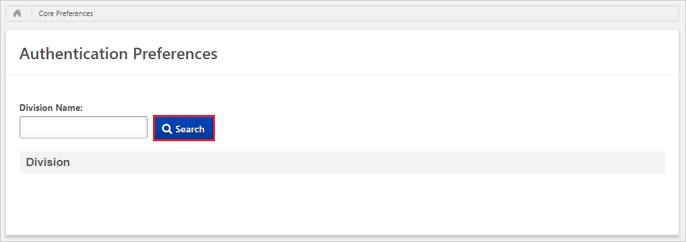
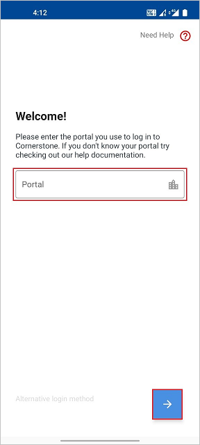
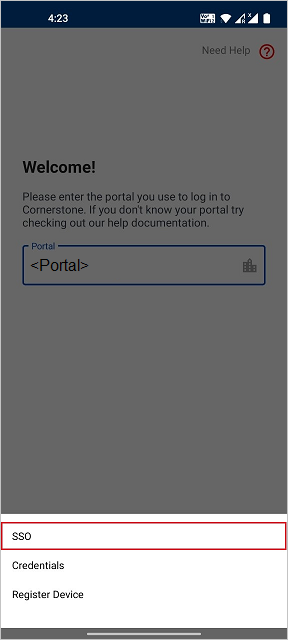
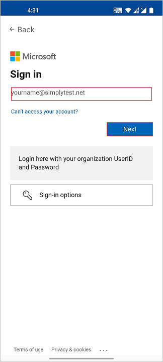
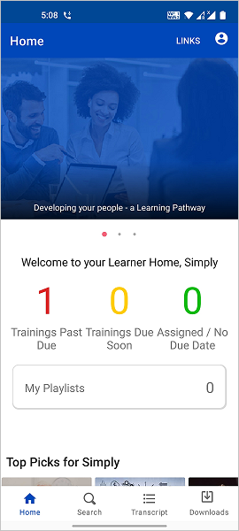

# Tutorial: Microsoft Entra Single sign-on (SSO) integration with Cornerstone

In this tutorial, you'll learn how to set up the single sign-on integration between Cornerstone and Microsoft Entra ID. When you integrate Cornerstone with Microsoft Entra ID, you can:

* Control in Microsoft Entra ID who has SSO access to Cornerstone.
* Enable your users to be automatically signed-in to Cornerstone with their Microsoft Entra accounts.
* Manage your accounts in one central location.

## Prerequisites

To get started, you need the following items:

* A Microsoft Entra subscription. If you don't have a subscription, you can get a [free account](https://azure.microsoft.com/free/).
* Enabled SSO in Cornerstone.

> [!NOTE]
> This integration is also available to use from Microsoft Entra US Government Cloud environment. You can find this application in the Microsoft Entra US Government Cloud Application Gallery and configure it in the same way as you do from public cloud.

## Scenario description

In this tutorial, you configure and test Microsoft Entra SSO in a test environment.

* Cornerstone supports **SP** initiated SSO.

* Cornerstone supports [Automated user provisioning](cornerstone-ondemand-provisioning-tutorial.md).

* If you are integrating one or multiple products from this particular list then you should use this Cornerstone Single Sign-On app from the Gallery.

    We offer solutions for :

    1. Recruiting
    2. Learning
    3. Development
    4. Content
    5. Performance
    6. Career
    7. HR

## Adding Cornerstone Single Sign-On from the gallery

To configure the Microsoft Entra SSO integration with Cornerstone, you need to...

1. Sign in to the [Microsoft Entra admin center](https://entra.microsoft.com) as at least a [Cloud Application Administrator](../roles/permissions-reference.md#cloud-application-administrator).
1. Browse to **Identity** > **Applications** > **Enterprise applications** > **New application**.
1. In the **Add from the gallery** section, type **Cornerstone Single Sign-On** in the search box.
1. Select **Cornerstone Single Sign-On** from results panel and then add the app. Wait a few seconds while the app is added to your tenant.

 Alternatively, you can also use the [Enterprise App Configuration Wizard](https://portal.office.com/AdminPortal/home?Q=Docs#/azureadappintegration). In this wizard, you can add an application to your tenant, add users/groups to the app, assign roles, as well as walk through the SSO configuration as well. [Learn more about Microsoft 365 wizards.](/microsoft-365/admin/misc/azure-ad-setup-guides)

## Configure and test Microsoft Entra SSO for Cornerstone

Configure and test Microsoft Entra SSO with Cornerstone using a test user called **B.Simon**. For SSO to work, you need to establish a link relationship between a Microsoft Entra user and the related user in Cornerstone.

To configure and test Microsoft Entra SSO with Cornerstone, perform the following steps:

1. **[Configure Microsoft Entra SSO](#configure-azure-ad-sso)** - to enable your users to use this feature.
    1. **[Create a Microsoft Entra test user](#create-an-azure-ad-test-user)** - to test Microsoft Entra single sign-on with B.Simon.
    1. **[Assign the Microsoft Entra test user](#assign-the-azure-ad-test-user)** - to enable B.Simon to use Microsoft Entra single sign-on.
2. **[Configure Cornerstone Single Sign-On](#configure-cornerstone-single-sign-on)** - to configure the SSO in Cornerstone.
    1. **[Create Cornerstone Single Sign-On test user](#create-cornerstone-single-sign-on-test-user)** - to have a counterpart of B.Simon in Cornerstone that is linked to the Microsoft Entra representation of user.
3. **[Test SSO](#test-sso)** - to verify whether the configuration works.
4. **[Test SSO for Cornerstone (Mobile)](#test-sso-for-cornerstone-mobile)** - to verify whether the configuration works.

## Configure Microsoft Entra SSO

Follow these steps to enable Microsoft Entra SSO.

1. Sign in to the [Microsoft Entra admin center](https://entra.microsoft.com) as at least a [Cloud Application Administrator](../roles/permissions-reference.md#cloud-application-administrator).
1. Browse to **Identity** > **Applications** > **Enterprise applications** > **Cornerstone Single Sign-On** application integration page, find the **Manage** section and select **Single sign-on**.
1. On the **Select a Single sign-on method** page, select **SAML**.
1. On the **Set up Single Sign-On with SAML** page, click the pencil icon for **Basic SAML Configuration** to edit the settings.

   

1. On the **Basic SAML Configuration** section, perform the following steps:

    a. In the **Identifier** text box, type a URL using the following pattern:
    `https://<PORTAL_NAME>.csod.com`

    b. In the **Reply URL** text box, type a URL using the following pattern:
    `https://<PORTAL_NAME>.csod.com/samldefault.aspx?ouid=<OUID>`

    c. In the **Sign on URL** text box, type a URL using the following pattern:
    `https://<PORTAL_NAME>.csod.com/samldefault.aspx?ouid=<OUID>`

    > [!NOTE]
    > These values are not real. Update these values with the actual Reply URL, Identifier and Sign on URL. Please reach out to your Cornerstone implementation project team to get these values. You can also refer to the patterns shown in the **Basic SAML Configuration** section.

4. On the **Set up Single Sign-On with SAML** page, in the **SAML Signing Certificate** section,  find **Certificate (Base64)** and select **Download** to download the certificate and save it on your computer.

    

1. On the **Set up Cornerstone Single Sign-On** section, copy the appropriate URL(s) based on your requirement.

    

### Create a Microsoft Entra test user

In this section, you'll create a test user called B.Simon.

1. Sign in to the [Microsoft Entra admin center](https://entra.microsoft.com) as at least a [User Administrator](../roles/permissions-reference.md#user-administrator).
1. Browse to **Identity** > **Users** > **All users**.
1. Select **New user** > **Create new user**, at the top of the screen.
1. In the **User** properties, follow these steps:
   1. In the **Display name** field, enter `B.Simon`.  
   1. In the **User principal name** field, enter the username@companydomain.extension. For example, `B.Simon@contoso.com`.
   1. Select the **Show password** check box, and then write down the value that's displayed in the **Password** box.
   1. Select **Review + create**.
1. Select **Create**.

### Assign the Microsoft Entra test user

In this section, you'll enable B.Simon to use single sign-on by granting access to Cornerstone.

1. Sign in to the [Microsoft Entra admin center](https://entra.microsoft.com) as at least a [Cloud Application Administrator](../roles/permissions-reference.md#cloud-application-administrator).
1. Browse to **Identity** > **Applications** > **Enterprise applications** > **Cornerstone Single Sign-On**.
1. In the app's overview page, select **Users and groups**.
1. Select **Add user/group**, then select **Users and groups** in the **Add Assignment** dialog.
   1. In the **Users and groups** dialog, select **B.Simon** from the Users list, then click the **Select** button at the bottom of the screen.
   1. If you are expecting a role to be assigned to the users, you can select it from the **Select a role** dropdown. If no role has been set up for this app, you see "Default Access" role selected.
   1. In the **Add Assignment** dialog, click the **Assign** button.

## Configure Cornerstone Single Sign-On

To configure SSO in Cornerstone, you need to reach out to your Cornerstone implementation project team. They set this setting to have the SAML SSO connection set properly on both sides.

### Create Cornerstone Single Sign-On test user

In this section, you create a user called Britta Simon in Cornerstone. Please work with your Cornerstone implementation project team to add the users in Cornerstone. Users must be created and activated before you use single sign-on.

Cornerstone Single Sign-On also supports automatic user provisioning, you can find more details [here](./cornerstone-ondemand-provisioning-tutorial.md) on how to configure automatic user provisioning.

## Test SSO 

In this section, you test your Microsoft Entra single sign-on configuration with following options. 

* Click on **Test this application**, this will redirect to Cornerstone Sign-on URL where you can initiate the login flow. 

* Go to Cornerstone Sign-on URL directly and initiate the login flow from there.

* You can use Microsoft My Apps. When you click the Cornerstone Single Sign-On tile in the My Apps, this will redirect to Cornerstone Sign-on URL. For more information about the My Apps, see [Introduction to the My Apps](https://support.microsoft.com/account-billing/sign-in-and-start-apps-from-the-my-apps-portal-2f3b1bae-0e5a-4a86-a33e-876fbd2a4510).

## Test SSO for Cornerstone (Mobile)

1. In a different browser window, log in to your Cornerstone website as an administrator and perform the following steps.

    a. Go to the **Admin -> Tools -> CORE FUNCTIONS -> Core Preferences -> Authentication Preferences**.

    

    b. Search the **Division Name** by giving the Division Name in the search box.

    c. Click the **Division Name** in the results.

    d. From the SAML/IDP server URL dropdown, select the appropriate SAML/IDP server that should be used for user Authentication.

    

    e. Click **Save**.

1. Go to **Admin > Tools > Core Functions > Core Preferences > Mobile**.

    a. Select the appropriate **Division OU**.

    b. Select **Allow users** in this OU to access the Cornerstone Learn app on their mobile and tablet device and checkbox in Enable Mobile Access.

    c. Click **Save**.

2. Open **Cornerstone Learn** mobile application. On the sign in page, enter the portal name.

    

3. Click **Alternative Login** and then click **SSO**.

    

4. .  Enter your **Microsoft Entra credentials** to sign into the Cornerstone application and click **Next**.

    

5. Finally after successful sign in, the application homepage will be displayed as shown below.

    

## Next steps

Once you configure Cornerstone Single Sign-On you can enforce Session control, which protects exfiltration and infiltration of your organization’s sensitive data in real time. Session control extends from Conditional Access. [Learn how to enforce session control with Microsoft Defender for Cloud Apps](/cloud-app-security/proxy-deployment-aad).
