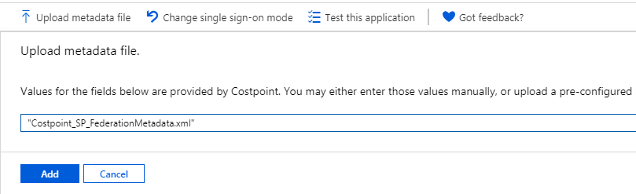
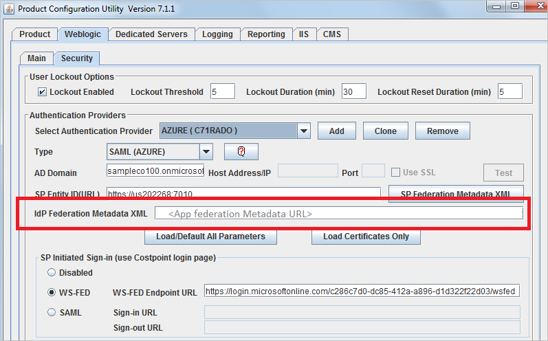
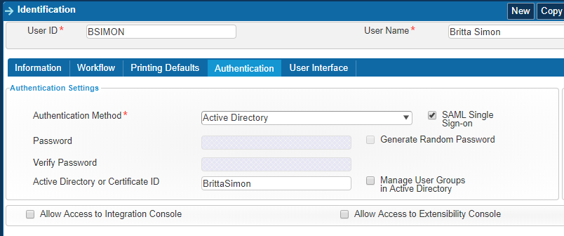

# Tutorial: Integrate Costpoint with Azure Active Directory

In this tutorial, you'll learn how to integrate Costpoint with Azure Active Directory (Azure AD). When you integrate Costpoint with Azure AD, you can:

* Control in Azure AD who has access to Costpoint.
* Enable your users to be automatically signed-in to Costpoint with their Azure AD accounts.
* Manage your accounts in one central location - the Azure portal.

## Prerequisites

To get started, you need the following items:

* An Azure AD subscription. If you don't have a subscription, you can get a [free account](https://azure.microsoft.com/free/).
* Costpoint single sign-on (SSO) enabled subscription.

## Scenario description

In this tutorial, you will configure and test Azure AD SSO in a test environment. 

* Costpoint supports **SP and IDP** initiated SSO.

## Generate Costpoint metadata

Costpoint SAML SSO configuration is explained in the **DeltekCostpoint711Security.pdf** guide. Download this guide from the Deltek Costpoint support site and refer to the **SAML Single Sign-on Setup** > **Configure SAML Single Sign-on between Costpoint and Microsoft Azure** section. Follow the instructions and generate a **Costpoint SP Federation Metadata XML** file. 

## Add Costpoint from the gallery

To configure the integration of Costpoint into Azure AD, you need to add Costpoint from the gallery to your list of managed SaaS apps.

1. Sign in to the Azure portal using either a work or school account, or a personal Microsoft account.
1. On the left navigation pane, select the **Azure Active Directory** service.
1. Navigate to **Enterprise Applications** and then select **All Applications**.
1. To add new application, select **New application**.
1. In the **Add from the gallery** section, type **Costpoint** in the search box.
1. Select **Costpoint** from results panel and then add the app. Wait a few seconds while the app is added to your tenant.

 Alternatively, you can also use the [Enterprise App Configuration Wizard](https://portal.office.com/AdminPortal/home?Q=Docs#/azureadappintegration). In this wizard, you can add an application to your tenant, add users/groups to the app, assign roles, as well as walk through the SSO configuration as well. [Learn more about Microsoft 365 wizards.](/microsoft-365/admin/misc/azure-ad-setup-guides)

## Configure and test Azure AD SSO for Costpoint

Configure and test Azure AD SSO with Costpoint using a test user called **B.Simon**. For SSO to work, you need to establish a link relationship between an Azure AD user and the related user in Costpoint.

To configure and test Azure AD SSO with Costpoint, perform the following steps:

1. **[Configure Azure AD SSO](#configure-azure-ad-sso)** - to enable your users to use this feature.
    1. **[Create an Azure AD test user](#create-an-azure-ad-test-user)** - to test Azure AD single sign-on with B.Simon.
    1. **[Assign the Azure AD test user](#assign-the-azure-ad-test-user)** - to enable B.Simon to use Azure AD single sign-on.
1. **[Configure Costpoint SSO](#configure-costpoint-sso)** - to configure the single sign-on settings on application side.
    1. **[Create Costpoint test user](#create-costpoint-test-user)** - to have a counterpart of B.Simon in Costpoint that is linked to the Azure AD representation of user.
1. **[Test SSO](#test-sso)** - to verify whether the configuration works.

## Configure Azure AD SSO

Follow these steps to enable Azure AD SSO in the Azure portal:

1. On the **Costpoint** application integration page, select **Single sign-on**.

1. In the **Basic SAML Configuration** section, if you have the **Service Provider metadata file**, complete these steps:

   > [!NOTE]
   > You get the Service Provider metadata file in [Generate Costpoint metadata](#generate-costpoint-metadata). How to use the file is explained later in the tutorial.
 
   1. Select the **Upload metadata file** button, then select the **Costpoint SP Federation Metadata XML** file previously generated by Costpoint, and then select the **Add** button to upload the file.

      
	
   1. When the metadata file is successfully uploaded, the **Identifier** and **Reply URL** values are auto populated in the Costpoint section.

      > [!NOTE]
      > If the **Identifier** and **Reply URL** values are not auto polulated, enter the values manually according to your requirement. Verify that **Identifier (Entity ID)** and **Reply URL (Assertion Consumer Service URL)** are correctly set, and that **ACS URL** is a valid Costpoint URL that ends with **/LoginServlet.cps**.

   1. Select **Set additional URLs**. For **Relay State**, enter a value using the following pattern:`system=[your system]` (for example, **system=DELTEKCP**).

1. On the **Set up Single Sign-On with SAML** page, in the **SAML Signing Certificate** section, select the **Copy** icon to copy the **App Federation Metadata Url** and save it to Notepad.

   

### Create an Azure AD test user

In this section, you'll create a test user in the Azure portal called B.Simon.

1. From the left pane in the Azure portal, select **Azure Active Directory**, select **Users**, and then select **All users**.
1. Select **New user** at the top of the screen.
1. In the **User** properties, follow these steps:
   1. In the **Name** field, enter `B.Simon`.  
   1. In the **User name** field, enter the username@companydomain.extension. For example, `B.Simon@contoso.com`.
   1. Select the **Show password** check box, and then write down the value that's displayed in the **Password** box.
   1. Click **Create**.

### Assign the Azure AD test user

In this section, you'll enable B.Simon to use Azure single sign-on by granting access to Costpoint.

1. In the Azure portal, select **Enterprise Applications**, and then select **All applications**.
1. In the applications list, select **Costpoint**.
1. In the app's overview page, find the **Manage** section and select **Users and groups**.
1. Select **Add user**, then select **Users and groups** in the **Add Assignment** dialog.
1. In the **Users and groups** dialog, select **B.Simon** from the Users list, then click the **Select** button at the bottom of the screen.
1. If you are expecting a role to be assigned to the users, you can select it from the **Select a role** dropdown. If no role has been set up for this app, you see "Default Access" role selected.
1. In the **Add Assignment** dialog, click the **Assign** button.

## Configure Costpoint SSO

1. Return to Costpoint Configuration Utility. In the **IdP Federation Metadata XML** text box, paste the contents of the *App Federation Metadata Url* file. 

   

1. Continue the instructions from the **DeltekCostpoint711Security.pdf** guide to finish the Costpoint SAML setup.

### Create Costpoint test user

In this section, you create a user in Costpoint. Assume the user ID is **B.SIMON** and the user's name is **B.Simon**. Work with the [Costpoint Client support team](https://www.deltek.com/about/contact-us) to add the user in the Costpoint platform. The user must be created and activated before they can use single sign-on.

After the user is created, the user's **Authentication Method** selection must be **Active Directory**, the **SAML Single Sign-on** check box must be selected, and the user name from Azure Active Directory must be **Active Directory or Certificate ID** (shown in the following screenshot).

## Test SSO

In this section, you test your Azure AD single sign-on configuration with following options. 

#### SP initiated:

* Click on **Test this application** in Azure portal. This will redirect to Costpoint Sign on URL where you can initiate the login flow.  

* Go to Costpoint Sign-on URL directly and initiate the login flow from there.

#### IDP initiated:

* Click on **Test this application** in Azure portal and you should be automatically signed in to the Costpoint for which you set up the SSO. 

You can also use Microsoft My Apps to test the application in any mode. When you click the Costpoint tile in the My Apps, if configured in SP mode you would be redirected to the application sign on page for initiating the login flow and if configured in IDP mode, you should be automatically signed in to the Costpoint for which you set up the SSO. For more information about the My Apps, see [Introduction to the My Apps](https://support.microsoft.com/account-billing/sign-in-and-start-apps-from-the-my-apps-portal-2f3b1bae-0e5a-4a86-a33e-876fbd2a4510).

## Next steps

Once you configure Costpoint you can enforce session control, which protects exfiltration and infiltration of your organization’s sensitive data in real time. Session control extends from Conditional Access. [Learn how to enforce session control with Microsoft Defender for Cloud Apps](/cloud-app-security/proxy-deployment-any-app).
