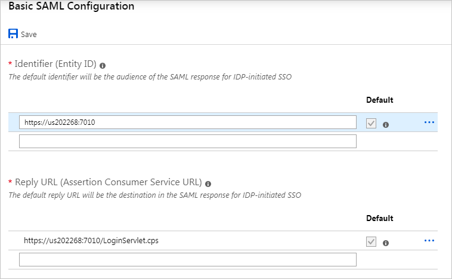
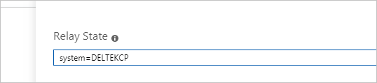

# Tutorial: Integrate Costpoint with Azure Active Directory

In this tutorial, you'll learn how to integrate Costpoint with Azure Active Directory (Azure AD). When you integrate Costpoint with Azure AD, you can:

* Control in Azure AD who has access to Costpoint.
* Enable your users to be automatically signed-in to Costpoint with their Azure AD accounts.
* Manage your accounts in one central location - the Azure portal.

To learn more about SaaS app integration with Azure AD, see [What is application access and single sign-on with Azure Active Directory](https://docs.microsoft.com/azure/active-directory/active-directory-appssoaccess-whatis).

## Prerequisites

To get started, you need the following items:

* An Azure AD subscription. If you don't have a subscription, you can get a [free account](https://azure.microsoft.com/free/).
* Costpoint single sign-on (SSO) enabled subscription.

## Scenario description

In this tutorial, you configure and test Azure AD SSO in a test environment. Costpoint supports **SP and IDP** initiated SSO.

## Generate Costpoint Metadata

Costpoint SAML SSO configuration is explained in **DeltekCostpoint711Security.pdf** manual. Download this document from Deltek Costpoint support site and refer to **SAML Single Sign-on Setup -> Configure SAML Single Sign-on between Costpoint and Microsoft Azure** section. Follow the instructions and generate **Costpoint SP Federation Metadata XML** file. 

## Adding Costpoint from the gallery

To configure the integration of Costpoint into Azure AD, you need to add Costpoint from the gallery to your list of managed SaaS apps.

1. Sign in to the [Azure portal](https://portal.azure.com) using either a work or school account, or a personal Microsoft account.

1. On the left navigation pane, select the **Azure Active Directory** service.

	

1. Navigate to **Enterprise Applications** and then select the **All Applications** option.

	

1. To add new application, select **New application**.

	

1. In the **Add from the gallery** section, type **Costpoint** in the search box.

	

1. Select **Costpoint** from results panel and then add the app. Wait a few seconds while the app is added to your tenant.

## Configure and test Azure AD single sign-on

Configure and test Azure AD SSO with Costpoint using a test user named **Britta Simon**. For SSO to work, you need to establish a link relationship between an Azure AD user and the related user in Costpoint.

To configure and test Azure AD SSO with Costpoint, complete the following building blocks:

1. **[Configure Azure AD SSO](#configure-azure-ad-sso)** to enable your users to use this feature.
1. **[Configure Costpoint](#configure-costpoint)** to configure the SAML SSO settings on application side.
1. **[Create an Azure AD test user](#create-an-azure-ad-test-user)** to test Azure AD single sign-on with Britta Simon.
1. **[Assign the Azure AD test user](#assign-the-azure-ad-test-user)** to enable Britta Simon to use Azure AD single sign-on.
1. **[Create Costpoint test user](#create-costpoint-test-user)** to have a counterpart of Britta Simon in Costpoint that is linked to the Azure AD representation of user.
1. **[Test SSO](#test-sso)** to verify whether the configuration works.

### Configure Azure AD SSO

Follow these steps to enable Azure AD SSO in the Azure portal.

1. On the **Costpoint** application integration page, select **Single sign-on**.

	

1. On the **Select a Single sign-on method** dialog, select **SAML** mode to enable single sign-on.

	

1. Click the **Upload metadata file** button at the top, and select Costpoint SP Federation Metadata XML file previously generated by Costpoint. Click the Add button to upload the file.

	

1. If **Basic SAML Configuration** dialog is not already opened, click the **Edit** icon to open it.

	

1. Verify that **Identifier (Entity ID)** and **Reply URL (Assertion Consumer Service URL)** are correctly set and that **ACS URL** is a valid Costpoint URL ending with **/LoginServlet.cps**.

	

1. In the **Relay State** text box, type a value using the following pattern: **system=[your system]**, e.g. **system=DELTEKCP**

	

1.	On the **Set up Single Sign-On with SAML** page, in the **SAML Signing Certificate** section, click copy button to copy **App Federation Metadata Url** and save it on your Notepad.

	

### Configure Costpoint

1. Return to **Costpoint Configuration Utility** and copy **App Federation Metadata Url** into **IdP Federation Metadata XML** text box. Continue the instructions from **DeltekCostpoint711Security.pdf** manual and finish Costpoint SAML setup.

	

### Create an Azure AD test user

The objective of this section is to create a test user in the Azure portal named Britta Simon.

1. In the Azure portal, in the left pane, select **Azure Active Directory**, select **Users**, and then select **All users**.

    

1. Select **New user** at the top of the screen.

    

1. In the User properties, perform the following steps.

    

    1. In the **Name** field enter **BrittaSimon**.
  
    1. In the **User name** field type `brittasimon\@yourcompanydomain.extension`. For example, BrittaSimon@contoso.com.

    1. Select **Show password** check box, and then write down the value that's displayed in the Password box.

    1. Click **Create**.

### Assign the Azure AD test user

In this section, you'll enable Britta Simon to use Azure single sign-on by granting access to Costpoint.

1. In the Azure portal, select **Enterprise Applications**, and then select **All applications**.
1. In the applications list, select **Costpoint**.
1. In the app's overview page, find the **Manage** section and select **Users and groups**.

	

1. Select **Add user**, then select **Users and groups** in the **Add Assignment** dialog.

	

1. In the **Users and groups** dialog, select **Britta Simon** from the Users list, then click the **Select** button at the bottom of the screen.
1. If you're expecting any role value in the SAML assertion, in the **Select Role** dialog, select the appropriate role for the user from the list and then click the **Select** button at the bottom of the screen.
1. In the **Add Assignment** dialog, click the **Assign** button.

### Create Costpoint test user

In this section, you create a user in Costpoint. Lets say user id is BSIMON and name Britta Simon. Work with [Costpoint Client support team](https://www.deltek.com/about/contact-us) to add the users in the Costpoint platform. Users must be created and activated before you use single sign-on. 
Once created, user's Authentication selection must list **Single Sign-on or Active Directory** as **Authentication method**, checked **SAML Single Sign-on** option and user name from Azure as **Active Directory or Certificate ID**.

### Test SSO

When you select the Costpoint tile in the Access Panel, you should be automatically signed in to the Costpoint for which you set up SSO. For more information about the Access Panel, see [Introduction to the Access Panel](https://docs.microsoft.com/azure/active-directory/active-directory-saas-access-panel-introduction).

## Additional Resources

- [List of Tutorials on How to Integrate SaaS Apps with Azure Active Directory](https://docs.microsoft.com/azure/active-directory/active-directory-saas-tutorial-list)

- [What is application access and single sign-on with Azure Active Directory?](https://docs.microsoft.com/azure/active-directory/active-directory-appssoaccess-whatis)

- [What is conditional access in Azure Active Directory?](https://docs.microsoft.com/azure/active-directory/conditional-access/overview)
