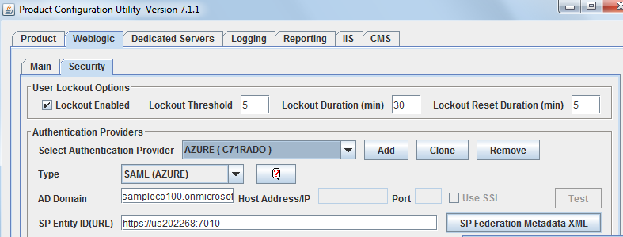
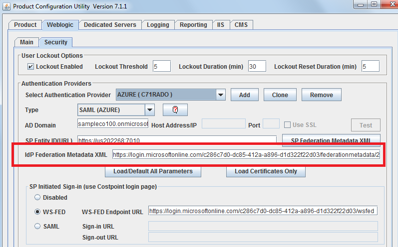

# Tutorial: Integrate Costpoint with Azure Active Directory

In this tutorial, you'll learn how to integrate Costpoint with Azure Active Directory (Azure AD). When you integrate Costpoint with Azure AD, you can:

* Control in Azure AD who has access to Costpoint.
* Enable your users to be automatically signed-in to Costpoint with their Azure AD accounts.
* Manage your accounts in one central location - the Azure portal.

To learn more about SaaS app integration with Azure AD, see [What is application access and single sign-on with Azure Active Directory](https://docs.microsoft.com/azure/active-directory/active-directory-appssoaccess-whatis).

## Prerequisites

To get started, you need the following items:

* An Azure AD subscription. If you don't have a subscription, you can get a [free account](https://azure.microsoft.com/free/).
* A Costpoint single sign-on (SSO) enabled subscription.

## Scenario description

In this tutorial, you will configure and test Azure AD SSO in a test environment. Costpoint supports **SP and IDP** initiated SSO.

## Generate Costpoint metadata

Costpoint SAML SSO configuration is explained in the **DeltekCostpoint711Security.pdf** guide. Download this guide from the Deltek Costpoint support site and refer to the **SAML Single Sign-on Setup** > **Configure SAML Single Sign-on between Costpoint and Microsoft Azure** section. Follow the instructions and generate a **Costpoint SP Federation Metadata XML** file. 

## Add Costpoint from the gallery

To integrate Costpoint with Azure AD, first add Costpoint to your list of managed SaaS apps from the gallery in the Azure portal:

1. Sign in to the [Azure portal](https://portal.azure.com) using either a work or school account, or a personal Microsoft account.

1. In the left navigation pane, select the **Azure Active Directory** service.

   

1. Select **Enterprise Applications** > **All Applications**.

   

1. To add a new application, select **New application**.

   

1. In the **Add from the gallery** section, enter **Costpoint** in the search box.

   

1. In the results list, select **Costpoint**, and then add the app. Wait a few seconds while the app is added to your tenant.

## Configure and test Azure AD single sgn-on

Configure and test Azure AD SSO with Costpoint by using a test user named **B.Simon**. For SSO to work, you need to establish a link relationship between an Azure AD user and the related user in Costpoint.

To configure and test Azure AD SSO with Costpoint, complete the following building blocks:

1. **[Configure Azure AD SSO](#configure-azure-ad-sso)** to enable your users to use this feature.
1. **[Configure Costpoint](#configure-costpoint)** to configure the SAML SSO settings on application side.
1. **[Create an Azure AD test user](#create-an-azure-ad-test-user)** to test Azure AD single sign-on with B.Simon.
1. **[Assign the Azure AD test user](#assign-the-azure-ad-test-user)** to enable B.Simon to use Azure AD single sign-on.
1. **[Create a Costpoint test user](#create-a-costpoint-test-user)** to have a counterpart of B.Simon in Costpoint that is linked to the Azure AD representation of user.
1. **[Test SSO](#test-sso)** to verify whether the configuration works.

### Configure Azure AD SSO

Follow these steps to enable Azure AD SSO in the Azure portal:

1. On the **Costpoint** application integration page, select **Single sign-on**.

   

1. In the **Basic SAML Configuration** section, if you have the *Service Provider metadata file*, complete these steps:

   > [!NOTE]
   > You get the Service Provider metadata file in [Generate Costpoint metadata](#generate-costpoint-metadata). How to use the file is explained later in the tutorial.
 
   1. Select the **Upload metadata file** button, then select the **Costpoint SP Federation Metadata XML** file previously generated by Costpoint, and then select the **Add** button to upload the file.

      
	
   1. When the metadata file is successfully uploaded, the **Identifier** and **Reply URL** values are auto populated in the Costpoint section.

      > [!NOTE]
      > If the **Identifier** and **Reply URL** values are not auto polulated, enter the values manually according to your requirement. Verify that **Identifier (Entity ID)** and **Reply URL (Assertion Consumer Service URL)** are correctly set, and that **ACS URL** is a valid Costpoint URL that ends with **/LoginServlet.cps**.

   1. Select **Set additional URLs**. For **Relay State**, enter a value using the following pattern:`system=[your system]` (for example, **system=DELTEKCP**).

1. On the **Set up Single Sign-On with SAML** page, in the **SAML Signing Certificate** section, select the **Copy** icon to copy the **App Federation Metadata Url** and save it to Notepad.

   

### Configure Costpoint

1. Return to Costpoint Configuration Utility. In the **IdP Federation Metadata XML** text box, paste the contents of the *App Federation Metadata Url* file. 

   

1. Continue the instructions from the **DeltekCostpoint711Security.pdf** guide to finish the Costpoint SAML setup.

### Create an Azure AD test user

The objective of this section is to create a test user in the Azure portal named B.Simon.

1. In the Azure portal, in the left pane, select **Azure Active Directory** > **Users** > **All users**.

   

1. Select **New user**.

   

1. In the **User** properties, complete these steps:

   

   1. In the **Name** field, enter **B.Simon**.
   
   1. In the **User name** field, enter `b.simon\@yourcompanydomain.extension` (for example, B.Simon@contoso.com).
   
   1. Select the **Show Password** check box, and then write down the value that's displayed in the **Password** field.
   
   1. Select **Create**.

### Assign the Azure AD test user

In this section, you enable B.Simon to use Azure single sign-on by granting B.Simon access to Costpoint.

1. In the Azure portal, select **Enterprise Applications** > **All applications**.

1. In the applications list, select **Costpoint**.

1. In the **Manage** section of the app's overview page, select **Users and groups**.

   

1. Select **Add user**. In the **Add Assignment** dialog box, select **Users and groups**.

   

1. In the **Users and groups** dialog box, In the **Users** list, select **B.Simon**. Then, choose **Select**.

1. If you're expecting any role value in the SAML assertion, in the **Select Role** dialog box, select the appropriate role for the user from the list, and then choose **Select**.

1. In the **Add Assignment** dialog box, select **Assign**.

### Create a Costpoint test user

In this section, you create a user in Costpoint. Assume the user id is **B.SIMON** and the user's name is **B.Simon**. Work with the [Costpoint Client support team](https://www.deltek.com/about/contact-us) to add the user in the Costpoint platform. The user must be created and activated before they can use single sign-on.

After the user is created, the user's **Authentication Method** selection must be **Active Directory**, the **SAML Single Sign-on** check box must be selected, and the user name from Azure Active Directory must be **Active Directory or Certificate ID** (shown in the following screenshot).

### Test SSO

When you select the Costpoint tile in the Access Panel, you should be automatically signed in to the Costpoint application because you set up SSO. For more information about the Access Panel, see [Introduction to the Access Panel](https://docs.microsoft.com/azure/active-directory/active-directory-saas-access-panel-introduction).

## Additional resources

- [List of tutorials to integrate SaaS apps with Azure Active Directory](https://docs.microsoft.com/azure/active-directory/active-directory-saas-tutorial-list)

- [What is application access and single sign-on with Azure Active Directory?](https://docs.microsoft.com/azure/active-directory/active-directory-appssoaccess-whatis)

- [What is conditional access in Azure Active Directory?](https://docs.microsoft.com/azure/active-directory/conditional-access/overview)
