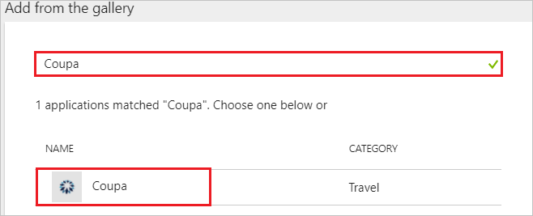
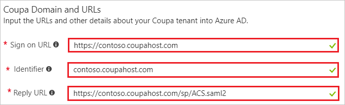
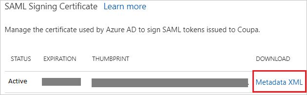
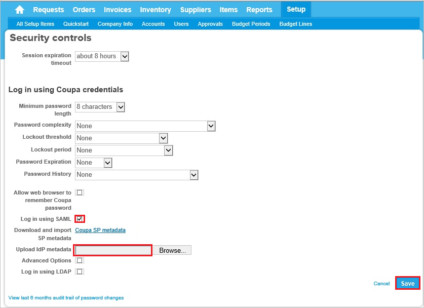
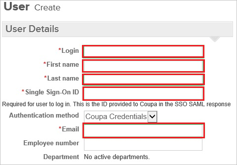

---
title: 'Tutorial: Azure Active Directory integration with Coupa | Microsoft Docs'
description: Learn how to configure single sign-on between Azure Active Directory and Coupa.
services: active-directory
documentationCenter: na
author: jeevansd
manager: femila
ms.reviewer: joflore

ms.assetid: 47f27746-9057-4b9c-991e-3abf77710f73
ms.service: active-directory
ms.component: saas-app-tutorial
ms.workload: identity
ms.tgt_pltfrm: na
ms.devlang: na
ms.topic: article
ms.date: 06/28/2018
ms.author: jeedes

---
# Tutorial: Azure Active Directory integration with Coupa

In this tutorial, you learn how to integrate Coupa with Azure Active Directory (Azure AD).

Integrating Coupa with Azure AD provides you with the following benefits:

- You can control in Azure AD who has access to Coupa.
- You can enable your users to automatically get signed-on to Coupa (Single Sign-On) with their Azure AD accounts.
- You can manage your accounts in one central location - the Azure portal.

If you want to know more details about SaaS app integration with Azure AD, see [what is application access and single sign-on with Azure Active Directory](../manage-apps/what-is-single-sign-on.md).

## Prerequisites

To configure Azure AD integration with Coupa, you need the following items:

- An Azure AD subscription
- A Coupa single sign-on enabled subscription

> [!NOTE]
> To test the steps in this tutorial, we do not recommend using a production environment.

To test the steps in this tutorial, you should follow these recommendations:

- Do not use your production environment, unless it is necessary.
- If you don't have an Azure AD trial environment, you can [get a one-month trial](https://azure.microsoft.com/pricing/free-trial/).

## Scenario description
In this tutorial, you test Azure AD single sign-on in a test environment. 
The scenario outlined in this tutorial consists of two main building blocks:

1. Adding Coupa from the gallery
1. Configuring and testing Azure AD single sign-on

## Adding Coupa from the gallery
To configure the integration of Coupa into Azure AD, you need to add Coupa from the gallery to your list of managed SaaS apps.

**To add Coupa from the gallery, perform the following steps:**

1. In the **[Azure portal](https://portal.azure.com)**, on the left navigation panel, click **Azure Active Directory** icon.

	![The Azure Active Directory button][1]

1. Navigate to **Enterprise applications**. Then go to **All applications**.

	![The Enterprise applications blade][2]

1. To add new application, click **New application** button on the top of dialog.

	![The New application button][3]

1. In the search box, type **Coupa**, select **Coupa** from result panel then click **Add** button to add the application.

	

## Configure and test Azure AD single sign-on

In this section, you configure and test Azure AD single sign-on with Coupa based on a test user called "Britta Simon".

For single sign-on to work, Azure AD needs to know what the counterpart user in Coupa is to a user in Azure AD. In other words, a link relationship between an Azure AD user and the related user in Coupa needs to be established.

In Coupa, assign the value of the **user name** in Azure AD as the value of the **Username** to establish the link relationship.

To configure and test Azure AD single sign-on with Coupa, you need to complete the following building blocks:

1. **[Configure Azure AD Single Sign-On](#configure-azure-ad-single-sign-on)** - to enable your users to use this feature.
1. **[Create an Azure AD test user](#create-an-azure-ad-test-user)** - to test Azure AD single sign-on with Britta Simon.
1. **[Create a Coupa test user](#create-a-coupa-test-user)** - to have a counterpart of Britta Simon in Coupa that is linked to the Azure AD representation of user.
1. **[Assign the Azure AD test user](#assign-the-azure-ad-test-user)** - to enable Britta Simon to use Azure AD single sign-on.
1. **[Test single sign-on](#test-single-sign-on)** - to verify whether the configuration works.

### Configure Azure AD single sign-on

In this section, you enable Azure AD single sign-on in the Azure portal and configure single sign-on in your Coupa application.

**To configure Azure AD single sign-on with Coupa, perform the following steps:**

1. In the Azure portal, on the **Coupa** application integration page, click **Single sign-on**.

	![Configure single sign-on link][4]

1. On the **Single sign-on** dialog, select **Mode** as	**SAML-based Sign-on** to enable single sign-on.

	

1. On the **Coupa Domain and URLs** section, perform the following steps:

	

    a. In the **Sign-on URL** textbox, type a URL using the following pattern: `https://<companyname>.coupahost.com`

    > [!NOTE]
	> The Sign-on URL value is not real. Update this value with the actual Sign-On URL. Contact [Coupa Client support team](https://success.coupa.com/Support/Contact_Us?) to get this value.

	b. In the **Identifier** textbox, type the URL:

    | Environment  | URL |
    |:-------------|----|
    | Sandbox | `devsso35.coupahost.com`|
    | Production | `prdsso40.coupahost.com`|
    | | |

    c. In the **Reply URL** textbox, type the URL:

    | Environment | URL |
    |------------- |----|
    | Sandbox | `https://devsso35.coupahost.com/sp/ACS.saml2`|
    | Production | `https://prdsso40.coupahost.com/sp/ACS.saml2`|
    | | |

1. On the **SAML Signing Certificate** section, click **Metadata XML** and then save the metadata file on your computer.

	 

1. Click **Save** button.

	

1. Sign on to your Coupa company site as an administrator.

1. Go to **Setup \> Security Control**.

   

1. In the **Log in using Coupa credentials** section, perform the following steps:

    

    a. Select **Log in using SAML**.

    b. Click **Browse** to upload the metadata downloaded from the Azure portal.

    c. Click **Save**.

### Create an Azure AD test user

The objective of this section is to create a test user in the Azure portal called Britta Simon.

   ![Create an Azure AD test user][100]

**To create a test user in Azure AD, perform the following steps:**

1. In the Azure portal, in the left pane, click the **Azure Active Directory** button.

    

1. To display the list of users, go to **Users and groups**, and then click **All users**.

    

1. To open the **User** dialog box, click **Add** at the top of the **All Users** dialog box.

    

1. In the **User** dialog box, perform the following steps:

    

    a. In the **Name** box, type **BrittaSimon**.

    b. In the **User name** box, type the email address of user Britta Simon.

    c. Select the **Show Password** check box, and then write down the value that's displayed in the **Password** box.

    d. Click **Create**.

### Create a Coupa test user

In order to enable Azure AD users to log into Coupa, they must be provisioned into Coupa.  

* In the case of Coupa, provisioning is a manual task.

**To configure user provisioning, perform the following steps:**

1. Log in to your **Coupa** company site as administrator.

1. In the menu on the top, click **Setup**, and then click **Users**.

   

1. Click **Create**.

   

1. In the **User Create** section, perform the following steps:

   

   a. Type the **Login**, **First name**, **Last Name**, **Single Sign-On ID**, **Email** attributes of a valid Azure Active Directory account you want to provision into the related textboxes.

   b. Click **Create**.

   >[!NOTE]
   >The Azure Active Directory account holder will get an email with a link to confirm the account before it becomes active.
   >

>[!NOTE]
>You can use any other Coupa user account creation tools or APIs provided by Coupa to provision AAD user accounts.

### Assign the Azure AD test user

In this section, you enable Britta Simon to use Azure single sign-on by granting access to Coupa.

![Assign the user role][200]

**To assign Britta Simon to Coupa, perform the following steps:**

1. In the Azure portal, open the applications view, and then navigate to the directory view and go to **Enterprise applications** then click **All applications**.

	![Assign User][201]

1. In the applications list, select **Coupa**.

	  

1. In the menu on the left, click **Users and groups**.

	![The "Users and groups" link][202]

1. Click **Add** button. Then select **Users and groups** on **Add Assignment** dialog.

	![The Add Assignment pane][203]

1. On **Users and groups** dialog, select **Britta Simon** in the Users list.

1. Click **Select** button on **Users and groups** dialog.

1. Click **Assign** button on **Add Assignment** dialog.

### Test single sign-on

In this section, you test your Azure AD single sign-on configuration using the Access Panel.

When you click the Coupa tile in the Access Panel, you should get automatically signed-on to your Coupa application.
For more information about the Access Panel, see [Introduction to the Access Panel](../user-help/active-directory-saas-access-panel-introduction.md).

## Additional resources

* [List of Tutorials on How to Integrate SaaS Apps with Azure Active Directory](tutorial-list.md)
* [What is application access and single sign-on with Azure Active Directory?](../manage-apps/what-is-single-sign-on.md)

<!--Image references-->

[1]: ./media/coupa-tutorial/tutorial_general_01.png
[2]: ./media/coupa-tutorial/tutorial_general_02.png
[3]: ./media/coupa-tutorial/tutorial_general_03.png
[4]: ./media/coupa-tutorial/tutorial_general_04.png

[100]: ./media/coupa-tutorial/tutorial_general_100.png

[200]: ./media/coupa-tutorial/tutorial_general_200.png
[201]: ./media/coupa-tutorial/tutorial_general_201.png
[202]: ./media/coupa-tutorial/tutorial_general_202.png
[203]: ./media/coupa-tutorial/tutorial_general_203.png
