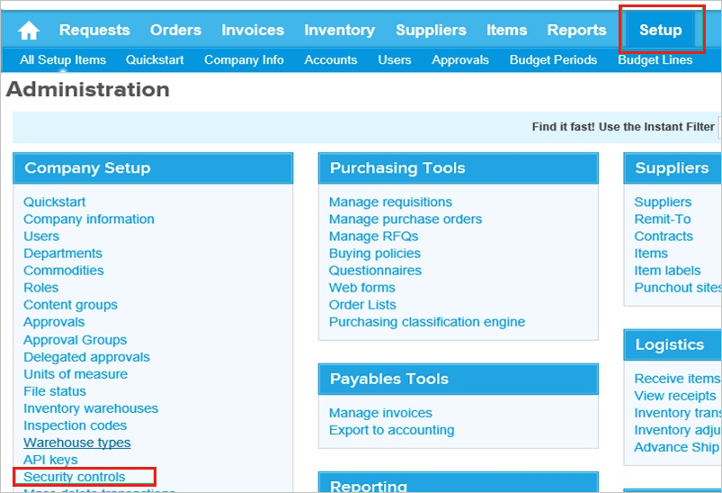
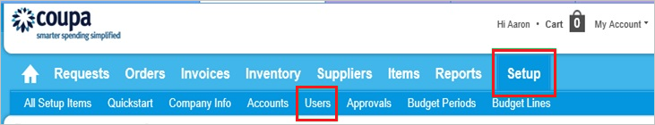

# Tutorial: Azure Active Directory integration with Coupa

In this tutorial, you'll learn how to integrate Coupa with Azure Active Directory (Azure AD). When you integrate Coupa with Azure AD, you can:

* Control in Azure AD who has access to Coupa.
* Enable your users to be automatically signed-in to Coupa with their Azure AD accounts.
* Manage your accounts in one central location - the Azure portal.

## Prerequisites

To get started, you need the following items:

* An Azure AD subscription. If you don't have a subscription, you can get a [free account](https://azure.microsoft.com/free/).
* Coupa single sign-on (SSO) enabled subscription.

## Scenario description

In this tutorial, you configure and test Azure AD single sign-on in a test environment.

* Coupa supports **SP** initiated SSO

## Add Coupa from the gallery

To configure the integration of Coupa into Azure AD, you need to add Coupa from the gallery to your list of managed SaaS apps.

1. Sign in to the Azure portal using either a work or school account, or a personal Microsoft account.
1. On the left navigation pane, select the **Azure Active Directory** service.
1. Navigate to **Enterprise Applications** and then select **All Applications**.
1. To add new application, select **New application**.
1. In the **Add from the gallery** section, type **Coupa** in the search box.
1. Select **Coupa** from results panel and then add the app. Wait a few seconds while the app is added to your tenant.

 Alternatively, you can also use the [Enterprise App Configuration Wizard](https://portal.office.com/AdminPortal/home?Q=Docs#/azureadappintegration). In this wizard, you can add an application to your tenant, add users/groups to the app, assign roles, as well as walk through the SSO configuration as well. [Learn more about Microsoft 365 wizards.](/microsoft-365/admin/misc/azure-ad-setup-guides)

## Configure and test Azure AD SSO for Coupa

Configure and test Azure AD SSO with Coupa using a test user called **B.Simon**. For SSO to work, you need to establish a link relationship between an Azure AD user and the related user in Coupa.

To configure and test Azure AD SSO with Coupa, perform the following steps:

1. **[Configure Azure AD SSO](#configure-azure-ad-sso)** - to enable your users to use this feature.
    1. **[Create an Azure AD test user](#create-an-azure-ad-test-user)** - to test Azure AD single sign-on with B.Simon.
    1. **[Assign the Azure AD test user](#assign-the-azure-ad-test-user)** - to enable B.Simon to use Azure AD single sign-on.
1. **[Configure Coupa SSO](#configure-coupa-sso)** - to configure the single sign-on settings on application side.
    1. **[Create Coupa test user](#create-coupa-test-user)** - to have a counterpart of B.Simon inCoupa that is linked to the Azure AD representation of user.
1. **[Test SSO](#test-sso)** - to verify whether the configuration works.

## Configure Azure AD SSO

Follow these steps to enable Azure AD SSO in the Azure portal.

1. In the Azure portal, on the **Coupa** application integration page, find the **Manage** section and select **single sign-on**.
1. On the **Select a single sign-on method** page, select **SAML**.
1. On the **Set up single sign-on with SAML** page, click the pencil icon for **Basic SAML Configuration** to edit the settings.

   

4. On the **Basic SAML Configuration** section, perform the following steps:

    a. In the **Sign-on URL** text box, type a URL using the following pattern:
    `https://<companyname>.coupahost.com`

    > [!NOTE]
    > The Sign-on URL value is not real. Update this value with the actual Sign-On URL. Contact [Coupa Client support team](https://success.coupa.com/Support/Contact_Us?) to get this value.

    b. In the **Identifier** box, type the URL:

    | Environment  | URL |
    |:-------------|----|
    | Sandbox | `sso-stg1.coupahost.com`|
    | Production | `sso-prd1.coupahost.com`|
    | | |

    c. In the **Reply URL** text box, type the URL:

    | Environment | URL |
    |------------- |----|
    | Sandbox | `https://sso-stg1.coupahost.com/sp/ACS.saml2`|
    | Production | `https://sso-prd1.coupahost.com/sp/ACS.saml2`|
    | | |

4. On the **Set up Single Sign-On with SAML** page, in the **SAML Signing Certificate** section, click **Download** to download the **Federation Metadata XML** from the given options as per your requirement and save it on your computer.

    

6. On the **Set up Coupa** section, copy the appropriate URL(s) as per your requirement.

    

### Create an Azure AD test user

In this section, you'll create a test user in the Azure portal called B.Simon.

1. From the left pane in the Azure portal, select **Azure Active Directory**, select **Users**, and then select **All users**.
1. Select **New user** at the top of the screen.
1. In the **User** properties, follow these steps:
   1. In the **Name** field, enter `B.Simon`.  
   1. In the **User name** field, enter the username@companydomain.extension. For example, `B.Simon@contoso.com`.
   1. Select the **Show password** check box, and then write down the value that's displayed in the **Password** box.
   1. Click **Create**.

### Assign the Azure AD test user

In this section, you'll enable B.Simon to use Azure single sign-on by granting access to Coupa.

1. In the Azure portal, select **Enterprise Applications**, and then select **All applications**.
1. In the applications list, select **Coupa**.
1. In the app's overview page, find the **Manage** section and select **Users and groups**.
1. Select **Add user**, then select **Users and groups** in the **Add Assignment** dialog.
1. In the **Users and groups** dialog, select **B.Simon** from the Users list, then click the **Select** button at the bottom of the screen.
1. If you are expecting a role to be assigned to the users, you can select it from the **Select a role** dropdown. If no role has been set up for this app, you see "Default Access" role selected.
1. In the **Add Assignment** dialog, click the **Assign** button.

## Configure Coupa SSO

1. Sign on to your Coupa company site as an administrator.

2. Go to **Setup \> Security Control**.

    

3. In the **Log in using Coupa credentials** section, perform the following steps:

    

    a. Select **Log in using SAML**.

    b. Click **Browse** to upload the metadata downloaded from the Azure portal.

    c. Click **Save**.

### Create Coupa test user

In order to enable Azure AD users to log into Coupa, they must be provisioned into Coupa.  

* In the case of Coupa, provisioning is a manual task.

**To configure user provisioning, perform the following steps:**

1. Log in to your **Coupa** company site as administrator.

2. In the menu on the top, click **Setup**, and then click **Users**.

    

3. Click **Create**.

    

4. In the **User Create** section, perform the following steps:

    

    a. Type the **Login**, **First name**, **Last Name**, **Single Sign-On ID**, **Email** attributes of a valid Azure Active Directory account you want to provision into the related textboxes.

    b. Click **Create**.

    >[!NOTE]
    >The Azure Active Directory account holder will get an email with a link to confirm the account before it becomes active.
    >

>[!NOTE]
>You can use any other Coupa user account creation tools or APIs provided by Coupa to provision Azure AD user accounts.

## Test SSO

In this section, you test your Azure AD single sign-on configuration with following options. 

* Click on **Test this application** in Azure portal. This will redirect to Coupa Sign-on URL where you can initiate the login flow. 

* Go to Coupa Sign-on URL directly and initiate the login flow from there.

* You can use Microsoft My Apps. When you click the Coupa tile in the My Apps, you should be automatically signed in to the Coupa for which you set up the SSO. For more information about the My Apps, see [Introduction to the My Apps](https://support.microsoft.com/account-billing/sign-in-and-start-apps-from-the-my-apps-portal-2f3b1bae-0e5a-4a86-a33e-876fbd2a4510).

## Next steps

Once you configure  Coupa you can enforce session control, which protects exfiltration and infiltration of your organization’s sensitive data in real time. Session control extends from Conditional Access. [Learn how to enforce session control with Microsoft Defender for Cloud Apps](/cloud-app-security/proxy-deployment-any-app).
