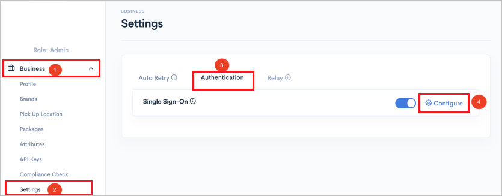
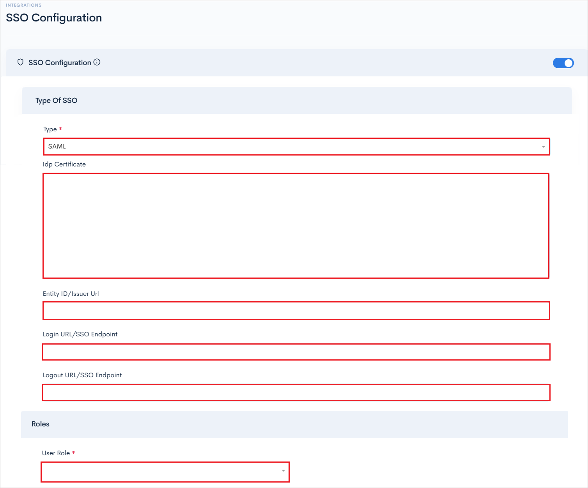

# Microsoft Entra SSO integration with Delivery Solutions

In this article, you'll learn how to integrate Delivery Solutions with Microsoft Entra ID. Delivery Solutions is an OXM platform that enables your omni channel strategy via same-day delivery, curbside, in-store pickup, shipping & post-purchase channels. When you integrate Delivery Solutions with Microsoft Entra ID, you can:

* Control in Microsoft Entra ID who has access to Delivery Solutions.
* Enable your users to be automatically signed-in to Delivery Solutions with their Microsoft Entra accounts.
* Manage your accounts in one central location.

You'll configure and test Microsoft Entra single sign-on for Delivery Solutions in a test environment. Delivery Solutions supports both **SP** and **IDP** initiated single sign-on and **Just In Time** user provisioning.

## Prerequisites

To integrate Microsoft Entra ID with Delivery Solutions, you need:

* A Microsoft Entra user account. If you don't already have one, you can [Create an account for free](https://azure.microsoft.com/free/?WT.mc_id=A261C142F).
* One of the following roles: Global Administrator, Cloud Application Administrator, Application Administrator, or owner of the service principal.
* A Microsoft Entra subscription. If you don't have a subscription, you can get a [free account](https://azure.microsoft.com/free/).
* Delivery Solutions single sign-on (SSO) enabled subscription.

## Add application and assign a test user

Before you begin the process of configuring single sign-on, you need to add the Delivery Solutions application from the Microsoft Entra gallery. You need a test user account to assign to the application and test the single sign-on configuration.

### Add Delivery Solutions from the Microsoft Entra gallery

Add Delivery Solutions from the Microsoft Entra application gallery to configure single sign-on with Delivery Solutions. For more information on how to add application from the gallery, see the [Quickstart: Add application from the gallery](../manage-apps/add-application-portal.md).

### Create and assign Microsoft Entra test user

Follow the guidelines in the [create and assign a user account](../manage-apps/add-application-portal-assign-users.md) article to create a test user account called B.Simon.

Alternatively, you can also use the [Enterprise App Configuration Wizard](https://portal.office.com/AdminPortal/home?Q=Docs#/azureadappintegration). In this wizard, you can add an application to your tenant, add users/groups to the app, and assign roles. The wizard also provides a link to the single sign-on configuration pane. [Learn more about Microsoft 365 wizards.](/microsoft-365/admin/misc/azure-ad-setup-guides). 

## Configure Microsoft Entra SSO

Complete the following steps to enable Microsoft Entra single sign-on.

1. Sign in to the [Microsoft Entra admin center](https://entra.microsoft.com) as at least a [Cloud Application Administrator](../roles/permissions-reference.md#cloud-application-administrator).
1. Browse to **Identity** > **Applications** > **Enterprise applications** > **Delivery Solutions** > **Single sign-on**.
1. On the **Select a single sign-on method** page, select **SAML**.
1. On the **Set up single sign-on with SAML** page, select the pencil icon for **Basic SAML Configuration** to edit the settings.

   

1. On the **Basic SAML Configuration** section, perform the following steps:

    a. In the **Identifier** textbox, type a value using the following pattern:
    `<ENVIRONMENT>.portal.deliverysolutions.co`

    b. In the **Reply URL** textbox, type a URL using the following pattern:
    `https://<ENVIRONMENT>.api.deliverysolutions.co/authentications/saml/response/<Base64_Tenant_ID>`

1. If you wish to configure the application in **SP** initiated mode, then perform the following step:

    In the **Sign on URL** textbox, type a URL using the following pattern:
    `https://<ENVIRONMENT>.portal.deliverysolutions.co/#/login/saml/<Tenant_ID>`

    > [!NOTE]
    > These values are not real. Update these values with the actual Identifier, Reply URL and Sign on URL. Contact [Delivery Solutions support team](mailto:support@deliverysolutions.co) to get these values. You can also refer to the patterns shown in the **Basic SAML Configuration** section.

1. Delivery Solutions application expects the SAML assertions in a specific format, which requires you to add custom attribute mappings to your SAML token attributes configuration. The following screenshot shows the list of default attributes.

	

1. In addition to above, Delivery Solutions application expects few more attributes to be passed back in SAML response, which are shown below. These attributes are also pre populated but you can review them as per your requirements.

	| Name |  Source Attribute|
	| ---------------|  --------- |
	| brandIds | user.jobtitle |
	| storeIds | user.department |
    | role | user.assignedroles |

   > [!NOTE]
   > Please click [here](../develop/howto-add-app-roles-in-azure-ad-apps.md#app-roles-ui) to know how to configure Role in Microsoft Entra ID.

1. On the **Set-up single sign-on with SAML** page, in the **SAML Signing Certificate** section, find **Certificate (Base64)** and select **Download** to download the certificate and save it on your computer.

    

1. On the **Set up Delivery Solutions** section, copy the appropriate URL(s) based on your requirement.

	

## Configure Delivery Solutions SSO

1. Log in to your Delivery Solutions company site as an administrator.

1. Go to **Business** > **Settings** > **Authentication**  and enable **Configure** button.

    

1. In the **SSO Configuration** page, perform the following steps:

    

    1. Select **SAML** type of SSO from the dropdown.

    1. Open the downloaded **Certificate (Base64)** into Notepad and paste the content into the **Idp Certificate** textbox.

    1. In the **Entity ID/Issuer Url** textbox, paste the **Microsoft Entra Identifier** value, which you copied previously.

    1. In the **Login URL/SSO Endpoint** textbox, paste the **Login URL**, which you copied previously.

    1. In the **Logout URL/SSO Endpoint** textbox, paste the **Logout URL**, which you copied previously.

    1. Select **User Role** from the dropdown and save the configuration.

### Create Delivery Solutions test user

In this section, a user called B.Simon is created in Delivery Solutions. Delivery Solutions supports just-in-time user provisioning, which is enabled by default. There's no action item for you in this section. If a user doesn't already exist in Delivery Solutions, a new one is commonly created after authentication.

## Test SSO 

In this section, you test your Microsoft Entra single sign-on configuration with following options. 

#### SP initiated:

* Click on **Test this application**, this will redirect to Delivery Solutions Sign-on URL where you can initiate the login flow.  

* Go to Delivery Solutions Sign-on URL directly and initiate the login flow from there.

#### IDP initiated:

* Click on **Test this application**, and you should be automatically signed in to the Delivery Solutions for which you set up the SSO. 

You can also use Microsoft My Apps to test the application in any mode. When you click the Delivery Solutions tile in the My Apps, if configured in SP mode you would be redirected to the application sign-on page for initiating the login flow and if configured in IDP mode, you should be automatically signed in to the Delivery Solutions for which you set up the SSO. For more information, see [Microsoft Entra My Apps](/azure/active-directory/manage-apps/end-user-experiences#azure-ad-my-apps).

## Additional resources

* [What is single sign-on with Microsoft Entra ID?](../manage-apps/what-is-single-sign-on.md)
* [Plan a single sign-on deployment](../manage-apps/plan-sso-deployment.md).

## Next steps

Once you configure Delivery Solutions you can enforce session control, which protects exfiltration and infiltration of your organization’s sensitive data in real time. Session control extends from Conditional Access. [Learn how to enforce session control with Microsoft Cloud App Security](/cloud-app-security/proxy-deployment-aad).
