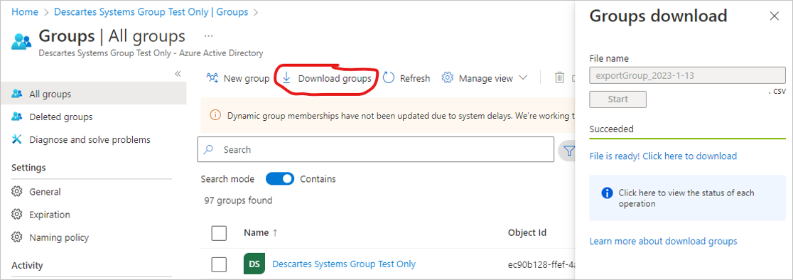
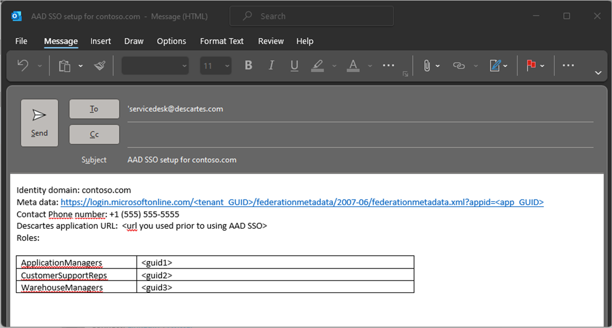

# Microsoft Entra SSO integration with Descartes

In this article, you'll learn how to integrate Descartes with Microsoft Entra ID. The Descartes application provides logistics information services to delivery sensitive companies around the world. As an integrated suite it provides modules for various logistics business roles. When you integrate Descartes with Microsoft Entra ID, you can:

* Control in Microsoft Entra ID who has access to Descartes.
* Enable your users to be automatically signed-in to Descartes with their Microsoft Entra accounts.
* Manage your accounts in one central location.

You'll configure and test Microsoft Entra single sign-on for Descartes in a test environment. Descartes supports both **SP** and **IDP** initiated single sign-on and also supports **Just In Time** user provisioning.

> [!NOTE]
> Identifier of this application is a fixed string value so only one instance can be configured in one tenant.

## Prerequisites

To integrate Microsoft Entra ID with Descartes, you need:

* A Microsoft Entra user account. If you don't already have one, you can [Create an account for free](https://azure.microsoft.com/free/?WT.mc_id=A261C142F).
* One of the following roles: Global Administrator, Cloud Application Administrator, Application Administrator, or owner of the service principal.
* A Microsoft Entra subscription. If you don't have a subscription, you can get a [free account](https://azure.microsoft.com/free/).
* Descartes single sign-on (SSO) enabled subscription.

## Add application and assign a test user

Before you begin the process of configuring single sign-on, you need to add the Descartes application from the Microsoft Entra gallery. You need a test user account to assign to the application and test the single sign-on configuration.

### Add Descartes from the Microsoft Entra gallery

Add Descartes from the Microsoft Entra application gallery to configure single sign-on with Descartes. For more information on how to add application from the gallery, see the [Quickstart: Add application from the gallery](../manage-apps/add-application-portal.md).

### Create and assign Microsoft Entra test user

Follow the guidelines in the [create and assign a user account](../manage-apps/add-application-portal-assign-users.md) article to create a test user account called B.Simon.

Alternatively, you can also use the [Enterprise App Configuration Wizard](https://portal.office.com/AdminPortal/home?Q=Docs#/azureadappintegration). In this wizard, you can add an application to your tenant, add users/groups to the app, and assign roles. The wizard also provides a link to the single sign-on configuration pane. [Learn more about Microsoft 365 wizards.](/microsoft-365/admin/misc/azure-ad-setup-guides). 

## Configure Microsoft Entra SSO

Complete the following steps to enable Microsoft Entra single sign-on.

1. Sign in to the [Microsoft Entra admin center](https://entra.microsoft.com) as at least a [Cloud Application Administrator](../roles/permissions-reference.md#cloud-application-administrator).
1. Browse to **Identity** > **Applications** > **Enterprise applications** > **Descartes** > **Single sign-on**.
1. On the **Select a single sign-on method** page, select **SAML**.
1. On the **Set up single sign-on with SAML** page, select the pencil icon for **Basic SAML Configuration** to edit the settings.

   

1. On the **Basic SAML Configuration** section, the user doesn't have to perform any step as the app is already pre-integrated with Azure.

1. If you want to configure **SP** initiated SSO, then perform the following step:

    In the **Relay State** textbox, type the URL:
    `https://auth.gln.com/Welcome`

1. Descartes application expects the SAML assertions in a specific format, which requires you to add custom attribute mappings to your SAML token attributes configuration. The following screenshot shows the list of default attributes.

	

1. In addition to above, Descartes application expects few more attributes to be passed back in SAML response, which are shown below. These attributes are also pre populated but you can review them as per your requirements.

	| Name |  Source Attribute|
	| ---------------|  --------- |
    | telephone | user.telephonenumber |
    | facsimiletelephonenumber | user.facsimiletelephonenumber |
    | ou | user.department |
    | assignedRoles | user.assignedroles |
    | Group | user.groups |

1. On the **Set up single sign-on with SAML** page, in the **SAML Signing Certificate** section, click copy button to copy **App Federation Metadata Url** and save it on your computer.

	

1. Compose a list of the Microsoft Entra groups you want the Descartes Application use for the Role-based configuration. A list of User Roles Descartes application modules can be found at https://www.gln.com/docs/Descartes_Application_User_Roles.pdf. You can find the Azure Active Direction Group GUIDs please download the Groups from your Azure portal Groups.

    

You can load this CSV file in Excel. Please select the groups that you want map to the Descartes application roles by list the ID in the first column and associating it with the Descartes Application User Role.

## Configure Descartes SSO

To configure single sign-on on **Descartes** side, you need to email the following values to the [Descartes support team](mailto:servicedesk@descartes.com). Please use the subject Microsoft Entra SSO Setup request as the subject.

1. The preferred identity domain suffix (often the same as the E-mail domain suffix).
1. The App Federation Metadata URL.
1.	A list with the Microsoft Entra group GUIDs for users entitled to use the Descartes application. 

Descartes will use the information in the E-mail to have the SAML SSO connection set properly on the application side.

An example of such a request below:

### Create Descartes test user

In this section, a user called B.Simon is created in Descartes. Descartes supports just-in-time user provisioning, which is enabled by default. There's no action item for you in this section. If a user doesn't already exist in Descartes, a new one is commonly created after authentication.

Descartes application use domain qualified usernames for your Microsoft Entra integrated users. The domain qualified usernames consist of the SAML claim subject and will always end with the domain suffix. Descartes recommends selecting your companies E-mail domain suffix all users in the domain have in common as the identity domain suffix (example B.Simon@contoso.com). 

## Test SSO 

In this section, you test your Microsoft Entra single sign-on configuration with following options. 

#### SP initiated:

* Click on **Test this application**, this will redirect to Descartes Sign-on URL where you can initiate the login flow. Alternatively you can use a 'deep link' URL into a specific module of the Descartes application, and you will be redirected to a page to provide your domain qualified username which will lead you to your Microsoft Entra login dialog.

* Go to Descartes application direct access URL provided and initiate the login flow by specifying your domain qualified username (B.Simon@contoso.com) in the application login window. This will redirect the user automatically to Microsoft Entra ID.

#### IDP initiated:

* Click on **Test this application**, and you should be automatically signed in to the Descartes application menu for which you set up the SSO. 

* You can also use Microsoft My Apps to test the application in any mode. When you click the Descartes tile in the My Apps, if configured in SP mode you would be redirected to the application sign-on page for initiating the login flow and if configured in IDP mode, you should be automatically signed in to the Descartes for which you set up the SSO. For more information, see [Microsoft Entra My Apps](/azure/active-directory/manage-apps/end-user-experiences#azure-ad-my-apps).

## Additional resources

* [What is single sign-on with Microsoft Entra ID?](../manage-apps/what-is-single-sign-on.md)
* [Plan a single sign-on deployment](../manage-apps/plan-sso-deployment.md).

## Next steps

Once you configure Descartes you can enforce session control, which protects exfiltration and infiltration of your organization’s sensitive data in real time. Session control extends from Conditional Access. [Learn how to enforce session control with Microsoft Cloud App Security](/cloud-app-security/proxy-deployment-aad).
