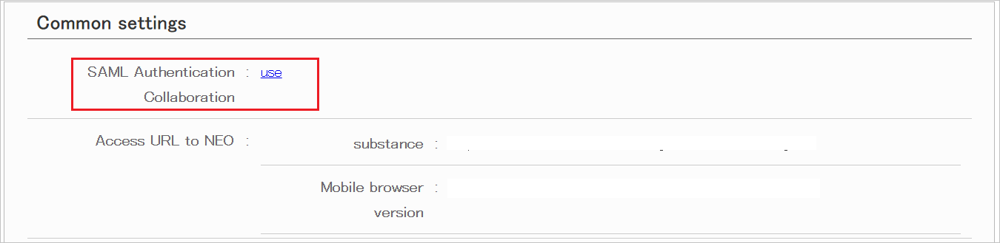
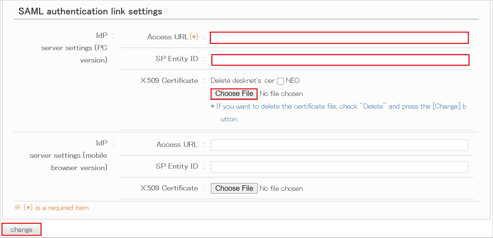
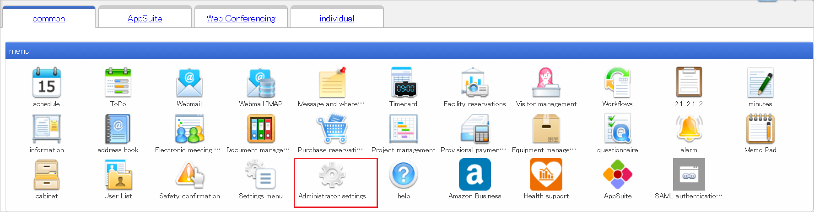
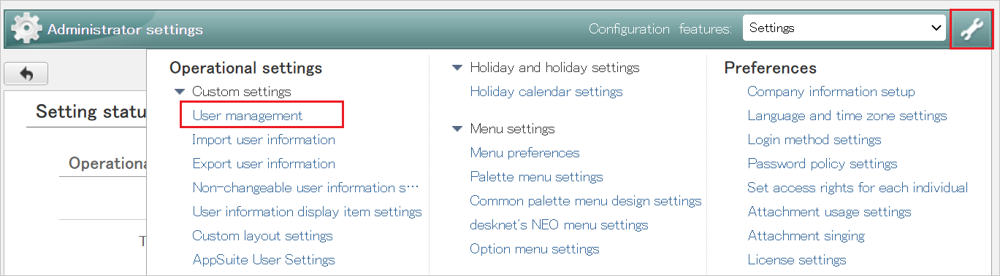
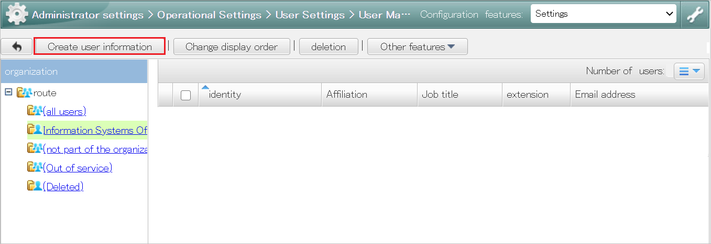
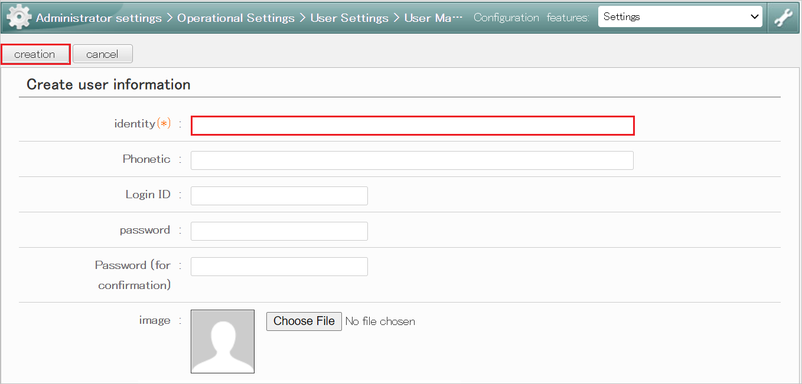

# Tutorial: Microsoft Entra single sign-on (SSO) integration with desknet's NEO

In this tutorial, you'll learn how to integrate desknet's NEO with Microsoft Entra ID. When you integrate desknet's NEO with Microsoft Entra ID, you can:

* Control in Microsoft Entra ID who has access to desknet's NEO.
* Enable your users to be automatically signed-in to desknet's NEO with their Microsoft Entra accounts.
* Manage your accounts in one central location.

## Prerequisites

To get started, you need the following items:

* A Microsoft Entra subscription. If you don't have a subscription, you can get a [free account](https://azure.microsoft.com/free/).
* desknet's NEO single sign-on (SSO) enabled subscription.

## Scenario description

In this tutorial, you configure and test Microsoft Entra SSO in a test environment.

* desknet's NEO supports **SP** initiated SSO.

## Adding desknet's NEO from the gallery

To configure the integration of desknet's NEO into Microsoft Entra ID, you need to add desknet's NEO from the gallery to your list of managed SaaS apps.

1. Sign in to the [Microsoft Entra admin center](https://entra.microsoft.com) as at least a [Cloud Application Administrator](../roles/permissions-reference.md#cloud-application-administrator).
1. Browse to **Identity** > **Applications** > **Enterprise applications** > **New application**.
1. In the **Add from the gallery** section, type **desknet's NEO** in the search box.
1. Select **desknet's NEO** from results panel and then add the app. Wait a few seconds while the app is added to your tenant.

 Alternatively, you can also use the [Enterprise App Configuration Wizard](https://portal.office.com/AdminPortal/home?Q=Docs#/azureadappintegration). In this wizard, you can add an application to your tenant, add users/groups to the app, assign roles, as well as walk through the SSO configuration as well. [Learn more about Microsoft 365 wizards.](/microsoft-365/admin/misc/azure-ad-setup-guides)

## Configure and test Microsoft Entra SSO for desknet's NEO

Configure and test Microsoft Entra SSO with desknet's NEO using a test user called **B.Simon**. For SSO to work, you need to establish a link relationship between a Microsoft Entra user and the related user in desknet's NEO.

To configure and test Microsoft Entra SSO with desknet's NEO, perform the following steps:

1. **[Configure Microsoft Entra SSO](#configure-azure-ad-sso)** - to enable your users to use this feature.
    1. **[Create a Microsoft Entra test user](#create-an-azure-ad-test-user)** - to test Microsoft Entra single sign-on with B.Simon.
    1. **[Assign the Microsoft Entra test user](#assign-the-azure-ad-test-user)** - to enable B.Simon to use Microsoft Entra single sign-on.
1. **[Configure desknet's NEO SSO](#configure-desknets-neo-sso)** - to configure the single sign-on settings on application side.
    1. **[Create desknet's NEO test user](#create-desknets-neo-test-user)** - to have a counterpart of B.Simon in desknet's NEO that is linked to the Microsoft Entra representation of user.
1. **[Test SSO](#test-sso)** - to verify whether the configuration works.

## Configure Microsoft Entra SSO

Follow these steps to enable Microsoft Entra SSO.

1. Sign in to the [Microsoft Entra admin center](https://entra.microsoft.com) as at least a [Cloud Application Administrator](../roles/permissions-reference.md#cloud-application-administrator).
1. Browse to **Identity** > **Applications** > **Enterprise applications** > **desknet's NEO** > **Single sign-on**.
1. On the **Select a single sign-on method** page, select **SAML**.
1. On the **Set up single sign-on with SAML** page, click the pencil icon for **Basic SAML Configuration** to edit the settings.

   

1. On the **Basic SAML Configuration** section, enter the values for the following fields:

    a. In the **Identifier (Entity ID)** text box, type a URL using the following pattern:
    `https://<CUSTOMER_NAME>.dn-cloud.com`

    b. In the **Reply URL** text box, type a URL using the following pattern:
    `https://<CUSTOMER_NAME>.dn-cloud.com/cgi-bin/dneo/zsaml.cgi`

	c. In the **Sign on URL** text box, type a URL using the following pattern:
    `https://<CUSTOMER_NAME>.dn-cloud.com/cgi-bin/dneo/dneo.cgi`

	> [!NOTE]
	> These values are not real. Update these values with the actual Identifier, Reply URL and Sign on URL. Contact [desknet's NEO Client support team](mailto:cloudsupport@desknets.com) to get these values. You can also refer to the patterns shown in the **Basic SAML Configuration** section.

1. On the **Set up single sign-on with SAML** page, in the **SAML Signing Certificate** section,  find **Certificate (Base64)** and select **Download** to download the certificate and save it on your computer.

	

1. On the **Set up desknet's NEO** section, copy the appropriate URL(s) based on your requirement.

	

### Create a Microsoft Entra test user

In this section, you'll create a test user called B.Simon.

1. Sign in to the [Microsoft Entra admin center](https://entra.microsoft.com) as at least a [User Administrator](../roles/permissions-reference.md#user-administrator).
1. Browse to **Identity** > **Users** > **All users**.
1. Select **New user** > **Create new user**, at the top of the screen.
1. In the **User** properties, follow these steps:
   1. In the **Display name** field, enter `B.Simon`.  
   1. In the **User principal name** field, enter the username@companydomain.extension. For example, `B.Simon@contoso.com`.
   1. Select the **Show password** check box, and then write down the value that's displayed in the **Password** box.
   1. Select **Review + create**.
1. Select **Create**.

### Assign the Microsoft Entra test user

In this section, you'll enable B.Simon to use single sign-on by granting access to desknet's NEO.

1. Sign in to the [Microsoft Entra admin center](https://entra.microsoft.com) as at least a [Cloud Application Administrator](../roles/permissions-reference.md#cloud-application-administrator).
1. Browse to **Identity** > **Applications** > **Enterprise applications** > **desknet's NEO**.
1. In the app's overview page, select **Users and groups**.
1. Select **Add user/group**, then select **Users and groups** in the **Add Assignment** dialog.
   1. In the **Users and groups** dialog, select **B.Simon** from the Users list, then click the **Select** button at the bottom of the screen.
   1. If you are expecting a role to be assigned to the users, you can select it from the **Select a role** dropdown. If no role has been set up for this app, you see "Default Access" role selected.
   1. In the **Add Assignment** dialog, click the **Assign** button.

## Configure desknet's NEO SSO

1. Sign in to your desknet's NEO company site as an administrator.

1. In the menu, click **SAML authentication link settings** icon.

    

1. In the **Common settings**, click **use** from SAML Authentication Collaboration.

    

1. Perform the below steps in the **SAML authentication link settings** section.

    

    a. In the **Access URL** textbox, paste the **Login URL** value, which you copied previously.

    b. In the **SP Entity ID** textbox, paste the **Identifier** value, which you copied previously.

    c. Click **Choose File** to upload the downloaded **Certificate (Base64)** file into the **x.509 Certificate** textbox.

    d. Click **change**.

### Create desknet's NEO test user

1. Sign in to your desknet's NEO company site as an administrator.

1. In the **menu**, click **Administrator settings** icon.

    

1. Click **settings** icon and select **User management** in the **Custom settings**.

    

1. Click **Create user information**.

    

1. Fill the required fields in the below page and click **creation**.

    

## Test SSO 

In this section, you test your Microsoft Entra single sign-on configuration with following options. 

* Click on **Test this application**, this will redirect to desknet's NEO Sign-on URL where you can initiate the login flow. 

* Go to desknet's NEO Sign-on URL directly and initiate the login flow from there.

* You can use Microsoft My Apps. When you click the desknet's NEO tile in the My Apps, this will redirect to desknet's NEO Sign-on URL. For more information about the My Apps, see [Introduction to the My Apps](https://support.microsoft.com/account-billing/sign-in-and-start-apps-from-the-my-apps-portal-2f3b1bae-0e5a-4a86-a33e-876fbd2a4510).

## Next steps

Once you configure desknet's NEO you can enforce session control, which protects exfiltration and infiltration of your organization’s sensitive data in real time. Session control extends from Conditional Access. [Learn how to enforce session control with Microsoft Defender for Cloud Apps](/cloud-app-security/proxy-deployment-any-app).
