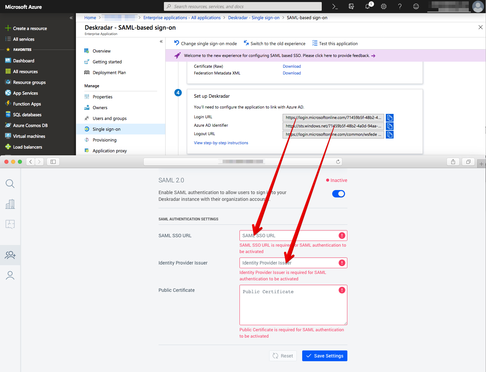

# Tutorial: Integrate Deskradar with Azure Active Directory

In this tutorial, you'll learn how to integrate Deskradar with Azure Active Directory (Azure AD). When you integrate Deskradar with Azure AD, you can:

* Control in Azure AD who has access to Deskradar.
* Enable your users to be automatically signed-in to Deskradar with their Azure AD accounts.
* Manage your accounts in one central location - the Azure portal.

To learn more about SaaS app integration with Azure AD, see [What is application access and single sign-on with Azure Active Directory](https://docs.microsoft.com/azure/active-directory/active-directory-appssoaccess-whatis).

## Prerequisites

To get started, you need the following items:

* An Azure AD subscription. If you don't have a subscription, you can get one-month free trial [here](https://azure.microsoft.com/pricing/free-trial/).
* Deskradar single sign-on (SSO) enabled subscription.

## Scenario description

In this tutorial, you configure and test Azure AD SSO in a test environment. Deskradar supports **SP and IDP** initiated SSO.

## Adding Deskradar from the gallery

To configure the integration of Deskradar into Azure AD, you need to add Deskradar from the gallery to your list of managed SaaS apps.

1. Sign in to the [Azure portal](https://portal.azure.com) using either a work or school account, or a personal Microsoft account.
1. On the left navigation pane, select the **Azure Active Directory** service.
1. Navigate to **Enterprise Applications** and then select **All Applications**.
1. To add new application, select **New application**.
1. In the **Add from the gallery** section, type **Deskradar** in the search box.
1. Select **Deskradar** from results panel and then add the app. Wait a few seconds while the app is added to your tenant.

## Configure and test Azure AD single sign-on

Configure and test Azure AD SSO with Deskradar using a test user called **B.Simon**. For SSO to work, you need to establish a link relationship between an Azure AD user and the related user in Deskradar.

To configure and test Azure AD SSO with Deskradar, complete the following building blocks:

1. **[Configure Azure AD SSO](#configure-azure-ad-sso)** - to enable your users to use this feature.
2. **[Configure Deskradar SSO](#configure-deskradar-sso)** - to configure the Single Sign-On settings on application side.
3. **[Create an Azure AD test user](#create-an-azure-ad-test-user)** - to test Azure AD single sign-on with Britta Simon.
4. **[Assign the Azure AD test user](#assign-the-azure-ad-test-user)** - to enable Britta Simon to use Azure AD single sign-on.
5. **[Create Deskradar test user](#create-deskradar-test-user)** - to have a counterpart of Britta Simon in Deskradar that is linked to the Azure AD representation of user.
6. **[Test SSO](#test-sso)** - to verify whether the configuration works.

### Configure Azure AD SSO

Follow these steps to enable Azure AD SSO in the Azure portal.

1. In the [Azure portal](https://portal.azure.com/), on the **Deskradar** application integration page, find the **Manage** section and select **Single sign-on**.
1. On the **Select a Single sign-on method** page, select **SAML**.
1. On the **Set up Single Sign-On with SAML** page, click the edit/pen icon for **Basic SAML Configuration** to edit the settings.

   

1. On the **Basic SAML Configuration** section, If you wish to configure the application in **IDP** initiated mode, perform the following steps:

    a. In the **Identifier** text box, type a URL using the following pattern:
    `https://YOURDOMAIN.deskradar.cloud`

    b. In the **Reply URL** text box, type a URL using the following pattern:
    `https://YOURDOMAIN.deskradar.cloud/auth/sso/saml/consume`

1. Click **Set additional URLs** and perform the following step if you wish to configure the application in **SP** initiated mode:

    In the **Sign-on URL** text box, type a URL using the following pattern:
    `https://YOURDOMAIN.deskradar.cloud/auth/sso/saml/login`

	> [!NOTE]
	> These values are not real. Update these values with the actual Identifier, Reply URL and Sign-on URL. Replace **YOURDOMAIN** with your Deskradar instance domain. Contact [Deskradar Client support team](mailto:support@deskradar.com) to get these values. You can also refer to the patterns shown in the **Basic SAML Configuration** section in the Azure portal.

1. Deskradar application expects the SAML assertions in a specific format. Configure the following claims for this application. You can manage the values of these attributes from the **User Attributes** section on application integration page. On the **Set up Single Sign-On with SAML** page, click **Edit** button to open **User Attributes** dialog.

	

1. In the **User Claims** section on the **User Attributes** dialog, configure SAML token attribute as shown in the image above and perform the following steps:

	| Name | Source Attribute|
	| ---------------| --------- |
	| FirstName | user.givenname |
	| LastName | user.surname |
	| Email | user.userprincipalname |
	| | |

	a. Click **Add new claim** to open the **Manage user claims** dialog.

	b. In the **Name** textbox, type the attribute name shown for that row.

	c. Leave the **Namespace** blank.

	d. Select Source as **Attribute**.

	e. From the **Source attribute** list, type the attribute value shown for that row.

	f. Click **Ok**.

	g. Click **Save**.

1. On the **Set up Single Sign-On with SAML** page, in the **SAML Signing Certificate** section, find **Certificate (Base64)** and select **Download** to download the certificate and save it on your computer.

   

1. On the **Set up Deskradar** section, copy the appropriate URL(s) based on your requirement.

   

### Configure Deskradar SSO

1. To automate the configuration within Deskradar, you need to install **My Apps Secure Sign-in browser extension** by clicking **Install the extension**.

	

1. After adding extension to the browser, click on **Setup Deskradar** will direct you to the Deskradar application. From there, provide the admin credentials to sign into Deskradar. The browser extension will automatically configure the application for you and automate steps 3-7.

	

1. If you want to setup Deskradar manually, open a new web browser window and sign into your Deskradar company site as an administrator and perform the following steps:

1. Open **Team** panel by clicking the icon in the Sidebar.

1. Switch to **Authentication** tab.

1. On the **SAML 2.0** tab, perform the following steps:

	

	a. Enable **SAML** authentication method.

	b. In the **SAML SSO URL** textbox, enter the **Login URL** value, which you have copied from the Azure portal.

	c. In the **Identity Provider Issuer** textbox, enter the **Azure AD Identifier** value, which you have copied from the Azure portal.

1. Open the downloaded **Certificate (Base64)** file with a text editor and copy and paste its content into **Public Certificate** field in Deskradar.

	

### Create an Azure AD test user

In this section, you'll create a test user in the Azure portal called B.Simon.

1. From the left pane in the Azure portal, select **Azure Active Directory**, select **Users**, and then select **All users**.
1. Select **New user** at the top of the screen.
1. In the **User** properties, follow these steps:
   1. In the **Name** field, enter `B.Simon`.  
   1. In the **User name** field, enter the username@companydomain.extension. For example, `B.Simon@contoso.com`.
   1. Select the **Show password** check box, and then write down the value that's displayed in the **Password** box.
   1. Click **Create**.

### Assign the Azure AD test user

In this section, you'll enable B.Simon to use Azure single sign-on by granting access to Deskradar.

1. In the Azure portal, select **Enterprise Applications**, and then select **All applications**.
1. In the applications list, select **Deskradar**.
1. In the app's overview page, find the **Manage** section and select **Users and groups**.

   

1. Select **Add user**, then select **Users and groups** in the **Add Assignment** dialog.

	

1. In the **Users and groups** dialog, select **B.Simon** from the Users list, then click the **Select** button at the bottom of the screen.
1. If you're expecting any role value in the SAML assertion, in the **Select Role** dialog, select the appropriate role for the user from the list and then click the **Select** button at the bottom of the screen.
1. In the **Add Assignment** dialog, click the **Assign** button.

### Create Deskradar test user

In this section, you create a user called Britta Simon in Deskradar. Work with [Deskradar Client support team](mailto:support@deskradar.com) to add the users in the Deskradar platform. Users must be created and activated before you use single sign-on.

### Test SSO

When you select the Deskradar tile in the Access Panel, you should be automatically signed in to the Deskradar for which you set up SSO. For more information about the Access Panel, see [Introduction to the Access Panel](https://docs.microsoft.com/azure/active-directory/active-directory-saas-access-panel-introduction).

## Additional Resources

- [List of Tutorials on How to Integrate SaaS Apps with Azure Active Directory](https://docs.microsoft.com/azure/active-directory/active-directory-saas-tutorial-list)

- [What is application access and single sign-on with Azure Active Directory?](https://docs.microsoft.com/azure/active-directory/active-directory-appssoaccess-whatis)

- [What is conditional access in Azure Active Directory?](https://docs.microsoft.com/azure/active-directory/conditional-access/overview)