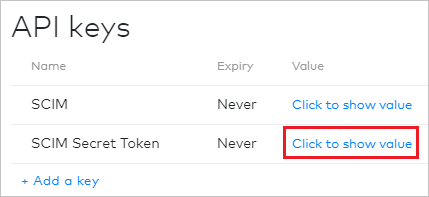
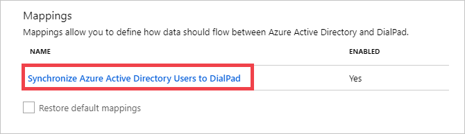
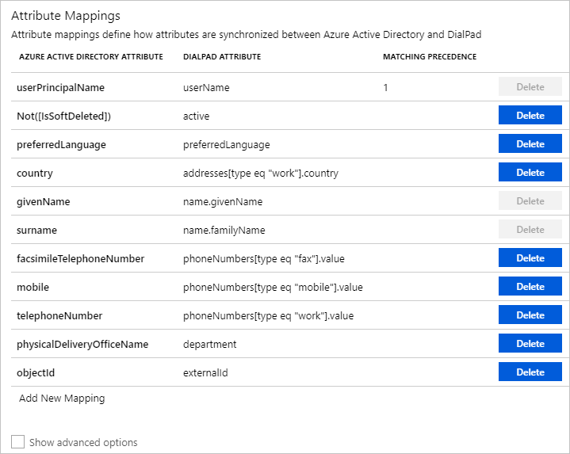

# Tutorial: Configure Dialpad for automatic user provisioning

The objective of this tutorial is to demonstrate the steps to be performed in Dialpad and Microsoft Entra ID to configure Microsoft Entra ID to automatically provision and de-provision users and/or groups to Dialpad.

> [!NOTE]
>  This tutorial describes a connector built on top of the Microsoft Entra user Provisioning Service. For important details on what this service does, how it works, and frequently asked questions, see [Automate user provisioning and deprovisioning to SaaS applications with Microsoft Entra ID](../app-provisioning/user-provisioning.md).

> This connector is currently in Preview. For more information about previews, see [Universal License Terms For Online Services](https://www.microsoft.com/licensing/terms/product/ForOnlineServices/all).

## Prerequisites

The scenario outlined in this tutorial assumes that you already have the following prerequisites:

* A Microsoft Entra tenant.
* [A Dialpad tenant](https://www.dialpad.com/pricing/).
* A user account in Dialpad with Admin permissions.

## Assign Users to Dialpad
Microsoft Entra ID uses a concept called assignments to determine which users should receive access to selected apps. In the context of automatic user provisioning, only the users and/or groups that have been assigned to an application in Microsoft Entra ID are synchronized.

Before configuring and enabling automatic user provisioning, you should decide which users and/or groups in Microsoft Entra ID need access to Dialpad. Once decided, you can assign these users and/or groups to Dialpad by following the instructions here:
 
* [Assign a user or group to an enterprise app](../manage-apps/assign-user-or-group-access-portal.md) 

 ## Important tips for assigning users to Dialpad

 * It is recommended that a single Microsoft Entra user is assigned to Dialpad to test the automatic user provisioning configuration. Additional users and/or groups may be assigned later.

* When assigning a user to Dialpad, you must select any valid application-specific role (if available) in the assignment dialog. Users with the Default Access role are excluded from provisioning.

## Setup Dialpad for provisioning

Before configuring Dialpad for automatic user provisioning with Microsoft Entra ID, you will need to retrieve some provisioning information from Dialpad.

1. Sign in to your [Dialpad Admin Console](https://dialpadbeta.com/login) and select **Admin settings**. Ensure that **My Company** is selected from the dropdown. Navigate to **Authentication > API Keys**.

	:::image type="content" source="media/dialpad-provisioning-tutorial/dialpad01.png" alt-text="Screenshot of the Dialpad admin console, with the settings icon, My Company, Authentication, and A P I keys highlighted, and My Company selected." border="false":::

2. Generate a new key by clicking **Add a key** and configuring the properties of your secret token.

	:::image type="content" source="media/dialpad-provisioning-tutorial/dialpad02.png" alt-text="Screenshot of the A P I keys page in the Dialpad admin console. Add a key is highlighted." border="false":::

	:::image type="content" source="media/dialpad-provisioning-tutorial/dialpad03.png" alt-text="Screenshot of the Edit A P I key page in the Dialpad admin console. The Save button is highlighted." border="false":::

3. Click the **Click to show value** button for your recently created API key and copy the value shown. This value will be entered in the **Secret Token** field in the Provisioning tab of your Dialpad application. 

	

## Add Dialpad from the gallery

To configuring Dialpad for automatic user provisioning with Microsoft Entra ID, you need to add Dialpad from the Microsoft Entra application gallery to your list of managed SaaS applications.

**To add Dialpad from the Microsoft Entra application gallery, perform the following steps:**

1. Sign in to the [Microsoft Entra admin center](https://entra.microsoft.com) as at least a [Cloud Application Administrator](../roles/permissions-reference.md#cloud-application-administrator).
1. Browse to **Identity** > **Applications** > **Enterprise applications** > **New application**.
1. In the **Add from the gallery** section, type **Dialpad**, select **Dialpad** in the results panel.
	

5. Navigate to the **URL** highlighted below in a separate browser. 

 	:::image type="content" source="media/dialpad-provisioning-tutorial/dialpad05.png" alt-text="Screenshot of a page displaying information about the Dialpad app. Under U R L, an address is listed and is highlighted." border="false":::

6. In the top right-hand corner, select **Log In > Use Dialpad online**.

	:::image type="content" source="media/dialpad-provisioning-tutorial/dialpad06.png" alt-text="Screenshot of the Dialpad website. Log in is highlighted, and the Log in tab is open. Use Dialpad online is also highlighted." border="false":::

7. As Dialpad is an OpenIDConnect app, choose to login to Dialpad using your Microsoft work account.

	:::image type="content" source="media/dialpad-provisioning-tutorial/loginpage.png" alt-text="Screenshot of the Start making calls page in the Dialpad website. The Log in with Office 365 button is highlighted." border="false":::

8. After a successful authentication, accept the consent prompt for the consent page. The application will then be automatically added to your tenant and you will be redirected to your Dialpad account.

	:::image type="content" source="media/dialpad-provisioning-tutorial/redirect.png" alt-text="Screenshot showing a Microsoft authentication page stating that the Dialpad app has requested access to some data. The Accept button is highlighted." border="false":::

 ## Configure automatic user provisioning to Dialpad

This section guides you through the steps to configure the Microsoft Entra provisioning service to create, update, and disable users and/or groups in Dialpad based on user and/or group assignments in Microsoft Entra ID.

### To configure automatic user provisioning for Dialpad in Microsoft Entra ID:

1. Sign in to the [Microsoft Entra admin center](https://entra.microsoft.com) as at least a [Cloud Application Administrator](../roles/permissions-reference.md#cloud-application-administrator).
1. Browse to **Identity** > **Applications** > **Enterprise applications**

	

1. In the applications list, select **Dialpad**.

	

3. Select the **Provisioning** tab.

	

4. Set the **Provisioning Mode** to **Automatic**.

	

5. Under the **Admin Credentials** section, input `https://dialpad.com/scim` in **Tenant URL**. Input the value that you retrieved and saved earlier from Dialpad in **Secret Token**. Click **Test Connection** to ensure Microsoft Entra ID can connect to Dialpad. If the connection fails, ensure your Dialpad account has Admin permissions and try again.

	

6. In the **Notification Email** field, enter the email address of a person or group who should receive the provisioning error notifications and check the checkbox - **Send an email notification when a failure occurs**.

	

7. Click **Save**.

8. Under the **Mappings** section, select **Synchronize Microsoft Entra users to Dialpad**.

	

9. Review the user attributes that are synchronized from Microsoft Entra ID to Dialpad in the **Attribute Mapping** section. The attributes selected as **Matching** properties are used to match the user accounts in Dialpad for update operations. Select the **Save** button to commit any changes.

	

10. To configure scoping filters, refer to the following instructions provided in the [Scoping filter tutorial](../app-provisioning/define-conditional-rules-for-provisioning-user-accounts.md).

11. To enable the Microsoft Entra provisioning service for Dialpad, change the **Provisioning Status** to **On** in the **Settings** section.

	

12. Define the users and/or groups that you would like to provision to Dialpad by choosing the desired values in **Scope** in the **Settings** section.

	

13. When you are ready to provision, click **Save**.

	

This operation starts the initial synchronization of all users and/or groups defined in **Scope** in the **Settings** section. The initial sync takes longer to perform than subsequent syncs, which occur approximately every 40 minutes as long as the Microsoft Entra provisioning service is running. You can use the **Synchronization Details** section to monitor progress and follow links to provisioning activity report, which describes all actions performed by the Microsoft Entra provisioning service on Dialpad.

For more information on how to read the Microsoft Entra provisioning logs, see [Reporting on automatic user account provisioning](../app-provisioning/check-status-user-account-provisioning.md)
## 	Connector limitations
* Dialpad does not support group renames today. This means that any changes to the **displayName** of a group in Microsoft Entra ID will not be updated and reflected in Dialpad.

## Additional resources

* [Managing user account provisioning for Enterprise Apps](../app-provisioning/configure-automatic-user-provisioning-portal.md)
* [What is application access and single sign-on with Microsoft Entra ID?](../manage-apps/what-is-single-sign-on.md)

## Next steps

* [Learn how to review logs and get reports on provisioning activity](../app-provisioning/check-status-user-account-provisioning.md)
