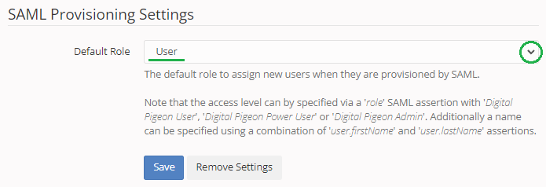
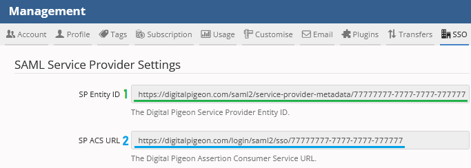
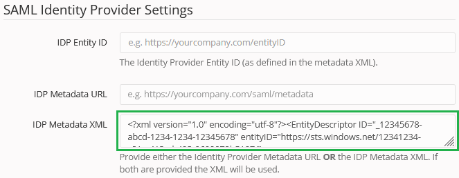
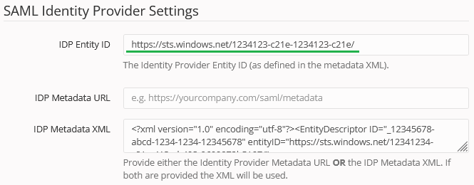

# Azure Active Directory SSO integration with Digital Pigeon

In this article, you'll learn how to integrate Digital Pigeon with Azure Active Directory (Azure AD). Digital Pigeon helps creative people deliver their work, beautifully and quickly.  Whatever your needs, Digital Pigeon makes sending and receiving large files seamless. When you integrate Digital Pigeon with Azure AD, you can:

* Control in Azure AD who has access to Digital Pigeon.
* Enable your users to be automatically signed-in to Digital Pigeon with their Azure AD accounts.
* Manage your accounts in one central location - the Azure portal.

You'll configure and test Azure AD single sign-on for Digital Pigeon in a test environment. Digital Pigeon supports both **SP** and **IDP** initiated single sign-on and also supports **Just In Time** user provisioning.

## Prerequisites

To integrate Azure Active Directory with Digital Pigeon, you need:

* An Azure AD user account. If you don't already have one, you can [Create an account for free](https://azure.microsoft.com/free/?WT.mc_id=A261C142F).
* One of the following roles: Global Administrator, Cloud Application Administrator, Application Administrator, or owner of the service principal.
* An Azure AD subscription. If you don't have a subscription, you can get a [free account](https://azure.microsoft.com/free/).
* Digital Pigeon single sign-on (SSO) enabled subscription (i.e.: Business or Enterprise plans)
* Digital Pigeon account owner access to the above subscription

## Add application and assign a test user

Before you begin the process of configuring single sign-on, you need to add the Digital Pigeon application from the Azure AD gallery. You need a test user account to assign to the application and test the single sign-on configuration.

### Add Digital Pigeon from the Azure AD gallery

Add Digital Pigeon from the Azure AD application gallery to configure single sign-on with Digital Pigeon. For more information on how to add application from the gallery, see the [Quickstart: Add application from the gallery](../manage-apps/add-application-portal.md).

### Create and assign Azure AD test user

Follow the guidelines in the [create and assign a user account](../manage-apps/add-application-portal-assign-users.md) article to create a test user account in the Azure portal called B.Simon.

   > [!NOTE]
   > Please click [here](../develop/howto-add-app-roles-in-azure-ad-apps.md#app-roles-ui) to learn how to configure App Roles in Azure AD. The Role value must be one of 'Digital Pigeon User', 'Digital Pigeon Power User', or 'Digital Pigeon Admin'. If a role claim is not supplied, the default role is configurable in the Digital Pigeon app (`Account Settings > SSO > SAML Provisioning Settings`) by a Digital Pigeon Owner, as seen below:
   

Alternatively, you can also use the [Enterprise App Configuration Wizard](https://portal.office.com/AdminPortal/home?Q=Docs#/azureadappintegration). In this wizard, you can add an application to your tenant, add users/groups to the app, and assign roles. The wizard also provides a link to the single sign-on configuration pane in the Azure portal. [Learn more about Microsoft 365 wizards.](/microsoft-365/admin/misc/azure-ad-setup-guides). 

## Configure Azure AD SSO

Complete the following steps to enable Azure AD single sign-on in the Azure portal.

1. In the Azure portal, on the **Digital Pigeon** application integration page, find the **Manage** section and select **single sign-on**.
1. On the **Select a single sign-on method** page, select **SAML**.
1. On the **Set up single sign-on with SAML** page, select the pencil icon for **Basic SAML Configuration** to edit the settings.

   

1. In another browser tab, log in to Digital Pigeon as an account administrator.

1. Navigate to **Account Settings > SSO** and copy the **SP Entity ID** and **SP ACS URL** values.

    

1. Now in Azure AD, in the **Basic SAML Configuration** section, perform the following steps:

    a. In the **Identifier** textbox, paste the value from _Digital Pigeon > Account Settings > SSO > **SP Entity ID**_.
    It should match the following pattern: `https://digitalpigeon.com/saml2/service-provider-metadata/<CustomerID>`

    b. In the **Reply URL** textbox, paste the value from _Digital Pigeon > Account Settings > SSO > **SP ACS URL**_.
    It should match the following pattern: `https://digitalpigeon.com/login/saml2/sso/<CustomerID>`  

1. Click **Set additional URLs** and perform the following step if you wish to configure the application in **SP** initiated mode:

    In the **Sign on URL** textbox, type the URL:
    `https://digitalpigeon.com/login`

1. Digital Pigeon application expects the SAML assertions in a specific format, which requires you to add custom attribute mappings to your SAML token attributes configuration. The following screenshot shows the list of default attributes.

    

1. In addition to above, Digital Pigeon application expects few more attributes to be passed back in SAML response, which are shown below. These attributes are also pre populated but you can review them as per your requirements.

    | Name | Source Attribute|
    | ------------ | --------- |
    | user.firstName | user.givenname |
    | user.lastName | user.surname |

1. On the **Set-up single sign-on with SAML** page, in the **SAML Signing Certificate** section,  find **Federation Metadata XML** and select **Download** to download the certificate and save it on your computer.

    

1. In Digital Pigeon, paste the content of downloaded **Federation Metadata XML** file into the **IDP Metadata XML** text field.

    

1. In Azure AD, on the **Set up Digital Pigeon** section, copy the Azure AD Identifier URL.

	

1. In Digital Pigeon, paste this URL into the **IDP Entity ID** text field.

    

1. Click **Save** button to activate Digital Pigeon SSO.

### Create Digital Pigeon test user

In this section, a user called B.Simon is created in Digital Pigeon. Digital Pigeon supports just-in-time user provisioning, which is enabled by default. There is no action item for you in this section. If a user doesn't already exist in Digital Pigeon, a new one is created after authentication.

## Test SSO 

In this section, you test your Azure AD single sign-on configuration with following options. 

#### SP initiated:

* Click on **Test this application** in Azure portal. This will redirect to Digital Pigeon Sign on URL where you can initiate the login flow.  

* Go to Digital Pigeon Sign on URL directly and initiate the login flow from there.

#### IDP initiated:

* Click on **Test this application** in Azure portal and you should be automatically signed in to the Digital Pigeon for which you set up the SSO. 

You can also use Microsoft My Apps to test the application in any mode. When you click the Digital Pigeon tile in the My Apps, if configured in SP mode you would be redirected to the application sign-on page for initiating the login flow and if configured in IDP mode, you should be automatically signed in to the Digital Pigeon for which you set up the SSO. For more information about the My Apps, see [Introduction to the My Apps](../user-help/my-apps-portal-end-user-access.md).

## Additional resources

* Should you run into any issues or require additional support, please contact the [Digital Pigeon support team](mailto:help@digitalpigeon.com)
* For an alternative step-by-step guide, please refer to the Digital Pigeon KB article: [Azure AD SSO Configuration](https://digitalpigeon.zendesk.com/hc/en-us/articles/5403612403855-Azure-AD-SSO-Configuration)
* [What is single sign-on with Azure Active Directory?](../manage-apps/what-is-single-sign-on.md)
* [Plan a single sign-on deployment](../manage-apps/plan-sso-deployment.md).

## Next steps

Once you configure Digital Pigeon you can enforce session control, which protects exfiltration and infiltration of your organization’s sensitive data in real time. Session control extends from Conditional Access. [Learn how to enforce session control with Microsoft Cloud App Security](/cloud-app-security/proxy-deployment-aad).