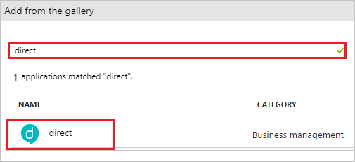
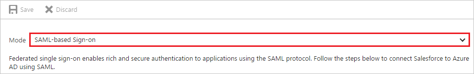
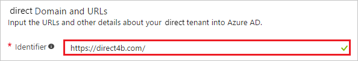
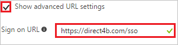
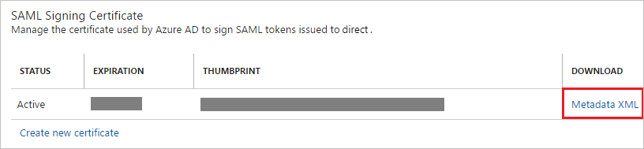
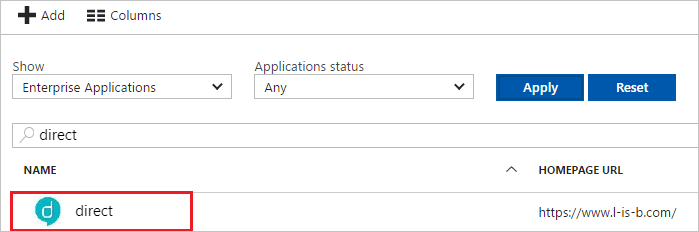

---
title: 'Tutorial: Azure Active Directory integration with direct | Microsoft Docs'
description: Learn how to configure single sign-on between Azure Active Directory and direct.
services: active-directory
documentationCenter: na
author: jeevansd
manager: mtillman

ms.assetid: 7c2cd1f0-d14c-42f0-94a8-9b800008b285
ms.service: active-directory
ms.component: saas-app-tutorial
ms.workload: identity
ms.tgt_pltfrm: na
ms.devlang: na
ms.topic: article
ms.date: 09/06/2018
ms.author: jeedes

---
# Tutorial: Azure Active Directory integration with direct

In this tutorial, you learn how to integrate direct with Azure Active Directory (Azure AD).

Integrating direct with Azure AD provides you with the following benefits:

- You can control in Azure AD who has access to direct
- You can enable your users to automatically get signed-on to direct (Single Sign-On) with their Azure AD accounts
- You can manage your accounts in one central location - the Azure portal

If you want to know more details about SaaS app integration with Azure AD, see [what is application access and single sign-on with Azure Active Directory](../manage-apps/what-is-single-sign-on.md).

## Prerequisites

To configure Azure AD integration with direct, you need the following items:

- An Azure AD subscription
- A direct single sign-on enabled subscription

> [!NOTE]
> To test the steps in this tutorial, we do not recommend using a production environment.

To test the steps in this tutorial, you should follow these recommendations:

- Do not use your production environment, unless it is necessary.
- If you don't have an Azure AD trial environment, you can get a one-month trial [here](https://azure.microsoft.com/pricing/free-trial/).

## Scenario description

In this tutorial, you test Azure AD single sign-on in a test environment.
The scenario outlined in this tutorial consists of two main building blocks:

1. Adding direct from the gallery
2. Configuring and testing Azure AD single sign-on

## Adding direct from the gallery

To configure the integration of direct into Azure AD, you need to add direct from the gallery to your list of managed SaaS apps.

**To add direct from the gallery, perform the following steps:**

1. In the **[Azure portal](https://portal.azure.com)**, on the left navigation panel, click **Azure Active Directory** icon. 

	![Active Directory][1]

2. Navigate to **Enterprise applications**. Then go to **All applications**.

	![Applications][2]

3. To add new application, click **New application** button on the top of dialog.

	![Applications][3]

4. In the search box, type **direct**. Select **direct** from the results panel, and then select the **Add** button to add the application.

	

## Configuring and testing Azure AD single sign-on

In this section, you configure and test Azure AD single sign-on with direct based on a test user called "Britta Simon."

For single sign-on to work, Azure AD needs to know what the counterpart user in direct is to a user in Azure AD. In other words, a link relationship between an Azure AD user and the related user in direct needs to be established.

In direct, assign the value of the **user name** in Azure AD as the value of the **Username** to establish the link relationship.

To configure and test Azure AD single sign-on with direct, you need to complete the following building blocks:

1. **[Configuring Azure AD Single Sign-On](#configuring-azure-ad-single-sign-on)** - to enable your users to use this feature.
2. **[Creating an Azure AD test user](#creating-an-azure-ad-test-user)** - to test Azure AD single sign-on with Britta Simon.
3. **[Creating a direct test user](#creating-a-direct-test-user)** - to have a counterpart of Britta Simon in direct that is linked to the Azure AD representation of user.
4. **[Assigning the Azure AD test user](#assigning-the-azure-ad-test-user)** - to enable Britta Simon to use Azure AD single sign-on.
5. **[Testing Single Sign-On](#testing-single-sign-on)** - to verify whether the configuration works.

### Configuring Azure AD single sign-on

In this section, you enable Azure AD single sign-on in the Azure portal and configure single sign-on in your direct application.

**To configure Azure AD single sign-on with direct, perform the following steps:**

1. In the Azure portal, on the **direct** application integration page, click **Single sign-on**.

	![Configure Single Sign-On][4]

2. On the **Single sign-on** dialog, select **Mode** as	**SAML-based Sign-on** to enable single sign-on.
 
	

3. On the **direct Domain and URLs** section, If you wish to configure the application in **IDP** initiated mode:

	

    In the **Identifier** textbox, type the URL: `https://direct4b.com/`

4. Check **Show advanced URL settings**, If you wish to configure the application in **SP** initiated mode:

    

	 In the **Sign-on URL** textbox, type the URL: `https://direct4b.com/sso` 

5. On the **SAML Signing Certificate** section, click **Metadata XML** and then save the metadata file on your computer.

	 

6. Click **Save** button.

	

7. To configure single sign-on on **direct** side, you need to send the downloaded **Metadata XML** to [direct support team](https://direct4b.com/ja/support.html#inquiry).

### Creating an Azure AD test user

The objective of this section is to create a test user in the Azure portal called Britta Simon.

![Create Azure AD User][100]

**To create a test user in Azure AD, perform the following steps:**

1. In the **Azure portal**, on the left navigation pane, click **Azure Active Directory** icon.

	 

2. To display the list of users, go to **Users and groups** and click **All users**.
	
	 

3. To open the **User** dialog, click **Add** on the top of the dialog.

	 

4. On the **User** dialog page, perform the following steps:

	 

    a. In the **Name** textbox, type **BrittaSimon**.

    b. In the **User name** textbox, type the **email address** of BrittaSimon.

	c. Select **Show Password** and write down the value of the **Password**.

    d. Click **Create**.

### Creating a direct test user

In this section, you create a user called Britta Simon in direct. Work with [direct support team](https://direct4b.com/ja/support.html#inquiry) to add the users in the direct platform. Users must be created and activated before you use single sign-on. 

### Assigning the Azure AD test user

In this section, you enable Britta Simon to use Azure single sign-on by granting access to direct.

![Assign User][200] 

**To assign Britta Simon to direct, perform the following steps:**

1. In the Azure portal, open the applications view, and then navigate to the directory view and go to **Enterprise applications** then click **All applications**.

	![Assign User][201] 

2. In the applications list, select **direct**.

	 

3. In the menu on the left, click **Users and groups**.

	![Assign User][202] 

4. Click **Add** button. Then select **Users and groups** on **Add Assignment** dialog.

	![Assign User][203]

5. On **Users and groups** dialog, select **Britta Simon** in the Users list.

6. Click **Select** button on **Users and groups** dialog.

7. Click **Assign** button on **Add Assignment** dialog.

### Testing single sign-on

In this section, you test your Azure AD single sign-on configuration using the Access Panel.

1. If you wish to test in **IDP Initiated Mode**:

	When you click the **direct** tile in the Access Panel, you should get automatically signed-on to your **direct** application.

2. If you wish to test in **SP Initiated Mode**:

	a. Click on the **direct** tile in the Access Panel and you will be redirected to the application sign-on page.

	b. Input your `subdomain` in the textbox displayed and press '次へ (Next)' and you should get automatically signed-on to your **direct** application .

For more information about the Access Panel, see [Introduction to the Access Panel](../user-help/active-directory-saas-access-panel-introduction.md).

## Additional resources

* [List of Tutorials on How to Integrate SaaS Apps with Azure Active Directory](tutorial-list.md)
* [What is application access and single sign-on with Azure Active Directory?](../manage-apps/what-is-single-sign-on.md)

<!--Image references-->

[1]: ./media/direct-tutorial/tutorial_general_01.png
[2]: ./media/direct-tutorial/tutorial_general_02.png
[3]: ./media/direct-tutorial/tutorial_general_03.png
[4]: ./media/direct-tutorial/tutorial_general_04.png

[100]: ./media/direct-tutorial/tutorial_general_100.png

[200]: ./media/direct-tutorial/tutorial_general_200.png
[201]: ./media/direct-tutorial/tutorial_general_201.png
[202]: ./media/direct-tutorial/tutorial_general_202.png
[203]: ./media/direct-tutorial/tutorial_general_203.png