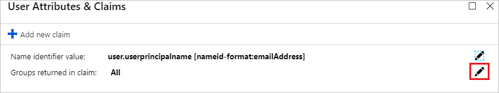
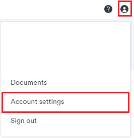
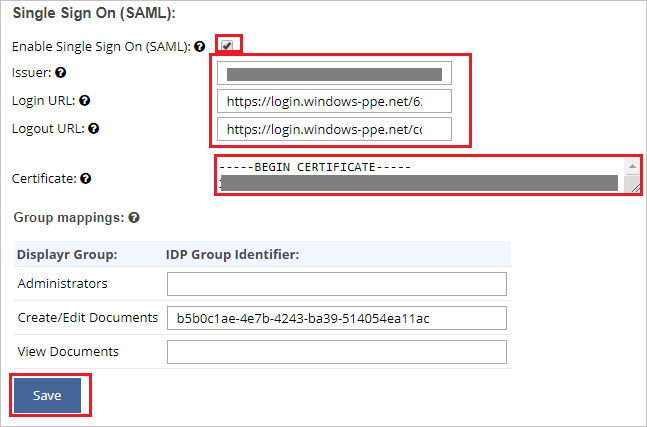
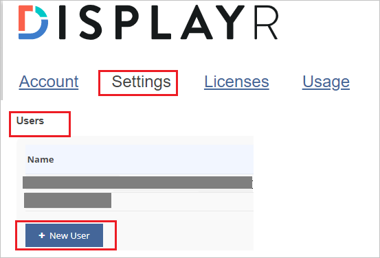
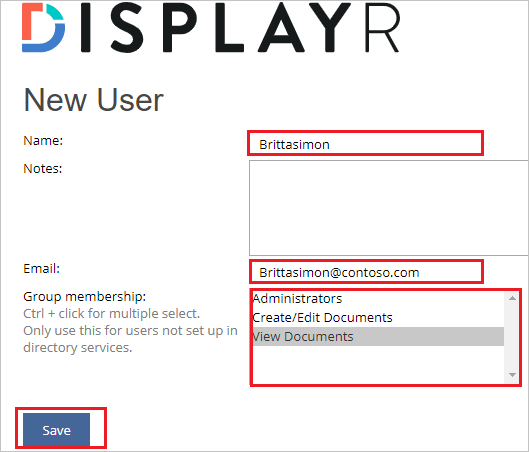

# Tutorial: Integrate Displayr with Azure Active Directory

In this tutorial, you'll learn how to integrate Displayr with Azure Active Directory (Azure AD). When you integrate Displayr with Azure AD, you can:

* Control in Azure AD who has access to Displayr.
* Enable your users to be automatically signed-in to Displayr with their Azure AD accounts.
* Manage your accounts in one central location - the Azure portal.

To learn more about SaaS app integration with Azure AD, see [What is application access and single sign-on with Azure Active Directory](https://docs.microsoft.com/azure/active-directory/active-directory-appssoaccess-whatis).

## Prerequisites

To get started, you need the following items:

* An Azure AD subscription. If you don't have a subscription, you can get a [free account](https://azure.microsoft.com/free/).
* Displayr single sign-on (SSO) enabled subscription.

## Scenario description

In this tutorial, you configure and test Azure AD SSO in a test environment. Displayr supports **SP** initiated SSO.

## Adding Displayr from the gallery

To configure the integration of Displayr into Azure AD, you need to add Displayr from the gallery to your list of managed SaaS apps.

1. Sign in to the [Azure portal](https://portal.azure.com) using either a work or school account, or a personal Microsoft account.
1. On the left navigation pane, select the **Azure Active Directory** service.
1. Navigate to **Enterprise Applications** and then select **All Applications**.
1. To add new application, select **New application**.
1. In the **Add from the gallery** section, type **Displayr** in the search box.
1. Select **Displayr** from results panel and then add the app. Wait a few seconds while the app is added to your tenant.

## Configure and test Azure AD single sign-on

Configure and test Azure AD SSO with Displayr using a test user called **Britta Simon**. For SSO to work, you need to establish a link relationship between an Azure AD user and the related user in Displayr.

To configure and test Azure AD SSO with Displayr, complete the following building blocks:

1. **[Configure Azure AD SSO](#configure-azure-ad-sso)** to enable your users to use this feature.
2. **[Configure Displayr](#configure-displayr)** to configure the SSO settings on application side.
3. **[Create an Azure AD test user](#create-an-azure-ad-test-user)** to test Azure AD single sign-on with Britta Simon.
4. **[Assign the Azure AD test user](#assign-the-azure-ad-test-user)** to enable Britta Simon to use Azure AD single sign-on.
5. **[Create Displayr test user](#create-displayr-test-user)** to have a counterpart of Britta Simon in Displayr that is linked to the Azure AD representation of user.
6. **[Test SSO](#test-sso)** to verify whether the configuration works.

### Configure Azure AD SSO

Follow these steps to enable Azure AD SSO in the Azure portal.

1. In the [Azure portal](https://portal.azure.com/), on the **Displayr** application integration page, find the **Manage** section and select **Single sign-on**.
1. On the **Select a Single sign-on method** page, select **SAML**.
1. On the **Set-up Single Sign-On with SAML** page, click the edit/pen icon for **Basic SAML Configuration** to edit the settings.

   

1. On the **Basic SAML Configuration** section, perform the following step:

	a. In the **Sign-on URL** text box, type a URL using the following pattern:
    `https://<YOURDOMAIN>.displayr.com`

	b. In the **Identifier (Entity ID)** text box, type a URL using the following pattern:`<YOURDOMAIN>.displayr.com`

	>[!NOTE]
	>These values are not real. Update these values with the actual Sign on URL and Identifier. Contact [Displayr Client support team](mailto:support@displayr.com) to get these values. You can also refer to the patterns shown in the Basic SAML Configuration section in the Azure portal.

1. On the **Set-up Single Sign-On with SAML** page, in the **SAML Signing Certificate** section, find **Certificate (Base64)** and select **Download** to download the certificate and save it on your computer.

   

1. Displayr application expects the SAML assertions in a specific format, which requires you to add custom attribute mappings to your SAML token attributes configuration. The following screenshot shows the list of default attributes. Click **Edit** icon to open User Attributes dialog.

	

1. In addition to above, Displayr application expects few more attributes to be passed back in SAML response. In the **User Attributes & Claims** section on the **Group Claims (Preview)** dialog, perform the following steps:

	a. Click the **pen** next to **Groups returned in claim**.

	

	

	b. Select **All Groups** from the radio list.

	c. Select **Source Attribute** of **Group ID**.

	d. Check **Customize the name of the group claim**.

	e. Check **Emit groups as role claims**.

	f. Click **Save**.

1. On the **Set-up Displayr** section, copy the appropriate URL(s) based on your requirement.

   

### Configure Displayr

1. To automate the configuration within Displayr, you need to install **My Apps Secure Sign-in browser extension** by clicking **Install the extension**.

	

2. After adding extension to the browser, click on **Setup Displayr** will direct you to the Displayr application. From there, provide the admin credentials to sign into Displayr. The browser extension will automatically configure the application for you and automate steps 3-6.

	

3. If you want to set up Displayr manually, open a new web browser window and sign into your Displayr company site as an administrator and perform the following steps:

4. Click on **Settings** then navigate to **Account**.

	

5. Switch to **Settings** from the top menu and scroll down the page for clicking **Configure Single Sign On (SAML)**.

	

6. On the **Single Sign On (SAML)** page, perform the following steps:

	

	a. Check the **Enable Single Sign On (SAML)** box.

	b. Copy the actual **Identifier** value from the **Basic SAML Configuration** section of Azure AD and paste it into the **Issuer** text box.

	c. In the **Login URL** text box, paste the value of **Login URL**, which you have copied from Azure portal.

	d. In the **Logout URL** text box, paste the value of **Logout URL**, which you have copied from Azure portal.

	e. Open the Certificate (Base64) in Notepad, copy its content and paste it into the **Certificate** text box.

	f. **Group mappings** are optional.

	g. Click **Save**.	

### Create an Azure AD test user

In this section, you'll create a test user in the Azure portal called Britta Simon.

1. From the left pane in the Azure portal, select **Azure Active Directory**, select **Users**, and then select **All users**.
1. Select **New user** at the top of the screen.
1. In the **User** properties, follow these steps:
   1. In the **Name** field, enter `Britta Simon`.  
   1. In the **User name** field, enter the username@companydomain.extension. For example, `BrittaSimon@contoso.com`.
   1. Select the **Show password** check box, and then write down the value that's displayed in the **Password** box.
   1. Click **Create**.

### Assign the Azure AD test user

In this section, you'll enable Britta Simon to use Azure single sign-on by granting access to Displayr.

1. In the Azure portal, select **Enterprise Applications**, and then select **All applications**.
1. In the applications list, select **Displayr**.
1. In the app's overview page, find the **Manage** section and select **Users and groups**.

   

1. Select **Add user**, then select **Users and groups** in the **Add Assignment** dialog.

	

1. In the **Users and groups** dialog, select **Britta Simon** from the Users list, then click the **Select** button at the bottom of the screen.
1. If you're expecting any role value in the SAML assertion, in the **Select Role** dialog, select the appropriate role for the user from the list and then click the **Select** button at the bottom of the screen.
1. In the **Add Assignment** dialog, click the **Assign** button.

### Create Displayr test user

To enable Azure AD users, sign in to Displayr, they must be provisioned into Displayr. In Displayr, provisioning is a manual task.

**To provision a user account, perform the following steps:**

1. Sign in to Displayr as an Administrator.

2. Click on **Settings** then navigate to **Account**.

	

3. Switch to **Settings** from the top menu and scroll down the page, until **Users** section then click on **New User**.

	

4. On the **New User** page, perform the following steps:

	

	a. In **Name** text box, enter the name of user like **Brittasimon**.

	b. In **Email** text box, enter the email of user like `Brittasimon@contoso.com`.

	c. Select your appropriate **Group membership**.

	d. Click **Save**.

### Test SSO

When you select the Displayr tile in the Access Panel, you should be automatically signed in to the Displayr for which you set up SSO. For more information about the Access Panel, see [Introduction to the Access Panel](https://docs.microsoft.com/azure/active-directory/active-directory-saas-access-panel-introduction).

## Additional Resources

- [List of Tutorials on How to Integrate SaaS Apps with Azure Active Directory](https://docs.microsoft.com/azure/active-directory/active-directory-saas-tutorial-list)

- [What is application access and single sign-on with Azure Active Directory?](https://docs.microsoft.com/azure/active-directory/active-directory-appssoaccess-whatis)

- [What is Conditional Access in Azure Active Directory?](https://docs.microsoft.com/azure/active-directory/conditional-access/overview)
