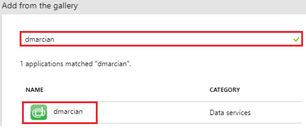
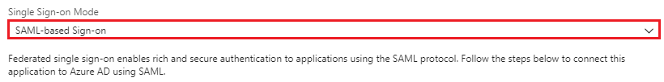
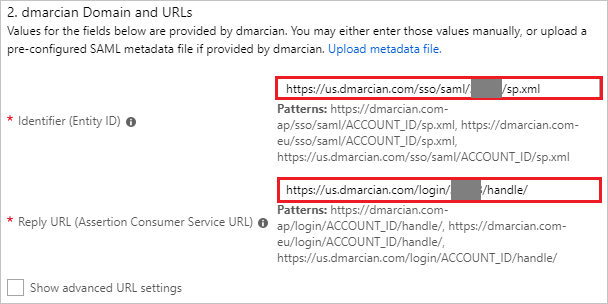
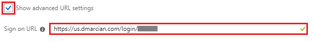
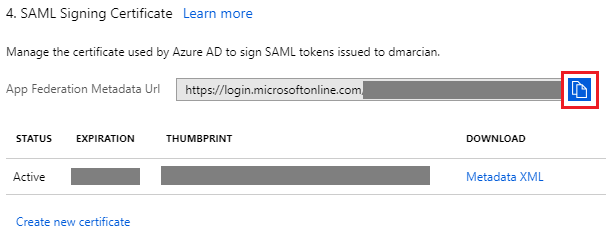
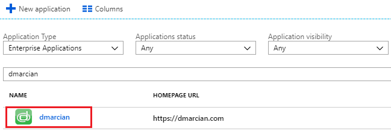

# Tutorial: Azure Active Directory integration with dmarcian

In this tutorial, you learn how to integrate dmarcian with Azure Active Directory (Azure AD).

Integrating dmarcian with Azure AD provides you with the following benefits:

- You can control in Azure AD who has access to dmarcian.
- You can enable your users to automatically get signed-on to dmarcian (Single Sign-On) with their Azure AD accounts.
- You can manage your accounts in one central location - the Azure portal.

If you want to know more details about SaaS app integration with Azure AD, see [what is application access and single sign-on with Azure Active Directory](../manage-apps/what-is-single-sign-on.md).

## Prerequisites

To configure Azure AD integration with dmarcian, you need the following items:

- An Azure AD subscription
- A dmarcian single sign-on enabled subscription

> [!NOTE]
> To test the steps in this tutorial, we do not recommend using a production environment.

To test the steps in this tutorial, you should follow these recommendations:

- Do not use your production environment, unless it is necessary.
- If you don't have an Azure AD trial environment, you can [get a one-month trial](https://azure.microsoft.com/pricing/free-trial/).

## Scenario description
In this tutorial, you test Azure AD single sign-on in a test environment. 
The scenario outlined in this tutorial consists of two main building blocks:

1. Adding dmarcian from the gallery
2. Configuring and testing Azure AD single sign-on

## Adding dmarcian from the gallery
To configure the integration of dmarcian into Azure AD, you need to add dmarcian from the gallery to your list of managed SaaS apps.

**To add dmarcian from the gallery, perform the following steps:**

1. In the **[Azure portal](https://portal.azure.com)**, on the left navigation panel, click **Azure Active Directory** icon. 

	![The Azure Active Directory button][1]

2. Navigate to **Enterprise applications**. Then go to **All applications**.

	![The Enterprise applications][2]
	
3. To add new application, click **New application** button on the top of dialog.

	![The New application button][3]

4. In the search box, type **dmarcian**, select **dmarcian** from result panel then click **Add** button to add the application.

	

## Configure and test Azure AD single sign-on

In this section, you configure and test Azure AD single sign-on with dmarcian based on a test user called "Britta Simon".

For single sign-on to work, Azure AD needs to know what the counterpart user in dmarcian is to a user in Azure AD. In other words, a link relationship between an Azure AD user and the related user in dmarcian needs to be established.

To configure and test Azure AD single sign-on with dmarcian, you need to complete the following building blocks:

1. **[Configure Azure AD Single Sign-On](#configure-azure-ad-single-sign-on)** - to enable your users to use this feature.
2. **[Create an Azure AD test user](#create-an-azure-ad-test-user)** - to test Azure AD single sign-on with Britta Simon.
3. **[Create a dmarcian test user](#create-a-dmarcian-test-user)** - to have a counterpart of Britta Simon in dmarcian that is linked to the Azure AD representation of user.
4. **[Assign the Azure AD test user](#assign-the-azure-ad-test-user)** - to enable Britta Simon to use Azure AD single sign-on.
5. **[Test single sign-on](#test-single-sign-on)** - to verify whether the configuration works.

### Configure Azure AD single sign-on

In this section, you enable Azure AD single sign-on in the Azure portal and configure single sign-on in your dmarcian application.

**To configure Azure AD single sign-on with dmarcian, perform the following steps:**

1. In the Azure portal, on the **dmarcian** application integration page, click **Single sign-on**.

	![Configure single sign-on link][4]

2. On the **Single sign-on** dialog, select **Mode** as	**SAML-based Sign-on** to enable single sign-on.
 
	

3. On the **dmarcian Domain and URLs** section, perform the following steps if you wish to configure the application in **IDP** initiated mode:

	

    a. In the **Identifier** textbox, type a URL using the following pattern:
	| |
	| -- |
	| `https://us.dmarcian.com/sso/saml/<ACCOUNT_ID>/sp.xml` |
	| `https://dmarcian-eu.com/sso/saml/<ACCOUNT_ID>/sp.xml` |
	| `https://dmarcian-ap.com/sso/saml/<ACCOUNT_ID>/sp.xml` |

	b. In the **Reply URL** textbox, type a URL using the following pattern:
	| |
	|--|
	| `https://us.dmarcian.com/login/<ACCOUNT_ID>/handle/` |
	| `https://dmarcian-eu.com/login/<ACCOUNT_ID>/handle/` |
	| `https://dmarcian-ap.com/login/<ACCOUNT_ID>/handle/` |

4. Check **Show advanced URL settings** and perform the following step if you wish to configure the application in **SP** initiated mode:

	

    In the **Sign-on URL** textbox, type a URL using the following pattern:
	| |
	|--|
	| `https://us.dmarcian.com/login/<ACCOUNT_ID>` |
	| `https://dmarcian-eu.com/login/<ACCOUNT_ID>` |
	| `https://dmarciam-ap.com/login/<ACCOUNT_ID>` |
	 
	> [!NOTE] 
	> These values are not real. You will update these values with the actual Identifier, Reply URL and Sign-On URL which is explained later in the tutorial. 

5. On the **SAML Signing Certificate** section, click the copy button to copy **App Federation Metadata Url** and paste it into notepad.

	 

6. Click **Save** button.

	
	
7. In a different web browser window, sign in to dmarcian as a Security Administrator.

8. Click on **Profile** on the top right corner and navigate to **Preferences**.

	

9. Scroll down and click on **Single Sign-On** section, then click on **Configure**.

	

10. On the **SAML Single Sign-On** page set the **Status** as **Enabled** and perform the following steps:

	

	* Under **Add dmarcian to your Identity Provider** section, click **COPY** to copy the **Assertion Consumer Service URL** for your instance and paste it in **Reply URL** textbox in **dmarcian Domain and URLs section** on Azure portal.

	* Under **Add dmarcian to your Identity Provider** section, click **COPY** to copy the **Entity ID** for your instance and paste it in **Identifier** textbox in **dmarcian Domain and URLs section** on Azure portal.

	* Under **Set up Authentication** section, in the **Identity Provider Metadata** textbox paste the **App Federation Metadata Url**, which you have copied from Azure portal.

	* Under **Set up Authentication** section, in the **Attribute Statements** textbox paste the url `http://schemas.xmlsoap.org/ws/2005/05/identity/claims/emailaddress`.

	* Under **Set up Login URL** section, copy the **Login URL** for your instance and paste it in **Sign-on URL** textbox in **dmarcian Domain and URLs section** on Azure portal.

		> [!Note]
		> You can modify the **Login URL** according to your organisation.

	* Click **Save**.

### Create an Azure AD test user

The objective of this section is to create a test user in the Azure portal called Britta Simon.

   ![Create an Azure AD test user][100]

**To create a test user in Azure AD, perform the following steps:**

1. In the Azure portal, in the left pane, click the **Azure Active Directory** button.

    

2. To display the list of users, go to **Users and groups**, and then click **All users**.

    

3. To open the **User** dialog box, click **Add** at the top of the **All Users** dialog box.

    

4. In the **User** dialog box, perform the following steps:

    

    a. In the **Name** box, type **BrittaSimon**.

    b. In the **User name** box, type the email address of user Britta Simon.

    c. Select the **Show Password** check box, and then write down the value that's displayed in the **Password** box.

    d. Click **Create**.
 
### Create a dmarcian test user

To enable Azure AD users to sign in to dmarcian, they must be provisioned into dmarcian. In dmarcian, provisioning is a manual task.

**To provision a user account, perform the following steps:**

1. Sign in to dmarcian as a Security Administrator.

2. Click on **Profile** on the top right corner and navigate to **Manage Users**.

	

3. On the right side of **SSO Users** section, click on **Add New User**.

	

4. On the **Add New User** popup, perform the following steps:

	

	a. In the **New User Email** textbox, enter the email of user like **brittasimon@contoso.com**.

	b. If you want to give admin rights to the user, select **Make User an Admin**.

	c. Click **Add User**.

### Assign the Azure AD test user

In this section, you enable Britta Simon to use Azure single sign-on by granting access to dmarcian.

![Assign the user role][200] 

**To assign Britta Simon to dmarcian, perform the following steps:**

1. In the Azure portal, open the applications view, and then navigate to the directory view and go to **Enterprise applications** then click **All applications**.

	![Assign User][201] 

2. In the applications list, select **dmarcian**.

	  

3. In the menu on the left, click **Users and groups**.

	![The "Users and groups" link][202]

4. Click **Add** button. Then select **Users and groups** on **Add Assignment** dialog.

	![The Add Assignment pane][203]

5. On **Users and groups** dialog, select **Britta Simon** in the Users list.

6. Click **Select** button on **Users and groups** dialog.

7. Click **Assign** button on **Add Assignment** dialog.
	
### Test single sign-on

In this section, you test your Azure AD single sign-on configuration using the Access Panel.

When you click the dmarcian tile in the Access Panel, you should get automatically signed-on to your dmarcian application.
For more information about the Access Panel, see [Introduction to the Access Panel](../active-directory-saas-access-panel-introduction.md). 

## Additional resources

* [List of Tutorials on How to Integrate SaaS Apps with Azure Active Directory](tutorial-list.md)
* [What is application access and single sign-on with Azure Active Directory?](../manage-apps/what-is-single-sign-on.md)

<!--Image references-->

[1]: ./media/dmarcian-tutorial/tutorial_general_01.png
[2]: ./media/dmarcian-tutorial/tutorial_general_02.png
[3]: ./media/dmarcian-tutorial/tutorial_general_03.png
[4]: ./media/dmarcian-tutorial/tutorial_general_04.png

[100]: ./media/dmarcian-tutorial/tutorial_general_100.png

[200]: ./media/dmarcian-tutorial/tutorial_general_200.png
[201]: ./media/dmarcian-tutorial/tutorial_general_201.png
[202]: ./media/dmarcian-tutorial/tutorial_general_202.png
[203]: ./media/dmarcian-tutorial/tutorial_general_203.png

