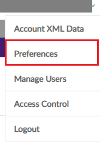
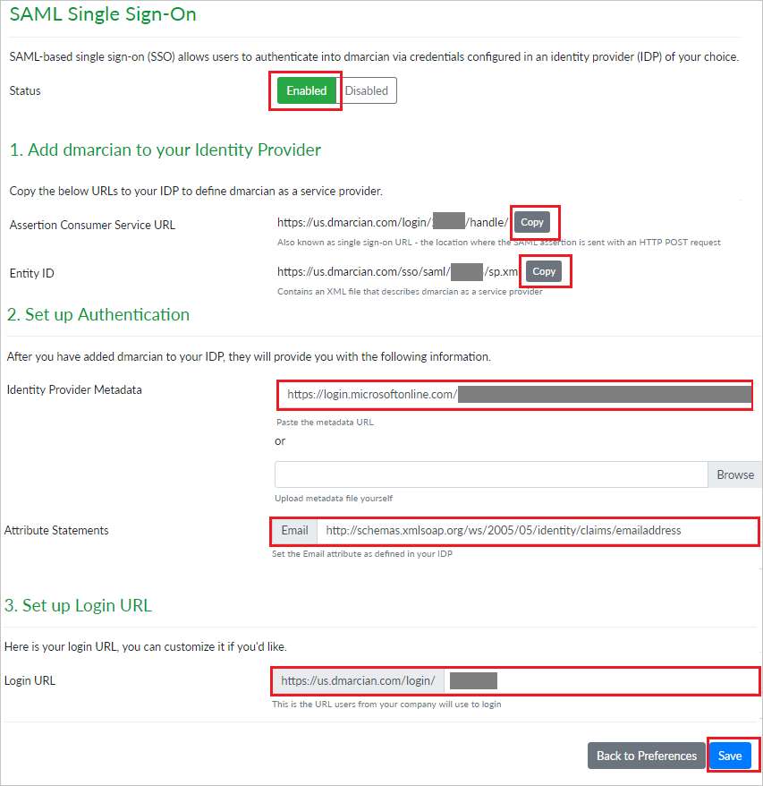
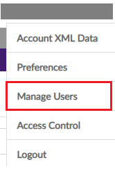
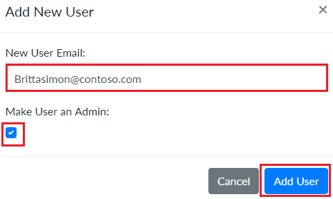

# Tutorial: Azure Active Directory integration with dmarcian

In this tutorial, you learn how to integrate dmarcian with Azure Active Directory (Azure AD).
Integrating dmarcian with Azure AD provides you with the following benefits:

* You can control in Azure AD who has access to dmarcian.
* You can enable your users to be automatically signed-in to dmarcian (Single Sign-On) with their Azure AD accounts.
* You can manage your accounts in one central location - the Azure portal.

If you want to know more details about SaaS app integration with Azure AD, see [What is application access and single sign-on with Azure Active Directory](https://docs.microsoft.com/azure/active-directory/active-directory-appssoaccess-whatis).
If you don't have an Azure subscription, [create a free account](https://azure.microsoft.com/free/) before you begin.

## Prerequisites

To configure Azure AD integration with dmarcian, you need the following items:

* An Azure AD subscription. If you don't have an Azure AD environment, you can get one-month trial [here](https://azure.microsoft.com/pricing/free-trial/)
* dmarcian single sign-on enabled subscription

## Scenario description

In this tutorial, you configure and test Azure AD single sign-on in a test environment.

* dmarcian supports **SP** and **IDP** initiated SSO

## Adding dmarcian from the gallery

To configure the integration of dmarcian into Azure AD, you need to add dmarcian from the gallery to your list of managed SaaS apps.

**To add dmarcian from the gallery, perform the following steps:**

1. In the **[Azure portal](https://portal.azure.com)**, on the left navigation panel, click **Azure Active Directory** icon.

	

2. Navigate to **Enterprise Applications** and then select the **All Applications** option.

	

3. To add new application, click **New application** button on the top of dialog.

	

4. In the search box, type **dmarcian**, select **dmarcian** from result panel then click **Add** button to add the application.

	 

## Configure and test Azure AD single sign-on

In this section, you configure and test Azure AD single sign-on with dmarcian based on a test user called **Britta Simon**.
For single sign-on to work, a link relationship between an Azure AD user and the related user in dmarcian needs to be established.

To configure and test Azure AD single sign-on with dmarcian, you need to complete the following building blocks:

1. **[Configure Azure AD Single Sign-On](#configure-azure-ad-single-sign-on)** - to enable your users to use this feature.
2. **[Configure dmarcian Single Sign-On](#configure-dmarcian-single-sign-on)** - to configure the Single Sign-On settings on application side.
3. **[Create an Azure AD test user](#create-an-azure-ad-test-user)** - to test Azure AD single sign-on with Britta Simon.
4. **[Assign the Azure AD test user](#assign-the-azure-ad-test-user)** - to enable Britta Simon to use Azure AD single sign-on.
5. **[Create dmarcian test user](#create-dmarcian-test-user)** - to have a counterpart of Britta Simon in dmarcian that is linked to the Azure AD representation of user.
6. **[Test single sign-on](#test-single-sign-on)** - to verify whether the configuration works.

### Configure Azure AD single sign-on

In this section, you enable Azure AD single sign-on in the Azure portal.

To configure Azure AD single sign-on with dmarcian, perform the following steps:

1. In the [Azure portal](https://portal.azure.com/), on the **dmarcian** application integration page, select **Single sign-on**.

    

2. On the **Select a Single sign-on method** dialog, select **SAML/WS-Fed** mode to enable single sign-on.

    

3. On the **Set up Single Sign-On with SAML** page, click **Edit** icon to open **Basic SAML Configuration** dialog.

	

4. On the **Basic SAML Configuration** section, If you wish to configure the application in **IDP** initiated mode, perform the following steps:

    

    a. In the **Identifier** text box, type a URL using the following pattern:

    | |
	| -- |
	| `https://us.dmarcian.com/sso/saml/<ACCOUNT_ID>/sp.xml` |
	| `https://dmarcian-eu.com/sso/saml/<ACCOUNT_ID>/sp.xml` |
	| `https://dmarcian-ap.com/sso/saml/<ACCOUNT_ID>/sp.xml` |

    b. In the **Reply URL** text box, type a URL using the following pattern:

    | |
	|--|
	| `https://us.dmarcian.com/login/<ACCOUNT_ID>/handle/` |
	| `https://dmarcian-eu.com/login/<ACCOUNT_ID>/handle/` |
	| `https://dmarcian-ap.com/login/<ACCOUNT_ID>/handle/` |

5. Click **Set additional URLs** and perform the following step if you wish to configure the application in **SP** initiated mode:

    

    In the **Sign-on URL** text box, type a URL using the following pattern:
	
    | |
	|--|
	| `https://us.dmarcian.com/login/<ACCOUNT_ID>` |
	| `https://dmarcian-eu.com/login/<ACCOUNT_ID>` |
	| `https://dmarciam-ap.com/login/<ACCOUNT_ID>` |
	 
	> [!NOTE] 
	> These values are not real. You will update these values with the actual Identifier, Reply URL and Sign-On URL which is explained later in the tutorial. 

6. On the **Set up Single Sign-On with SAML** page, In the **SAML Signing Certificate** section, click copy button to copy **App Federation Metadata Url** and save it on your computer.

	

### Configure dmarcian Single Sign-On

1. In a different web browser window, sign in to dmarcian as a Security Administrator.

2. Click on **Profile** on the top-right corner and navigate to **Preferences**.

	

3. Scroll down and click on **Single Sign-On** section, then click on **Configure**.

	

4. On the **SAML Single Sign-On** page set the **Status** as **Enabled** and perform the following steps:

	

	* Under **Add dmarcian to your Identity Provider** section, click **COPY** to copy the **Assertion Consumer Service URL** for your instance and paste it in **Reply URL** textbox in **Basic SAML Configuration section** on Azure portal.

	* Under **Add dmarcian to your Identity Provider** section, click **COPY** to copy the **Entity ID** for your instance and paste it in **Identifier** textbox in **Basic SAML Configuration section** on Azure portal.

	* Under **Set up Authentication** section, in the **Identity Provider Metadata** textbox paste the **App Federation Metadata Url**, which you have copied from Azure portal.

	* Under **Set up Authentication** section, in the **Attribute Statements** textbox paste the url `http://schemas.xmlsoap.org/ws/2005/05/identity/claims/emailaddress`

	* Under **Set up Login URL** section, copy the **Login URL** for your instance and paste it in **Sign-on URL** textbox in **Basic SAML Configuration section** on Azure portal.

		> [!Note]
		> You can modify the **Login URL** according to your organization.

	* Click **Save**.

### Create an Azure AD test user 

The objective of this section is to create a test user in the Azure portal called Britta Simon.

1. In the Azure portal, in the left pane, select **Azure Active Directory**, select **Users**, and then select **All users**.

    

2. Select **New user** at the top of the screen.

    

3. In the User properties, perform the following steps.

    

    a. In the **Name** field, enter **BrittaSimon**.
  
    b. In the **User name** field, type **brittasimon\@yourcompanydomain.extension**  
    For example, BrittaSimon@contoso.com

    c. Select **Show password** check box, and then write down the value that's displayed in the Password box.

    d. Click **Create**.

### Assign the Azure AD test user

In this section, you enable Britta Simon to use Azure single sign-on by granting access to dmarcian.

1. In the Azure portal, select **Enterprise Applications**, select **All applications**, then select **dmarcian**.

	

2. In the applications list, select **dmarcian**.

	

3. In the menu on the left, select **Users and groups**.

    

4. Click the **Add user** button, then select **Users and groups** in the **Add Assignment** dialog.

    

5. In the **Users and groups** dialog, select **Britta Simon** in the Users list, then click the **Select** button at the bottom of the screen.

6. If you are expecting any role value in the SAML assertion then in the **Select Role** dialog select the appropriate role for the user from the list, then click the **Select** button at the bottom of the screen.

7. In the **Add Assignment** dialog, click the **Assign** button.

### Create dmarcian test user

To enable Azure AD users to sign in to dmarcian, they must be provisioned into dmarcian. In dmarcian, provisioning is a manual task.

**To provision a user account, perform the following steps:**

1. Sign in to dmarcian as a Security Administrator.

2. Click on **Profile** on the top right-corner and navigate to **Manage Users**.

	

3. On the right side of **SSO Users** section, click on **Add New User**.

	

4. On the **Add New User** popup, perform the following steps:

	

	a. In the **New User Email** textbox, enter the email of user like **brittasimon\@contoso.com**.

	b. If you want to give admin rights to the user, select **Make User an Admin**.

	c. Click **Add User**.

### Test single sign-on 

In this section, you test your Azure AD single sign-on configuration using the Access Panel.

When you click the dmarcian tile in the Access Panel, you should be automatically signed in to the dmarcian for which you set up SSO. For more information about the Access Panel, see [Introduction to the Access Panel](https://docs.microsoft.com/azure/active-directory/active-directory-saas-access-panel-introduction).

## Additional Resources

- [List of Tutorials on How to Integrate SaaS Apps with Azure Active Directory](https://docs.microsoft.com/azure/active-directory/active-directory-saas-tutorial-list)

- [What is application access and single sign-on with Azure Active Directory?](https://docs.microsoft.com/azure/active-directory/active-directory-appssoaccess-whatis)

- [What is Conditional Access in Azure Active Directory?](https://docs.microsoft.com/azure/active-directory/conditional-access/overview)

