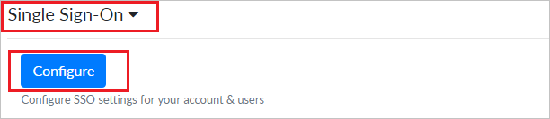
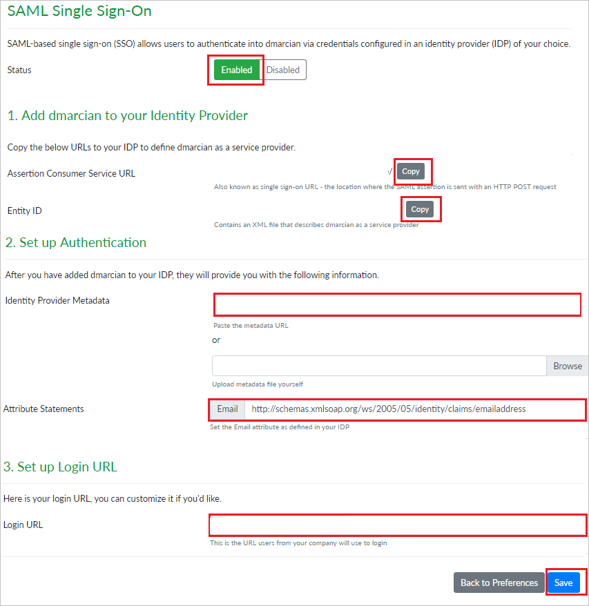
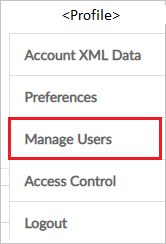

# Tutorial: Integrate dmarcian with Microsoft Entra ID

In this tutorial, you'll learn how to integrate dmarcian with Microsoft Entra ID. When you integrate dmarcian with Microsoft Entra ID, you can:

* Control in Microsoft Entra ID who has access to dmarcian.
* Enable your users to be automatically signed-in to dmarcian with their Microsoft Entra accounts.
* Manage your accounts in one central location.

## Prerequisites

To get started, you need the following items:

* A Microsoft Entra subscription. If you don't have a subscription, you can get a [free account](https://azure.microsoft.com/free/).
* dmarcian single sign-on (SSO) enabled subscription.

## Scenario description

In this tutorial, you configure and test Microsoft Entra SSO in a test environment.

* dmarcian supports **SP and IDP** initiated SSO.

## Add dmarcian from the gallery

To configure the integration of dmarcian into Microsoft Entra ID, you need to add dmarcian from the gallery to your list of managed SaaS apps.

1. Sign in to the [Microsoft Entra admin center](https://entra.microsoft.com) as at least a [Cloud Application Administrator](../roles/permissions-reference.md#cloud-application-administrator).
1. Browse to **Identity** > **Applications** > **Enterprise applications** > **New application**.
1. In the **Add from the gallery** section, type **dmarcian** in the search box.
1. Select **dmarcian** from results panel and then add the app. Wait a few seconds while the app is added to your tenant.

 Alternatively, you can also use the [Enterprise App Configuration Wizard](https://portal.office.com/AdminPortal/home?Q=Docs#/azureadappintegration). In this wizard, you can add an application to your tenant, add users/groups to the app, assign roles, as well as walk through the SSO configuration as well. [Learn more about Microsoft 365 wizards.](/microsoft-365/admin/misc/azure-ad-setup-guides)

## Configure and test Microsoft Entra SSO for dmarcian

Configure and test Microsoft Entra SSO with dmarcian using a test user called **B.Simon**. For SSO to work, you need to establish a link relationship between a Microsoft Entra user and the related user in dmarcian.

To configure and test Microsoft Entra SSO with dmarcian, perform the following steps:

1. **[Configure Microsoft Entra SSO](#configure-azure-ad-sso)** - to enable your users to use this feature.
    1. **[Create a Microsoft Entra test user](#create-an-azure-ad-test-user)** - to test Microsoft Entra single sign-on with B.Simon.
    1. **[Assign the Microsoft Entra test user](#assign-the-azure-ad-test-user)** - to enable B.Simon to use Microsoft Entra single sign-on.
1. **[Configure dmarcian SSO](#configure-dmarcian-sso)** - to configure the single sign-on settings on application side.
    1. **[Create dmarcian test user](#create-dmarcian-test-user)** - to have a counterpart of B.Simon in dmarcian that is linked to the Microsoft Entra representation of user.
1. **[Test SSO](#test-sso)** - to verify whether the configuration works.

## Configure Microsoft Entra SSO

Follow these steps to enable Microsoft Entra SSO.

1. Sign in to the [Microsoft Entra admin center](https://entra.microsoft.com) as at least a [Cloud Application Administrator](../roles/permissions-reference.md#cloud-application-administrator).
1. Browse to **Identity** > **Applications** > **Enterprise applications** > **dmarcian** application integration page, find the **Manage** section and select **Single sign-on**.

1. On the **Select a Single sign-on method** page, select **SAML**.

1. On the **Set up Single Sign-On with SAML** page, click the pencil icon for **Basic SAML Configuration** to edit the settings.

   

1. On the **Basic SAML Configuration** section, If you wish to configure the application in **IDP** initiated mode, perform the following steps:

    1. In the **Identifier** text box, type a URL using the following pattern:

       | **Identifier** |
       |-----|
       | `https://us.dmarcian.com/sso/saml/<ACCOUNT_ID>/sp.xml` |
       | `https://dmarcian-eu.com/sso/saml/<ACCOUNT_ID>/sp.xml` |
       | `https://dmarcian-ap.com/sso/saml/<ACCOUNT_ID>/sp.xml` |

    1. In the **Reply URL** text box, type a URL using the following pattern:

       | **Reply URL** |
       |----|
       | `https://us.dmarcian.com/login/<ACCOUNT_ID>/handle/` |
       | `https://dmarcian-eu.com/login/<ACCOUNT_ID>/handle/` |
       | `https://dmarcian-ap.com/login/<ACCOUNT_ID>/handle/` |

1. Click **Set additional URLs** and perform the following step if you wish to configure the application in **SP** initiated mode:

    In the **Sign-on URL** text box, type a URL using the following pattern:

    | **Sign-on URL** |
    |-----|
    | `https://us.dmarcian.com/login/<ACCOUNT_ID>` |
    | `https://dmarcian-eu.com/login/<ACCOUNT_ID>` |
    | `https://dmarciam-ap.com/login/<ACCOUNT_ID>` |

    > [!NOTE] 
    > These values are not real. You will update these values with the actual Identifier, Reply URL and Sign-On URL which is explained later in the tutorial.

1. On the **Set up Single Sign-On with SAML** page, In the **SAML Signing Certificate** section, click copy button to copy **App Federation Metadata Url** and save it on your computer.

    

### Create a Microsoft Entra test user

In this section, you'll create a test user called B.Simon.

1. Sign in to the [Microsoft Entra admin center](https://entra.microsoft.com) as at least a [User Administrator](../roles/permissions-reference.md#user-administrator).
1. Browse to **Identity** > **Users** > **All users**.
1. Select **New user** > **Create new user**, at the top of the screen.
1. In the **User** properties, follow these steps:
   1. In the **Display name** field, enter `B.Simon`.  
   1. In the **User principal name** field, enter the username@companydomain.extension. For example, `B.Simon@contoso.com`.
   1. Select the **Show password** check box, and then write down the value that's displayed in the **Password** box.
   1. Select **Review + create**.
1. Select **Create**.

### Assign the Microsoft Entra test user

In this section, you'll enable B.Simon to use single sign-on by granting access to dmarcian.

1. Sign in to the [Microsoft Entra admin center](https://entra.microsoft.com) as at least a [Cloud Application Administrator](../roles/permissions-reference.md#cloud-application-administrator).
1. Browse to **Identity** > **Applications** > **Enterprise applications** > **dmarcian**.
1. In the app's overview page, find the **Manage** section and select **Users and groups**.
1. Select **Add user**, then select **Users and groups** in the **Add Assignment** dialog.
1. In the **Users and groups** dialog, select **B.Simon** from the Users list, then click the **Select** button at the bottom of the screen.
1. If you're expecting any role value in the SAML assertion, in the **Select Role** dialog, select the appropriate role for the user from the list and then click the **Select** button at the bottom of the screen.
1. In the **Add Assignment** dialog, click the **Assign** button.

## Configure dmarcian SSO

1. In a different web browser window, sign in to your dmarcian company site as an administrator

4. Click on **Profile** on the top-right corner and navigate to **Preferences**.

    

5. Scroll down and click on **Single Sign-On** section, then click on **Configure**.

    

6. On the **SAML Single Sign-On** page set the **Status** as **Enabled** and perform the following steps:

    

    1. Under **Add dmarcian to your Identity Provider** section, click **COPY** to copy the **Assertion Consumer Service URL** for your instance and paste it in **Reply URL** textbox in **Basic SAML Configuration section** on Azure portal.

    1. Under **Add dmarcian to your Identity Provider** section, click **COPY** to copy the **Entity ID** for your instance and paste it in **Identifier** textbox in **Basic SAML Configuration section** on Azure portal.

    1. Under **Set up Authentication** section, in the **Identity Provider Metadata** textbox, paste the **App Federation Metadata Url**.

    1. Under **Set up Authentication** section, in the **Attribute Statements** textbox, paste this URL:
    
       `http://schemas.xmlsoap.org/ws/2005/05/identity/claims/emailaddress`

    1. Under **Set up Login URL** section, copy the **Login URL** for your instance and paste it in **Sign-on URL** textbox in **Basic SAML Configuration section** on Azure portal.

       > [!NOTE]
       > You can modify the **Login URL** according to your organization.

    1. Click **Save**.

### Create dmarcian test user

To enable Microsoft Entra users to sign in to dmarcian, they must be provisioned into dmarcian. In dmarcian, provisioning is a manual task.

**To provision a user account, perform the following steps:**

1. Sign in to dmarcian as a Security Administrator.

2. Click on **Profile** on the top right-corner and navigate to **Manage Users**.

    

3. On the right side of **SSO Users** section, click on **Add New User**.

    

4. In the **Add New User** pop-up, perform the following steps:

    

    1. In the **New User Email** textbox, enter the email of the user, such as `brittasimon@contoso.com`.

    1. If you want to give admin rights to the user, select **Make User an Admin**.

    1. Click **Add User**.

## Test SSO 

In this section, you test your Microsoft Entra single sign-on configuration with following options. 

#### SP initiated:

* Click on **Test this application**, this will redirect to dmarcian Sign on URL where you can initiate the login flow.  

* Go to dmarcian Sign-on URL directly and initiate the login flow from there.

#### IDP initiated:

* Click on **Test this application**, and you should be automatically signed in to the dmarcian for which you set up the SSO. 

You can also use Microsoft My Apps to test the application in any mode. When you click the dmarcian tile in the My Apps, if configured in SP mode you would be redirected to the application sign on page for initiating the login flow and if configured in IDP mode, you should be automatically signed in to the dmarcian for which you set up the SSO. For more information about the My Apps, see [Introduction to the My Apps](https://support.microsoft.com/account-billing/sign-in-and-start-apps-from-the-my-apps-portal-2f3b1bae-0e5a-4a86-a33e-876fbd2a4510).

## Next steps

Once you configure dmarcian you can enforce session control, which protects exfiltration and infiltration of your organization’s sensitive data in real time. Session control extends from Conditional Access. [Learn how to enforce session control with Microsoft Defender for Cloud Apps](/cloud-app-security/proxy-deployment-aad).
