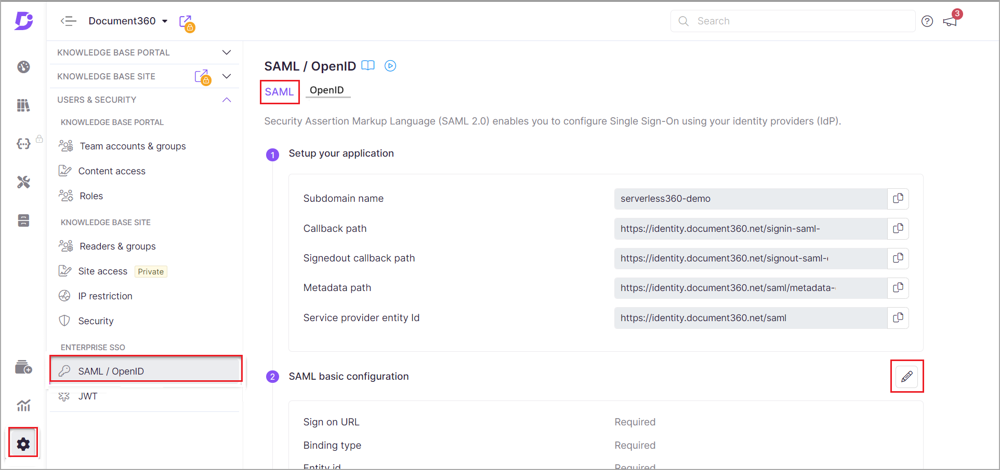
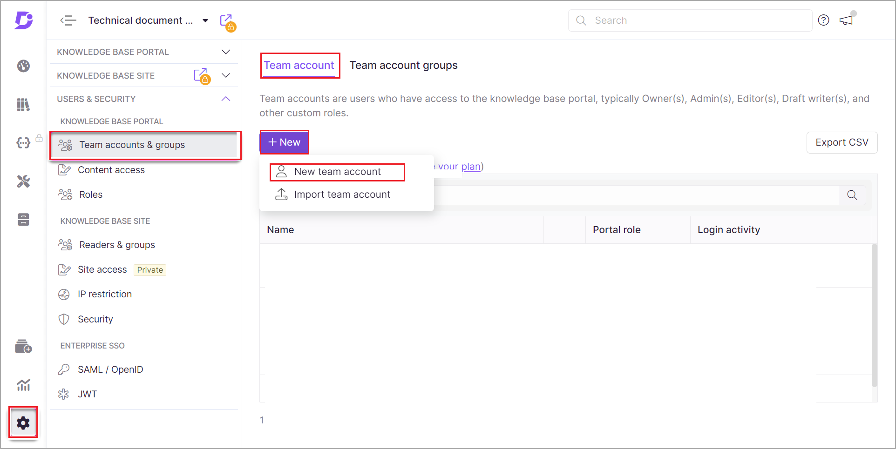

# Microsoft Entra SSO integration with Document360

This article teaches you how to integrate Document360 with Microsoft Entra ID. Document360 is an online self-service knowledge base software. When you integrate Document360 with Microsoft Entra ID, you can:

* Control in Microsoft Entra ID who has access to Document360.
* Enable your users to be automatically signed in to Document360 with their Microsoft Entra accounts.
* Manage your accounts in one central location.

You configure and test Microsoft Entra single sign-on for Document360 in a test environment. Document360 supports **Service Provider (SP)** and **Identity Provider (IdP)** initiated SSO.

> [!NOTE]
> Identifier of this application is a fixed string value, so only one instance can be configured in one tenant.

## Prerequisites

To integrate Microsoft Entra ID with Document360, you need the following:

* A Microsoft Entra user account. If you don't already have one, you can [Create an account for free](https://azure.microsoft.com/free/?WT.mc_id=A261C142F).
* One of the following roles: Global Administrator, Cloud Application Administrator, Application Administrator, or owner of the service principal.
* A Microsoft Entra subscription. If you don't have a subscription, you can [get a free account](https://azure.microsoft.com/free/).
* Document360 subscription with SSO enabled. If you don't have a subscription, you can [Sign up for a new account](https://document360.com/signup/).

## Add application and assign a test user

Before configuring SSO, add the Document360 application from the Microsoft Entra gallery. You need a test user account to assign to the application and test the SSO configuration.

### Add Document360 from the Microsoft Entra gallery

Add Document360 from the Microsoft Entra application gallery to configure SSO with Document360. For more information on adding an application from the gallery, see the [Quickstart: Add application from the gallery](../manage-apps/add-application-portal.md).

### Create and assign Microsoft Entra test user

Follow the guidelines in the [create and assign a user account](../manage-apps/add-application-portal-assign-users.md) article to create a test user account called B.Simon.

Alternatively, you can use the [Enterprise App Configuration Wizard](https://portal.office.com/AdminPortal/home?Q=Docs#/azureadappintegration). In this wizard, you can add an application to your tenant, add users/groups to the app, and assign roles. The wizard also provides a link to the single sign-on configuration pane. [Learn more about Microsoft 365 wizards.](/microsoft-365/admin/misc/azure-ad-setup-guides). 

## Configure Microsoft Entra SSO

Complete the following steps to enable Microsoft Entra single sign-on.

1. Sign in to the [Microsoft Entra admin center](https://entra.microsoft.com) as at least a [Cloud Application Administrator](../roles/permissions-reference.md#cloud-application-administrator).
1. Browse to **Identity** > **Applications** > **Enterprise applications** > **Document360** application integration page, find the **Manage** section and select **single sign-on**.
2. On the **Select a single sign-on method** page, select **SAML**.
3. On the **Set up single sign-on with SAML** page, select the pencil icon for **Basic SAML Configuration** to edit the settings.

   

1. On the **Basic SAML Configuration** section, perform the following steps. Choose any one of the Identifiers, Reply URL, and Sign on URL based on your Data center region.

    a. In the **Identifier** textbox, type/copy & paste one of the following URLs:

    | **Identifier** |
    |-----------|
    | `https://identity.document360.io/saml` |
    | **(or)** |
    | `https://identity.us.document360.io/saml` |

    b. In the **Reply URL** textbox, type/copy & paste a URL using one of the following patterns:

    | **Reply URL** |
    | ----------|
    | `https://identity.document360.io/signin-saml-<ID>` |
    | **(or)** |
    | `https://identity.us.document360.io/signin-saml-<ID>` |  

5. If you wish to configure the application in **SP** initiated mode, then perform the following step:

    In the **Sign on URL** textbox, type/copy & paste one of the following URLs:

    | **Sign on URL** |
    |-----------| 
    | `https://identity.document360.io ` |
    | **(or)** |
    | `https://identity.us.document360.io` |

    > [!NOTE]
    > The Reply URL is not real. Update this value with the actual Reply URL. You can also refer to the patterns shown in the Azure portal's **Basic SAML Configuration** section.

6. On the **Set-up single sign-on with SAML** page, in the **SAML Signing Certificate** section, find **Certificate (Base64)** and select **Download** to download the certificate and save it on your computer.

    

7. On the **Set up Document360** section, copy the appropriate URL(s) based on your requirement.

	

## Configure Document360 SSO

1. In a different web browser window, log in to your Document360 portal as an administrator.

1. To configure SSO on the **Document360** portal, you need to navigate to **Settings** → **Users & Security** → **SAML/OpenID** → **SAML** and perform the following steps:

    

1. Click on the Edit icon in **SAML basic configuration** on the Document360 portal side and paste the values from Microsoft Entra admin center based on the below mentioned field associations.

    | Document360 portal fields | Microsoft Entra admin center values |
    | --- | --- |
    | Email domains | Domains of emails you have under active directory |
    | Sign On URL | Login URL |
    | Entity ID | Microsoft Entra identifier |
    | Sign Out URL | Logout URL |
    | SAML certificate | Download Certificate (Base64) from Microsoft Entra ID side and upload in Document360 |

1. Click on the **Save** button when you’re done with the values.

### Create Document360 test user

1. In a different web browser window, log in to your Document360 portal as an administrator.

1. From the Document360 portal, go to **Settings → Users & Security → Team accounts & groups  → Team account**. Click the **New team account** button and type in the required details, specify the roles, and follow the module steps to add a user to Document360. 

    

## Test SSO 

In this section, you test your Microsoft Entra single sign-on configuration with the following options. 

#### SP initiated:

* Click on **Test this application**, this will redirect to the Document360 Sign-on URL, where you can initiate the login flow.  

* Go to Document360 Sign-on URL directly and initiate the login flow.

#### IDP initiated:

* Click on **Test this application**, in the Azure portal, and you should be automatically signed in to the Document360 for which you set up the SSO. 

You can also use Microsoft My Apps to test the application in any mode. When you click the Document360 tile in the My Apps if configured in SP mode, you will be redirected to the application sign-on page for initiating the login flow. If configured in IDP mode, you should be automatically signed in to the Document360 for which you set up the SSO. 

For more information, see [Microsoft Entra My Apps](/azure/active-directory/manage-apps/end-user-experiences#azure-ad-my-apps).

## Additional resources

* [What is single sign-on with Microsoft Entra ID?](../manage-apps/what-is-single-sign-on.md)
* [Plan a single sign-on deployment](../manage-apps/plan-sso-deployment.md).

## Next steps

Once you configure Document360, you can enforce session control, which protects the exfiltration and infiltration of your organization's sensitive data in real-time. Session control extends from Conditional Access. [Learn how to enforce session control with Microsoft Cloud App Security](/cloud-app-security/proxy-deployment-aad).
