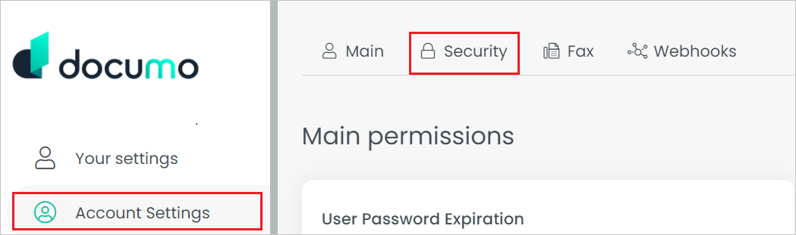
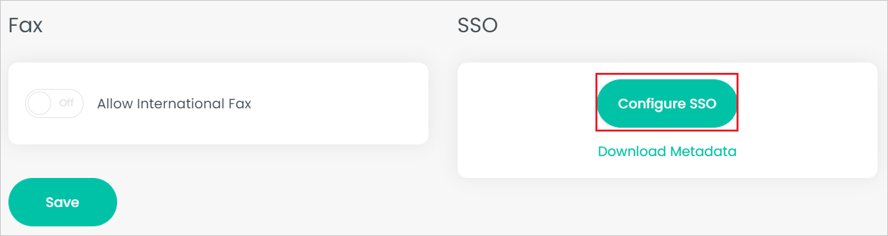
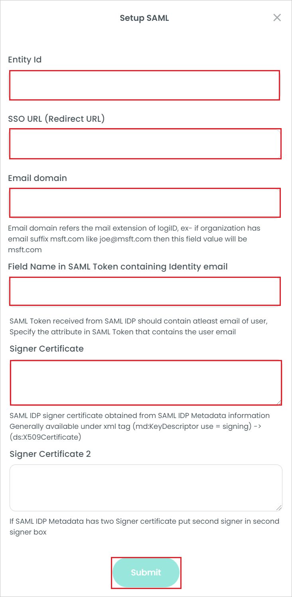

# Tutorial: Azure Active Directory single sign-on (SSO) integration with Documo

In this tutorial, you'll learn how to integrate Documo with Azure Active Directory (Azure AD). When you integrate Documo with Azure AD, you can:

* Control in Azure AD who has access to Documo.
* Enable your users to be automatically signed-in to Documo with their Azure AD accounts.
* Manage your accounts in one central location - the Azure portal.

## Prerequisites

To get started, you need the following items:

* An Azure AD subscription. If you don't have a subscription, you can get a [free account](https://azure.microsoft.com/free/).
* Documo single sign-on (SSO) enabled subscription.

## Scenario description

In this tutorial, you configure and test Azure AD SSO in a test environment.

* Documo supports **SP and IDP** initiated SSO.

> [!NOTE]
> Identifier of this application is a fixed string value so only one instance can be configured in one tenant.

## Adding Documo from the gallery

To configure the integration of Documo into Azure AD, you need to add Documo from the gallery to your list of managed SaaS apps.

1. Sign in to the Azure portal using either a work or school account, or a personal Microsoft account.
1. On the left navigation pane, select the **Azure Active Directory** service.
1. Navigate to **Enterprise Applications** and then select **All Applications**.
1. To add new application, select **New application**.
1. In the **Add from the gallery** section, type **Documo** in the search box.
1. Select **Documo** from results panel and then add the app. Wait a few seconds while the app is added to your tenant.

 Alternatively, you can also use the [Enterprise App Configuration Wizard](https://portal.office.com/AdminPortal/home?Q=Docs#/azureadappintegration). In this wizard, you can add an application to your tenant, add users/groups to the app, assign roles, as well as walk through the SSO configuration as well. [Learn more about Microsoft 365 wizards.](/microsoft-365/admin/misc/azure-ad-setup-guides)

## Configure and test Azure AD SSO for Documo

Configure and test Azure AD SSO with Documo using a test user called **B.Simon**. For SSO to work, you need to establish a link relationship between an Azure AD user and the related user in Documo.

To configure and test Azure AD SSO with Documo, perform the following steps:

1. **[Configure Azure AD SSO](#configure-azure-ad-sso)** - to enable your users to use this feature.
    1. **[Create an Azure AD test user](#create-an-azure-ad-test-user)** - to test Azure AD single sign-on with B.Simon.
    1. **[Assign the Azure AD test user](#assign-the-azure-ad-test-user)** - to enable B.Simon to use Azure AD single sign-on.
1. **[Configure Documo SSO](#configure-documo-sso)** - to configure the single sign-on settings on application side.
    1. **[Create Documo test user](#create-documo-test-user)** - to have a counterpart of B.Simon in Documo that is linked to the Azure AD representation of user.
1. **[Test SSO](#test-sso)** - to verify whether the configuration works.

## Configure Azure AD SSO

Follow these steps to enable Azure AD SSO in the Azure portal.

1. In the Azure portal, on the **Documo** application integration page, find the **Manage** section and select **single sign-on**.
1. On the **Select a single sign-on method** page, select **SAML**.
1. On the **Set up single sign-on with SAML** page, click the pencil icon for **Basic SAML Configuration** to edit the settings.

   

1. On the **Basic SAML Configuration** section, the user does not have to perform any step as the app is already pre-integrated with Azure. If your Documo account has a custom domain, you must also have a custom API domain for SSO to work. Replace the default values with your custom API domain, for example, `https://mycustomapidomain.com` and `https://mycustomapidomain.com/assert`.

1. Click **Set additional URLs** and perform the following step if you wish to configure the application in **SP** initiated mode:

    In the **Sign-on URL** text box, type the URL:  
    `https://app.documo.com/sso`

1. Click **Save**.

1. On the **Set up single sign-on with SAML** page, in the **SAML Signing Certificate** section,  find **Federation Metadata XML** and select **Download** to download the certificate and save it on your computer.

	

1. On the **Set up Documo** section, copy the appropriate URL(s) based on your requirement.

	

### Create an Azure AD test user

In this section, you'll create a test user in the Azure portal called B.Simon.

1. From the left pane in the Azure portal, select **Azure Active Directory**, select **Users**, and then select **All users**.
1. Select **New user** at the top of the screen.
1. In the **User** properties, follow these steps:
   1. In the **Name** field, enter `B.Simon`.  
   1. In the **User name** field, enter the username@companydomain.extension. For example, `B.Simon@contoso.com`.
   1. Select the **Show password** check box, and then write down the value that's displayed in the **Password** box.
   1. Click **Create**.

### Assign the Azure AD test user

In this section, you'll enable B.Simon to use Azure single sign-on by granting access to Documo.

1. In the Azure portal, select **Enterprise Applications**, and then select **All applications**.
1. In the applications list, select **Documo**.
1. In the app's overview page, find the **Manage** section and select **Users and groups**.
1. Select **Add user**, then select **Users and groups** in the **Add Assignment** dialog.
1. In the **Users and groups** dialog, select **B.Simon** from the Users list, then click the **Select** button at the bottom of the screen.
1. If you are expecting a role to be assigned to the users, you can select it from the **Select a role** dropdown. If no role has been set up for this app, you see "Default Access" role selected.
1. In the **Add Assignment** dialog, click the **Assign** button.

## Configure Documo SSO

1. Log in to your Documo website as an administrator.

1. Go to the **Account Settings** -> **Security**.

    

1. In the security tab, click on **Configure SSO** button at the bottom of the page.

    

1. Perform the following steps in the **Setup SAML** page.

    

    a. In the **Entity Id** textbox, paste the **Azure AD Identifier** value which you have copied from the Azure portal.

    b. In the **SSO URL(Redirect URL)** textbox, paste the **Login URL** value which you have copied from the Azure portal.

    c. Give the **Email Domain** value in the text box.

    d. Enter the value in the **Field Name in SAML Token containing Identity email** text box.

    e. Open the downloaded **Federation Metadata XML** from the Azure portal into Notepad. Find the `<X509Certificate>` tag and paste the content into the **Signer Certificate** textbox.

    f. Click **Submit**.

### Create Documo test user

In this section, a user called B.Simon is created in Documo. 

1. Navigate to the [Users page](https://app.documo.com?redirectTo=/users) on the Documo app.
1. Click the **New user** button.
1. Fill out the user form with name, email, phone number, user role, and password information. Make sure the **email** field matches the email for B.Simon in **Azure AD**.
1. Click **Create**.

## Test SSO 

In this section, you test your Azure AD single sign-on configuration with following options. 

#### SP initiated:

* Click on **Test this application** in Azure portal. This will redirect to Documo Sign on URL where you can initiate the login flow.  

* Go to Documo Sign-on URL directly and initiate the login flow from there.

#### IDP initiated:

* Click on **Test this application** in Azure portal and you should be automatically signed in to the Documo for which you set up the SSO 

You can also use Microsoft My Apps to test the application in any mode. When you click the Documo tile in the My Apps, if configured in SP mode you would be redirected to the application sign on page for initiating the login flow and if configured in IDP mode, you should be automatically signed in to the Documo for which you set up the SSO. For more information about the My Apps, see [Introduction to the My Apps](https://support.microsoft.com/account-billing/sign-in-and-start-apps-from-the-my-apps-portal-2f3b1bae-0e5a-4a86-a33e-876fbd2a4510).

## Next steps

Once you configure Documo you can enforce session control, which protects exfiltration and infiltration of your organization’s sensitive data in real time. Session control extends from Conditional Access. [Learn how to enforce session control with Microsoft Defender for Cloud Apps](/cloud-app-security/proxy-deployment-any-app).
