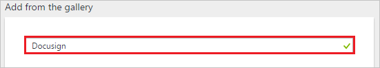
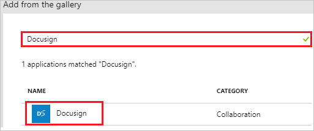
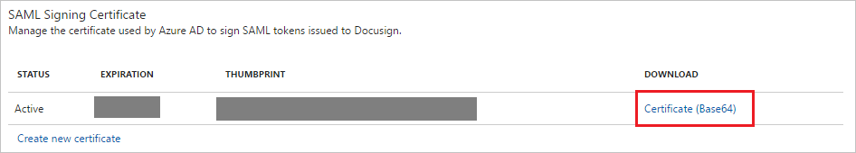
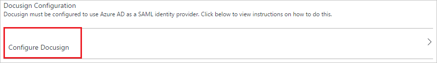
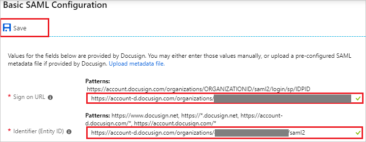

# Tutorial: Azure Active Directory integration with DocuSign

In this tutorial, you learn how to integrate DocuSign with Azure Active Directory (Azure AD).

Integrating DocuSign with Azure AD provides you with the following benefits:

- You can control in Azure AD who has access to DocuSign
- You can enable your users to automatically get signed-on to DocuSign (Single Sign-On) with their Azure AD accounts
- You can manage your accounts in one central location - the Azure portal

If you want to know more details about SaaS app integration with Azure AD, see [what is application access and single sign-on with Azure Active Directory](../manage-apps/what-is-single-sign-on.md).

## Prerequisites

To configure Azure AD integration with DocuSign, you need the following items:

- An Azure AD subscription
- A DocuSign single sign-on enabled subscription

> [!NOTE]
> To test the steps in this tutorial, we do not recommend using a production environment.

To test the steps in this tutorial, you should follow these recommendations:

- Do not use your production environment, unless it is necessary.
- If you don't have an Azure AD trial environment, you can get a one-month trial [here](https://azure.microsoft.com/pricing/free-trial/).

## Scenario description
In this tutorial, you test Azure AD single sign-on in a test environment. 
The scenario outlined in this tutorial consists of two main building blocks:

1. Adding DocuSign from the gallery
1. Configuring and testing Azure AD single sign-on

## Adding DocuSign from the gallery
To configure the integration of DocuSign into Azure AD, you need to add DocuSign from the gallery to your list of managed SaaS apps.

**To add DocuSign from the gallery, perform the following steps:**

1. In the **[Azure portal](https://portal.azure.com)**, on the left navigation panel, click **Azure Active Directory** icon. 

	![Active Directory][1]

1. Navigate to **Enterprise applications**. Then go to **All applications**.

	![Applications][2]
	
1. Click **New application** button on the top of the dialog.

	![Applications][3]

1. In the search box, type **DocuSign**.

	

1. In the results panel, select **DocuSign**, and then click **Add** button to add the application.

	

##  Configuring and testing Azure AD single sign-on
In this section, you configure and test Azure AD single sign-on with DocuSign based on a test user called "Britta Simon."

For single sign-on to work, Azure AD needs to know what the counterpart user in DocuSign is to a user in Azure AD. In other words, a link relationship between an Azure AD user and the related user in DocuSign needs to be established.

This link relationship is established by assigning the value of the **user name** in Azure AD as the value of the **Username** in DocuSign.

To configure and test Azure AD single sign-on with DocuSign, you need to complete the following building blocks:

1. **[Configuring Azure AD Single Sign-On](#configuring-azure-ad-single-sign-on)** - to enable your users to use this feature.
1. **[Creating an Azure AD test user](#creating-an-azure-ad-test-user)** - to test Azure AD single sign-on with Britta Simon.
1. **[Creating a DocuSign test user](#creating-a-docusign-test-user)** - to have a counterpart of Britta Simon in DocuSign that is linked to the Azure AD representation of user.
1. **[Assigning the Azure AD test user](#assigning-the-azure-ad-test-user)** - to enable Britta Simon to use Azure AD single sign-on.
1. **[Testing Single Sign-On](#testing-single-sign-on)** - to verify whether the configuration works.

### Configuring Azure AD single sign-on

In this section, you enable Azure AD single sign-on in the Azure portal and configure single sign-on in your DocuSign application.

**To configure Azure AD single sign-on with DocuSign, perform the following steps:**

1. In the Azure portal, on the **DocuSign** application integration page, click **Single sign-on**.

	![Configure Single Sign-On][4]

1. On the **Single sign-on** dialog, select **Mode** as	**SAML-based Sign-on** to enable single sign-on.
 
	

1. On the **SAML Signing Certificate** section, click **Certificate(Base 64)** and then save certificate file on your computer.

	 

1. On the **DocuSign Configuration** section of Azure portal, Click **Configure DocuSign** to open Configure sign-on window. Copy the **Sign-Out URL, SAML Entity ID, and SAML Single Sign-On Service URL** from the **Quick Reference section.**
    
    

1. In a different web browser window, login to your **DocuSign admin portal** as an administrator.

1. In the navigation menu on the left, click **Domains**.
   
    ![Configuring single sign-on][51]

1. On the right pane, click **Claim Domain**.
   
    ![Configuring single sign-on][52]

1. On the **Claim a domain** dialog, in the **Domain Name** textbox, type your company domain, and then click **Claim**. Make sure that you verify the domain and the status is active.
   
    ![Configuring single sign-on][53]

1. In menu on the left side, click **Identity Providers**  
   
    ![Configuring single sign-on][54]
1. In the right pane, click **Add Identity Provider**. 
   
	![Configuring single sign-on][55]

1. On the **Identity Provider Settings** page, perform the following steps:
   
	![Configuring single sign-on][56]

    a. In the **Name** textbox, type a unique name for your configuration. Do not use spaces.

    b. Paste **SAML Entity ID** into the **Identity Provider Issuer** textbox.

    c. Paste **SAML Single Sign-On Service URL** into the **Identity Provider Login URL** textbox.

    d. Paste **Sign-Out URL** into the **Identity Provider Logout URL** textbox.

    e. Select **Sign AuthN Request**.

    f. As **Send AuthN request by**, select **POST**.

    g. As **Send logout request by**, select **GET**.

1. In the **Custom Attribute Mapping** section, choose the field you want to map with Azure AD Claim. In this example, the **emailaddress** claim is mapped with the value of **http://schemas.xmlsoap.org/ws/2005/05/identity/claims/emailaddress**. It is the default claim name from Azure AD for email claim. 
   
	> [!NOTE]
	> Use the appropriate **User identifier** to map the user from Azure AD to DocuSign user mapping. Select the proper Field and enter the appropriate value based on your organization settings.
		  
	![Configuring single sign-on][57]

1. In the **Identity Provider Certificate** section, click **Add Certificate**, and then upload the certificate you have downloaded from Azure AD portal.   
   
	![Configuring single sign-on][58]

1. Click **Save**.

1. In the **Identity Providers** section, click **Actions**, and then click **Endpoints**.   
   
	![Configuring single sign-on][59]
 
1. In the **View SAML 2.0 Endpoints** section on **DocuSign admin portal**, perform the following steps:
   
	![Configuring single sign-on][60]
   
	a. Copy the **Service Provider Issuer URL**, and then paste into the **Identifier** textbox on **DocuSign Domain and URLs** section of the Azure portal following the pattern: `https://<subdomain>.docusign.com/organization/<uniqueID>/saml2/login/sp/<uniqueID>`.
   
	b. Copy the **Service Provider Login URL**, and then paste into the **Sign On URL** textbox on **DocuSign Domain and URLs** section of the Azure portal following the pattern: `https://<subdomain>.docusign.com/organization/<uniqueID>/saml2/`.

	
	  
	c.  Click **Close**
    
1. On the Azure portal, click **Save**.
    
    

> [!TIP]
> You can now read a concise version of these instructions inside the [Azure portal](https://portal.azure.com), while you are setting up the app!  After adding this app from the **Active Directory > Enterprise Applications** section, simply click the **Single Sign-On** tab and access the embedded documentation through the **Configuration** section at the bottom. You can read more about the embedded documentation feature here: [Azure AD embedded documentation]( https://go.microsoft.com/fwlink/?linkid=845985)

### Creating an Azure AD test user
The objective of this section is to create a test user in the Azure portal called Britta Simon.

![Create Azure AD User][100]

**To create a test user in Azure AD, perform the following steps:**

1. In the **Azure portal**, on the left navigation pane, click **Azure Active Directory** icon.

	 

1. To display the list of users, go to **Users and groups** and click **All users**.
	
	 

1. At the top of the dialog, click **Add** to open the **User** dialog.
 
	 

1. On the **User** dialog page, perform the following steps:
 
	 

    a. In the **Name** textbox, type **BrittaSimon**.

    b. In the **User name** textbox, type the **email address** of BrittaSimon.

	c. Select **Show Password** and write down the value of the **Password**.

    d. Click **Create**.
 
### Creating a DocuSign test user

Application supports **Just in time user provisioning** and after authentication users are created in the application automatically.

### Assigning the Azure AD test user

In this section, you enable Britta Simon to use Azure single sign-on by granting her access to DocuSign.

![Assign User][200] 

**To assign Britta Simon to DocuSign, perform the following steps:**

1. In the Azure portal, open the applications view, and then navigate to the directory view and go to **Enterprise applications** then click **All applications**.

	![Assign User][201] 

1. In the applications list, select **DocuSign**.

	 

1. In the menu on the left, click **Users and groups**.

	![Assign User][202] 

1. Click **Add** button. Then select **Users and groups** on **Add Assignment** dialog.

	![Assign User][203]

1. On **Users and groups** dialog, select **Britta Simon** in the Users list.

1. Click **Select** button on **Users and groups** dialog.

1. Click **Assign** button on **Add Assignment** dialog.
	
### Testing single sign-on

In this section, you test your Azure AD single sign-on configuration using the Access Panel.

When you click the DocuSign tile in the Access Panel, you should get automatically signed-on to your DocuSign application.
For more information about the Access Panel, see [Introduction to the Access Panel](../user-help/active-directory-saas-access-panel-introduction.md). 

## Additional resources

* [List of Tutorials on How to Integrate SaaS Apps with Azure Active Directory](tutorial-list.md)
* [What is application access and single sign-on with Azure Active Directory?](../manage-apps/what-is-single-sign-on.md)
* [Configure User Provisioning](docusign-provisioning-tutorial.md)

<!--Image references-->

[1]: ./media/docusign-tutorial/tutorial_general_01.png
[2]: ./media/docusign-tutorial/tutorial_general_02.png
[3]: ./media/docusign-tutorial/tutorial_general_03.png
[4]: ./media/docusign-tutorial/tutorial_general_04.png
[51]: ./media/docusign-tutorial/tutorial_docusign_21.png
[52]: ./media/docusign-tutorial/tutorial_docusign_22.png
[53]: ./media/docusign-tutorial/tutorial_docusign_23.png
[54]: ./media/docusign-tutorial/tutorial_docusign_19.png
[55]: ./media/docusign-tutorial/tutorial_docusign_20.png
[56]: ./media/docusign-tutorial/tutorial_docusign_24.png
[57]: ./media/docusign-tutorial/tutorial_docusign_25.png
[58]: ./media/docusign-tutorial/tutorial_docusign_26.png
[59]: ./media/docusign-tutorial/tutorial_docusign_27.png
[60]: ./media/docusign-tutorial/tutorial_docusign_28.png
[61]: ./media/docusign-tutorial/tutorial_docusign_29.png
[100]: ./media/docusign-tutorial/tutorial_general_100.png

[200]: ./media/docusign-tutorial/tutorial_general_200.png
[201]: ./media/docusign-tutorial/tutorial_general_201.png
[202]: ./media/docusign-tutorial/tutorial_general_202.png
[203]: ./media/docusign-tutorial/tutorial_general_203.png

