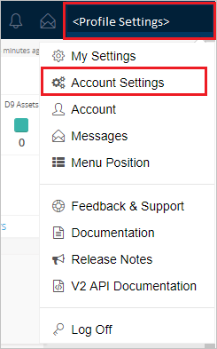
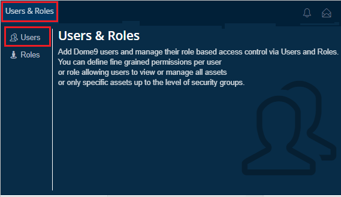
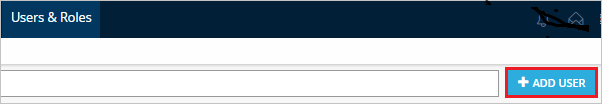
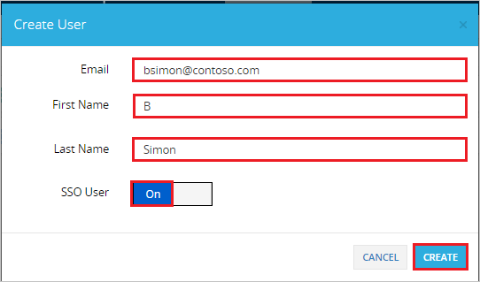

# Tutorial: Azure Active Directory integration with Dome9 Arc

In this tutorial, you learn how to integrate Dome9 Arc with Azure Active Directory (Azure AD).
Integrating Dome9 Arc with Azure AD provides you with the following benefits:

* You can control in Azure AD who has access to Dome9 Arc.
* You can enable your users to be automatically signed-in to Dome9 Arc (Single Sign-On) with their Azure AD accounts.
* You can manage your accounts in one central location - the Azure portal.

If you want to know more details about SaaS app integration with Azure AD, see [What is application access and single sign-on with Azure Active Directory](https://docs.microsoft.com/azure/active-directory/active-directory-appssoaccess-whatis).
If you don't have an Azure subscription, [create a free account](https://azure.microsoft.com/free/) before you begin.

## Prerequisites

To configure Azure AD integration with Dome9 Arc, you need the following items:

* An Azure AD subscription. If you don't have an Azure AD environment, you can get one-month trial [here](https://azure.microsoft.com/pricing/free-trial/)
* Dome9 Arc single sign-on enabled subscription

## Scenario description

In this tutorial, you configure and test Azure AD single sign-on in a test environment.

* Dome9 Arc supports **SP** and **IDP** initiated SSO

## Adding Dome9 Arc from the gallery

To configure the integration of Dome9 Arc into Azure AD, you need to add Dome9 Arc from the gallery to your list of managed SaaS apps.

**To add Dome9 Arc from the gallery, perform the following steps:**

1. In the **[Azure portal](https://portal.azure.com)**, on the left navigation panel, click **Azure Active Directory** icon.

	

2. Navigate to **Enterprise Applications** and then select the **All Applications** option.

	

3. To add new application, click **New application** button on the top of dialog.

	

4. In the search box, type **Dome9 Arc**, select **Dome9 Arc** from result panel then click **Add** button to add the application.

	 

## Configure and test Azure AD single sign-on

In this section, you configure and test Azure AD single sign-on with Dome9 Arc based on a test user called **Britta Simon**.
For single sign-on to work, a link relationship between an Azure AD user and the related user in Dome9 Arc needs to be established.

To configure and test Azure AD single sign-on with Dome9 Arc, you need to complete the following building blocks:

1. **[Configure Azure AD Single Sign-On](#configure-azure-ad-single-sign-on)** - to enable your users to use this feature.
2. **[Configure Dome9 Arc Single Sign-On](#configure-dome9-arc-single-sign-on)** - to configure the Single Sign-On settings on application side.
3. **[Create an Azure AD test user](#create-an-azure-ad-test-user)** - to test Azure AD single sign-on with Britta Simon.
4. **[Assign the Azure AD test user](#assign-the-azure-ad-test-user)** - to enable Britta Simon to use Azure AD single sign-on.
5. **[Create Dome9 Arc test user](#create-dome9-arc-test-user)** - to have a counterpart of Britta Simon in Dome9 Arc that is linked to the Azure AD representation of user.
6. **[Test single sign-on](#test-single-sign-on)** - to verify whether the configuration works.

### Configure Azure AD single sign-on

In this section, you enable Azure AD single sign-on in the Azure portal.

To configure Azure AD single sign-on with Dome9 Arc, perform the following steps:

1. In the [Azure portal](https://portal.azure.com/), on the **Dome9 Arc** application integration page, select **Single sign-on**.

    

2. On the **Select a Single sign-on method** dialog, select **SAML/WS-Fed** mode to enable single sign-on.

    

3. On the **Set up Single Sign-On with SAML** page, click **Edit** icon to open **Basic SAML Configuration** dialog.

	

4. On the **Basic SAML Configuration** section, If you wish to configure the application in **IDP** initiated mode, perform the following steps:

    

    a. In the **Identifier** text box, type a URL using the following pattern:
    `https://secure.dome9.com/`

    b. In the **Reply URL** text box, type a URL using the following pattern:
    `https://secure.dome9.com/sso/saml/yourcompanyname`

	> [!NOTE]
	> You will select your company name value in the dome9 admin portal, which is explained later in the tutorial.

5. Click **Set additional URLs** and perform the following step if you wish to configure the application in **SP** initiated mode:

    

    In the **Sign-on URL** text box, type a URL using the following pattern:
    `https://secure.dome9.com/sso/saml/<yourcompanyname>`

	> [!NOTE]
	> These values are not real. Update these values with the actual Reply URL and Sign-on URL. Contact [Dome9 Arc Client support team](mailto:support@dome9.com) to get these values. You can also refer to the patterns shown in the **Basic SAML Configuration** section in the Azure portal.

6. Dome9 Arc application expects the SAML assertions in a specific format. Configure the following claims for this application. You can manage the values of these attributes from the **User Attributes** section on application integration page. On the **Set up Single Sign-On with SAML** page, click **Edit** button to open **User Attributes** dialog.

	

7. In the **User Claims** section on the **User Attributes** dialog, edit the claims by using **Edit icon** or add the claims by using **Add new claim** to configure SAML token attribute as shown in the image above and perform the following steps: 

	| Name |  Source Attribute|
	| ---------------| --------------- |
	| memberof | user.assignedroles |

	a. Click **Add new claim** to open the **Manage user claims** dialog.

	

	

	b. In the **Name** textbox, type the attribute name shown for that row.

	c. Leave the **Namespace** blank.

	d. Select Source as **Attribute**.

	e. From the **Source attribute** list, type the attribute value shown for that row.

	f. Click **Ok**

	g. Click **Save**.

8. On the **Set up Single Sign-On with SAML** page, in the **SAML Signing Certificate** section, click **Download** to download the **Certificate (Base64)** from the given options as per your requirement and save it on your computer.

	

9. On the **Set up Dome9 Arc** section, copy the appropriate URL(s) as per your requirement.

	

	a. Login URL

	b. Azure Ad Identifier

	c. Logout URL

### Configure Dome9 Arc Single Sign-On

1. In a different web browser window, log into your Dome9 Arc company site as an administrator.

2. Click on the **Profile Settings** on the right top corner and then click **Account Settings**. 

	

3. Navigate to **SSO** and then click **ENABLE**.

	

4. In the SSO Configuration section, perform the following steps:

	

	a. Enter company name in the **Account ID** textbox. This value is to be used in the reply url mentioned in the Azure portal URL section.

	b. In the **Issuer** textbox, paste the value of **Azure Ad Identifier**, which you have copied form the Azure portal.

	c. In the **Idp endpoint url** textbox, paste the value of **Login URL**, which you have copied form the Azure portal.

	d. Open your downloaded Base64 encoded certificate in notepad, copy the content of it into your clipboard, and then paste it to the **X.509 certificate** textbox.

	e. Click **Save**.

### Create an Azure AD test user 

The objective of this section is to create a test user in the Azure portal called Britta Simon.

1. In the Azure portal, in the left pane, select **Azure Active Directory**, select **Users**, and then select **All users**.

    

2. Select **New user** at the top of the screen.

    

3. In the User properties, perform the following steps.

    

    a. In the **Name** field enter **BrittaSimon**.
  
    b. In the **User name** field type **brittasimon\@yourcompanydomain.extension**  
    For example, BrittaSimon@contoso.com

    c. Select **Show password** check box, and then write down the value that's displayed in the Password box.

    d. Click **Create**.

### Assign the Azure AD test user

In this section, you enable Britta Simon to use Azure single sign-on by granting access to Dome9 Arc.

1. In the Azure portal, select **Enterprise Applications**, select **All applications**, then select **Dome9 Arc**.

	

2. In the applications list, select **Dome9 Arc**.

	

3. In the menu on the left, select **Users and groups**.

    

4. Click the **Add user** button, then select **Users and groups** in the **Add Assignment** dialog.

    

5. In the **Users and groups** dialog select **Britta Simon** in the Users list, then click the **Select** button at the bottom of the screen.

6. If you are expecting any role value in the SAML assertion then in the **Select Role** dialog select the appropriate role for the user from the list, then click the **Select** button at the bottom of the screen.

7. In the **Add Assignment** dialog click the **Assign** button.

### Create Dome9 Arc test user

To enable Azure AD users to log in to Dome9 Arc, they must be provisioned into application. Dome9 Arc supports just-in-time provisioning but for that to work properly, user have to select particular **Role** and assign the same to the user.

   >[!Note]
   >For **Role** creation and other details contact [Dome9 Arc Client support team](https://dome9.com/about/contact-us/).

**To provision a user account manually, perform the following steps:**

1. Log in to your Dome9 Arc company site as an administrator.

2. Click on the **Users & Roles** and then click **Users**.

	

3. Click **ADD USER**.

	

4. In the **Create User** section, perform the following steps:

	

	a. In the **Email** textbox, type the email of user like Brittasimon@contoso.com.

	b. In the **First Name** textbox, type first name of the user like Britta.

	c. In the **Last Name** textbox, type last name of the user like Simon.

	d. Make **SSO User** as **On**.

	e. Click **CREATE**.

### Test single sign-on 

In this section, you test your Azure AD single sign-on configuration using the Access Panel.

When you click the Dome9 Arc tile in the Access Panel, you should be automatically signed in to the Dome9 Arc for which you set up SSO. For more information about the Access Panel, see [Introduction to the Access Panel](https://docs.microsoft.com/azure/active-directory/active-directory-saas-access-panel-introduction).

## Additional Resources

- [List of Tutorials on How to Integrate SaaS Apps with Azure Active Directory](https://docs.microsoft.com/azure/active-directory/active-directory-saas-tutorial-list)

- [What is application access and single sign-on with Azure Active Directory?](https://docs.microsoft.com/azure/active-directory/active-directory-appssoaccess-whatis)

- [What is conditional access in Azure Active Directory?](https://docs.microsoft.com/azure/active-directory/conditional-access/overview)

