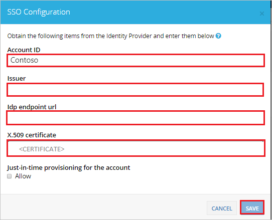
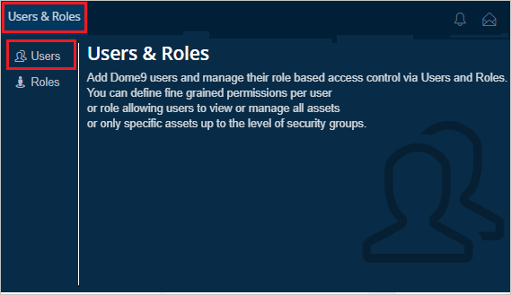
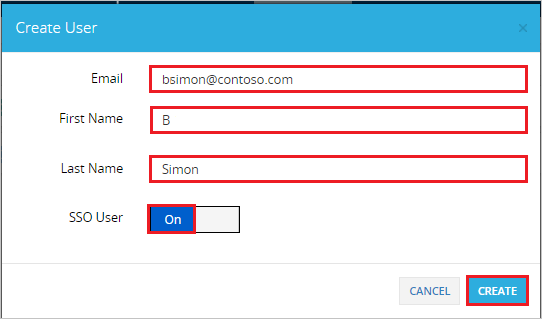

# Tutorial: Microsoft Entra single sign-on (SSO) integration with Check Point CloudGuard Posture Management

In this tutorial, you'll learn how to integrate Check Point CloudGuard Posture Management with Microsoft Entra ID. When you integrate Check Point CloudGuard Posture Management with Microsoft Entra ID, you can:

- Control in Microsoft Entra ID who has access to Check Point CloudGuard Posture Management.
- Enable your users to be automatically signed-in to Check Point CloudGuard Posture Management with their Microsoft Entra accounts.
- Manage your accounts in one central location.

## Prerequisites

To get started, you need the following items:

* A Microsoft Entra subscription. If you don't have a subscription, you can get a [free account](https://azure.microsoft.com/free/).
* Check Point CloudGuard Posture Management single sign-on (SSO) enabled subscription.

## Scenario description

In this tutorial, you configure and test Microsoft Entra SSO in a test environment.

* Check Point CloudGuard Posture Management supports **SP and IDP** initiated SSO.

> [!NOTE]
> Identifier of this application is a fixed string value so only one instance can be configured in one tenant.

## Adding Check Point CloudGuard Posture Management from the gallery

To configure the integration of Check Point CloudGuard Posture Management into Microsoft Entra ID, you need to add Check Point CloudGuard Posture Management from the gallery to your list of managed SaaS apps.

1. Sign in to the [Microsoft Entra admin center](https://entra.microsoft.com) as at least a [Cloud Application Administrator](../roles/permissions-reference.md#cloud-application-administrator).
1. Browse to **Identity** > **Applications** > **Enterprise applications** > **New application**.
1. In the **Add from the gallery** section, type **Check Point CloudGuard Posture Management** in the search box.
1. Select **Check Point CloudGuard Posture Management** from results panel and then add the app. Wait a few seconds while the app is added to your tenant.

 Alternatively, you can also use the [Enterprise App Configuration Wizard](https://portal.office.com/AdminPortal/home?Q=Docs#/azureadappintegration). In this wizard, you can add an application to your tenant, add users/groups to the app, assign roles, as well as walk through the SSO configuration as well. [Learn more about Microsoft 365 wizards.](/microsoft-365/admin/misc/azure-ad-setup-guides)

## Configure and test Microsoft Entra SSO for Check Point CloudGuard Posture Management

Configure and test Microsoft Entra SSO with Check Point CloudGuard Posture Management using a test user called **B.Simon**. For SSO to work, you need to establish a link relationship between a Microsoft Entra user and the related user in Check Point CloudGuard Posture Management.

To configure and test Microsoft Entra SSO with Check Point CloudGuard Posture Management, perform the following steps:

1. **[Configure Microsoft Entra SSO](#configure-azure-ad-sso)** - to enable your users to use this feature.
   1. **[Create a Microsoft Entra test user](#create-an-azure-ad-test-user)** - to test Microsoft Entra single sign-on with B.Simon.
   1. **[Assign the Microsoft Entra test user](#assign-the-azure-ad-test-user)** - to enable B.Simon to use Microsoft Entra single sign-on.
1. **[Configure Check Point CloudGuard Posture Management SSO](#configure-check-point-cloudguard-posture-management-sso)** - to configure the single sign-on settings on application side.
   1. **[Create Check Point CloudGuard Posture Management test user](#create-check-point-cloudguard-posture-management-test-user)** - to have a counterpart of B.Simon in Check Point CloudGuard Posture Management that is linked to the Microsoft Entra representation of user.
1. **[Test SSO](#test-sso)** - to verify whether the configuration works.

## Configure Microsoft Entra SSO

Follow these steps to enable Microsoft Entra SSO.

1. Sign in to the [Microsoft Entra admin center](https://entra.microsoft.com) as at least a [Cloud Application Administrator](../roles/permissions-reference.md#cloud-application-administrator).
1. Browse to **Identity** > **Applications** > **Enterprise applications** > **Check Point CloudGuard Posture Management** > **Single sign-on**.
1. On the **Select a single sign-on method** page, select **SAML**.
1. On the **Set up single sign-on with SAML** page, click the pencil icon for **Basic SAML Configuration** to edit the settings.

   

1. On the **Basic SAML Configuration** section, if you wish to configure the application in **IDP** initiated mode, perform the following step:

   In the **Reply URL** text box, type a URL using the following pattern:
   `https://secure.dome9.com/sso/saml/<YOURCOMPANYNAME>`

1. Click **Set additional URLs** and perform the following step if you wish to configure the application in **SP** initiated mode:

   In the **Sign-on URL** text box, type a URL using the following pattern:
   `https://secure.dome9.com/sso/saml/<YOURCOMPANYNAME>`

   > [!NOTE]
   > These values are not real. Update these values with the actual Reply URL and Sign-on URL. You will get the `<company name>` value from the **Configure Check Point CloudGuard Posture Management SSO** section, which is explained later in the tutorial. You can also refer to the patterns shown in the **Basic SAML Configuration** section.

1. Check Point CloudGuard Posture Management application expects the SAML assertions in a specific format, which requires you to add custom attribute mappings to your SAML token attributes configuration. The following screenshot shows the list of default attributes.

   

1. In addition to above, Check Point CloudGuard Posture Management application expects few more attributes to be passed back in SAML response which are shown below. These attributes are also pre populated but you can review them as per your requirement.

   | Name     | Source Attribute   |
   | -------- | ------------------ |
   | memberof | user.assignedroles |

   > [!NOTE]
   > Click [here](../develop/howto-add-app-roles-in-azure-ad-apps.md#app-roles-ui) to know how to create roles in Microsoft Entra ID.

1. On the **Set up single sign-on with SAML** page, in the **SAML Signing Certificate** section, find **Certificate (Base64)** and select **Download** to download the certificate and save it on your computer.

   

1. On the **Set up Check Point CloudGuard Posture Management** section, copy the appropriate URL(s) based on your requirement.

   

### Create a Microsoft Entra test user

In this section, you'll create a test user called B.Simon.

1. Sign in to the [Microsoft Entra admin center](https://entra.microsoft.com) as at least a [User Administrator](../roles/permissions-reference.md#user-administrator).
1. Browse to **Identity** > **Users** > **All users**.
1. Select **New user** > **Create new user**, at the top of the screen.
1. In the **User** properties, follow these steps:
   1. In the **Display name** field, enter `B.Simon`.  
   1. In the **User principal name** field, enter the username@companydomain.extension. For example, `B.Simon@contoso.com`.
   1. Select the **Show password** check box, and then write down the value that's displayed in the **Password** box.
   1. Select **Review + create**.
1. Select **Create**.

### Assign the Microsoft Entra test user

In this section, you'll enable B.Simon to use single sign-on by granting access to Check Point CloudGuard Posture Management.

1. Sign in to the [Microsoft Entra admin center](https://entra.microsoft.com) as at least a [Cloud Application Administrator](../roles/permissions-reference.md#cloud-application-administrator).
1. Browse to **Identity** > **Applications** > **Enterprise applications** > **Check Point CloudGuard Posture Management**.
1. In the app's overview page, find the **Manage** section and select **Users and groups**.
1. Select **Add user**, then select **Users and groups** in the **Add Assignment** dialog.
1. In the **Users and groups** dialog, select **B.Simon** from the Users list, then click the **Select** button at the bottom of the screen.
1. If you have setup the roles as explained in the above, you can select it from the **Select a role** dropdown.
1. In the **Add Assignment** dialog, click the **Assign** button.

## Configure Check Point CloudGuard Posture Management SSO

1. In a different web browser window, sign in to your Check Point CloudGuard Posture Management company site as an administrator

4. Click on the **Profile Settings** on the right top corner and then click **Account Settings**.

   

5. Navigate to **SSO** and then click **ENABLE**.

   

6. In the SSO Configuration section, perform the following steps:

   

   a. Enter company name in the **Account ID** textbox. This value is to be used in the **Reply** and **Sign on** URL mentioned in **Basic SAML Configuration** section of Azure portal.

   b. In the **Issuer** textbox, paste the value of **Microsoft Entra Identifier**, which you have copied form the Azure portal.

   c. In the **Idp endpoint url** textbox, paste the value of **Login URL**, which you have copied form the Azure portal.

   d. Open your downloaded Base64 encoded certificate in notepad, copy the content of it into your clipboard, and then paste it to the **X.509 certificate** textbox.

   e. Click **Save**.

### Create Check Point CloudGuard Posture Management test user

To enable Microsoft Entra users to sign in to Check Point CloudGuard Posture Management, they must be provisioned into application. Check Point CloudGuard Posture Management supports just-in-time provisioning but for that to work properly, user have to select particular **Role** and assign the same to the user.

> [!NOTE]
> To learn how to create a **Role** and for other information, see the [CloudGuard Admin Guide](https://sc1.checkpoint.com/documents/CloudGuard_Dome9/Documentation/Integrations/Single-Sign-On/SSO-ADFS.htm).
> 
> For 24/7 assistance, contact [Check Point Support](https://www.checkpoint.com/support-services/contact-support/).  
>  

**To provision a user account manually, perform the following steps:**

1. Sign in to your Check Point CloudGuard Posture Management company site as an administrator.

2. Click on the **Users & Roles** and then click **Users**.

   

3. Click **ADD USER**.

   

4. In the **Create User** section, perform the following steps:

   

   a. In the **Email** textbox, type the email of user like B.Simon@contoso.com.

   b. In the **First Name** textbox, type first name of the user like B.

   c. In the **Last Name** textbox, type last name of the user like Simon.

   d. Make **SSO User** as **On**.

   e. Click **CREATE**.

## Test SSO

In this section, you test your Microsoft Entra single sign-on configuration with following options. 

#### SP initiated:

* Click on **Test this application**, this will redirect to Check Point CloudGuard Posture Management Sign on URL where you can initiate the login flow.

* Go to Check Point CloudGuard Posture Management Sign-on URL directly and initiate the login flow from there.

#### IDP initiated:

* Click on **Test this application**, and you should be automatically signed in to the Check Point CloudGuard Posture Management for which you set up the SSO

You can also use Microsoft My Apps to test the application in any mode. When you click the Check Point CloudGuard Posture Management tile in the My Apps, if configured in SP mode you would be redirected to the application sign on page for initiating the login flow and if configured in IDP mode, you should be automatically signed in to the Check Point CloudGuard Posture Management for which you set up the SSO. For more information about the My Apps, see [Introduction to the My Apps](https://support.microsoft.com/account-billing/sign-in-and-start-apps-from-the-my-apps-portal-2f3b1bae-0e5a-4a86-a33e-876fbd2a4510).

## Next steps

Once you configure Check Point CloudGuard Posture Management you can enforce session control, which protects exfiltration and infiltration of your organization’s sensitive data in real time. Session control extends from Conditional Access. [Learn how to enforce session control with Microsoft Defender for Cloud Apps](/cloud-app-security/proxy-deployment-any-app).
