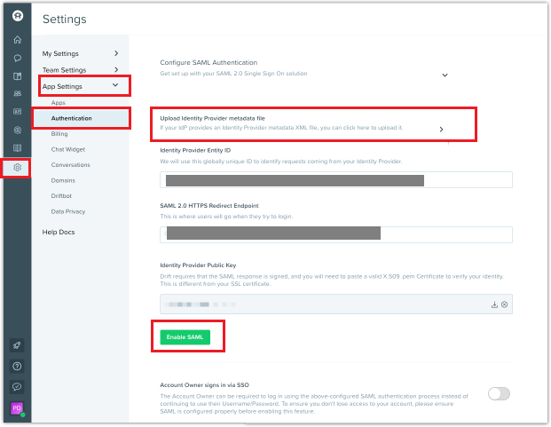

# Tutorial: Integrate Drift with Azure Active Directory

In this tutorial, you'll learn how to integrate Drift with Azure Active Directory (Azure AD). When you integrate Drift with Azure AD, you can:

* Control in Azure AD who has access to Drift.
* Enable your users to be automatically signed-in to Drift with their Azure AD accounts.
* Manage your accounts in one central location - the Azure portal.

To learn more about SaaS app integration with Azure AD, see [What is application access and single sign-on with Azure Active Directory](https://docs.microsoft.com/azure/active-directory/active-directory-appssoaccess-whatis).

## Prerequisites

To get started, you need the following items:

* An Azure AD subscription. If you don't have a subscription, you can get a [free account](https://azure.microsoft.com/free/).
* Drift single sign-on (SSO) enabled subscription.

## Scenario description

In this tutorial, you configure and test Azure AD SSO in a test environment. Drift supports **SP and IDP** initiated SSO and **Just In Time** user provisioning.

## Adding Drift from the gallery

To configure the integration of Drift into Azure AD, you need to add Drift from the gallery to your list of managed SaaS apps.

1. Sign in to the [Azure portal](https://portal.azure.com) using either a work or school account, or a personal Microsoft account.
1. On the left navigation pane, select the **Azure Active Directory** service.
1. Navigate to **Enterprise Applications** and then select **All Applications**.
1. To add new application, select **New application**.
1. In the **Add from the gallery** section, type **Drift** in the search box.
1. Select **Drift** from results panel and then add the app. Wait a few seconds while the app is added to your tenant.

## Configure and test Azure AD single sign-on

Configure and test Azure AD SSO with Drift using a test user called **B. Simon**. For SSO to work, you need to establish a link relationship between an Azure AD user and the related user in Drift.

To configure and test Azure AD SSO with Drift, complete the following building blocks:

1. **[Configure Azure AD SSO](#configure-azure-ad-sso)** to enable your users to use this feature.
2. **[Configure Drift](#configure-drift)** to configure the SSO settings on application side.
3. **[Create an Azure AD test user](#create-an-azure-ad-test-user)** to test Azure AD single sign-on with B. Simon.
4. **[Assign the Azure AD test user](#assign-the-azure-ad-test-user)** to enable B. Simon to use Azure AD single sign-on.
5. **[Create Drift test user](#create-drift-test-user)** to have a counterpart of B. Simon in Drift that is linked to the Azure AD representation of user.
6. **[Test SSO](#test-sso)** to verify whether the configuration works.

### Configure Azure AD SSO

Follow these steps to enable Azure AD SSO in the Azure portal.

1. In the [Azure portal](https://portal.azure.com/), on the **Drift** application integration page, find the **Manage** section and select **Single sign-on**.
1. On the **Select a Single sign-on method** page, select **SAML**.
1. On the **Set up Single Sign-On with SAML** page, click the edit/pen icon for **Basic SAML Configuration** to edit the settings.

   

1. On the **Basic SAML Configuration** section, the application is pre-configured and the necessary URLs are already pre-populated with Azure. The user needs to save the configuration by clicking the **Save** button and perform the following steps:

	a. Click **Set additional URLs**.
 
	b. In the **Relay State** text box, type a URL:
    `https://app.drift.com` 

	c. If you wish to configure the application in **SP** initiated mode perform the following step:

	d. In the **Sign-on URL** text box, type a URL:
    `https://start.drift.com`

6. Your Drift application expects the SAML assertions in a specific format, which requires you to add custom attribute mappings to your SAML token attributes configuration. The following screenshot shows the list of default attributes. Click **Edit** icon to open User Attributes dialog.

	

7. In addition to above, Drift application expects few more attributes to be passed back in SAML response. In the User Claims section on the User Attributes dialog, perform the following steps to add SAML token attribute as shown in the below table: 

	| Name | Source Attribute|
	| ---------------| --------------- |    
	| Name | user.displayname |

	a. Click **Add new claim** to open the **Manage user claims** dialog.

	

	

	b. In the **Name** textbox, type the attribute name shown for that row.

	c. Leave the **Namespace** blank.

	d. Select Source as **Attribute**.

	e. From the **Source attribute** list, type the attribute value shown for that row.

	f. Click **Ok**

	g. Click **Save**.

1. On the **Set up Single Sign-On with SAML** page, in the **SAML Signing Certificate** section, find **Federation Metadata XML** and select **Download** to download the certificate and save it on your computer.

   

1. On the **Set up Drift** section, copy the appropriate URL(s) based on your requirement.

   

### Configure Drift

1. To automate the configuration within Drift, you need to install **My Apps Secure Sign-in browser extension** by clicking **Install the extension**.

	

2. After adding extension to the browser, click on **Setup Drift** will direct you to the Drift application. From there, provide the admin credentials to sign into Drift. The browser extension will automatically configure the application for you and automate steps 3-4.

	

3. If you want to setup Drift manually, open a new web browser window and sign into your Drift company site as an administrator and perform the following steps:

4. From the left side of menu bar, click on **Settings icon** > **App Settings** > **Authentication** and perform the following steps:

	

	a. Upload the **Federation Metadata XML** that you have downloaded from the Azure portal, into the **Upload Identity Provider metadata file** text box.

	b. After uploading the metadata file, the remaining values get auto populated on the page automatically.

	c. Click **Enable SAML**.

### Create an Azure AD test user

In this section, you'll create a test user in the Azure portal called B. Simon.

1. From the left pane in the Azure portal, select **Azure Active Directory**, select **Users**, and then select **All users**.
1. Select **New user** at the top of the screen.
1. In the **User** properties, follow these steps:
   1. In the **Name** field, enter `B. Simon`.  
   1. In the **User name** field, enter the username@companydomain.extension. For example, `B. Simon@contoso.com`.
   1. Select the **Show password** check box, and then write down the value that's displayed in the **Password** box.
   1. Click **Create**.

### Assign the Azure AD test user

In this section, you'll enable B. Simon to use Azure single sign-on by granting access to Drift.

1. In the Azure portal, select **Enterprise Applications**, and then select **All applications**.
1. In the applications list, select **Drift**.
1. In the app's overview page, find the **Manage** section and select **Users and groups**.

   

1. Select **Add user**, then select **Users and groups** in the **Add Assignment** dialog.

	

1. In the **Users and groups** dialog, select **B. Simon** from the Users list, then click the **Select** button at the bottom of the screen.
1. If you're expecting any role value in the SAML assertion, in the **Select Role** dialog, select the appropriate role for the user from the list and then click the **Select** button at the bottom of the screen.
1. In the **Add Assignment** dialog, click the **Assign** button.

### Create Drift test user

In this section, a user called Britta Simon is created in Drift. Drift supports just-in-time user provisioning, which is enabled by default. There is no action item for you in this section. If a user doesn't already exist in Drift, a new one is created after authentication.

>[!Note]
>If you need to create a user manually, contact [Drift support team](mailto:integrations@drift.com).

### Test SSO

When you select the Drift tile in the Access Panel, you should be automatically signed in to the Drift for which you set up SSO. For more information about the Access Panel, see [Introduction to the Access Panel](https://docs.microsoft.com/azure/active-directory/active-directory-saas-access-panel-introduction).

## Additional Resources

- [List of Tutorials on How to Integrate SaaS Apps with Azure Active Directory](https://docs.microsoft.com/azure/active-directory/active-directory-saas-tutorial-list)

- [What is application access and single sign-on with Azure Active Directory?](https://docs.microsoft.com/azure/active-directory/active-directory-appssoaccess-whatis)

- [What is Conditional Access in Azure Active Directory?](https://docs.microsoft.com/azure/active-directory/conditional-access/overview)