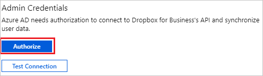
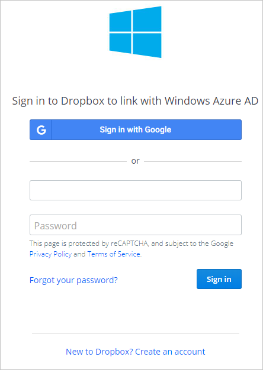
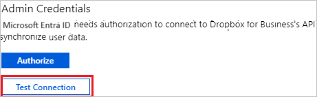
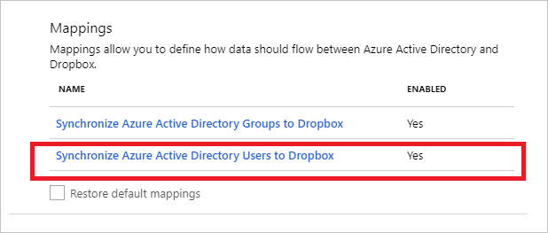
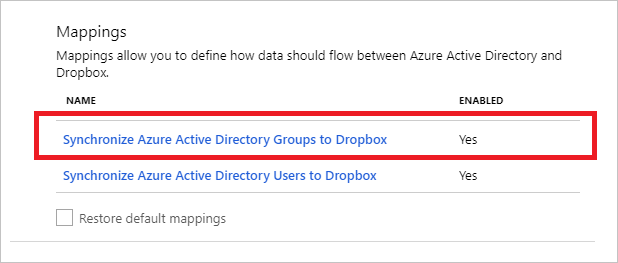
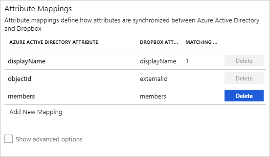

# Tutorial: Configure Dropbox for Business for automatic user provisioning

The objective of this tutorial is to demonstrate the steps to be performed in Dropbox for Business and Microsoft Entra ID to configure Microsoft Entra ID to automatically provision and de-provision users and/or groups to Dropbox for Business.

> [!IMPORTANT]
> In the future, Microsoft and Dropbox will be deprecating the old Dropbox integration. This was originally planned for 4/1/2021, but has been postponed indefinitely. However, to avoid disruption of service, we recommend migrating to the new SCIM 2.0 Dropbox integration which supports Groups. To migrate to the new Dropbox integration, add and configure a new instance of Dropbox for Provisioning in your Microsoft Entra tenant using the steps below. Once you have configured the new Dropbox integration, disable Provisioning on the old Dropbox integration to avoid Provisioning conflicts. For more detailed steps on migrating to the new Dropbox integration, see [Update to the newest Dropbox for Business application using Microsoft Entra ID](https://help.dropbox.com/installs-integrations/third-party/update-dropbox-azure-ad-connector).

> [!NOTE]
> This tutorial describes a connector built on top of the Microsoft Entra user Provisioning Service. For important details on what this service does, how it works, and frequently asked questions, see [Automate user provisioning and deprovisioning to SaaS applications with Microsoft Entra ID](../app-provisioning/user-provisioning.md).

## Prerequisites

The scenario outlined in this tutorial assumes that you already have the following prerequisites:

* A Microsoft Entra tenant
* [A Dropbox for Business tenant](https://www.dropbox.com/business/pricing)
* A user account in Dropbox for Business with Admin permissions.

## Add Dropbox for Business from the gallery

Before configuring Dropbox for Business for automatic user provisioning with Microsoft Entra ID, you need to add Dropbox for Business from the Microsoft Entra application gallery to your list of managed SaaS applications.

**To add Dropbox for Business from the Microsoft Entra application gallery, perform the following steps:**

1. Sign in to the [Microsoft Entra admin center](https://entra.microsoft.com) as at least a [Cloud Application Administrator](../roles/permissions-reference.md#cloud-application-administrator).
1. Browse to **Identity** > **Applications** > **Enterprise applications** > **New application**.
1. In the **Add from the gallery** section, type **Dropbox for Business**, select **Dropbox for Business** in the search box.
1. Select **Dropbox for Business** from results panel and then add the app. Wait a few seconds while the app is added to your tenant.
	

## Assigning users to Dropbox for Business

Microsoft Entra ID uses a concept called *assignments* to determine which users should receive access to selected apps. In the context of automatic user provisioning, only the users and/or groups that have been assigned to an application in Microsoft Entra ID are synchronized.

Before configuring and enabling automatic user provisioning, you should decide which users and/or groups in Microsoft Entra ID need access to Dropbox for Business. Once decided, you can assign these users and/or groups to Dropbox for Business by following the instructions here:

* [Assign a user or group to an enterprise app](../manage-apps/assign-user-or-group-access-portal.md)

### Important tips for assigning users to Dropbox for Business

* It is recommended that a single Microsoft Entra user is assigned to Dropbox for Business to test the automatic user provisioning configuration. Additional users and/or groups may be assigned later.

* When assigning a user to Dropbox for Business, you must select any valid application-specific role (if available) in the assignment dialog. Users with the **Default Access** role are excluded from provisioning.

## Configuring automatic user provisioning to Dropbox for Business 

This section guides you through the steps to configure the Microsoft Entra provisioning service to create, update, and disable users and/or groups in Dropbox for Business based on user and/or group assignments in Microsoft Entra ID.

> [!TIP]
> You may also choose to enable SAML-based single sign-on for Dropbox for Business, following the instructions provided in the [Dropbox for Business single sign-on tutorial](dropboxforbusiness-tutorial.md). Single sign-on can be configured independently of automatic user provisioning, though these two features compliment each other.

### To configure automatic user provisioning for Dropbox for Business in Microsoft Entra ID:

1. Sign in to the [Microsoft Entra admin center](https://entra.microsoft.com) as at least a [Cloud Application Administrator](../roles/permissions-reference.md#cloud-application-administrator).
1. Browse to **Identity** > **Applications** > **Enterprise applications**

	

1. In the applications list, select **Dropbox for Business**.

	

3. Select the **Provisioning** tab.

	

4. Set the **Provisioning Mode** to **Automatic**.

	

5. Under the **Admin Credentials** section, click **Authorize**. It opens a Dropbox for Business login dialog in a new browser window.

	

6. On the **Sign-in to Dropbox for Business to link with Microsoft Entra ID** dialog, sign in to your Dropbox for Business tenant and verify your identity.

	

7. Upon completing steps 5 and 6, click **Test Connection** to ensure Microsoft Entra ID can connect to Dropbox for Business. If the connection fails, ensure your Dropbox for Business account has Admin permissions and try again.

	

8. In the **Notification Email** field, enter the email address of a person or group who should receive the provisioning error notifications and check the checkbox - **Send an email notification when a failure occurs**.

	

9. Click **Save**.

10. Under the **Mappings** section, select **Synchronize Microsoft Entra users to Dropbox**.

	

11. Review the user attributes that are synchronized from Microsoft Entra ID to Dropbox in the **Attribute Mapping** section. The attributes selected as **Matching** properties are used to match the user accounts in Dropbox for update operations. Select the **Save** button to commit any changes.

	

12. Under the **Mappings** section, select **Synchronize Microsoft Entra groups to Dropbox**.

	

13. Review the group attributes that are synchronized from Microsoft Entra ID to Dropbox in the **Attribute Mapping** section. The attributes selected as **Matching** properties are used to match the groups in Dropbox for update operations. Select the **Save** button to commit any changes.

	

14. To configure scoping filters, refer to the following instructions provided in the [Scoping filter tutorial](../app-provisioning/define-conditional-rules-for-provisioning-user-accounts.md).

15. To enable the Microsoft Entra provisioning service for Dropbox, change the **Provisioning Status** to **On** in the **Settings** section.

	

16. Define the users and/or groups that you would like to provision to Dropbox by choosing the desired values in **Scope** in the **Settings** section.

	

17. When you are ready to provision, click **Save**.

	

This operation starts the initial synchronization of all users and/or groups defined in **Scope** in the **Settings** section. The initial sync takes longer to perform than subsequent syncs, which occur approximately every 40 minutes as long as the Microsoft Entra provisioning service is running. You can use the **Synchronization Details** section to monitor progress and follow links to provisioning activity report, which describes all actions performed by the Microsoft Entra provisioning service on Dropbox.

For more information on how to read the Microsoft Entra provisioning logs, see [Reporting on automatic user account provisioning](../app-provisioning/check-status-user-account-provisioning.md).

## Connector Limitations
 
* Dropbox does not support suspending invited users. If an invited user is  suspended, that user will be deleted.

## Additional resources

* [Managing user account provisioning for Enterprise Apps](../app-provisioning/configure-automatic-user-provisioning-portal.md)
* [What is application access and single sign-on with Microsoft Entra ID?](../manage-apps/what-is-single-sign-on.md)

## Next steps

* [Learn how to review logs and get reports on provisioning activity](../app-provisioning/check-status-user-account-provisioning.md)
