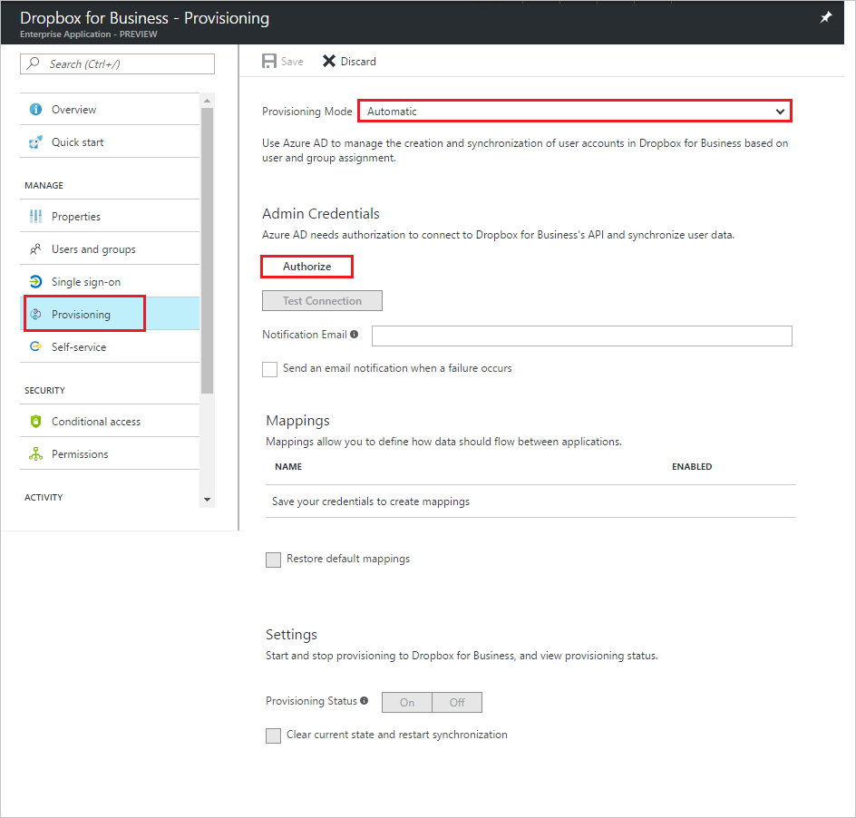
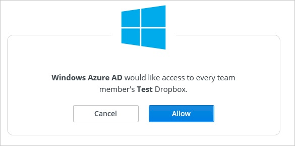

# Tutorial: Configure Dropbox for Business for automatic user provisioning

The objective of this tutorial is to show you the steps you need to perform in Dropbox for Business and Azure AD to automatically provision and de-provision user accounts from Azure AD to Dropbox for Business.

## Prerequisites

The scenario outlined in this tutorial assumes that you already have the following items:

*   An Azure Active directory tenant.
*   A Dropbox for Business single-sign on enabled subscription.
*   A user account in Dropbox for Business with Team Admin permissions.

## Assigning users to Dropbox for Business

Azure Active Directory uses a concept called "assignments" to determine which users should receive access to selected apps. In the context of automatic user account provisioning, only the users and groups that have been "assigned" to an application in Azure AD is synchronized.

Before configuring and enabling the provisioning service, you need to decide what users and/or groups in Azure AD represent the users who need access to your Dropbox for Business app. Once decided, you can assign these users to your Dropbox for Business app by following the instructions here:

[Assign a user or group to an enterprise app](https://docs.microsoft.com/azure/active-directory/active-directory-coreapps-assign-user-azure-portal)

### Important tips for assigning users to Dropbox for Business

*   It is recommended that a single Azure AD user is assigned to Dropbox for Business to test the provisioning configuration. Additional users and/or groups may be assigned later.

*   When assigning a user to Dropbox for Business, you must select a valid user role. The "Default Access" role does not work for provisioning..

## Enable Automated User Provisioning

This section guides you through connecting your Azure AD to Dropbox for Business's user account provisioning API, and configuring the provisioning service to create, update, and disable assigned user accounts in Dropbox for Business based on user and group assignment in Azure AD.

>[!Tip]
>You may also choose to enabled SAML-based Single Sign-On for Dropbox for Business, following the instructions provided in [Azure portal](https://portal.azure.com). Single sign-on can be configured independently of automatic provisioning, though these two features compliment each other.

### To configure automatic user account provisioning:

1. In the [Azure portal](https://portal.azure.com), browse to the **Azure Active Directory > Enterprise Apps > All applications** section.

2. If you have already configured Dropbox for Business for single sign-on, search for your instance of Dropbox for Business using the search field. Otherwise, select **Add** and search for **Dropbox for Business** in the application gallery. Select Dropbox for Business from the search results, and add it to your list of applications.

3. Select your instance of Dropbox for Business, then select the **Provisioning** tab.

4. Set the **Provisioning Mode** to **Automatic**. 

    

5. Under the **Admin Credentials** section, click **Authorize**. It opens a Dropbox for Business login dialog in a new browser window.

6. On the **Sign-in to Dropbox to link with Azure AD** dialog, sign in to your Dropbox for Business tenant.

     

7. Confirm that you would like to give Azure Active Directory permission to make changes to your Dropbox for Business tenant. Click **Allow**.
    
      

8. In the Azure portal, click **Test Connection** to ensure Azure AD can connect to your Dropbox for Business app. If the connection fails, ensure your Dropbox for Business account has Team Admin permissions and try the **"Authorize"** step again.

9. Enter the email address of a person or group who should receive provisioning error notifications in the **Notification Email** field, and check the checkbox.

10. Click **Save.**

11. Under the Mappings section, select **Synchronize Azure Active Directory Users to Dropbox for Business.**

12. In the **Attribute Mappings** section, review the user attributes that are synchronized from Azure AD to Dropbox for Business. The attributes selected as **Matching** properties are used to match the user accounts in Dropbox for Business for update operations. Select the Save button to commit any changes.

13. To enable the Azure AD provisioning service for Dropbox for Business, change the **Provisioning Status** to **On** in the Settings section

14. Click **Save.**

It starts the initial synchronization of any users and/or groups assigned to Dropbox for Business in the Users and Groups section. The initial sync takes longer to perform than subsequent syncs, which occur approximately every 40 minutes as long as the service is running. You can use the **Synchronization Details** section to monitor progress and follow links to provisioning activity logs, which describe all actions performed by the provisioning service on your Dropbox for Business app.

For more information on how to read the Azure AD provisioning logs, see [Reporting on automatic user account provisioning](../manage-apps/check-status-user-account-provisioning.md).

## Additional resources

* [Managing user account provisioning for Enterprise Apps](tutorial-list.md)
* [What is application access and single sign-on with Azure Active Directory?](../manage-apps/what-is-single-sign-on.md)
* [Configure Single Sign-on](dropboxforbusiness-tutorial.md)