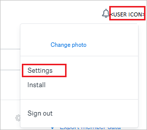
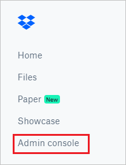

# Tutorial: Integrate Dropbox Business with Azure Active Directory

In this tutorial, you'll learn how to integrate Dropbox Business with Azure Active Directory (Azure AD). When you integrate Dropbox Business with Azure AD, you can:

* Control in Azure AD who has access to Dropbox Business.
* Enable your users to be automatically signed-in to Dropbox Business with their Azure AD accounts.
* Manage your accounts in one central location - the Azure portal.

## Prerequisites

To get started, you need the following items:

* An Azure AD subscription. If you don't have a subscription, you can get a [free account](https://azure.microsoft.com/free/).
* Dropbox Business single sign-on (SSO) enabled subscription.

> [!NOTE]
> This integration is also available to use from Azure AD US Government Cloud environment. You can find this application in the Azure AD US Government Cloud Application Gallery and configure it in the same way as you do from public cloud.

## Scenario description

* In this tutorial, you configure and test Azure AD SSO in a test environment. Dropbox Business supports **SP** initiated SSO.

* Dropbox Business supports [Automated user provisioning and deprovisioning](dropboxforbusiness-tutorial.md).

> [!NOTE]
> Identifier of this application is a fixed string value so only one instance can be configured in one tenant.

## Add Dropbox Business from the gallery

To configure the integration of Dropbox Business into Azure AD, you need to add Dropbox Business from the gallery to your list of managed SaaS apps.

1. Sign in to the Azure portal using either a work or school account, or a personal Microsoft account.
1. On the left navigation pane, select the **Azure Active Directory** service.
1. Navigate to **Enterprise Applications** and then select **All Applications**.
1. To add new application, select **New application**.
1. In the **Add from the gallery** section, type **Dropbox Business** in the search box.
1. Select **Dropbox Business** from results panel and then add the app. Wait a few seconds while the app is added to your tenant.

## Configure and test Azure AD SSO for Dropbox Business

Configure and test Azure AD SSO with Dropbox Business using a test user called **Britta Simon**. For SSO to work, you need to establish a link relationship between an Azure AD user and the related user in Dropbox Business.

To configure and test Azure AD SSO with Dropbox Business, perform the following steps:

1. **[Configure Azure AD SSO](#configure-azure-ad-sso)** - to enable your users to use this feature.    
    1. **[Create an Azure AD test user](#create-an-azure-ad-test-user)** - to test Azure AD single sign-on with Britta Simon.
    1. **[Assign the Azure AD test user](#assign-the-azure-ad-test-user)** - to enable Britta Simon to use Azure AD single sign-on.
1. **[Configure Dropbox Business SSO](#configure-dropbox-business-sso)** - to configure the Single Sign-On settings on application side.
    1. **[Create Dropbox Business test user](#create-dropbox-business-test-user)** - to have a counterpart of Britta Simon in Dropbox Business that is linked to the Azure AD representation of user.
1. **[Test SSO](#test-sso)** - to verify whether the configuration works.

## Configure Azure AD SSO

Follow these steps to enable Azure AD SSO in the Azure portal.

1. In the Azure portal, on the **Dropbox Business** application integration page, find the **Manage** section and select **Single sign-on**.
1. On the **Select a Single sign-on method** page, select **SAML**.
1. On the **Set up Single Sign-On with SAML** page, click the pencil icon for **Basic SAML Configuration** to edit the settings.

   

1. On the **Basic SAML Configuration** page, enter the values for the following fields:

	a. In the **Sign on URL** text box, type a URL using the following pattern:
    `https://www.dropbox.com/sso/<id>`
	
	 b. In the **Identifier (Entity ID)** text box, type the value:
    `Dropbox`
	
	c. In the Reply URL field enter https://www.dropbox.com/saml_login
	> [!NOTE]
	> The **Dropbox Sign SSO ID** can be found in the Dropbox site at Dropbox > Admin console > Settings > Single sign-on > SSO sign-in URL.

1. On the **Set up Single Sign-On with SAML** page, in the **SAML Signing Certificate** section, click **Download** to download the **Certificate (Base64)** from the given options as per your requirement and save it on your computer.

	

1. On the **Set up Dropbox Business** section, copy the appropriate URL(s) as per your requirement.

	

### Create an Azure AD test user

In this section, you'll create a test user in the Azure portal called Britta Simon.

1. From the left pane in the Azure portal, select **Azure Active Directory**, select **Users**, and then select **All users**.
1. Select **New user** at the top of the screen.
1. In the **User** properties, follow these steps:
   1. In the **Name** field, enter `Britta Simon`.  
   1. In the **User name** field, enter the username@companydomain.extension. For example, `BrittaSimon@contoso.com`.
   1. Select the **Show password** check box, and then write down the value that's displayed in the **Password** box.
   1. Click **Create**.

### Assign the Azure AD test user

In this section, you'll enable B.Simon to use Azure single sign-on by granting access to Dropbox Business.

1. In the Azure portal, select **Enterprise Applications**, and then select **All applications**.
1. In the applications list, select **Dropbox Business**.
1. In the app's overview page, find the **Manage** section and select **Users and groups**.
1. Select **Add user**, then select **Users and groups** in the **Add Assignment** dialog.
1. In the **Users and groups** dialog, select **B.Simon** from the Users list, then click the **Select** button at the bottom of the screen.
1. If you are expecting a role to be assigned to the users, you can select it from the **Select a role** dropdown. If no role has been set up for this app, you see "Default Access" role selected.
1. In the **Add Assignment** dialog, click the **Assign** button.

## Configure Dropbox Business SSO

1. To automate the configuration within Dropbox Business, you need to install **My Apps Secure Sign-in browser extension** by clicking **Install the extension**.

	

2. After adding extension to the browser, click on **Setup Dropbox Business** will direct you to the Dropbox Business application. From there, provide the admin credentials to sign into Dropbox Business. The browser extension will automatically configure the application for you and automate steps 3-8.

	

3. If you want to setup Dropbox Business manually, open a new web browser window and go on your Dropbox Business tenant and sign on to your Dropbox Business tenant. and perform the following steps:

	

4. Click on the **User Icon** and select **Settings** tab.

	

5. In the navigation pane on the left side, click **Admin console**.

	

6. On the **Admin console**, click **Settings** in the left navigation pane.

	

7. Select **Single sign-on** option under the **Authentication** section.

	

8. In the **Single sign-on** section, perform the following steps:  

	

	a. Select **Required** as an option from the dropdown for the **Single sign-on**.

	b. Click on **Add sign-in URL** and in the **Identity provider sign-in URL** textbox, paste the **Login URL** value which you have copied from the Azure portal and then select **Done**.

	

	c. Click **Upload certificate**, and then browse to your **Base64 encoded certificate file** which you have downloaded from the Azure portal.

	d. Click on **Copy link** and paste the copied value into the **Sign-on URL** textbox of **Dropbox Business Domain and URLs** section on Azure portal.

	e. Click **Save**.

### Create Dropbox Business test user

In this section, a user called B.Simon is created in Dropbox Business. Dropbox Business supports just-in-time user provisioning, which is enabled by default. There is no action item for you in this section. If a user doesn't already exist in Dropbox Business, a new one is created after authentication.

>[!Note]
>If you need to create a user manually, Contact [Dropbox Business Client support team](https://www.dropbox.com/business/contact)

## Test SSO

In this section, you test your Azure AD single sign-on configuration with following options. 

* Click on **Test this application** in Azure portal. This will redirect to Dropbox Business Sign-on URL where you can initiate the login flow. 

* Go to Dropbox Business Sign-on URL directly and initiate the login flow from there.

* You can use Microsoft My Apps. When you click the Dropbox Business tile in the My Apps, this will redirect to Dropbox Business Sign-on URL. For more information about the My Apps, see [Introduction to the My Apps](../user-help/my-apps-portal-end-user-access.md).

## Next steps

Once you configure Dropbox Business you can enforce session control, which protects exfiltration and infiltration of your organization’s sensitive data in real time. Session control extends from Conditional Access. [Learn how to enforce session control with Microsoft Cloud App Security](/cloud-app-security/proxy-deployment-any-app).
